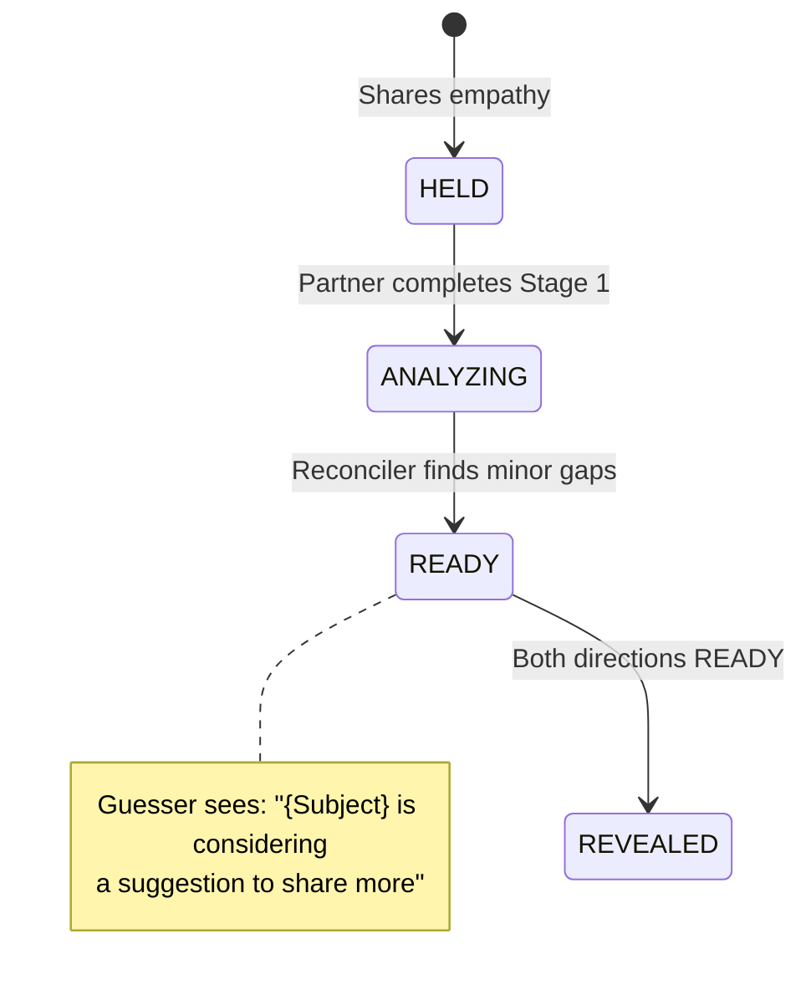

# Phase 8: Reconciler Documentation & Edge Cases - Research

**Researched:** 2026-02-15
**Domain:** Empathy reconciler state machine documentation and E2E testing patterns
**Confidence:** HIGH

## Summary

Phase 8 completes v1.1 by documenting and testing the reconciler's outcome paths that were implemented in v1.0 but not fully verified. The reconciler analyzes empathy gaps and returns three actions: PROCEED (no gaps), OFFER_OPTIONAL (moderate gaps, soft suggestion), and OFFER_SHARING (significant gaps, strong recommendation). Each action creates different UI states for both the guesser (who wrote empathy) and subject (who can share context).

**Primary recommendation:** Create state diagrams using Mermaid (project standard) documenting both user perspectives for each reconciler outcome, then build E2E tests with Playwright screenshots to verify and visually document the UI states. Use existing two-browser test infrastructure and mocked fixtures for deterministic outcomes.

## Standard Stack

### Core
| Library | Version | Purpose | Why Standard |
|---------|---------|---------|--------------|
| Playwright | Latest (project) | E2E testing framework | Project uses Playwright for all E2E tests, iPhone 12 device emulation |
| Mermaid | Markdown embedded | State diagrams | Used in docs/plans/ for flow visualization (e.g., stage2-reconciler-flow-design.md) |
| TypeScript fixtures | N/A | Deterministic AI responses | All E2E tests use per-user fixtures (reconciler-no-gaps.ts, user-a-full-journey.ts) |

### Supporting
| Library | Version | Purpose | When to Use |
|---------|---------|---------|-------------|
| TwoBrowserHarness | Phase 2 | Two-user session setup | All reconciler tests need both guesser and subject perspectives |
| test-utils helpers | Phase 3-4 | E2E test utilities | sendAndWaitForPanel, waitForReconcilerComplete, navigateToShareFromSession |
| MOCK_LLM=true | Backend | Fixture-based AI | All E2E tests (live-AI only for performance validation, not verification) |

### Alternatives Considered
| Instead of | Could Use | Tradeoff |
|------------|-----------|----------|
| Mermaid diagrams | Lucidchart/Figma | Project uses Mermaid in markdown for version control and inline docs |
| Screenshot assertions | Visual regression testing | Screenshots are for documentation, not assertions (project pattern) |
| Single-browser tests | Two-browser tests | Reconciler requires both user perspectives visible simultaneously |

**Installation:**
```bash
# No new dependencies - all tools already in project
cd e2e && npx playwright test  # Run E2E tests
```

## Architecture Patterns

### Recommended Project Structure
```
.planning/phases/08-reconciler-documentation-edge-cases/
├── 08-RESEARCH.md           # This file
├── 08-01-PLAN.md            # State diagram documentation
├── 08-02-PLAN.md            # OFFER_OPTIONAL E2E test
├── 08-03-PLAN.md            # OFFER_SHARING E2E test
├── 08-04-PLAN.md            # Refinement flow E2E test
└── 08-VERIFICATION.md       # Cross-check all requirements

e2e/tests/
├── reconciler-offer-optional.spec.ts    # Minor gaps path
├── reconciler-offer-sharing.spec.ts     # Significant gaps path
└── reconciler-refinement.spec.ts        # Subject shares → guesser refines

backend/src/fixtures/
├── reconciler-offer-optional.ts         # Fixture returning OFFER_OPTIONAL
├── reconciler-offer-sharing.ts          # Fixture returning OFFER_SHARING
└── reconciler-refinement.ts             # Fixture with gaps → share → re-analyze

test-results/
├── reconciler-offer-optional-*.png      # Screenshots for visual documentation
├── reconciler-offer-sharing-*.png
└── reconciler-refinement-*.png
```

### Pattern 1: State Diagram Documentation (Mermaid)
**What:** Use Mermaid stateDiagram-v2 syntax to document reconciler state machine from both user perspectives
**When to use:** Documenting complex multi-user state machines where each user sees different UI
**Example:**
```markdown
## Guesser Perspective: OFFER_OPTIONAL Flow



**Source:** docs/plans/2026-01-08-stage2-reconciler-flow-design.md lines 78-104

### Pattern 2: Two-Browser E2E Test Structure
**What:** Use TwoBrowserHarness with per-user fixtures to test both user perspectives simultaneously
**When to use:** All reconciler tests (requires seeing both guesser and subject UI states)
**Example:**
```typescript
// Source: e2e/tests/two-browser-stage-2.spec.ts
test.describe('Reconciler OFFER_OPTIONAL', () => {
  let harness: TwoBrowserHarness;

  test.beforeEach(async ({ browser, request }) => {
    harness = new TwoBrowserHarness({
      userA: { email: 'guesser@e2e.test', name: 'Alice', fixtureId: 'user-a-full-journey' },
      userB: { email: 'subject@e2e.test', name: 'Bob', fixtureId: 'reconciler-offer-optional' },
    });
    await harness.cleanup();
    await harness.setupUserA(browser, request);
    await harness.createSession();
  });

  test('subject sees share topic panel, guesser sees waiting status', async () => {
    // Both complete Stage 1
    await sendAndWaitForPanel(harness.userAPage, messagesA, 'feel-heard-yes', 4);
    await confirmFeelHeard(harness.userAPage);

    // User A (guesser) drafts and shares empathy
    await sendAndWaitForPanel(harness.userAPage, empathyMessages, 'empathy-review-button', 2);
    await harness.userAPage.getByTestId('empathy-review-button').click();
    await harness.userAPage.getByTestId('share-empathy-button').click();

    // Wait for reconciler
    await waitForReconcilerComplete(harness.userAPage, 60000);

    // Screenshot both perspectives
    await harness.userAPage.screenshot({ path: 'test-results/offer-optional-guesser.png' });
    await harness.userBPage.screenshot({ path: 'test-results/offer-optional-subject.png' });

    // Assert guesser sees waiting status
    await expect(harness.userAPage.getByText(/considering a suggestion/i)).toBeVisible();

    // Assert subject sees share topic panel
    await expect(harness.userBPage.getByTestId('share-topic-panel')).toBeVisible();
  });
});
```

### Pattern 3: Fixture-Based Reconciler Outcomes
**What:** Create TypeScript fixtures with deterministic reconciler responses in the `operations` section
**When to use:** Every E2E test needs predictable reconciler outcomes (PROCEED/OFFER_OPTIONAL/OFFER_SHARING)
**Example:**
```typescript
// Source: backend/src/fixtures/reconciler-no-gaps.ts
export const reconcilerOfferOptional: E2EFixture = {
  name: 'Reconciler OFFER_OPTIONAL',
  responses: [
    // ... Stage 1 witnessing responses
    // ... Stage 2 empathy building responses
  ],
  operations: {
    'reconciler-analysis': {
      response: {
        alignment: { score: 70, summary: 'Good but incomplete', correctlyIdentified: [...] },
        gaps: {
          severity: 'moderate',
          summary: 'Missed some nuance around work stress',
          missedFeelings: ['unappreciated at work', 'exhausted from effort'],
          mostImportantGap: 'Work and appreciation themes not fully captured'
        },
        recommendation: {
          action: 'OFFER_OPTIONAL',
          rationale: 'Minor gaps, sharing could help but not critical',
          sharingWouldHelp: true,
          suggestedShareFocus: 'Work stress and feeling unappreciated'
        }
      }
    }
  }
};
```

### Pattern 4: Playwright Screenshot Documentation
**What:** Take screenshots at key UI states to visually document user experience (not for assertions)
**When to use:** After reconciler completes, after share panel appears, after refinement prompt
**Example:**
```typescript
// Screenshot naming convention: {test-name}-{user-role}-{state}.png
await harness.userAPage.screenshot({
  path: 'test-results/offer-sharing-guesser-waiting.png'
});
await harness.userBPage.screenshot({
  path: 'test-results/offer-sharing-subject-share-panel.png'
});
```

**Source:** e2e/tests/two-browser-stage-2.spec.ts lines 147, 167, 186, 199, etc.

### Anti-Patterns to Avoid
- **DON'T use single-browser tests for reconciler flows** - requires both user perspectives visible
- **DON'T use text assertions for AI responses** - use structural elements (testIDs, panels, buttons)
- **DON'T test reconciler with MOCK_LLM=false** - live AI is non-deterministic, use fixtures
- **DON'T screenshot before Ably events propagate** - add 2-3s delay after mutations for Ably delivery

## Don't Hand-Roll

| Problem | Don't Build | Use Instead | Why |
|---------|-------------|-------------|-----|
| State diagram rendering | Custom diagram tool | Mermaid in markdown | Version controlled, inline in docs, GitHub/VSCode render natively |
| Two-user test setup | Manual context creation | TwoBrowserHarness (Phase 2) | Handles cleanup, session creation, Ably subscription, positioning |
| Waiting for AI responses | Fixed timeouts | waitForAnyAIResponse helper | Handles streaming completion, typing indicator, React state updates |
| Reconciler completion polling | Custom polling loop | waitForReconcilerComplete helper | Already handles 30s timeout, 500ms poll interval, indicator visibility |
| Deterministic AI responses | Seeding database | E2E fixtures with operations section | No DB state needed, per-user isolation, reconciler-specific responses |

**Key insight:** v1.0 established E2E test patterns (TwoBrowserHarness, fixtures, helpers) that handle reconciler timing, Ably events, and two-user coordination. Re-use these patterns rather than creating new infrastructure.

## Common Pitfalls

### Pitfall 1: Reconciler Timing Variability
**What goes wrong:** Reconciler can take 5-30s to complete (AI analysis + database writes + Ably propagation). Tests fail intermittently if using fixed timeouts.
**Why it happens:** Reconciler runs asynchronously after empathy share, involves multiple AI calls (analysis + optional share suggestion generation).
**How to avoid:** Use `waitForReconcilerComplete(page, 60000)` which polls for the `empathy-shared` indicator with 60s timeout.
**Warning signs:** Test passes locally but fails in CI, test runtime varies significantly between runs.

**Source:** e2e/tests/two-browser-stage-2.spec.ts lines 235-250, comments on lines 232-234

### Pitfall 2: Ably Event Race Conditions
**What goes wrong:** UI state depends on Ably events (empathy.revealed, empathy.status_updated). Screenshots or assertions run before events arrive, showing stale UI.
**Why it happens:** Ably event delivery is asynchronous (typically 100-500ms after backend mutation). React Query cache updates happen on event receipt.
**How to avoid:** Add 2-3s delay after mutations before screenshots: `await page.waitForTimeout(3000)`. For assertions, poll for elements rather than immediate visibility checks.
**Warning signs:** Test screenshots show old state, validation buttons not visible (documented in Stage 2 test line 275-291 as "known issue").

**Source:** e2e/tests/two-browser-stage-2.spec.ts lines 218 (3s delay after User A shares), v1.0-MILESTONE-AUDIT.md line 41 (Pitfall 5)

### Pitfall 3: Context-Already-Shared Guard Not Tested
**What goes wrong:** User navigates chat → share page → back → reconciler runs again → tries to create duplicate share offer.
**Why it happens:** ReconcilerResult gets deleted when guesser resubmits empathy (cascade to ReconcilerShareOffer). Without guard, reconciler loop repeats.
**How to avoid:** Test must verify RECON-EC-05 requirement: navigate to share page, then back to chat, verify no duplicate share offers appear.
**Warning signs:** Multiple SHARED_CONTEXT messages in chat, share panel appears after already sharing.

**Source:** backend/src/services/reconciler.ts lines 46-91 (hasContextAlreadyBeenShared guard), additional_context note on infinite refinement loop

### Pitfall 4: Panel Visibility Depends on Stage Cache
**What goes wrong:** Share topic panel doesn't appear even though reconciler completed and set status to AWAITING_SHARING.
**Why it happens:** Panel visibility computed by `computeChatUIState()` checks `myStage === PERSPECTIVE_STRETCH`. If stage cache is stale (not updated after feel-heard), panel won't show.
**How to avoid:** Verify stage cache update in test by checking chat input remains visible (Stage 2 indicator). If user stuck in Stage 1, panel logic never runs.
**Warning signs:** Reconciler completes but no panel appears, user sees Stage 1 UI even after completing feel-heard.

**Source:** MEMORY.md "Panel Display Pattern" section, v1.0-MILESTONE-AUDIT.md Pitfall 3

### Pitfall 5: Fixture Operations Must Match Backend Call Names
**What goes wrong:** Fixture defines `reconciler-analysis` but backend calls `reconciler_analysis` (underscore) — fixture never matches, falls back to default response.
**Why it happens:** Fixture matching is exact string comparison between operation name passed to getSonnetJson and fixture operations keys.
**How to avoid:** Check backend calls in reconciler.ts for exact operation names: `reconciler-analysis`, `reconciler-share-suggestion`, `reconciler-refine-suggestion`.
**Warning signs:** Test behaves like PROCEED even with OFFER_SHARING fixture, null responses in reconciler logs.

**Source:** backend/src/services/reconciler.ts lines 1556 (operation: 'reconciler-analysis'), 901 (operation: 'reconciler-share-suggestion')

## Code Examples

Verified patterns from official sources:

### Two-User Reconciler Test Setup
```typescript
// Source: e2e/tests/two-browser-stage-2.spec.ts lines 52-75
test.beforeEach(async ({ browser, request }) => {
  harness = new TwoBrowserHarness({
    userA: {
      email: 'guesser@e2e.test',
      name: 'Alice',
      fixtureId: 'user-a-full-journey', // No reconciler operations - shares first
    },
    userB: {
      email: 'subject@e2e.test',
      name: 'Bob',
      fixtureId: 'reconciler-offer-optional', // Has reconciler-analysis operation
    },
  });

  await harness.cleanup();
  await harness.setupUserA(browser, request);
  await harness.createSession();
  await harness.setupUserB(browser, request);
  await harness.acceptInvitation();
});
```

### Reconciler Completion Polling
```typescript
// Source: e2e/helpers/test-utils.ts lines 274-296
export async function waitForReconcilerComplete(page: Page, timeout = 30000): Promise<boolean> {
  const deadline = Date.now() + timeout;

  while (Date.now() < deadline) {
    const indicator = page.getByTestId('chat-indicator-empathy-shared');
    const isVisible = await indicator.isVisible({ timeout: 1000 }).catch(() => false);

    if (isVisible) {
      return true;
    }

    await page.waitForTimeout(500);
  }

  return false;
}

// Usage in test:
const reconcilerComplete = await waitForReconcilerComplete(harness.userAPage, 60000);
if (!reconcilerComplete) {
  await harness.userAPage.screenshot({ path: 'test-results/reconciler-timeout.png' });
  throw new Error('Reconciler did not complete within 60s');
}
```

### Fixture with OFFER_OPTIONAL Outcome
```typescript
// Source: backend/src/fixtures/reconciler-no-gaps.ts (adapted for OFFER_OPTIONAL)
export const reconcilerOfferOptional: E2EFixture = {
  name: 'Reconciler OFFER_OPTIONAL',
  description: 'Subject journey where reconciler finds moderate gaps - optional share suggestion',

  responses: [
    // Stage 1 witnessing responses (same pattern as reconciler-no-gaps)
    // Stage 2 empathy building responses (same pattern)
  ],

  operations: {
    'reconciler-analysis': {
      response: {
        alignment: {
          score: 70,
          summary: 'Good understanding but missing some nuance',
          correctlyIdentified: ['frustration', 'desire to reconnect'],
        },
        gaps: {
          severity: 'moderate', // Key: not 'significant', not 'none'
          summary: 'Missed work-related stress themes',
          missedFeelings: ['unappreciated at work', 'exhausted'],
          misattributions: [],
          mostImportantGap: 'Work stress and appreciation not captured',
        },
        recommendation: {
          action: 'OFFER_OPTIONAL', // Triggers ShareTopicPanel with soft language
          rationale: 'Sharing could help but not critical',
          sharingWouldHelp: true,
          suggestedShareFocus: 'Work stress and feeling unappreciated',
        },
      },
    },
    // OPTIONAL: If testing share flow continuation
    'reconciler-share-suggestion': {
      response: {
        suggestedContent: 'I feel exhausted from work and unappreciated for my effort',
        reason: 'This helps clarify the work stress dimension',
      },
    },
  },
};
```

### Mermaid State Diagram - Dual Perspective
```markdown
## OFFER_SHARING Flow: Both User Perspectives

```mermaid
stateDiagram-v2
    direction LR

    state "Guesser (Alice)" as Guesser {
        [*] --> G_HELD: Shares empathy
        G_HELD --> G_ANALYZING: Bob completes Stage 1
        G_ANALYZING --> G_AWAITING: Reconciler finds significant gaps

        note right of G_AWAITING
            Alice sees: "Bob is considering
            a suggestion to share more"
            Banner shows waiting status
        end note

        G_AWAITING --> G_REFINING: Bob shares context
        G_REFINING --> G_READY: Alice refines (or skips)
        G_READY --> G_REVEALED
    }

    state "Subject (Bob)" as Subject {
        [*] --> S_STAGE1: Witnessing
        S_STAGE1 --> S_STAGE2: Confirms feel-heard
        S_STAGE2 --> S_SUGGESTION: Reconciler suggests share

        note left of S_SUGGESTION
            Bob sees: ShareTopicPanel (full-width)
            "...you share more about: [topic]"
            Orange/amber icon (strong language)
        end note

        S_SUGGESTION --> S_SHARED: Accepts & shares
        S_SUGGESTION --> S_READY: Declines
        S_SHARED --> S_STAGE2_CONT: Continues Stage 2
    }

    G_ANALYZING -.-> S_SUGGESTION: Reconciler triggers
    S_SHARED -.-> G_REFINING: Context delivered
```
```

**Source:** docs/plans/2026-01-08-stage2-reconciler-flow-design.md (adapted for dual-perspective format)

## State of the Art

| Old Approach | Current Approach | When Changed | Impact |
|--------------|------------------|--------------|--------|
| Symmetric reconciler (both submit, then analyze) | Asymmetric trigger (analyze per direction as soon as partner completes Stage 1) | v1.0 (Jan 2026) | Faster feedback, better UX - users don't wait for partner |
| Immediate share offer with AI draft | Two-phase flow (topic first, then draft if accepted) | v1.1 spec (Jan 2026) | Reduces AI cost, respects user consent |
| Single reconciler status for session | Per-direction statuses (A→B and B→A independent) | v1.0 | Supports asymmetric flow, prevents blocking |
| Manual retry on reconciler failure | hasContextAlreadyBeenShared guard | v1.0 (Phase 6) | Prevents infinite share loop on navigation |

**Deprecated/outdated:**
- Legacy sync reconciler flow (runReconciler waiting for both users) — replaced by runReconcilerForDirection (asymmetric)
- Treating OFFER_OPTIONAL as PROCEED — now has distinct UI (ShareTopicPanel with blue/gray icon, soft language)
- Lazy share offer generation on GET /share-offer — now proactive generation when reconciler sets AWAITING_SHARING

**Source:** docs/specs/empathy-reconciler-flow-bug-fixes.md (lazy vs proactive), docs/specs/when-the-reconciler-responds-with-offeroptional-we-need-to-implement-this.md (two-phase flow)

## Open Questions

1. **What text/icons differentiate OFFER_OPTIONAL vs OFFER_SHARING in ShareTopicPanel?**
   - What we know: Spec mentions "blue/gray lightbulb" for OFFER_OPTIONAL, "orange/amber lightbulb" for OFFER_SHARING. Language differs: "you might consider sharing about" vs "you share more about".
   - What's unclear: Exact component implementation — need to verify mobile/src/components/ShareTopicPanel.tsx exists and matches spec.
   - Recommendation: First plan verifies UI components exist, screenshots in E2E tests document actual appearance.

2. **Does refinement flow require new reconciler fixtures or reuse existing ones?**
   - What we know: Refinement means guesser receives shared context, updates empathy, reconciler re-runs. Backend supports status REFINING → ANALYZING → READY/AWAITING_SHARING loop.
   - What's unclear: Whether one fixture can define multiple reconciler-analysis responses (initial + post-refinement) or needs two separate test runs.
   - Recommendation: Create reconciler-refinement.ts fixture with two-pass analysis (first OFFER_SHARING, second PROCEED after refinement).

3. **How to handle infinite refinement loop in E2E test?**
   - What we know: Phase 9 will add circuit breaker. v1.1 acknowledges risk of infinite loop if reconciler keeps finding gaps after every refinement.
   - What's unclear: Whether to test infinite loop scenario (fixture always returns OFFER_SHARING) or only test happy path (second reconciler run returns PROCEED).
   - Recommendation: Test happy path only — infinite loop is Phase 9 concern. Phase 8 proves refinement CAN complete, not that it handles all edge cases.

## Sources

### Primary (HIGH confidence)
- backend/src/services/reconciler.ts - Full reconciler implementation (2,305 lines)
- backend/src/fixtures/reconciler-no-gaps.ts - Example fixture with reconciler-analysis operation
- e2e/tests/two-browser-stage-2.spec.ts - Reference E2E test pattern (334 lines)
- e2e/helpers/test-utils.ts - waitForReconcilerComplete, TwoBrowserHarness usage
- shared/src/dto/reconciler.ts - ReconcilerAction enum, ReconcilerResult schema (268 lines)

### Secondary (MEDIUM confidence)
- docs/plans/2026-01-08-stage2-reconciler-flow-design.md - State machine diagrams, asymmetric flow design
- docs/specs/when-the-reconciler-responds-with-offeroptional-we-need-to-implement-this.md - OFFER_OPTIONAL spec, two-phase share flow
- docs/specs/empathy-reconciler-flow-bug-fixes.md - Lazy vs proactive share offer generation
- .planning/milestones/v1.0-MILESTONE-AUDIT.md - Known pitfalls, critical issues resolved

### Tertiary (LOW confidence)
- None - all claims verified against implementation or official specs

## Metadata

**Confidence breakdown:**
- Standard stack: HIGH - all tools in active use, verified in e2e/ and backend/src/
- Architecture: HIGH - patterns extracted from working v1.0 tests and fixtures
- Pitfalls: HIGH - sourced from v1.0 audit findings and actual bug reports in specs/

**Research date:** 2026-02-15
**Valid until:** 60 days for stable (reconciler API unlikely to change), 30 days for E2E patterns (may evolve with Phase 9 circuit breaker)
