# Full-Session E2E Test Plan: Complete Happy Path

## Executive Summary

This document outlines a comprehensive plan for an end-to-end test that takes **both users through a complete Meet Without Fear session** - from initial session creation through to resolution in Stage 4. The test validates the full happy path flow including all stage transitions, empathy exchange, need mapping, and strategic repair.

**Target File:** `/home/ubuntu/.openclaw/workspace/meet-without-fear/FULL_SESSION_E2E_PLAN.md`

---

## 1. Complete Happy Path Flow Overview

```mermaid
flowchart TB
    subgraph UserA["👤 USER A (Initiator)"]
        A0[Stage 0: Onboarding<br/>• Sign Compact<br/>• Invite B]
        A1[Stage 1: The Witness<br/>• Chat w/ AI<br/>• Feel Heard]
        A2[Stage 2: Perspective Stretch<br/>• Build empathy guess<br/>• Share & Validate]
        A3[Stage 3: Need Mapping<br/>• See needs<br/>• Find common ground]
        A4[Stage 4: Strategic Repair<br/>• Propose strategies<br/>• Rank & Agree]
        AR[Resolution<br/>• Documented<br/>• Check-in scheduled]
    end

    subgraph UserB["👤 USER B (Partner)"]
        B0[Stage 0: Accept Invite<br/>• Sign Compact]
        B1[Stage 1: The Witness<br/>• Chat w/ AI<br/>• Feel Heard]
        B2[Stage 2: Perspective Stretch<br/>• Build empathy guess<br/>• Share & Validate]
        B3[Stage 3: Need Mapping<br/>• See needs<br/>• Find common ground]
        B4[Stage 4: Strategic Repair<br/>• Propose strategies<br/>• Rank & Agree]
        BR[Resolution<br/>• Documented<br/>• Check-in scheduled]
    end

    subgraph Reconciler["🔍 RECONCILER"]
        R[Analyzes empathy<br/>• Validates<br/>• Shares]
    end

    A0 -->|Invitation| B0
    B0 --> A1
    A1 -->|Both complete| A2
    B1 -->|Both complete| B2
    
    A2 <--->|Empathy exchange| R
    R <--->|Empathy exchange| B2
    
    A2 -->|Both validated| A3
    B2 -->|Both validated| B3
    
    A3 <--->|Mutual discovery| B3
    
    A3 -->|Common ground confirmed| A4
    B3 -->|Common ground confirmed| B4
    
    A4 <--->|Anonymous pool| B4
    
    A4 -->|Agreement reached| AR
    B4 -->|Agreement reached| BR
```



---

## 2. Detailed Stage Breakdown

### Stage 0: Onboarding

**User A Actions:**
1. Navigate to session creation
2. Sign Curiosity Compact (checkbox + "Begin" button)
3. Complete mood check (if present)
4. Send invitation to User B

**User B Actions:**
1. Receive invitation (via URL or in-app)
2. Accept invitation via API or UI
3. Sign Curiosity Compact
4. Complete mood check

**Key UI Components:**
- `compact-agree-checkbox`
- `compact-sign-button`
- `mood-check-continue-button`
- `invitation-draft-panel` (for User A)

**API Endpoints:**
- `POST /api/sessions` - Create session
- `POST /api/invitations/:id/accept` - Accept invitation

---

### Stage 1: The Witness (Parallel)

**Both Users (Independently):**

| Step | Action | Expected State |
|------|--------|----------------|
| 1 | Send first message to AI | AI responds with welcoming/witnessing message |
| 2 | Continue sharing (2-3 exchanges) | AI reflects back with empathy |
| 3 | Send deeper sharing message | AI triggers `FeelHeardCheck: Y` in thinking |
| 4 | Click "feel-heard-yes" button | Stage 1 marked complete for user |
| 5 | Wait for partner | Progress blocked until both complete |

**Key UI Components:**
- `chat-input`
- `send-button`
- `feel-heard-yes` / `feel-heard-no`
- `typing-indicator`

**API Endpoints:**
- `POST /api/sessions/:id/messages` - Send message
- `POST /api/sessions/:id/feel-heard` - Confirm feeling heard
- `GET /api/sessions/:id/progress` - Check progress

**AI Response Triggers:**
- `FeelHeardCheck: Y` in `<thinking>` block triggers feel-heard UI

---

### Stage 2: Perspective Stretch (Complex)

This is the most complex stage with the reconciler system.

#### Phase 2A: Building Empathy Guess (Parallel)

**Both Users (Independently):**

| Step | Action | Expected State |
|------|--------|----------------|
| 1 | Chat with AI about partner's perspective | AI guides empathy building |
| 2 | Build empathy statement | AI offers `<draft>` tag with statement |
| 3 | Review empathy draft | `Review what you'll share` button appears |
| 4 | Click to review | Empathy statement drawer opens |
| 5 | Click "Share" | Empathy attempt status → `HELD` |

**Key UI Components:**
- Empathy draft panel/drawer
- `share-empathy-button`
- `chat-indicator-empathy-shared`
- Waiting banner for partner

#### Phase 2B: Reconciler Analysis (Automated)

When User B confirms feel-heard (completes Stage 1):

```mermaid
flowchart TD
    Input["User A's empathy (HELD) + User B's Stage 1 content"]
    Input --> Reconciler[RECONCILER RUNS]
    
    Reconciler -->|No gaps| PROCEED[PROCEED]
    Reconciler -->|Moderate gaps| OFFER_OPT[OFFER_OPTIONAL]
    Reconciler -->|Significant gaps| OFFER_SHARE[OFFER_SHARING]
    
    PROCEED -->|Status → READY| Wait1[Wait for mutual reveal]
    OFFER_OPT -->|Normal Stage 2| Normal[User B continues]
    
    OFFER_SHARE -->|Share suggestion shown to User B| Share[User B shares context]
    Share --> Refining[Status → REFINING]
    Refining -->|User A refines| ReReconciler[Re-reconciler]
    ReReconciler --> Ready[Status → READY]
    
    Wait1 --> Reveal[Mutual reveal]
    Ready --> Reveal
    Normal --> Reveal
```



**Reconciler Outcomes:**

| Action | Trigger | User A Sees | User B Sees |
|--------|---------|-------------|-------------|
| `PROCEED` | No/minor gaps | "Analyzing..." → "[B] is considering your perspective" | Normal Stage 2 |
| `OFFER_OPTIONAL` | Moderate gaps | "Analyzing..." → "[B] is considering your perspective" | Normal Stage 2 |
| `OFFER_SHARING` | Significant gaps | "Waiting for [B] to respond..." | Share suggestion panel |

#### Phase 2C: Mutual Reveal

When **both** empathy attempts are `READY`:
1. Both statements are revealed simultaneously
2. Each user sees partner's attempt to understand them
3. Validation UI appears (accuracy feedback)

**Key UI Components:**
- `AccuracyFeedbackPanel`
- Validation buttons: "Accurate", "Partially", "Off"
- Partner's empathy statement card

#### Phase 2D: Validation Loop

| Path | Flow |
|------|------|
| Accurate | Status → `VALIDATED`, can proceed to Stage 3 |
| Partially | Status → `VALIDATED` (with note), can proceed |
| Off | Status → `NEEDS_WORK`, refinement chat triggered |

**After Refinement:**
- Guesser revises empathy statement
- Re-submits to reconciler
- Process repeats until validated or user accepts experience

**API Endpoints:**
- `POST /api/sessions/:id/empathy/consent` - Share empathy
- `GET /api/sessions/:id/empathy/status` - Check status
- `GET /api/sessions/:id/reconciler/share-offer` - Get share suggestion
- `POST /api/sessions/:id/reconciler/share-offer/respond` - Accept/decline share
- `POST /api/sessions/:id/empathy/validate` - Validate partner's empathy
- `POST /api/sessions/:id/empathy/resubmit` - Resubmit revised empathy

---

### Stage 3: Need Mapping

**Both Users (Collaborative):**

| Step | Action | Expected State |
|------|--------|----------------|
| 1 | AI presents synthesized needs | Needs panel appears with identified needs |
| 2 | User validates needs | Click "Yes this is right" or adjust |
| 3 | Wait for partner | Both must confirm |
| 4 | AI reveals common ground | Common ground panel shows shared needs |
| 5 | Confirm common ground | Click to proceed to Stage 4 |

**Key UI Components:**
- Needs display cards
- "Adjust these?" button
- Common ground highlight panel
- Confirmation buttons

**API Endpoints:**
- `GET /api/sessions/:id/needs` - Get synthesized needs
- `POST /api/sessions/:id/needs/confirm` - Confirm needs
- `POST /api/sessions/:id/needs/consent` - Consent to share
- `GET /api/sessions/:id/common-ground` - Get common ground
- `POST /api/sessions/:id/common-ground/confirm` - Confirm common ground

**Visual Design Notes:**
- Softer colors (blues, teals, greens)
- Side-by-side layout showing both users' needs
- Highlight of shared/common needs

---

### Stage 4: Strategic Repair

**Both Users (Collaborative):**

| Step | Action | Expected State |
|------|--------|----------------|
| 1 | AI introduces repair work | Strategy generation begins |
| 2 | Each user proposes strategies | Strategies added to anonymous pool |
| 3 | AI generates suggestions (optional) | Additional strategies added |
| 4 | Users mark ready to rank | "Rank my choices" button |
| 5 | Private ranking | Each user ranks top 3 strategies |
| 6 | Submit ranking | Wait for partner |
| 7 | AI reveals overlap | Overlap panel shows matches |
| 8 | Discuss/agree on micro-experiment | Agreement reached |
| 9 | Document agreement | Micro-experiment documented |
| 10 | Schedule check-in (optional) | Follow-up scheduled |

**Key UI Components:**
- Strategy pool (unlabeled, anonymous)
- "Generate more ideas" button
- Private ranking interface
- Overlap reveal panel
- Agreement documentation form

**API Endpoints:**
- `GET /api/sessions/:id/strategies` - Get strategy pool
- `POST /api/sessions/:id/strategies` - Propose strategy
- `POST /api/sessions/:id/strategies/suggest` - Request AI suggestions
- `POST /api/sessions/:id/strategies/rank` - Submit ranking
- `GET /api/sessions/:id/strategies/overlap` - Get overlap
- `POST /api/sessions/:id/agreements` - Create agreement
- `POST /api/sessions/:id/agreements/:id/confirm` - Confirm agreement

---

## 3. Existing Infrastructure Assessment

### What's Already Built ✅

#### E2E Framework
- Playwright configured with mobile viewport (`iPhone 12`)
- SessionBuilder for seeding test sessions at various stages
- Fixture system for deterministic AI responses
- Two-browser-context pattern for multi-user tests
- Helper functions for common actions

#### SessionBuilder Target Stages
```typescript
type TargetStage = 
  | 'CREATED'              // Session just created
  | 'EMPATHY_SHARED_A'     // User A shared empathy, User B at Stage 0
  | 'FEEL_HEARD_B'         // User B has felt heard
  | 'RECONCILER_SHOWN_B'   // Reconciler ran with gaps, share offer ready
  | 'CONTEXT_SHARED_B';    // User B shared context with User A
```

#### Existing Fixtures
- `user-a-full-journey.ts` - Stage 0 through empathy draft
- `user-b-partner-journey.ts` - Invitation acceptance through feel-heard
- `reconciler-no-gaps.ts` - Reconciler returns `PROCEED` (no sharing)

#### Backend APIs
- Full Stage 0-2 APIs implemented
- Stage 3 APIs (needs, common ground) implemented
- Stage 4 APIs (strategies, agreements) implemented

#### Existing Tests
- `single-user-journey.spec.ts` - Stage 0 through empathy shared
- `partner-journey.spec.ts` - Two-user flow through reconciler
- `stage-2-empathy/reconciler/` tests for various reconciler paths

---

### What's Missing / Needs Creation 🚧

#### New Fixtures Needed

| Fixture | Purpose |
|---------|---------|
| `full-session-happy-path.ts` | Complete journey from Stage 0-4 |
| `stage-3-need-mapping.ts` | Stage 3 AI responses and need synthesis |
| `stage-4-strategic-repair.ts` | Stage 4 strategy generation and agreement |
| `stage-2-validation-loop.ts` | Empathy validation and refinement |

#### New SessionBuilder Stages Needed

```typescript
// Extend TargetStage type
type ExtendedTargetStage = TargetStage
  | 'STAGE_3_READY'        // Both users ready for need mapping
  | 'NEEDS_CONFIRMED_A'    // User A confirmed needs
  | 'COMMON_GROUND_FOUND'  // Both confirmed, common ground ready
  | 'STAGE_4_READY'        // Ready for strategic repair
  | 'STRATEGIES_PROPOSED'  // Both proposed strategies
  | 'RANKINGS_SUBMITTED'   // Both submitted rankings
  | 'AGREEMENT_REACHED';   // Micro-experiment agreed
```

#### New E2E Test Infrastructure

| Component | Description |
|-----------|-------------|
| `waitForStage()` | Helper to wait for both users to reach a stage |
| `parallelAction()` | Execute actions on both users simultaneously |
| `validateBoth()` | Assert state for both users |
| `StageNavigator` | Fluent API for multi-stage progression |

#### UI Test IDs to Add

Some screens may need additional test IDs:
- `need-card-{id}` - Individual need cards
- `common-ground-panel` - Common ground display
- `strategy-card-{id}` - Strategy cards
- `ranking-slot-{n}` - Ranking positions
- `overlap-reveal-panel` - Overlap display
- `agreement-document-panel` - Final agreement

---

## 4. Recommended Test Approaches

### Option A: Full Integration Test (Recommended)

**Approach:** Run the complete flow in a single test with both browser contexts

**Pros:**
- Validates complete user experience
- Tests real-time interactions via Ably
- Catches integration issues between stages

**Cons:**
- Long running time (15-20 minutes estimated)
- More brittle (more points of failure)
- Harder to debug when it fails

**Structure:**
```typescript
test('complete session happy path', async ({ browser }) => {
  // Setup: Create session with both users at Stage 0
  
  // Phase 1: Stage 0 (both sign compact)
  // Phase 2: Stage 1 (both complete witnessing)
  // Phase 3: Stage 2 (empathy exchange with reconciler)
  // Phase 4: Stage 3 (need mapping)
  // Phase 5: Stage 4 (strategic repair)
  // Phase 6: Resolution validation
});
```

---

### Option B: Staged Tests with State Passing

**Approach:** Break into smaller tests that can run independently

**Pros:**
- Faster individual tests
- Easier to debug
- Can run in parallel

**Cons:**
- Requires complex state passing between tests
- Doesn't test real-time interactions
- More setup/teardown overhead

**Structure:**
```typescript
// test-1-stage-0-1.spec.ts
test('Stage 0-1: Setup and Witnessing', async () => {
  // Setup and run through Stage 1
  // Save session state to file
});

// test-2-stage-2.spec.ts
test('Stage 2: Empathy Exchange', async () => {
  // Load session state from file
  // Run reconciler flow
  // Save updated state
});

// etc.
```

---

### Option C: Hybrid Approach (Best for CI)

**Approach:** Combine both approaches

1. **Nightly/Release:** Run full Option A test
2. **PR/CI:** Run Option B modular tests
3. **Development:** Run individual stage tests

---

## 5. Detailed Test Script (Option A)

```typescript
/**
 * Full Session Happy Path E2E Test
 * 
 * Prerequisites:
 * - Backend running with E2E fixtures enabled
 * - Mobile web app running
 * - AI responses mocked via fixtures
 * 
 * Total Duration Estimate: 15-20 minutes
 */

import { test, expect, devices, BrowserContext, Page } from '@playwright/test';
import { cleanupE2EData, getE2EHeaders, SessionBuilder } from '../helpers';

const FIXTURE_ID = 'full-session-happy-path';
const API_BASE_URL = process.env.API_BASE_URL || 'http://localhost:3002';
const APP_BASE_URL = process.env.APP_BASE_URL || 'http://localhost:8082';

test.use(devices['iPhone 12']);

test.describe('Full Session Happy Path', () => {
  const userA = { email: 'user-a@e2e.test', name: 'Alex' };
  const userB = { email: 'user-b@e2e.test', name: 'Jordan' };
  
  let sessionId: string;
  let userAId: string;
  let userBId: string;
  let userAContext: BrowserContext;
  let userAPage: Page;
  let userBContext: BrowserContext;
  let userBPage: Page;

  test.beforeAll(async ({ browser, request }) => {
    test.setTimeout(1200000); // 20 minutes for full session
    
    await cleanupE2EData();
    
    // Seed users
    const seedA = await request.post(`${API_BASE_URL}/api/e2e/seed`, {
      data: { email: userA.email, name: userA.name },
    });
    userAId = (await seedA.json()).id;
    
    const seedB = await request.post(`${API_BASE_URL}/api/e2e/seed`, {
      data: { email: userB.email, name: userB.name },
    });
    userBId = (await seedB.json()).id;
    
    // Create browser contexts
    userAContext = await browser.newContext({
      ...devices['iPhone 12'],
      extraHTTPHeaders: getE2EHeaders(userA.email, userAId, FIXTURE_ID),
    });
    userAPage = await userAContext.newPage();
    
    userBContext = await browser.newContext({
      ...devices['iPhone 12'],
      extraHTTPHeaders: getE2EHeaders(userB.email, userBId, FIXTURE_ID),
    });
    userBPage = await userBContext.newPage();
  });

  test.afterAll(async () => {
    await userAContext?.close();
    await userBContext?.close();
  });

  // ═══════════════════════════════════════════════════════════════
  // PHASE 0: Session Creation & Invitation
  // ═══════════════════════════════════════════════════════════════
  test('Phase 0: Create session and send invitation', async ({ request }) => {
    // User A creates session
    const createResponse = await request.post(`${API_BASE_URL}/api/sessions`, {
      headers: getE2EHeaders(userA.email, userAId, FIXTURE_ID),
      data: { inviteName: userB.name },
    });
    
    expect(createResponse.ok()).toBe(true);
    const sessionData = await createResponse.json();
    sessionId = sessionData.data.session.id;
    
    // Navigate User A to session
    await navigateToSession(userAPage, sessionId, userAId, userA.email);
    
    // User A signs compact
    await signCompact(userAPage);
    
    // User A completes initial chat to trigger invitation panel
    await completeOnboardingChat(userAPage);
    
    // Mark invitation as sent
    await markInvitationSent(userAPage);
    
    // User B accepts invitation
    await acceptInvitation(request, sessionId, userB.email, userBId);
    
    // Navigate User B to session
    await navigateToSession(userBPage, sessionId, userBId, userB.email);
    
    // User B signs compact
    await signCompact(userBPage);
  });

  // ═══════════════════════════════════════════════════════════════
  // PHASE 1: The Witness (Parallel)
  // ═══════════════════════════════════════════════════════════════
  test('Phase 1: Both users complete witnessing', async () => {
    // Both users chat independently (parallel)
    await Promise.all([
      completeWitnessingStage(userAPage, userA.name),
      completeWitnessingStage(userBPage, userB.name),
    ]);
    
    // Verify both are at Stage 2
    await verifyBothAtStage(2);
  });

  // ═══════════════════════════════════════════════════════════════
  // PHASE 2: Perspective Stretch
  // ═══════════════════════════════════════════════════════════════
  test('Phase 2A: Both users build and share empathy', async () => {
    // Both build empathy in parallel
    await Promise.all([
      buildAndShareEmpathy(userAPage, userA.name),
      buildAndShareEmpathy(userBPage, userB.name),
    ]);
  });

  test('Phase 2B: Reconciler processes empathy attempts', async () => {
    // Trigger reconciler by having User B confirm feel-heard first
    // (This happens automatically as part of completing Stage 1)
    
    // Wait for reconciler to complete
    await waitForReconcilerComplete();
    
    // Handle any share suggestions if gaps detected
    await handleShareSuggestions();
  });

  test('Phase 2C: Mutual reveal and validation', async () => {
    // Wait for both empathy attempts to be READY
    await waitForMutualReveal();
    
    // Both validate partner's empathy
    await Promise.all([
      validatePartnerEmpathy(userAPage, 'accurate'),
      validatePartnerEmpathy(userBPage, 'accurate'),
    ]);
    
    // Verify both at Stage 3
    await verifyBothAtStage(3);
  });

  // ═══════════════════════════════════════════════════════════════
  // PHASE 3: Need Mapping
  // ═══════════════════════════════════════════════════════════════
  test('Phase 3: Need synthesis and common ground', async () => {
    // Both confirm synthesized needs
    await Promise.all([
      confirmNeeds(userAPage),
      confirmNeeds(userBPage),
    ]);
    
    // AI reveals common ground
    await waitForCommonGroundReveal();
    
    // Both confirm common ground
    await Promise.all([
      confirmCommonGround(userAPage),
      confirmCommonGround(userBPage),
    ]);
    
    // Verify both at Stage 4
    await verifyBothAtStage(4);
  });

  // ═══════════════════════════════════════════════════════════════
  // PHASE 4: Strategic Repair
  // ═══════════════════════════════════════════════════════════════
  test('Phase 4A: Strategy proposal', async () => {
    // Both propose strategies
    await Promise.all([
      proposeStrategy(userAPage, 'Have a 10-minute daily check-in'),
      proposeStrategy(userBPage, 'Take turns choosing weekend activities'),
    ]);
  });

  test('Phase 4B: Private ranking and overlap reveal', async () => {
    // Both mark ready and submit rankings
    await Promise.all([
      submitRanking(userAPage, [1, 2]),
      submitRanking(userBPage, [1, 2]),
    ]);
    
    // Wait for overlap reveal
    await waitForOverlapReveal();
  });

  test('Phase 4C: Agreement and resolution', async () => {
    // Create agreement on overlapping strategy
    await createAgreement(userAPage, 'Daily 10-minute check-in');
    await confirmAgreement(userBPage);
    
    // Verify resolution state
    await verifyResolutionReached();
  });
});
```

---

## 6. Implementation Roadmap

### Phase 1: Foundation (Week 1)
- [ ] Create `full-session-happy-path.ts` fixture
- [ ] Extend SessionBuilder with new target stages
- [ ] Add UI test IDs for Stage 3-4 screens
- [ ] Create helper functions for Stage 3-4 actions

### Phase 2: Stage 3-4 Tests (Week 2)
- [ ] Write individual Stage 3 test
- [ ] Write individual Stage 4 test
- [ ] Validate all APIs work as expected
- [ ] Fix any UI test ID gaps

### Phase 3: Integration (Week 3)
- [ ] Combine all stages into full session test
- [ ] Add parallel execution helpers
- [ ] Optimize wait conditions
- [ ] Add comprehensive screenshots

### Phase 4: Hardening (Week 4)
- [ ] Run test 10+ times to check reliability
- [ ] Add retry logic for flaky operations
- [ ] Document known timing issues
- [ ] Add CI integration

---

## 7. Risk Assessment

| Risk | Likelihood | Impact | Mitigation |
|------|------------|--------|------------|
| Test too long/unreliable | High | High | Break into smaller tests; add retry logic |
| Ably timing issues | Medium | Medium | Add polling fallbacks; increase timeouts |
| Fixture maintenance | Medium | Medium | Document fixture format; automate generation |
| UI changes break tests | High | Medium | Use data-testid; review on PR |
| Backend API changes | Low | High | API versioning; contract tests |

---

## 8. Success Criteria

The full session E2E test is successful when:

1. ✅ Both users can complete Stage 0 (onboarding) independently
2. ✅ Both users can complete Stage 1 (witnessing) in parallel
3. ✅ Reconciler correctly analyzes empathy attempts
4. ✅ Share suggestion flow works when gaps detected (optional path)
5. ✅ Both empathy attempts are revealed and validated
6. ✅ Both users confirm needs and common ground (Stage 3)
7. ✅ Both users propose, rank, and agree on strategies (Stage 4)
8. ✅ Resolution is documented with micro-experiment
9. ✅ Total test time under 20 minutes
10. ✅ Test passes reliably (90%+ success rate)

---

## 9. Related Documents

- [E2E Testing Architecture](../docs/e2e-testing-architecture.md)
- [Playwright E2E Plan](../docs/plans/playwright-e2e-plan.md)
- [Stage 2 Reconciler Flow Design](../docs/plans/2026-01-08-stage2-reconciler-flow-design.md)
- [Stage 2 Empathy Exchange Flow](../docs/user-flows/stage2-empathy-flow.md)
- [Accuracy Feedback Flow](../docs/user-flows/accuracy-feedback-flow.md)
- [User Journey](../docs/mvp-planning/plans/overview/user-journey.md)

---

## 10. Appendix: State Machine Reference

### EmpathyAttempt Status Flow


### Session Stage Progression


---

*Document created: 2026-02-03*
*Next review: After Phase 1 completion*
