# Backend Prompting Architecture Audit

**Last Updated:** 2026-01-18

This document provides a comprehensive overview of how prompting works in the Meet Without Fear backend, including prompt construction, model usage, parallel vs sequential operations, and memory handling.

## Table of Contents

1. [Overview](#overview)
2. [Model Stratification](#model-stratification)
3. [Main Orchestration Flow](#main-orchestration-flow)
4. [Decision Layers](#decision-layers)
5. [Memory Collection & Retrieval](#memory-collection--retrieval)
6. [Prompt Construction](#prompt-construction)
7. [Parallel vs Sequential Operations](#parallel-vs-sequential-operations)
8. [Service-Specific Flows](#service-specific-flows)

---

## Overview

The backend uses a **two-model stratification** approach:

- **Haiku (Claude 3.5 Haiku)**: Fast, structured output for mechanical tasks (classification, detection, planning)
- **Sonnet (Claude 3.5 Sonnet)**: Empathetic responses for user-facing interactions

The system follows a **decision-first architecture** where a "decider" (Memory Intent Layer) determines what kind of remembering is appropriate before any retrieval occurs.

---

## Model Stratification

```mermaid
graph TB
    subgraph "AWS Bedrock Models"
        HAIKU["Claude 3.5 Haiku<br/>Fast & Cheap<br/>~3x faster than Sonnet"]
        SONNET["Claude 3.5 Sonnet<br/>Empathetic & Nuanced<br/>Better conversation"]
        TITAN["Amazon Titan Embed<br/>Vector Embeddings<br/>1024 dimensions"]
    end

    subgraph "Haiku Use Cases"
        H1["Retrieval Planning<br/>(planRetrieval)"]
        H2["Memory Detection<br/>(detectMemoryIntent)"]
        H3["Intent Detection<br/>(detectIntent)"]
        H4["Reference Detection<br/>(detectReferences)"]
        H5["JSON Extraction<br/>(getHaikuJson)"]
    end

    subgraph "Sonnet Use Cases"
        S1["User-Facing Responses<br/>(orchestrateResponse)"]
        S2["Witnessing Responses<br/>(getWitnessingResponse)"]
        S3["Empathy Building<br/>(Stage 2 prompts)"]
        S4["Reconciler Analysis<br/>(runReconciler)"]
    end

    subgraph "Titan Use Cases"
        T1["Semantic Search<br/>(getEmbedding)"]
        T2["Vector Similarity<br/>(searchAcrossSessions)"]
    end

    HAIKU --> H1
    HAIKU --> H2
    HAIKU --> H3
    HAIKU --> H4
    HAIKU --> H5

    SONNET --> S1
    SONNET --> S2
    SONNET --> S3
    SONNET --> S4

    TITAN --> T1
    TITAN --> T2
```

**Key Files:**

- `backend/src/lib/bedrock.ts` - Model configuration and client
- `backend/src/services/ai-orchestrator.ts` - Main orchestration using both models

---

## Main Orchestration Flow

The main flow from user message to AI response follows this sequence:

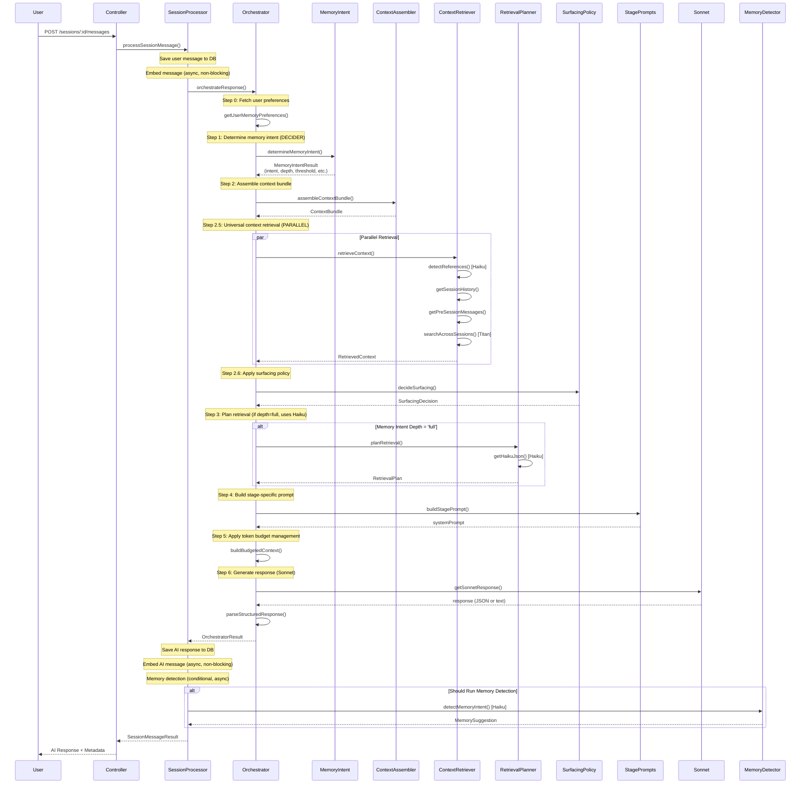

**Key Decision Point:** The **Memory Intent Layer** acts as the "decider" that runs FIRST, before any retrieval or context assembly. It determines:

- What kind of remembering is appropriate (`intent`)
- How deep to retrieve (`depth`: none, minimal, light, full)
- Similarity thresholds and cross-session limits
- How to surface pattern observations

---

## Decision Layers

### Memory Intent Decider (Runs First)

The Memory Intent Layer is the **primary decider** that determines retrieval strategy:

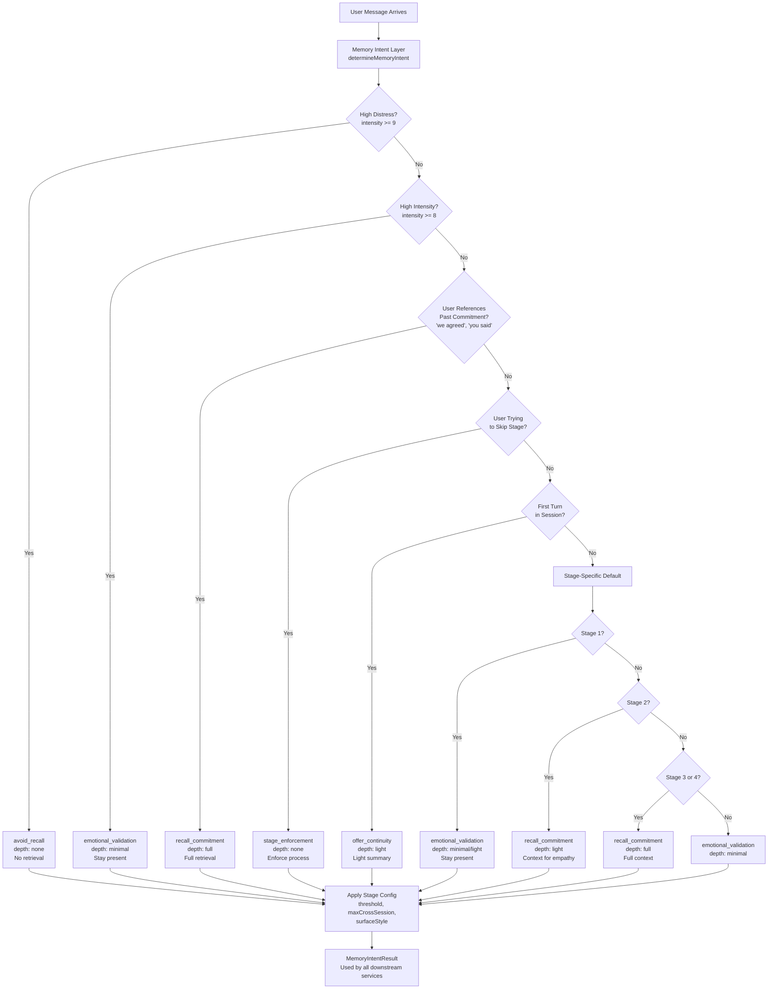

**Memory Intent Types:**

- `avoid_recall`: High distress - no retrieval
- `emotional_validation`: Stay present, minimal recall
- `recall_commitment`: Full structured retrieval
- `offer_continuity`: Light summary from previous session
- `stage_enforcement`: No recall, enforce stage rules

**Stage-Aware Configuration:**
Each intent gets stage-specific thresholds:

- **Stage 1**: threshold=0.65, maxCrossSession=0-3, surfaceStyle='silent'
- **Stage 2**: threshold=0.55, maxCrossSession=5, surfaceStyle='tentative'
- **Stage 3-4**: threshold=0.50, maxCrossSession=10, surfaceStyle='explicit'

**Key File:** `backend/src/services/memory-intent.ts`

---

### Surfacing Policy (Runs After Retrieval)

Determines when and how to surface pattern observations:

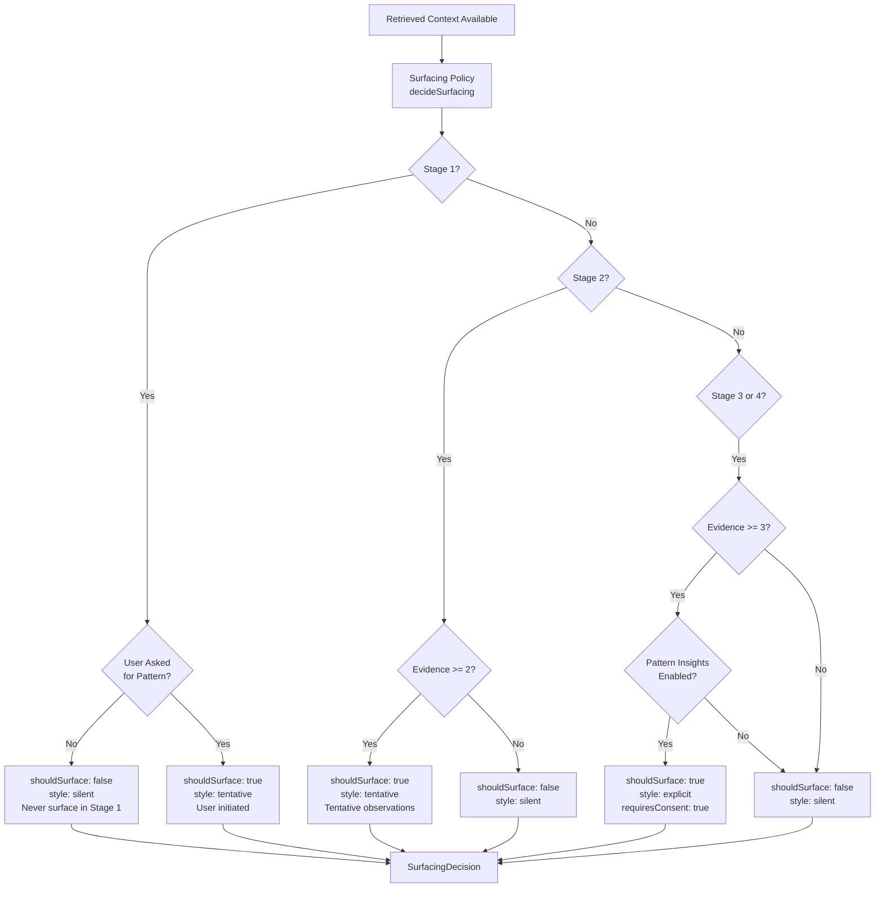

**Key File:** `backend/src/services/surfacing-policy.ts`

---

## Memory Collection & Retrieval

### Memory Collection Flow

Memories are collected in multiple ways:

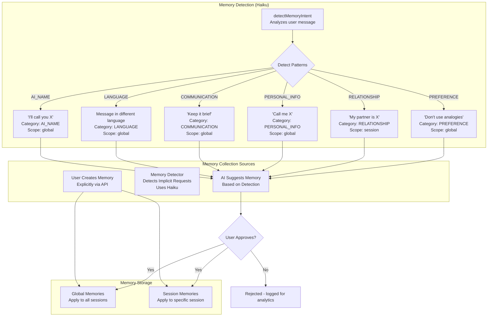

**Memory Detection Gating:**
Memory detection only runs when:

- `userTurnCount >= 3` (let user settle in first)
- `emotionalIntensity <= 7` (skip during high emotional moments)
- `!isStageTransition` (skip during stage transitions)

**Key Files:**

- `backend/src/services/memory-detector.ts` - Detection logic
- `backend/src/services/chat-router/session-processor.ts` - Detection trigger

---

### Context Retrieval Flow

The Universal Context Retriever runs on EVERY message:

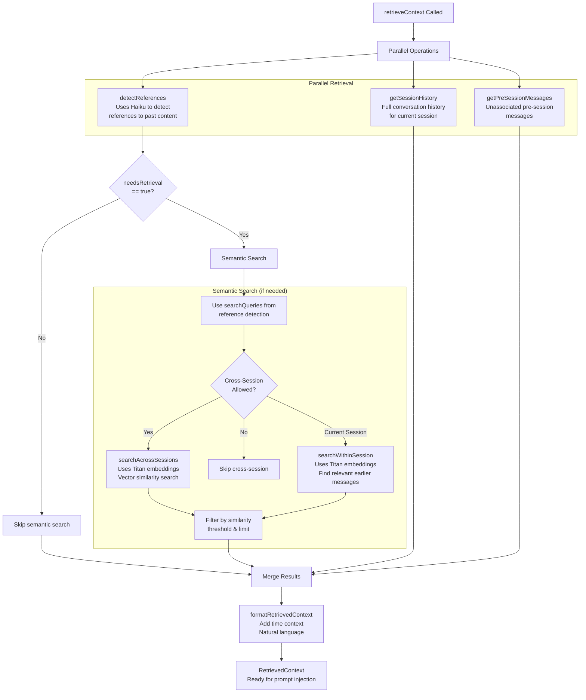

**Key Features:**

- **Runs on every message** regardless of stage or intent
- **Parallel operations** for reference detection, history, and pre-session messages
- **Conditional semantic search** only if references detected
- **Stage-aware thresholds** from Memory Intent
- **Data isolation** - only returns user's own messages and AI responses to them

**Key File:** `backend/src/services/context-retriever.ts`

---

## Prompt Construction

### Stage Prompt Building

Prompts are built dynamically based on stage and context:

```mermaid
graph TD
    START[buildStagePrompt Called] --> CHECK_STAGE{Which Stage?}

    CHECK_STAGE -->|Stage 0| CHECK_ONBOARDING{Onboarding?}
    CHECK_ONBOARDING -->|Yes| ONBOARDING_PROMPT[buildOnboardingPrompt<br/>Curiosity Compact review]
    CHECK_ONBOARDING -->|No| CHECK_INVITATION{Invitation Phase?}
    CHECK_INVITATION -->|Yes| INVITATION_PROMPT[buildInvitationPrompt<br/>Craft invitation message]

    CHECK_STAGE -->|Stage 1| WITNESS_PROMPT[buildStage1Prompt<br/>Witnessing mode<br/>Deep listening]

    CHECK_STAGE -->|Stage 2| PERSPECTIVE_PROMPT[buildStage2Prompt<br/>Perspective stretch<br/>Empathy building]

    CHECK_STAGE -->|Stage 3| NEEDS_PROMPT[buildStage3Prompt<br/>Need mapping<br/>Crystallize needs]

    CHECK_STAGE -->|Stage 4| REPAIR_PROMPT[buildStage4Prompt<br/>Strategic repair<br/>Experiments]

    ONBOARDING_PROMPT --> CHECK_TRANSITION
    INVITATION_PROMPT --> CHECK_TRANSITION
    WITNESS_PROMPT --> CHECK_TRANSITION
    PERSPECTIVE_PROMPT --> CHECK_TRANSITION
    NEEDS_PROMPT --> CHECK_TRANSITION
    REPAIR_PROMPT --> CHECK_TRANSITION

    CHECK_TRANSITION{isStageTransition?} -->|Yes| TRANSITION_PROMPT[buildStageTransitionPrompt<br/>Acknowledge previous stage<br/>Introduce new stage]
    CHECK_TRANSITION -->|No| ADD_BASE[Add BASE_SYSTEM_PROMPT]
    TRANSITION_PROMPT --> ADD_BASE

    ADD_BASE --> ADD_CONTEXT[Inject Context Bundle<br/>- Conversation history<br/>- Emotional thread<br/>- Prior themes<br/>- Inner thoughts<br/>- User memories]

    ADD_CONTEXT --> ADD_RETRIEVED[Inject Retrieved Context<br/>- Cross-session messages<br/>- Relevant history<br/>- Detected references]

    ADD_RETRIEVED --> ADD_SURFACING[Add Surfacing Style<br/>silent | tentative | explicit]

    ADD_SURFACING --> FINAL_PROMPT[Final System Prompt<br/>Ready for Sonnet]
```

**Prompt Components:**

1. **BASE_SYSTEM_PROMPT** (always included):
   - Communication principles
   - Memory guidance
   - Process overview

2. **Stage-Specific Content:**
   - Stage 1: Witnessing techniques, mode switching (WITNESS vs INSIGHT)
   - Stage 2: Empathy building, perspective-taking
   - Stage 3: Need mapping, no solutions
   - Stage 4: Strategic repair, experiments

3. **Context Injection (Fact-Ledger Order):**
   - **Global facts** (user profile from previous sessions - injected at TOP)
   - Emotional state (intensity, trend)
   - Context bundle (conversation, emotional thread, prior themes)
   - Session summary (for long sessions)
   - Inner Thoughts reflections (if linked)
   - User memories (preferences, names, communication style)
   - **Categorized session facts** (People, Logistics, Conflict, Emotional, History)
   - Retrieved context (cross-session, relevant history)

4. **Dynamic Elements:**
   - Turn count
   - Emotional intensity
   - Surfacing style
   - Stage transition acknowledgments

**Key File:** `backend/src/services/stage-prompts.ts`

---

## Parallel vs Sequential Operations

### Sequential Operations (Must Wait)

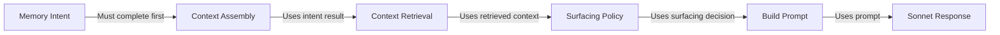

**Why Sequential:**

- Each step depends on the output of the previous step
- Memory Intent determines retrieval depth and thresholds
- Context Assembly uses Memory Intent result
- Prompt building needs all context assembled

---

### Parallel Operations

#### 1. Context Retrieval Parallel Operations

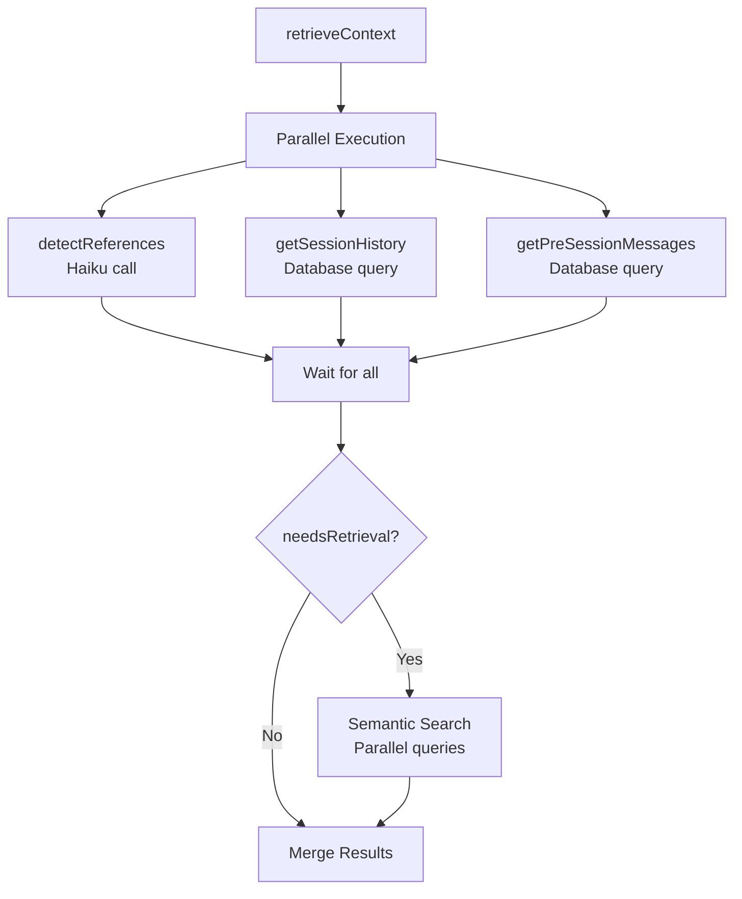

#### 2. Background Classification (Non-Blocking) - Fact-Ledger Architecture

The **Partner Session Classifier** consolidates multiple background Haiku operations into a single call for better latency, cost, and coherence:

```mermaid
graph TD
    START[AI Response Saved] --> CLASSIFIER[runPartnerSessionClassifier<br/>Haiku call<br/>Non-blocking / fire-and-forget]

    CLASSIFIER --> MEMORY[Memory Intent Detection<br/>Detect explicit "remember" requests]
    CLASSIFIER --> FACTS[Categorized Facts Extraction<br/>Update facts by category]
    CLASSIFIER --> TOPIC[Topic Context<br/>What user is discussing]

    MEMORY --> VALID{Memory Valid?}
    VALID -->|Yes| PUBLISH[Create pending memory<br/>Publish via Ably]
    VALID -->|No| LOG[Log rejection reason]

    FACTS --> SAVE_FACTS[Save to UserVessel.notableFacts<br/>JSONB: CategorizedFact[]]

    FACTS --> EMBED[embedSessionContent<br/>Session-level embedding]

    PUBLISH --> RETURN[Return Result<br/>User sees response immediately]
    LOG --> RETURN
    SAVE_FACTS --> RETURN
    EMBED --> RETURN
```

**What Gets Extracted:**

1. **Memory Intent:** Detects explicit "remember" requests (e.g., "remember this", "call me X")
2. **Categorized Notable Facts:** Maintains a curated list of 15-20 facts with categories:
   - **People:** names, roles, relationships (e.g., "daughter Emma is 14")
   - **Logistics:** scheduling, location, practical circumstances
   - **Conflict:** specific disagreements, triggers, patterns
   - **Emotional:** feelings, frustrations, fears, hopes
   - **History:** past events, relationship timeline, backstory
3. **Topic Context:** Brief description of what user is discussing

**Categorized Fact Format:**
```typescript
interface CategorizedFact {
  category: string;  // People, Logistics, Conflict, Emotional, History
  fact: string;      // 1 sentence max
}
```

**Configuration:**

- Runs **after** AI response is sent (fire-and-forget)
- **Non-blocking** - doesn't delay user response
- Uses circuit breaker for Haiku failures (graceful fallback)
- Facts limited to 20 max, consolidated if exceeding
- Facts stored as **JSONB** (not String[])
- **Session-level embedding** triggered after classification

**Key Files:**
- Partner Sessions: `backend/src/services/partner-session-classifier.ts`
- Inner Thoughts: `backend/src/services/background-classifier.ts`

#### 2b. Global Facts Consolidation (Stage Transition)

When a user completes Stage 1 (confirms "Feel Heard"), session facts are consolidated into their global profile:

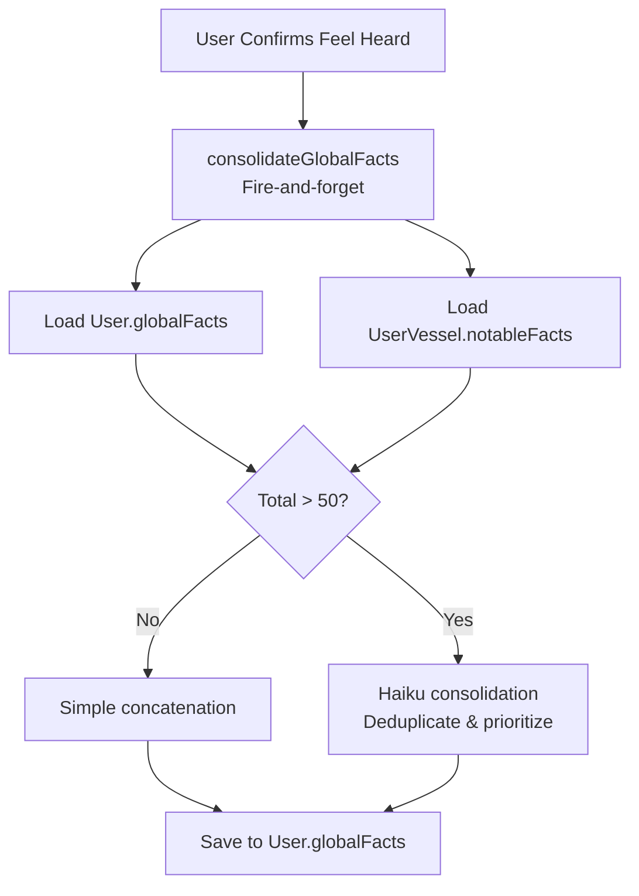

**Configuration:**
- **Max global facts:** 50 (~500 tokens)
- **Trigger:** Stage 1 → Stage 2 transition
- **Cost tracking:** `GLOBAL_MEMORY_CONSOLIDATION` call type
- **Key File:** `backend/src/services/global-memory.ts`

#### 3. Message Embedding (Non-Blocking)

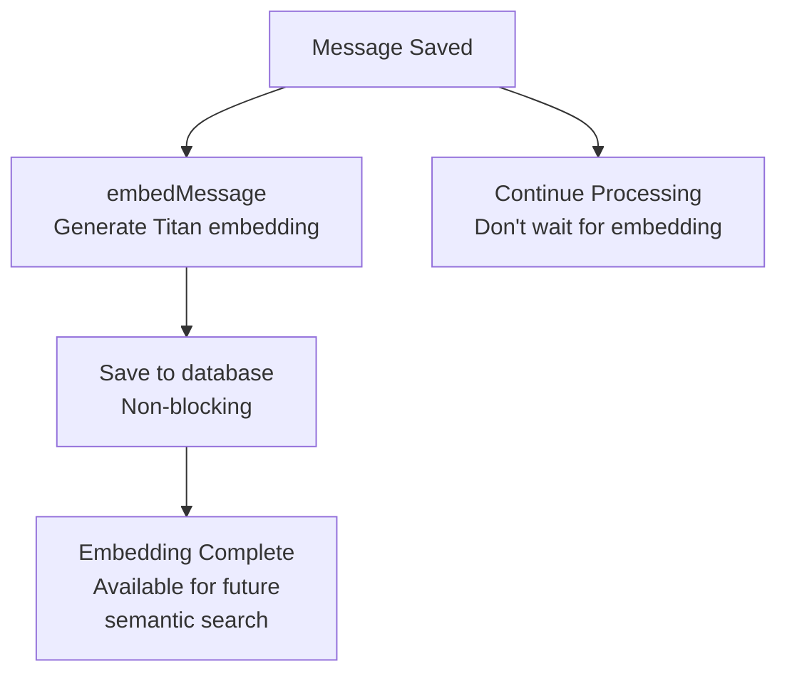

**Embedding Strategy:**

- User messages: Embedded immediately (async)
- AI messages: Embedded immediately (async)
- Used later for semantic search across sessions
- **Never blocks** the main response flow

#### 4. Conversation Summarization (Non-Blocking)

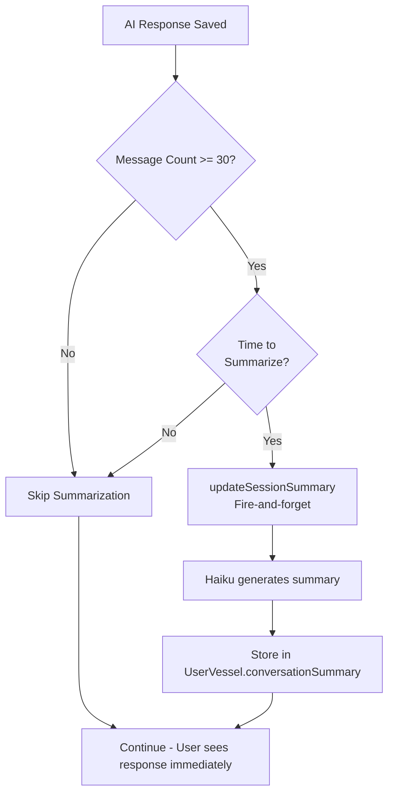

**Summarization Strategy:**

- **Threshold:** Kicks in at 30+ messages
- **Re-summarize:** Every 20 messages after threshold
- **Keeps recent:** Last 15 messages always in full
- **Summarizes:** Older messages condensed by Haiku
- **Non-blocking:** Fire-and-forget, doesn't delay response
- **Output:** Summary text, key themes, emotional journey, unresolved topics

**Where Called:**

- `messages.ts` - After AI message saved
- `sessions.ts` - After session message
- `stage2.ts` - After Stage 2 responses
- `session-processor.ts` - After processing
- `session-creation.ts` - After creation

**Key File:** `backend/src/services/conversation-summarizer.ts`

---

## Service-Specific Flows

### 1. Intent Detection (Chat Router)

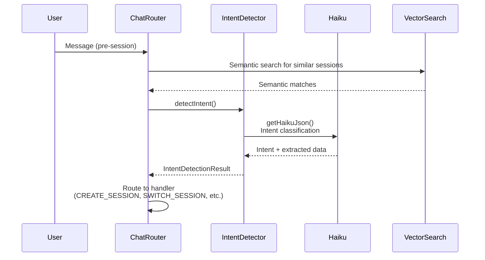

**Key File:** `backend/src/services/chat-router/intent-detector.ts`

---

### 2. Retrieval Planning (Full Depth Only)

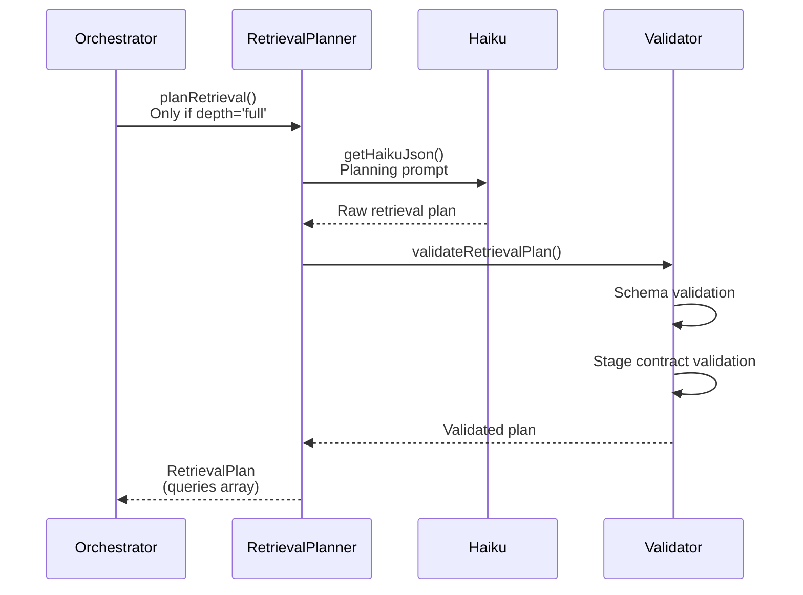

**Key Features:**

- Only runs when `memoryIntent.depth === 'full'`
- Uses Haiku for fast, structured JSON output
- Validates against stage contracts (what queries are allowed per stage)
- Filters invalid queries before execution

**Key File:** `backend/src/services/retrieval-planner.ts`

---

### 3. Witnessing Service (Pre-Session)

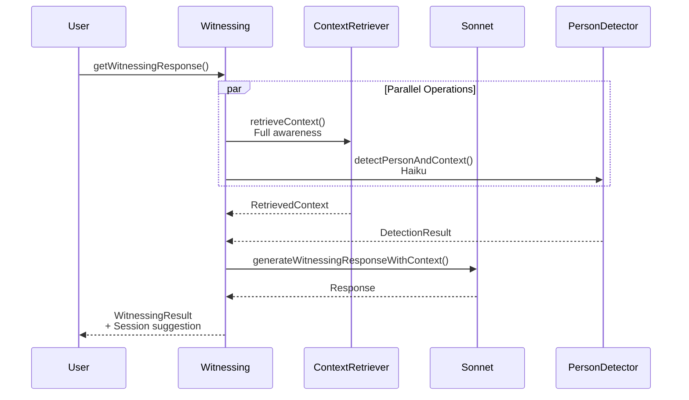

**Key File:** `backend/src/services/witnessing.ts`

---

### 4. Reconciler Service (Post-Stage 2)

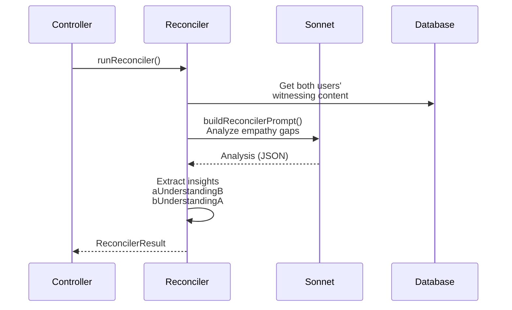

**Key File:** `backend/src/services/reconciler.ts`

---

## Summary: Key Decision Points

### 1. Memory Intent (Primary Decider)

**Runs:** FIRST, before any retrieval  
**Purpose:** Determines what kind of remembering is appropriate  
**Output:** `MemoryIntentResult` with intent, depth, thresholds, surface style  
**Used By:** All downstream services (Context Assembler, Context Retriever, Retrieval Planner)

### 2. Surfacing Policy

**Runs:** After context retrieval  
**Purpose:** Determines when/how to surface pattern observations  
**Output:** `SurfacingDecision` with shouldSurface, style, requiresConsent  
**Used By:** Prompt builder (injects surfacing style into prompt)

### 3. Context Retrieval

**Runs:** On EVERY message, regardless of intent  
**Purpose:** Universal awareness of relevant history  
**Output:** `RetrievedContext` with messages, references, summaries  
**Used By:** Prompt builder (injects retrieved context)

### 4. Retrieval Planning

**Runs:** Only when `depth === 'full'`  
**Purpose:** Plans structured data queries  
**Output:** `RetrievalPlan` with validated queries  
**Used By:** (Currently planned but not fully implemented in retrieval execution)

---

## Model Usage Summary

| Service                                 | Model              | Purpose                            | When                               |
| --------------------------------------- | ------------------ | ---------------------------------- | ---------------------------------- |
| Memory Intent                           | None (rules-based) | Determine retrieval strategy       | Every message                      |
| Context Retrieval - Reference Detection | Haiku              | Detect references to past          | Every message (parallel)           |
| Context Retrieval - Semantic Search     | Titan              | Vector similarity search           | When references detected           |
| Retrieval Planning                      | Haiku              | Plan structured queries            | When depth='full'                  |
| Intent Detection                        | Haiku              | Classify user intent               | Pre-session messages               |
| Background Classification               | Haiku              | Memory detection + categorized facts | After every AI response (fire-and-forget) |
| Global Facts Consolidation              | Haiku              | Merge session facts into user profile | Stage 1 → Stage 2 transition       |
| Session Embedding                       | Titan              | Embed session content              | After classification               |
| Conversation Summarization              | Haiku              | Summarize older messages           | When message count >= 30           |
| Response Generation                     | Sonnet             | User-facing responses              | Every message                      |
| Witnessing                              | Sonnet             | Pre-session witnessing             | Pre-session messages               |
| Reconciler                              | Sonnet             | Analyze empathy gaps               | Post-Stage 2                       |
| Needs Extraction                        | Sonnet             | Extract needs from conversation    | Stage 3                            |
| Common Ground                           | Sonnet             | Find common ground                 | Stage 2+                           |

---

## Files Reference

### Core Orchestration

- `backend/src/services/ai-orchestrator.ts` - Main orchestration flow
- `backend/src/services/ai.ts` - AI service wrapper
- `backend/src/lib/bedrock.ts` - Model configuration and client

### Decision Layers

- `backend/src/services/memory-intent.ts` - Primary decider (Memory Intent)
- `backend/src/services/surfacing-policy.ts` - Pattern surfacing decisions

### Context & Retrieval

- `backend/src/services/context-assembler.ts` - Builds context bundles
- `backend/src/services/context-retriever.ts` - Universal context retrieval
- `backend/src/services/retrieval-planner.ts` - Plans structured queries

### Prompt Building

- `backend/src/services/stage-prompts.ts` - Stage-specific prompts

### Memory & Summarization

- `backend/src/services/partner-session-classifier.ts` - Background classification (memory + categorized facts) for partner sessions
- `backend/src/services/background-classifier.ts` - Background classification for Inner Thoughts sessions
- `backend/src/services/global-memory.ts` - Global facts consolidation (cross-session user profile)
- `backend/src/controllers/memories.ts` - Memory CRUD operations
- `backend/src/services/conversation-summarizer.ts` - Rolling conversation summarization
- `backend/src/utils/token-budget.ts` - Token counting and budget management

### Other Services

- `backend/src/services/chat-router/intent-detector.ts` - Intent classification
- `backend/src/services/witnessing.ts` - Pre-session witnessing
- `backend/src/services/reconciler.ts` - Empathy gap analysis
- `backend/src/services/needs.ts` - Need extraction

---

## Conclusion

The backend uses a **decision-first architecture** where:

1. **Memory Intent Layer** acts as the primary decider, running FIRST
2. **Context is pre-assembled** - the AI doesn't decide what to retrieve
3. **Two-model stratification** optimizes cost and speed (Haiku for mechanics, Sonnet for empathy)
4. **Universal context retrieval** ensures awareness on every message
5. **Parallel operations** optimize performance (reference detection, history loading, semantic search)
6. **Non-blocking operations** (embeddings, fact extraction) don't delay responses

The system is designed to be **therapeutically appropriate** - respecting emotional intensity, stage boundaries, and user preferences while maintaining full awareness of relevant history.
