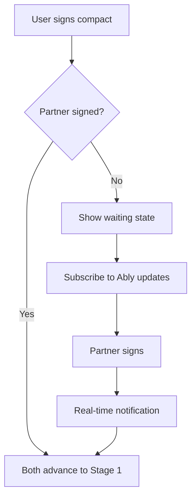

# Stage 0 API: Onboarding

Endpoints for the Curiosity Compact signing flow.

## Sign Curiosity Compact

Sign the Curiosity Compact to commit to the process.

```
POST /api/v1/sessions/:id/compact/sign
```

### Request Body

```typescript
interface SignCompactRequest {
  agreed: true;  // must literally be true; any other value returns VALIDATION_ERROR
}
```

### Response

```typescript
interface SignCompactResponse {
  signed: boolean;
  signedAt: string;
  partnerSigned: boolean;
  canAdvance: boolean;
}
```

### Example

```bash
curl -X POST /api/v1/sessions/sess_abc123/compact/sign \
  -H "Authorization: Bearer <token>"
```

```json
{
  "success": true,
  "data": {
    "signed": true,
    "signedAt": "2024-01-16T14:30:00Z",
    "partnerSigned": false,
    "canAdvance": false
  }
}
```

### Side Effects

1. Updates `StageProgress.gatesSatisfied` with `compactSigned: true` and stamps `signedAt`.
2. Notification target depends on role: if the signer is the invitee, the inviter is notified; otherwise the session's partner is notified (if any).
3. **Self-healing session activation**: If both parties have now signed and the session is still in `CREATED` / `INVITED`, the controller upgrades it to `ACTIVE` in the same transaction. This covers edge cases where the invitation-accept flow didn't flip the status.
4. `canAdvance` in the response is `true` iff both parties have signed.

### Errors

| Code | When |
|------|------|
| `VALIDATION_ERROR` | `agreed` is not literally `true`, or the user has already signed |

> There is no separate `SESSION_NOT_ACTIVE` error for Stage 0 — signing can succeed from `CREATED`/`INVITED` as well (see side effect 3).

---

## Get Compact Status

Check compact signing status for both parties.

```
GET /api/v1/sessions/:id/compact/status
```

### Response

```typescript
interface CompactStatusResponse {
  mySigned: boolean;
  mySignedAt: string | null;
  partnerSigned: boolean;
  partnerSignedAt: string | null;  // Only visible after user signs
  canAdvance: boolean;
  isFirstSession: boolean;  // No prior resolved sessions for this relationship
}
```

### Privacy Note

`partnerSignedAt` is only returned if the current user has signed. This prevents one party from waiting to see if the other signs first.

### Example Response (user signed, partner hasn't)

```json
{
  "success": true,
  "data": {
    "mySigned": true,
    "mySignedAt": "2024-01-16T14:30:00Z",
    "partnerSigned": false,
    "partnerSignedAt": null,
    "canAdvance": false
  }
}
```

### Example Response (both signed)

```json
{
  "success": true,
  "data": {
    "mySigned": true,
    "mySignedAt": "2024-01-16T14:30:00Z",
    "partnerSigned": true,
    "partnerSignedAt": "2024-01-16T14:45:00Z",
    "canAdvance": true
  }
}
```

---

## Stage 0 Gate Requirements

To advance from Stage 0 to Stage 1:

| Gate | Requirement |
|------|-------------|
| `compactSigned` | User has signed the compact |
| `partnerCompactSigned` | Partner has signed the compact |

**Both** users must sign before **either** can advance.

---

## Opening Framing

The opening welcome message is served as static content embedded in the mobile app. It replaces the former "Curiosity Compact" formal agreement with a brief, warm AI-spoken message.

- **First session:** "You'll each chat with me privately first. Nothing gets shared without your say. Ready?"
- **Repeat session:** "Welcome back. Same as before — your space is private, nothing shared without your say. Let's pick up where we left off."

The `isFirstSession` field in the compact status response indicates which variant to show. No formal commitments or checkboxes are required — just a "Ready" / "Let's go" button.

---

## Waiting State

When user has signed but partner hasn't:

1. Show waiting UI with partner status
2. Subscribe to Ably channel for real-time update when the partner signs

> There is no "nudge" endpoint — reminders are handled out-of-band by the inviter re-sharing the invitation URL if the partner never engages.



---

## Related Documentation

- [Stage 0: Onboarding](../../stages/stage-0-onboarding.md) - Full stage documentation
- [Stages API](./stages.md) - Stage advancement
- [Real-time Integration](./realtime.md) - Ably notifications

---

[Back to API Index](./index.md) | [Back to Backend](../index.md)
