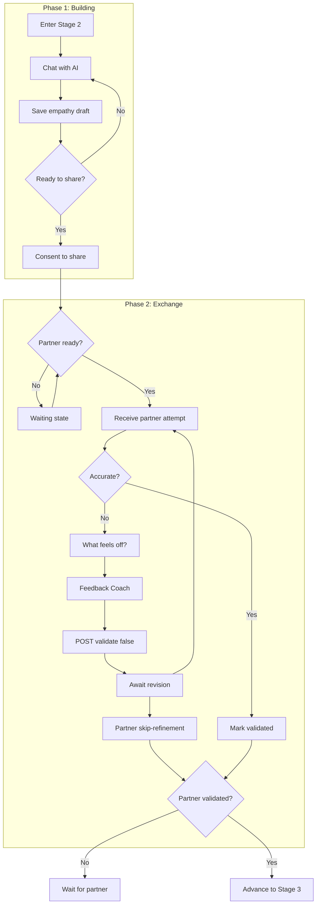

# Stage 2 API: Perspective Stretch

Endpoints for building and exchanging empathy attempts.

## Overview

Stage 2 has two phases:

1. **Phase 1: Building** - User works with AI to build their empathy guess about partner
2. **Phase 2: Exchange** - Users exchange empathy attempts and validate each other

### Data persistence
- Drafts → `EmpathyDraft` (one per user/session, mutable)
- Consented share → `EmpathyAttempt` with `ConsentRecord.targetType = 'EMPATHY_DRAFT'`
- Validation → `EmpathyValidation` (one per recipient per attempt)

### Consent semantics (MVP)
- Consent is recorded via `POST /sessions/:id/empathy/consent`. The controller creates a `ConsentRecord` with `targetType = 'EMPATHY_DRAFT'` referencing the draft, and snapshots the content into an `EmpathyAttempt`.
- `EmpathyDraft` is currently **mutable** after sharing — the controller does not block further `saveDraft` calls on a consented draft. Downstream reads (partner view, validation) use the `EmpathyAttempt` snapshot, so edits to the draft do not leak to the partner, but the draft row itself can still move.
- General consent revocation / pending-queue semantics live in the [Consent API](./consent.md), not here.

---

## Phase 1: Building Empathy

### Save Empathy Draft

Save or update the user's empathy attempt draft.

```
POST /api/v1/sessions/:id/empathy/draft
```

### Request Body

```typescript
interface SaveEmpathyDraftRequest {
  content: string;  // The empathy attempt text
  readyToShare?: boolean; // Optional toggle to mark draft as ready (sets gate empathyDraftReady)
}
```

### Response

```typescript
interface SaveEmpathyDraftResponse {
  draft: EmpathyDraftDTO;
  readyToShare: boolean;  // AI assessment if draft shows genuine curiosity
}

interface EmpathyDraftDTO {
  id: string;
  content: string;
  version: number;
  readyToShare: boolean;
  updatedAt: string;
}
```

Validation: 1-1200 chars; trims whitespace; idempotent update (same draft row per user/session).

### Example

```bash
curl -X POST /api/v1/sessions/sess_abc123/empathy/draft \
  -H "Authorization: Bearer <token>" \
  -d '{
    "content": "I think they might be feeling overwhelmed and scared that our relationship is falling apart. Maybe they feel like nothing they do is good enough."
  }'
```

```json
{
  "success": true,
  "data": {
    "draft": {
      "id": "draft_001",
      "content": "I think they might be feeling overwhelmed and scared...",
      "updatedAt": "2024-01-16T17:00:00Z",
      "version": 1
    },
    "readyToShare": true
  }
}
```

---

### Get Empathy Draft

Get the current empathy draft.

```
GET /api/v1/sessions/:id/empathy/draft
```

### Response

```typescript
interface GetEmpathyDraftResponse {
  draft: EmpathyDraftDTO | null;
  canConsent: boolean;
  alreadyConsented: boolean;
}
```

---

### Consent to Share Empathy

Consent to share the empathy attempt with partner.

```
POST /api/v1/sessions/:id/empathy/consent
```

### Request Body

```typescript
interface ConsentToShareEmpathyRequest {
  consent: boolean;  // true to consent and share
}
```

### Response

```typescript
interface ConsentToShareEmpathyResponse {
  consented: boolean;
  consentedAt: string | null;
  partnerConsented: boolean;
  canReveal: boolean;
  status: 'HELD' | 'ANALYZING';  // HELD = waiting for partner; ANALYZING = both shared
  empathyMessage: {
    id: string;
    content: string;
    timestamp: string;
    stage: number;
  };
  transitionMessage?: {
    id: string;
    content: string;
    timestamp: string;
    stage: number;
  };
}
```

### Side Effects

1. `ConsentRecord` created with `targetType = 'EMPATHY_DRAFT'`
2. `EmpathyAttempt` snapshot is created from the (possibly edited) content; this is what the partner reads
3. The original `EmpathyDraft` row remains mutable — subsequent edits don't affect the shared `EmpathyAttempt`
4. If partner already has an `EmpathyAttempt`, both sides can now read each other's via `GET /empathy/partner` / `/empathy/status`
5. Partner notified via the Ably session channel

---

## Phase 2: Exchange

### Get Partner's Empathy Attempt

Get the partner's empathy attempt (after both have consented).

```
GET /api/v1/sessions/:id/empathy/partner
```

### Response

```typescript
interface GetPartnerEmpathyResponse {
  // Null if partner hasn't consented yet
  attempt: EmpathyAttemptDTO | null;
  waitingForPartner: boolean;

  // If validated, show validation status
  validated: boolean;
  validatedAt: string | null;
  awaitingRevision: boolean;
}

interface EmpathyAttemptDTO {
  id: string;
  sourceUserId: string;
  content: string;  // Partner's attempt to understand you
  sharedAt: string;
  consentRecordId: string;
}
```

> Unlike many API endpoints, this returns **200 OK with `attempt: null` and `waitingForPartner: true`** when the partner hasn't shared yet — there's no dedicated `PARTNER_NOT_READY` error code. The same is true when the caller themselves hasn't consented yet.

---

## Status + refinement + share suggestion endpoints

Besides the Phase-1 / Phase-2 core above, the routes file exposes these controllers:

| Method | Endpoint | Purpose |
|--------|----------|---------|
| `GET`  | `/api/v1/sessions/:id/empathy/status` | Single-call status for the whole Stage 2 exchange — returns draft, attempt, refinement state (`NEEDS_WORK`, `REFINING`, `ANALYZING`, etc.), and gate flags |
| `POST` | `/api/v1/sessions/:id/empathy/refine` | Run AI refinement on the caller's current draft (used by the validation feedback / coach loop) |
| `POST` | `/api/v1/sessions/:id/empathy/resubmit` | After refinement, resubmit an updated `EmpathyAttempt` on top of an existing validation request |
| `POST` | `/api/v1/sessions/:id/empathy/skip-refinement` | Accept or decline the current gap as a "willing-to-accept" difference and advance without further refinement; updates `skippedRefinement`, `willingToAccept`, `skipReason` on the caller's StageProgress |
| `GET`  | `/api/v1/sessions/:id/empathy/share-suggestion` | Asymmetric reconciler: fetch a suggestion to help the caller close an empathy gap for the partner |
| `POST` | `/api/v1/sessions/:id/empathy/share-suggestion/respond` | Accept or decline a share suggestion |
| `POST` | `/api/v1/sessions/:id/empathy/validation-feedback/draft` | Draft feedback via the "Feedback Coach" AI flow |
| `POST` | `/api/v1/sessions/:id/empathy/validation-feedback/refine` | Iterate on feedback-coach output |

---

### Validate Partner's Attempt

Provide feedback on how accurate partner's attempt is.

```
POST /api/v1/sessions/:id/empathy/validate
```

### Request Body

```typescript
interface ValidateEmpathyRequest {
  validated: boolean;  // true = "accurate/partial", false = "not quite"
  feedback?: string;   // Required for validated: false; optional note for validated: true
  consentToShareFeedback?: boolean;  // Legacy client hint; validated: false shares feedback
}
```

### Response

```typescript
interface ValidateEmpathyResponse {
  validated: boolean;
  validatedAt: string | null;

  // If feedback shared, partner can revise
  feedbackShared: boolean;
  awaitingRevision: boolean;

  // Gate status
  canAdvance: boolean;
  partnerValidated: boolean;
}
```

Validation: feedback max 1000 chars; one validation per recipient per attempt (idempotent overwrite allowed).

For the "Not quite" path, mobile first collects rough notes with the `What feels off?`
step, then the Feedback Coach refines those notes into a final message. The final send
uses this validation endpoint with `validated: false` and the coach-approved `feedback`.
The backend stores the validation, creates a targeted partner chat message with role
`VALIDATION_FEEDBACK`, updates the partner's empathy attempt to `REFINING`, and emits
`empathy.status_updated` for that partner with `status: 'REFINING'`,
`feedbackShared: true`, and `validationFeedback`.

### Gate keys set by Stage 2 endpoints
- `empathyDraftReady`: set when `readyToShare: true` on draft save
- `empathyConsented`: set when the caller consents to share their attempt
- `empathyValidated` / `validatedAt`: set when the caller posts `validated: true` on the partner's attempt
- `skippedRefinement`, `willingToAccept`, `skipReason`: set by `/empathy/skip-refinement` when the caller accepts remaining differences

Stage-2 advancement is computed by comparing the caller's and partner's mutual `empathyValidated` status (either both validated, or at least one side has skipped refinement and both gates are consistent).

### Example: Validation with Feedback

```bash
curl -X POST /api/v1/sessions/sess_abc123/empathy/validate \
  -H "Authorization: Bearer <token>" \
  -d '{
    "validated": false,
    "feedback": "Close, but it is not so much fear as exhaustion. I feel like I have been carrying everything alone.",
    "consentToShareFeedback": true
  }'
```

```json
{
  "success": true,
  "data": {
    "validated": false,
    "validatedAt": "2024-01-16T17:05:00.000Z",
    "feedbackShared": true,
    "awaitingRevision": true,
    "canAdvance": false,
    "partnerValidated": false
  }
}
```

### Revision Loop

If feedback is shared:
1. Partner receives a targeted `VALIDATION_FEEDBACK` message and their attempt status becomes `REFINING`
2. Partner can revise and resubmit their empathy attempt
3. User receives the revised attempt and can validate again
4. Partner can also accept or decline the remaining difference via `/empathy/skip-refinement`

### Skip Refinement / Acceptance Check

```
POST /api/v1/sessions/:id/empathy/skip-refinement
```

Request:

```typescript
interface SkipRefinementRequest {
  willingToAccept: boolean;
  reason?: string; // Used when willingToAccept is false
}
```

`willingToAccept: true` records that the partner accepts the subject's experience without
editing their statement further. `willingToAccept: false` records that they do not accept
the framing; the optional `reason` captures why. Both paths set `skippedRefinement` and
allow the Stage 2 mutual gate logic to advance without another revision cycle.

---

## Stage 2 Gate Requirements

To advance from Stage 2 to Stage 3, the caller needs:

| Gate | Requirement |
|------|-------------|
| `empathyConsented` | Caller consented to share their attempt (`EmpathyAttempt` exists) |
| `empathyValidated` (or `skippedRefinement = true`) | Caller validated the partner's attempt, or explicitly accepted the remaining differences |

Advancement also requires the partner has reached the matching state — see `empathy-status.ts` for the mutual-state check.

---

## Stage 2 Flow



---

## Retrieval Contract

In Stage 2, the API enforces these retrieval rules:

| Allowed | Forbidden |
|---------|-----------|
| User's own data (all) | Partner's raw venting (User Vessel) |
| Shared Vessel (consented content only) | AI Synthesis Map directly |
| Partner's consented reflections | Non-consented partner data |

See [Retrieval Contracts: Stage 2](../state-machine/retrieval-contracts.md#stage-2-perspective-stretch).

---

## Related Documentation

- [Stage 2: Perspective Stretch](../../stages/stage-2-perspective-stretch.md) - Full stage documentation
- [Consensual Bridge](../../mechanisms/consensual-bridge.md) - Consent mechanism
- [Mirror Intervention](../../mechanisms/mirror-intervention.md) - Handling judgment
- [Consent API](./consent.md) - General consent endpoints

---

[Back to API Index](./index.md) | [Back to Backend](../index.md)
