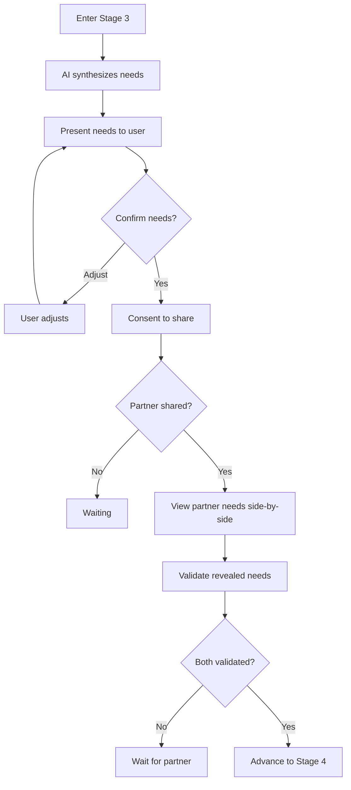

# Stage 3 API: What Matters

Endpoints for identifying needs, confirming them, and validating revealed needs with a partner.

## Overview

Stage 3 transforms complaints and emotions into universal human needs, then both partners validate each other's revealed needs before advancing.

Key concepts:
- **Need synthesis**: AI extracts needs from Stage 1-2 content
- **Need confirmation**: User validates extracted needs
- **Needs validation**: Both partners confirm they have reviewed each other's revealed needs

---

## Get Synthesized Needs

Get AI-synthesized needs for the current user based on their Stage 1-2 content.

```
GET /api/v1/sessions/:id/needs
```

### Response

```typescript
interface GetNeedsResponse {
  needs: IdentifiedNeedDTO[];
  synthesizedAt: string;
  isDirty: boolean;  // True if content changed since synthesis
}

interface IdentifiedNeedDTO {
  id: string;
  need: string;              // e.g., "Recognition"
  category: NeedCategory;    // SAFETY, CONNECTION, etc.
  description: string;       // Specific description
  evidence: string[];        // Quotes/references supporting this
  confirmed: boolean;
  aiConfidence: number;      // 0-1
}

enum NeedCategory {
  SAFETY = 'SAFETY',
  CONNECTION = 'CONNECTION',
  AUTONOMY = 'AUTONOMY',
  RECOGNITION = 'RECOGNITION',
  MEANING = 'MEANING',
  FAIRNESS = 'FAIRNESS',
}
```

### Example Response

```json
{
  "success": true,
  "data": {
    "needs": [
      {
        "id": "need_001",
        "need": "Recognition",
        "category": "RECOGNITION",
        "description": "Need to feel seen and appreciated for contributions at home",
        "evidence": [
          "I cleaned the whole house and they did not even notice",
          "I feel like nothing I do is ever enough"
        ],
        "confirmed": false,
        "aiConfidence": 0.87
      },
      {
        "id": "need_002",
        "need": "Partnership",
        "category": "FAIRNESS",
        "description": "Need for shared responsibility in household tasks",
        "evidence": [
          "I am always the one who has to think about everything"
        ],
        "confirmed": false,
        "aiConfidence": 0.72
      }
    ],
    "synthesizedAt": "2024-01-16T18:00:00Z",
    "isDirty": false
  }
}
```

### Synthesis Trigger

`GET /needs` runs extraction only when **no needs exist yet** for the caller AND the caller has sent at least one Stage-3 `USER` message (the caller has to engage before the AI will synthesize).

- First call with zero Stage-3 messages: returns `{ needs: [], extracting: false }`; the UI prompts the user to reflect.
- First call after the user has messaged: returns `{ needs: [], extracting: true }` on a cache miss while AI extraction runs; subsequent polls return the synthesized list.
- Subsequent calls once needs exist: returns the stored `IdentifiedNeed` rows without re-extracting.
`isDirty` and explicit re-synthesis are not currently triggers — extraction runs once and is not re-run from this endpoint. Validation: each need has evidence 1-5 items; `aiConfidence` 0-1. The response includes both `need` and `description` fields carrying the same string (`description` is a compatibility alias).

---

## Confirm Needs

Confirm or adjust AI-synthesized needs.

```
POST /api/v1/sessions/:id/needs/confirm
```

### Request Body

```typescript
interface ConfirmNeedsRequest {
  confirmations: NeedConfirmation[];
}

interface NeedConfirmation {
  needId: string;
  confirmed: boolean;
  adjustment?: string;  // If user wants to rephrase
}
```

### Response

```typescript
interface ConfirmNeedsResponse {
  updated: IdentifiedNeedDTO[];
  allConfirmed: boolean;
  canProceedToConsent: boolean; // true when at least one confirmed AND consent flow ready
}
```

Validation: confirmation required for each presented need; adjustment max 300 chars. Sets gate `needsConfirmed` for the caller. The response includes a `partnerConfirmed` boolean indicating whether the partner has reached the same gate (no separate `partnerNeedsConfirmed` field in the payload).

### Example

```bash
curl -X POST /api/v1/sessions/sess_abc123/needs/confirm \
  -H "Authorization: Bearer <token>" \
  -d '{
    "confirmations": [
      {"needId": "need_001", "confirmed": true},
      {"needId": "need_002", "confirmed": true, "adjustment": "Need for us to be a team at home"}
    ]
  }'
```

---

## Add Custom Need

Add a need that AI did not identify.

```
POST /api/v1/sessions/:id/needs
```

### Request Body

```typescript
interface AddNeedRequest {
  need: string;
  category: NeedCategory;
  description: string;
}
```

### Response

```typescript
interface AddNeedResponse {
  need: IdentifiedNeedDTO;
}
```

Validation: need/description 1-200 chars; category required. User-added needs are created with `confirmed: true` (they represent an explicit user declaration, not an AI guess).

---

## Consent to Share Needs

Consent to share confirmed needs with partner.

```
POST /api/v1/sessions/:id/needs/consent
```

### Request Body

```typescript
interface ConsentShareNeedsRequest {
  needIds: string[];  // Which needs to share
}
```

### Response

```typescript
interface ConsentShareNeedsResponse {
  consented: boolean;
  sharedAt: string;
  waitingForPartner: boolean;
}
```

### Side Effects

1. Selected needs transformed and added to SharedVessel
2. Partner notified
3. Creates `ConsentRecord` rows with `targetType = IDENTIFIED_NEED`, links ConsentedContent

Validation: needIds must reference confirmed needs; at least 1. Consenting sets the caller's `needsShared` gate and moves the caller's Stage-3 status to `GATE_PENDING`. The partner-side check `partnerProgress.gatesSatisfied.needsShared === true` (surfaced via the `hasPartnerSharedNeeds` helper) is what unblocks the needs-validation step.

---

## Compare Needs (Side-by-Side)

After both partners share needs, the app can render a side-by-side comparison of each user's confirmed/shared needs:

```
GET /api/v1/sessions/:id/needs/comparison
```

Returns each partner's needs grouped for display; useful before the validation step completes.

---

## Validate Needs

Confirm that you have reviewed your partner's revealed needs. Both partners must validate before advancing to Stage 4.

```
POST /api/v1/sessions/:id/needs/validate
```

### Request Body

```typescript
interface ValidateNeedsRequest {
  validated: boolean;  // Defaults to true if omitted
}
```

### Response

```typescript
interface ValidateNeedsResponse {
  validated: boolean;
  validatedAt: string | null;
  partnerValidated: boolean;
  canAdvance: boolean;  // true when both partners have validated
}
```

### Side Effects

When both partners validate (`canAdvance === true`):
1. Both partners' Stage-3 status transitions to `COMPLETED`
2. Both partners' Stage-4 progress records are created (`IN_PROGRESS`)
3. A transition message is published to both users

Pre-conditions: both partners must have consented to share needs (`needsShared` gate) before calling this endpoint. The `hasPartnerSharedNeeds` check is enforced server-side.

---

## Stage 3 Gate Requirements

To advance from Stage 3 to Stage 4:

| Gate | Requirement |
|------|-------------|
| `needsConfirmed` | Caller confirmed at least one need |
| `needsShared` | Caller consented to share confirmed needs |
| `needsValidated` | Caller called `POST /needs/validate` (both partners must satisfy this gate to advance) |

The partner-side check reads `partnerProgress.gatesSatisfied.needsShared`; there is no standalone `partnerNeedsConfirmed` gate. Stage-3 status transitions: `IN_PROGRESS → GATE_PENDING` (after sharing needs) → `COMPLETED` (when both partners have validated).

---

## Stage 3 Flow



---

## Retrieval Contract

In Stage 3, the API enforces these retrieval rules:

| Allowed | Forbidden |
|---------|-----------|
| User's identified needs | Partner's raw events |
| Shared Vessel (consented needs) | Non-consented partner needs |
| Partner's revealed needs (after both consent) | Partner's UserVessel |

Vector search is scoped to needs only (not raw events).

See [Retrieval Contracts: Stage 3](../state-machine/retrieval-contracts.md#stage-3-what-matters).

---

## Related Documentation

- [Stage 3: What Matters](../../stages/stage-3-what-matters.md)
- [Need Extraction Prompt](../prompts/need-extraction.md)
- [Universal Needs Framework](../../stages/stage-3-what-matters.md#universal-needs-framework)

---

[Back to API Index](./index.md) | [Back to Backend](../index.md)
