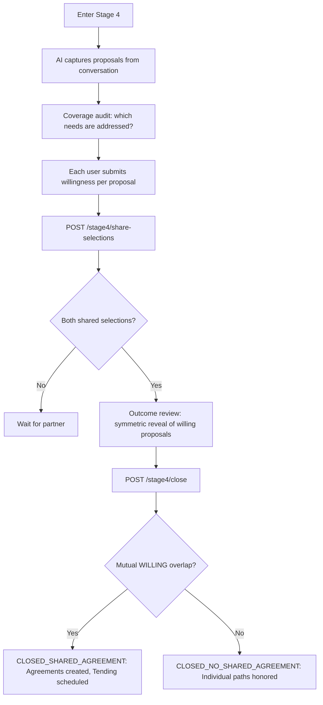
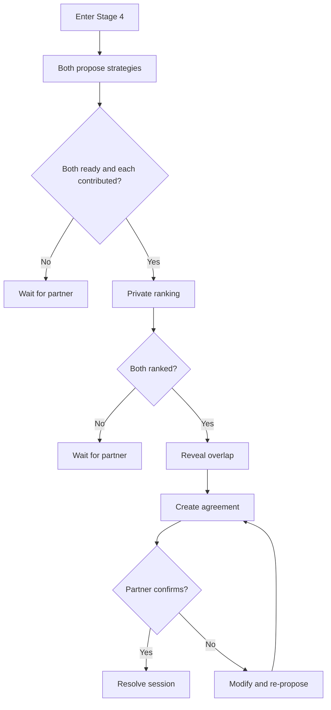

# Stage 4 API: Strategic Repair

Endpoints for collaborative strategy proposal, willingness selection, agreement documentation, and Tending check-ins.

## Overview

Stage 4 is **sequential** (unlike stages 1-3 which are parallel). Both users must complete Stage 3 before either can enter Stage 4.

> **Two flows coexist in the codebase.**
>
> The **redesigned flow** (primary) uses a willingness-selection model: proposals are AI-captured, both users indicate willingness (WILLING / NOT_WILLING) per proposal, then stage 4 closes explicitly via `POST /stage4/close`. See [Stage 4 Redesign endpoints](#stage-4-redesign-primary-flow) below.
>
> The **legacy flow** (vestigial) used private ranking followed by overlap reveal. Its endpoints (`/strategies/rank`, `/strategies/overlap`, `/strategies/ready`) remain in the router for backward compatibility but are not the primary resolution path.

### Data persistence
- Proposals → `StrategyProposal` with `kind` (SHARED_PROPOSAL | INDIVIDUAL_COMMITMENT), `source` (USER_SUBMITTED | AI_SUGGESTED | CURATED), and `status` (ACTIVE | REVISED | REMOVED | CONVERTED_TO_AGREEMENT). The redesigned walkthrough exposes a source label (current user, partner, AI, or unknown) so users understand where options came from.
- Willingness selections → `Stage4ProposalSelection` per user per proposal
- Coverage audit → `Stage4NeedCoverage` tracks which confirmed needs are addressed by proposals
- Walkthrough state → `StageProgress.gatesSatisfied.stage4Walkthrough` stores the caller's focused phase, current need, covered needs, and skipped needs
- Closure → `Stage4Closure` records the final outcome kind (SHARED_AGREEMENT | NO_SHARED_AGREEMENT)
- Agreements → `Agreement` rows linked to proposals via `proposalId`
- Follow-up check-ins → `TendingEntry` rows scheduled from `Agreement.followUpDate`
- Legacy rankings → `StrategyRanking` (ordered array of proposal IDs; used by legacy flow only)

---

## Stage 4 Redesign (Primary Flow)

The redesigned endpoints replace the ranking model with a willingness-selection model. They are the canonical path to Stage 4 resolution.

### Get Stage 4 State

Returns the consolidated Stage 4 state: proposal inventory, needs coverage audit, selections, focused walkthrough state, quality warnings, and closure outcome.

```
GET /api/v1/sessions/:id/stage4
```

#### Response

```typescript
interface GetStage4StateResponse {
  phase: Stage4Phase;
  inventory: ProposalInventoryDTO;
  coverageAudit: Stage4CoverageAuditDTO;
  mySelections: Stage4SelectionDTO[];
  partnerSelections: Stage4SelectionDTO[];  // visible after both users share
  mySelectionStatus: 'NOT_STARTED' | 'SUBMITTED';
  partnerSelectionStatus: 'NOT_STARTED' | 'SUBMITTED';
  walkthrough: Stage4WalkthroughDTO;
  outcome: Stage4OutcomeDTO | null;
  tendingPreview: TendingPreviewDTO | null;
}

interface ProposalInventoryDTO {
  sharedProposals: ProposalCardDTO[];
  individualCommitments: ProposalCardDTO[];
  unaddressedNeeds: UnaddressedNeedDTO[];
}

interface ProposalCardDTO {
  id: string;
  kind: Stage4ProposalKind;   // SHARED_PROPOSAL | INDIVIDUAL_COMMITMENT
  description: string;
  ownerLabel: 'You' | string;  // partner display name for partner-owned proposals
  needsAddressed: ProposalNeedCoverageDTO[];
  duration: string | null;
  measureOfSuccess: string | null;
  status: Stage4ProposalStatus; // ACTIVE | REVISED | REMOVED | CONVERTED_TO_AGREEMENT
  myDecision: Stage4SelectionDecision | null;
  partnerDecisionVisible: Stage4SelectionDecision | null;  // null until partner shares
  sourceLabel: 'YOU' | 'PARTNER' | 'AI' | 'UNKNOWN';
}

interface Stage4WalkthroughDTO {
  phase: 'MY_NEEDS' | 'PARTNER_NEEDS' | 'QUALITY_REVIEW' | 'SUMMARY';
  currentNeed: Stage4WalkthroughNeedDTO | null;
  ownNeeds: Stage4WalkthroughNeedDTO[];
  partnerNeeds: Stage4WalkthroughNeedDTO[];
  proposalGroups: Stage4WalkthroughProposalGroupDTO[];
  qualityWarnings: Stage4QualityWarningDTO[];
  defaultCheckInDate: string; // defaults to 10 days from now
}

interface ProposalNeedCoverageDTO {
  needLabel: string;
  coverageStatus: 'COVERED' | 'PARTIAL' | 'OPEN';
}

interface UnaddressedNeedDTO {
  needId: string;
  needLabel: string;
  sourceUserId: string;
  declinedAt: string | null;  // set when user marks "leave for now"
}

enum Stage4SelectionDecision {
  WILLING     = 'WILLING',
  NOT_WILLING = 'NOT_WILLING',
}

enum Stage4Phase {
  INVENTORY_BUILDING         = 'INVENTORY_BUILDING',
  COVERAGE_REVIEW            = 'COVERAGE_REVIEW',
  SELECTION                  = 'SELECTION',
  OUTCOME_REVIEW             = 'OUTCOME_REVIEW',
  CLOSING                    = 'CLOSING',
  CLOSED_SHARED_AGREEMENT    = 'CLOSED_SHARED_AGREEMENT',
  CLOSED_NO_SHARED_AGREEMENT = 'CLOSED_NO_SHARED_AGREEMENT',
}
```

---

### Submit Single Willingness Decision

```
POST /api/v1/sessions/:id/stage4/proposals/:proposalId/selection
```

#### Request Body

```typescript
interface SubmitStage4ProposalSelectionRequest {
  decision: Stage4SelectionDecision;
  note?: string;    // max 1000 chars
}
```

#### Response

```typescript
// Returns the full updated GetStage4StateResponse
type SubmitStage4ProposalSelectionResponse = GetStage4StateResponse;
```

Gate link: sets `selectionSubmitted` on `StageProgress.gatesSatisfied` after the caller submits decisions.

---

### Submit Batch Willingness Decisions

```
POST /api/v1/sessions/:id/stage4/selections
```

#### Request Body

```typescript
interface SubmitStage4SelectionsRequest {
  selections: Array<{
    proposalId: string;
    decision: Stage4SelectionDecision;
    note?: string;    // max 1000 chars
  }>;  // min 1 item
}
```

#### Response

```typescript
interface SubmitStage4SelectionsResponse {
  submitted: boolean;
  submittedAt: string;
  partnerSubmitted: boolean;
  state: GetStage4StateResponse;
}
```

Gate link: sets `selectionSubmitted`.

---

### Update Walkthrough Need Status

Persist the caller's one-need-at-a-time walkthrough progress. The server advances from own needs to partner needs to quality review based on the ordered coverage rows.

```
POST /api/v1/sessions/:id/stage4/walkthrough/needs/:needId
```

#### Request Body

```typescript
interface UpdateStage4WalkthroughNeedRequest {
  action: 'covered' | 'skip';
}
```

#### Response

```typescript
interface UpdateStage4WalkthroughNeedResponse {
  state: GetStage4StateResponse;
}
```

`covered` records that the current need feels sufficiently addressed for the caller. `skip` records that the caller is leaving the need for later. Both actions are per-user state and survive refresh/resume.

---

### Close Stage 4

Closes the stage and resolves the session from the quality review surface. Determines closure kind from selection overlap: if both partners selected WILLING on at least one SHARED_PROPOSAL, the kind is SHARED_AGREEMENT; otherwise NO_SHARED_AGREEMENT. Creates `Agreement` rows for shared proposals both partners accepted. Schedules `TendingEntry` rows for agreements with the single `checkInDate`, which the client defaults to 10 days from the review date.

```
POST /api/v1/sessions/:id/stage4/close
```

#### Request Body

```typescript
interface CloseStage4Request {
  checkInDate: string;               // ISO 8601 date; client defaults to 10 days from defaultCheckInDate in WalkthroughDTO
  kind?: Stage4ClosureKind;          // Overrides computed kind if provided
  reason?: Stage4ClosureReason;
  summary?: string;                  // max 2000 chars
}

enum Stage4ClosureKind {
  SHARED_AGREEMENT    = 'SHARED_AGREEMENT',
  NO_SHARED_AGREEMENT = 'NO_SHARED_AGREEMENT',
}

enum Stage4ClosureReason {
  MUTUAL_SELECTION  = 'MUTUAL_SELECTION',
  NO_OVERLAP        = 'NO_OVERLAP',
  BOUNDARY_HONORED  = 'BOUNDARY_HONORED',
  USER_STOPPED      = 'USER_STOPPED',
}
```

#### Response

```typescript
interface CloseStage4Response {
  closed: boolean;
  closedAt: string;
  outcome: Stage4OutcomeDTO;
  state: GetStage4StateResponse;
}

interface Stage4OutcomeDTO {
  kind: Stage4ClosureKind;
  reason: Stage4ClosureReason;
  sharedAgreements: AgreementDTO[];
  individualCommitments: ProposalCardDTO[];
  checkInAt: string | null;
}
```

---

### Share Selections

Publishes the caller's willingness decisions to their partner. Before sharing, decisions are private. Once shared, the partner can see your stances on each proposal. Enables symmetric reveal.

```
POST /api/v1/sessions/:id/stage4/share-selections
```

Returns the full `GetStage4StateResponse`. After sharing, `mySelectionStatus` remains `'SUBMITTED'` (sharing is tracked via a separate visibility flag, not an additional status state).

---

### Unshare Selections

Withdraws the caller's shared selections (allowed while partner has not yet shared).

```
POST /api/v1/sessions/:id/stage4/unshare-selections
```

Returns the full `GetStage4StateResponse`.

---

### Decline / Undecline a Need

Mark a need as "leave for now" instead of forcing full coverage before closure.

```
POST /api/v1/sessions/:id/stage4/needs/:needId/decline
DELETE /api/v1/sessions/:id/stage4/needs/:needId/decline
```

Both return the full `GetStage4StateResponse`.

---

### Open Sub-Chat

Open a guided AI sub-chat anchored to a specific context (needs brainstorm, proposal refinement, or no-overlap recovery). The sub-chat uses a persona tuned to the anchor kind.

```
POST /api/v1/sessions/:id/stage4/subchat
```

#### Request Body

```typescript
interface OpenStage4SubChatRequest {
  anchorKind: Stage4SubChatAnchor;
  anchorId?: string;  // proposalId for PROPOSAL_REFINEMENT; needId for NEEDS_BRAINSTORM
}

enum Stage4SubChatAnchor {
  NEEDS_BRAINSTORM    = 'NEEDS_BRAINSTORM',     // Brainstorm proposals for an unaddressed need
  PROPOSAL_REFINEMENT = 'PROPOSAL_REFINEMENT',  // Refine an existing proposal
  NO_OVERLAP          = 'NO_OVERLAP',           // Guided recovery when no mutual willing proposals exist
}
```

#### Response

```typescript
interface OpenStage4SubChatResponse {
  subChat: Stage4SubChatDTO;
}

interface Stage4SubChatDTO {
  id: string;
  anchorKind: Stage4SubChatAnchor;
  anchorId: string | null;
  status: Stage4SubChatStatus;   // ACTIVE | RESOLVED
  messages: Stage4SubChatMessageDTO[];
  createdAt: string;
  resolvedAt: string | null;
}

interface Stage4SubChatMessageDTO {
  id: string;
  role: 'USER' | 'AI';
  content: string;
  proposalDraft?: Stage4ProposalDraft;  // AI-surfaced candidate proposal
  createdAt: string;
}

interface Stage4ProposalDraft {
  description: string;
  kind: Stage4ProposalKind;
  duration: string | null;
  measureOfSuccess: string | null;
}

enum Stage4SubChatStatus {
  ACTIVE   = 'ACTIVE',
  RESOLVED = 'RESOLVED',
}
```

---

### Send Sub-Chat Message

```
POST /api/v1/sessions/:id/stage4/subchat/:subChatId/messages
```

#### Request Body

```typescript
interface SendStage4SubChatMessageRequest {
  content: string;  // max 2000 chars
}
```

Returns the updated `Stage4SubChatDTO`.

---

### Resolve Sub-Chat

Accept a proposal draft from the sub-chat (optionally modified) and apply it to the main proposal inventory.

```
POST /api/v1/sessions/:id/stage4/subchat/:subChatId/resolve
```

#### Request Body

```typescript
interface ResolveStage4SubChatRequest {
  acceptedDraft?: Stage4ProposalDraft;  // omit to resolve without creating a proposal
}
```

Returns `{ subChat: Stage4SubChatDTO; state: GetStage4StateResponse }`.

---

### Get Agreements

```
GET /api/v1/sessions/:id/agreements
```

Returns all agreement rows for the session.

#### Response

```typescript
interface GetAgreementsResponse {
  agreements: AgreementDTO[];
}
```

---

---

## Proposal Capture: Typed Structured Input

The AI populates a hidden `<stage4_proposals>` block in its response when it identifies proposals in the conversation. The capture service reads this block to extract typed proposals before falling back to free-text inference.

### Stage4StructuredProposalInput shape

```typescript
interface Stage4StructuredProposalInput {
  action:          'ADD' | 'REVISE' | 'REMOVE' | 'IGNORE';
  classification:  'PROPOSAL' | 'REFLECTION' | 'SUCCESS_MARKER' | 'PROCESS';
  kind?:           Stage4ProposalKind;    // authoritative if set; bypasses inferProposalKind()
  description:     string;
  ownerUserId?:    string;               // explicit ownership (INDIVIDUAL_COMMITMENT only)
  targetProposalId?: string;             // required for REVISE / REMOVE actions
}
```

When `structuredProposals` are present the capture service uses them directly and assigns a confidence score of **0.92**. When absent it falls back to free-text heuristics (`inferProposalKind()`) with a confidence of **0.78**.

### inferProposalKind() fallback rules

When no typed kind is supplied the heuristic defaults to **INDIVIDUAL_COMMITMENT** on ambiguity (safer than auto-promoting to shared):
- Keywords "we", "together", "let's" → `SHARED_PROPOSAL`
- First-person commitment ("I can", "I'll", "I will") → `INDIVIDUAL_COMMITMENT`
- Explicit signals ("mine alone", "just for me") → `INDIVIDUAL_COMMITMENT`
- Uncertain → `INDIVIDUAL_COMMITMENT` (safe default)

---

## Auto-Closure

`applyStage4AutoClosureFromSignal()` (`backend/src/services/stage4-auto-closure.service.ts`) closes Stage 4 automatically when the AI emits a `Stage4ClosureSignalDTO` in its response micro-tags.

### Closure paths

| Signal | Condition | Result |
|--------|-----------|--------|
| `readyToClose: true` + `kind: NO_SHARED_AGREEMENT` | Always | Closes immediately with `NO_SHARED_AGREEMENT` |
| Any other signal | — | Returns `{closed: false, reason: 'no_explicit_no_shared_closure_signal'}` — signal ignored |

> **Note:** `SHARED_AGREEMENT` closures are not handled by this function. They require the manual `POST /stage4/close` endpoint, which evaluates mutual WILLING selections and creates agreement records.

Both auto-closure and manual `POST /stage4/close` filter needs using **OPEN and PARTIAL** coverage status when computing `openNeedIds` for the closure record.

---

## Legacy Strategy Endpoints

> These endpoints are not the primary resolution path in the redesigned Stage 4. `readyToRank` and `rankingSubmitted` gates are still set by these endpoints but are not checked by the redesign's closure flow.

### Get Strategy Pool

Get the strategies currently visible to the caller.

```
GET /api/v1/sessions/:id/strategies
```

During `COLLECTING`, the response only includes strategies created by the caller. Partner-origin strategies remain hidden so one side cannot be asked to rank a partner-only pool. After both users mark ready and the caller has contributed at least one strategy, the endpoint returns the full shared pool as unlabeled options.

### Response

```typescript
interface GetStrategiesResponse {
  strategies: StrategyDTO[];
  aiSuggestionsAvailable: boolean;
  phase: StrategyPhase;
  myReadyToRank?: boolean;
  partnerReadyToRank?: boolean;
  canMarkReadyToRank?: boolean;
  canRank?: boolean;
  rankableStrategyCount?: number;
}

interface StrategyDTO {
  id: string;
  description: string;
  needsAddressed: string[];      // Which confirmed Stage 3 needs
  duration: string | null;       // e.g., "1 week"
  measureOfSuccess: string | null;
  // Note: NO source attribution
}

// Legacy StrategyPhase (used by getStrategies response in the legacy flow):
enum StrategyPhase {
  COLLECTING = 'COLLECTING',     // Users still adding strategies
  RANKING    = 'RANKING',        // Both have marked ready; ranking in progress
  REVEALING  = 'REVEALING',      // Both rankings submitted; overlap revealed
}
// The redesigned flow uses Stage4Phase (see Stage 4 Redesign section above) instead.
```

### Example Response

```json
{
  "success": true,
  "data": {
    "strategies": [
      {
        "id": "strat_001",
        "description": "Have a 10-minute phone-free conversation at dinner for 5 days",
        "needsAddressed": ["Connection"],
        "duration": "5 days",
        "measureOfSuccess": "Did we do it? How did it feel?"
      },
      {
        "id": "strat_002",
        "description": "Say one specific thing I appreciate each morning for a week",
        "needsAddressed": ["Recognition"],
        "duration": "1 week",
        "measureOfSuccess": "Did we remember? Did it feel genuine?"
      },
      {
        "id": "strat_003",
        "description": "Use a pause signal when conversations get heated",
        "needsAddressed": ["Safety"],
        "duration": "Ongoing",
        "measureOfSuccess": "Did we use it? Did it help?"
      }
    ],
    "aiSuggestionsAvailable": false,
    "phase": "COLLECTING",
    "myReadyToRank": false,
    "partnerReadyToRank": false,
    "canMarkReadyToRank": true,
    "canRank": false,
    "rankableStrategyCount": 3
  }
}
```

**Privacy note**: Strategies are never attributed to their source. During collection, partner-created strategies are not returned to the caller. Once ranking opens for the caller, both parties see the same unlabeled shared list.

Validation: description required (1-800 chars), needsAddressed max 3 entries, duration/measureOfSuccess optional. Allow duplicates; UI may dedupe.

---

## Propose Strategy

Add a new strategy to the pool.

```
POST /api/v1/sessions/:id/strategies
```

### Request Body

```typescript
interface ProposeStrategyRequest {
  description: string;
  needsAddressed?: string[];
  duration?: string;
  measureOfSuccess?: string;
}
```

### Response

```typescript
interface ProposeStrategyResponse {
  strategy: {
    id: string;
    description: string;
    duration: string | null;
    measureOfSuccess: string | null;
  };
  createdAt: string;
}
```

### AI Refinement

After submission, AI may suggest refinements:

```typescript
interface StrategyRefinementSuggestion {
  original: string;
  refined: string;
  reason: string;  // e.g., "Made more specific and time-bounded"
}
```

---

## Request AI Suggestions

Request and persist AI-generated Stage 4 options for a specific need. The preferred redesigned route is:

```
POST /api/v1/sessions/:id/stage4/proposals/suggest
```

`POST /api/v1/sessions/:id/strategies/suggest` remains wired to the same handler for compatibility.

### Request Body

```typescript
interface RequestSuggestionsRequest {
  needId?: string;        // Preferred: target confirmed need
  count?: number;         // Default: 3, max 3
  focusNeeds?: string[];  // Fallback need labels if no needId is supplied
}
```

### Response

```typescript
interface RequestSuggestionsResponse {
  suggestions: StrategyDTO[];
  source: 'AI_GENERATED';
}
```

### Source Constraints

AI suggestions are generated from:
- The target confirmed Stage 3 need, or the explicit `focusNeeds` fallback
- Curated Global Micro-Experiments Library items

They are never generated from user memory. Created rows use `source = AI_SUGGESTED`, `createdByUserId = null`, and a `StrategyProposalNeed` link when `needId` is supplied so the focused walkthrough can show them immediately in the current need's AI-suggested group.

Validation: count 1-3; either `needId` or a non-empty `focusNeeds` value is required.

---

## Mark Ready to Rank

Indicate that the caller is done adding ideas and ready to move toward ranking.

```
POST /api/v1/sessions/:id/strategies/ready
```

### Response

```typescript
interface MarkReadyResponse {
  ready: boolean;
  readyAt?: string;
  partnerReady: boolean;
  canStartRanking: boolean;
}
```

### Preconditions

- Session must be active.
- Caller must be in Stage 4.
- Caller must have contributed at least one `StrategyProposal` in this session.

If the caller has no strategies, the endpoint returns `VALIDATION_ERROR` (400) and does not set `readyToRank`.

### Side Effects

When both ready:
- Phase changes to `RANKING`
- Strategy pool is locked (no new additions)
- Partner notified

Gate link: sets `readyToRank` on the caller's `StageProgress.gatesSatisfied`.

---

## Submit Ranking

Submit private ranking of strategies.

```
POST /api/v1/sessions/:id/strategies/rank
```

### Request Body

```typescript
interface SubmitRankingRequest {
  rankedIds: string[]; // Ordered strategy IDs (unique, length >= 1)
}
```

### Response

```typescript
interface SubmitRankingResponse {
  submitted: boolean;
  submittedAt: string;
  partnerSubmitted: boolean;
  awaitingReveal: boolean;
}
```

### Privacy

Rankings are **completely private** until both submit. Neither party can see the other's choices during ranking.

### Preconditions and Validation

- Session must be active.
- Caller must be in Stage 4.
- Both users must have `readyToRank`.
- Caller must have contributed at least one strategy.
- `rankedIds` must be unique.
- Every ranked ID must belong to the session's rankable strategy pool.

Overwrite is allowed (last write wins). Gate link: sets `rankingSubmitted` on the caller's `StageProgress.gatesSatisfied`.

---

## Reveal Overlap

Reveal overlapping rankings once both users have submitted.

```
GET /api/v1/sessions/:id/strategies/overlap
```

### Response

```typescript
interface RevealOverlapResponse {
  overlap: Array<Pick<StrategyDTO, 'id' | 'description' | 'needsAddressed' | 'duration'>> | null;
  waitingForPartner: boolean;
  agreementCandidates: Array<Pick<StrategyDTO, 'id' | 'description' | 'duration'>> | null;
}
```

### Behavior

- Until both users have ranked, the response is `{ overlap: null, waitingForPartner: true, agreementCandidates: null }`.
- Once both users have ranked, `overlap` contains strategies that appear in both users' top three.
- If no top-three overlap exists, `overlap` is `[]` and `agreementCandidates` falls back to each user's top-ranked strategy so the UI can keep the conversation moving.
- Non-active sessions return empty data with `waitingForPartner: false`.

---

## Create Agreement

Formalize agreement on a micro-experiment.

```
POST /api/v1/sessions/:id/agreements
```

### Request Body

```typescript
interface CreateAgreementRequest {
  strategyId?: string;            // From existing strategy
  description: string;            // Final agreed description (can refine strategy text)
  type: 'MICRO_EXPERIMENT' | 'COMMITMENT' | 'CHECK_IN';
  duration?: string;
  measureOfSuccess?: string;
  followUpDate?: string;          // ISO 8601
}
```

### Response

```typescript
interface CreateAgreementResponse {
  agreement: AgreementDTO;
  awaitingPartnerConfirmation: boolean;
}

interface AgreementDTO {
  id: string;
  description: string;
  duration: string | null;
  measureOfSuccess: string | null;
  status: AgreementStatus;
  agreedByMe: boolean;
  agreedByPartner: boolean;
  agreedAt: string | null;
  followUpDate: string | null;
}

enum AgreementStatus {
  PROPOSED = 'PROPOSED',
  AGREED = 'AGREED',
  IN_PROGRESS = 'IN_PROGRESS',
  COMPLETED = 'COMPLETED',
  ABANDONED = 'ABANDONED',
}
```

---

## Confirm Agreement

Confirm proposed agreement (partner response).

```
POST /api/v1/sessions/:id/agreements/:agreementId/confirm
```

### Request Body

```typescript
interface ConfirmAgreementRequest {
  confirmed: boolean;
  modification?: string;  // If suggesting change
}
```

### Response

```typescript
interface ConfirmAgreementResponse {
  agreement: AgreementDTO;
  sessionCanResolve: boolean;  // True if at least one agreement confirmed
}
```

---

## Resolve Session

Session resolution is a **side effect of confirming an agreement**, not a standalone endpoint.

When `POST /sessions/:id/agreements/:agreementId/confirm` flips the last outstanding agreement to `AGREED` and both parties have signed off, the `confirmAgreement` controller updates the session in the same transaction:

```ts
if (sessionCanResolve) {
  await prisma.session.update({ where: { id: sessionId }, data: { status: 'RESOLVED' } });
}
```

The confirm response's `sessionCanResolve` boolean tells the client whether this happened. There is no dedicated `POST /sessions/:id/resolve` for Stage 4.

---

## Agreement count cap

Each session is capped at **two `Agreement` rows**. `createAgreement` returns `VALIDATION_ERROR` (400) with "Maximum of 2 agreements per session" once the cap is reached.

---

## Stage 4 Gate Requirements

Stage 4 uses these caller-side gate markers on `StageProgress.gatesSatisfied`:

| Gate | Flow | Requirement |
|------|------|-------------|
| `selectionSubmitted` | Redesign (primary) | Caller posted `/stage4/proposals/:id/selection` or `/stage4/selections` |
| `shareSelectionSubmitted` | Redesign (primary) | Caller posted `/stage4/share-selections` |
| `readyToRank` | Legacy | Caller posted `/strategies/ready` after contributing at least one strategy |
| `rankingSubmitted` | Legacy | Caller posted `/strategies/rank` after both users were ready |
| `agreementCreated` | Legacy | Set by generic `/stages/advance` gate table; not used by redesign closure |

In the redesigned flow, session resolution is driven by `POST /stage4/close`. The caller must have submitted AND shared their selections (`shareSelectionSubmitted`) before closure is allowed. `readyToRank` and `rankingSubmitted` are set but not consulted by `closeStage4`.

In the legacy flow, session resolves when every `Agreement` row is fully confirmed by both partners.

---

## Stage 4 Flow (Redesigned — Primary)



## Stage 4 Flow (Legacy — Vestigial)



---

## Retrieval Contract

In Stage 4, the API enforces these retrieval rules:

| Allowed | Forbidden |
|---------|-----------|
| All Shared Vessel content | User Vessel raw content |
| Confirmed Stage 3 needs | Vector search on user memory |
| Past agreements | Any retrieval for decision-making |
| Global Library (vector) | - |

See [Retrieval Contracts: Stage 4](../state-machine/retrieval-contracts.md#stage-4-strategic-repair).

---

## Related Documentation

- [Stage 4: Strategic Repair](../../stages/stage-4-strategic-repair.md)
- [Stage 4 Prompt](../prompts/stage-4-repair.md)
- [Global Library](../data-model/prisma-schema.md#global-library-stage-4-suggestions)
- [Tending API](./tending.md) — Post-resolution check-in and re-entry

---

[Back to API Index](./index.md) | [Back to Backend](../index.md)
