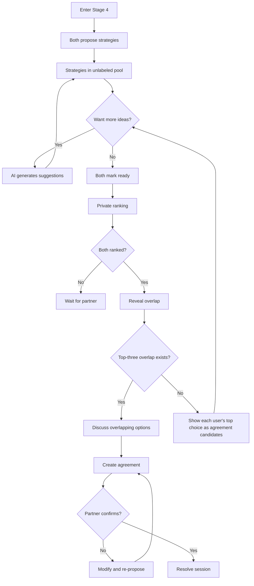

# Stage 4 API: Strategic Repair

Endpoints for collaborative strategy generation, ranking, and agreement documentation.

## Overview

Stage 4 is **sequential** (unlike stages 1-3 which are parallel). Both users must complete Stage 3 before either can enter Stage 4.

Key design:
- Both users propose strategies independently
- Strategies are presented as an **unlabeled pool**
- Users **privately rank** their preferences
- Overlap is revealed together

### Data persistence
- Strategies → `StrategyProposal` (source tracked for audit; not exposed to partner). Strategy pool is shuffled server-side before returning to avoid revealing order-of-proposal.
- Rankings → `StrategyRanking` (ordered array of proposal ids)
- Winning micro-experiment → `Agreement` with `type = MICRO_EXPERIMENT` and `proposalId` reference. `duration` and `measureOfSuccess` are returned for shape compatibility but are currently `null` — fields not yet added to the Prisma model.
- `ConsentRecord` rows are **not** created for Stage 4 proposals today — the feature is designed but not wired in the controllers yet.

---

## Get Strategy Pool

Get all proposed strategies (unlabeled).

```
GET /api/v1/sessions/:id/strategies
```

### Response

```typescript
interface GetStrategiesResponse {
  strategies: StrategyDTO[];
  aiSuggestionsAvailable: boolean;
  phase: StrategyPhase;
  myReadyToRank?: boolean;
  partnerReadyToRank?: boolean;
}

interface StrategyDTO {
  id: string;
  description: string;
  needsAddressed: string[];      // Which confirmed Stage 3 needs
  duration: string | null;       // e.g., "1 week"
  measureOfSuccess: string | null;
  // Note: NO source attribution
}

enum StrategyPhase {
  COLLECTING = 'COLLECTING',     // Users still adding strategies
  RANKING    = 'RANKING',        // Both have marked ready; ranking in progress
  REVEALING  = 'REVEALING',      // Both rankings submitted; overlap revealed
}
// There is no NEGOTIATING or AGREED phase — the code uses only the three above.
// Overlap with no shared items just returns an empty `overlap` array while staying in REVEALING.
```

### Example Response

```json
{
  "success": true,
  "data": {
    "strategies": [
      {
        "id": "strat_001",
        "description": "Have a 10-minute phone-free conversation at dinner for 5 days",
        "needsAddressed": ["Connection"],
        "duration": "5 days",
        "measureOfSuccess": "Did we do it? How did it feel?"
      },
      {
        "id": "strat_002",
        "description": "Say one specific thing I appreciate each morning for a week",
        "needsAddressed": ["Recognition"],
        "duration": "1 week",
        "measureOfSuccess": "Did we remember? Did it feel genuine?"
      },
      {
        "id": "strat_003",
        "description": "Use a pause signal when conversations get heated",
        "needsAddressed": ["Safety"],
        "duration": "Ongoing",
        "measureOfSuccess": "Did we use it? Did it help?"
      }
    ],
    "aiSuggestionsAvailable": false,
    "phase": "COLLECTING",
    "myReadyToRank": false,
    "partnerReadyToRank": false
  }
}
```

**Privacy note**: Strategies are never attributed to their source. Both parties see the same unlabeled list.

Validation: description required (1-800 chars), needsAddressed max 3 entries, duration/measureOfSuccess optional. Allow duplicates; UI may dedupe.

---

## Propose Strategy

Add a new strategy to the pool.

```
POST /api/v1/sessions/:id/strategies
```

### Request Body

```typescript
interface ProposeStrategyRequest {
  description: string;
  needsAddressed?: string[];
  duration?: string;
  measureOfSuccess?: string;
}
```

### Response

```typescript
interface ProposeStrategyResponse {
  strategy: {
    id: string;
    description: string;
    duration: string | null;
    measureOfSuccess: string | null;
  };
  createdAt: string;
}
```

### AI Refinement

After submission, AI may suggest refinements:

```typescript
interface StrategyRefinementSuggestion {
  original: string;
  refined: string;
  reason: string;  // e.g., "Made more specific and time-bounded"
}
```

---

## Request AI Suggestions

Request AI-generated strategy suggestions.

```
POST /api/v1/sessions/:id/strategies/suggest
```

### Request Body

```typescript
interface RequestSuggestionsRequest {
  count?: number;  // Default: 3
  focusNeeds?: string[];  // Which needs to focus on
}
```

### Response

```typescript
interface RequestSuggestionsResponse {
  suggestions: StrategyDTO[];
  source: 'AI_GENERATED';
}
```

### Source Constraints

AI suggestions are designed to be generated from:
- Confirmed Stage 3 needs (Shared Vessel)
- Global Micro-Experiments Library (anonymized)

**Never** from user memory (Retrieval Contract enforced).

> **Current state**: this endpoint is a placeholder. The controller returns `{ suggestions: [] }` and does not persist any `StrategyProposal` rows. The route path is `/strategies/suggest`; the JSDoc in the controller still says `/strategies/suggestions` (stale comment, route is correct).

Validation: count 1-5; focusNeeds max 3 entries.

---

## Mark Ready to Rank

Indicate readiness to move to ranking phase.

```
POST /api/v1/sessions/:id/strategies/ready
```

### Response

```typescript
interface MarkReadyResponse {
  ready: boolean;
  partnerReady: boolean;
  canStartRanking: boolean;
}
```

### Side Effects

When both ready:
- Phase changes to `RANKING`
- Strategy pool is locked (no new additions)
- Partner notified

Gate link: sets `readyToRank` on the caller's `StageProgress.gatesSatisfied`.

---

## Submit Ranking

Submit private ranking of strategies.

```
POST /api/v1/sessions/:id/strategies/rank
```

### Request Body

```typescript
interface SubmitRankingRequest {
  rankedIds: string[]; // Ordered strategy IDs (unique, length >= 1)
}
```

### Response

```typescript
interface SubmitRankingResponse {
  submitted: boolean;
  submittedAt: string;
  partnerSubmitted: boolean;
  awaitingReveal: boolean;
}
```

### Privacy

Rankings are **completely private** until both submit. Neither party can see the other's choices during ranking.

Validation: IDs must exist in session, no duplicates, overwrite allowed (last write wins). Gate link: sets `rankingSubmitted` on the caller's `StageProgress.gatesSatisfied`.

---

## Reveal Overlap

Reveal overlapping rankings once both users have submitted.

```
GET /api/v1/sessions/:id/strategies/overlap
```

### Response

```typescript
interface RevealOverlapResponse {
  overlap: Array<Pick<StrategyDTO, 'id' | 'description' | 'needsAddressed' | 'duration'>> | null;
  waitingForPartner: boolean;
  agreementCandidates: Array<Pick<StrategyDTO, 'id' | 'description' | 'duration'>> | null;
}
```

### Behavior

- Until both users have ranked, the response is `{ overlap: null, waitingForPartner: true, agreementCandidates: null }`.
- Once both users have ranked, `overlap` contains strategies that appear in both users' top three.
- If no top-three overlap exists, `overlap` is `[]` and `agreementCandidates` falls back to each user's top-ranked strategy so the UI can keep the conversation moving.
- Non-active sessions return empty data with `waitingForPartner: false`.

---

## Create Agreement

Formalize agreement on a micro-experiment.

```
POST /api/v1/sessions/:id/agreements
```

### Request Body

```typescript
interface CreateAgreementRequest {
  strategyId?: string;            // From existing strategy
  description: string;            // Final agreed description (can refine strategy text)
  type: 'MICRO_EXPERIMENT' | 'COMMITMENT' | 'CHECK_IN';
  duration?: string;
  measureOfSuccess?: string;
  followUpDate?: string;          // ISO 8601
}
```

### Response

```typescript
interface CreateAgreementResponse {
  agreement: AgreementDTO;
  awaitingPartnerConfirmation: boolean;
}

interface AgreementDTO {
  id: string;
  description: string;
  duration: string | null;
  measureOfSuccess: string | null;
  status: AgreementStatus;
  agreedByMe: boolean;
  agreedByPartner: boolean;
  agreedAt: string | null;
  followUpDate: string | null;
}

enum AgreementStatus {
  PROPOSED = 'PROPOSED',
  AGREED = 'AGREED',
  IN_PROGRESS = 'IN_PROGRESS',
  COMPLETED = 'COMPLETED',
  ABANDONED = 'ABANDONED',
}
```

---

## Confirm Agreement

Confirm proposed agreement (partner response).

```
POST /api/v1/sessions/:id/agreements/:agreementId/confirm
```

### Request Body

```typescript
interface ConfirmAgreementRequest {
  confirmed: boolean;
  modification?: string;  // If suggesting change
}
```

### Response

```typescript
interface ConfirmAgreementResponse {
  agreement: AgreementDTO;
  sessionCanResolve: boolean;  // True if at least one agreement confirmed
}
```

---

## Resolve Session

Session resolution is a **side effect of confirming an agreement**, not a standalone endpoint.

When `POST /sessions/:id/agreements/:agreementId/confirm` flips the last outstanding agreement to `AGREED` and both parties have signed off, the `confirmAgreement` controller updates the session in the same transaction:

```ts
if (sessionCanResolve) {
  await prisma.session.update({ where: { id: sessionId }, data: { status: 'RESOLVED' } });
}
```

The confirm response's `sessionCanResolve` boolean tells the client whether this happened. There is no dedicated `POST /sessions/:id/resolve` for Stage 4.

---

## Agreement count cap

Each session is capped at **two `Agreement` rows**. `createAgreement` returns `VALIDATION_ERROR` (400) with "Maximum of 2 agreements per session" once the cap is reached.

---

## Stage 4 Gate Requirements

Stage 4 uses these caller-side gate markers on `StageProgress.gatesSatisfied`:

| Gate | Requirement |
|------|-------------|
| `readyToRank` | Caller posted `/strategies/ready` |
| `rankingSubmitted` | Caller posted `/strategies/rank` |
| `agreementCreated` | Required by the generic `/stages/advance` gate table, but Stage 4 normally resolves through agreement confirmation rather than manual advancement |

`readyToRank` and `rankingSubmitted` are actively set by the Stage 4 controller. Agreement confirmation updates `Agreement` rows and may resolve the session directly; it does not currently set a StageProgress `agreementConfirmed` gate.

Session resolves when every `Agreement` row in the session is fully signed by both partners. If two agreements exist and only one is agreed, the session remains active until the other is also agreed.

---

## Stage 4 Flow



---

## Retrieval Contract

In Stage 4, the API enforces these retrieval rules:

| Allowed | Forbidden |
|---------|-----------|
| All Shared Vessel content | User Vessel raw content |
| Confirmed Stage 3 needs | Vector search on user memory |
| Past agreements | Any retrieval for decision-making |
| Global Library (vector) | - |

See [Retrieval Contracts: Stage 4](../state-machine/retrieval-contracts.md#stage-4-strategic-repair).

---

## Related Documentation

- [Stage 4: Strategic Repair](../../stages/stage-4-strategic-repair.md)
- [Stage 4 Prompt](../prompts/stage-4-repair.md)
- [Global Library](../data-model/prisma-schema.md#global-library-stage-4-suggestions)

---

[Back to API Index](./index.md) | [Back to Backend](../index.md)
