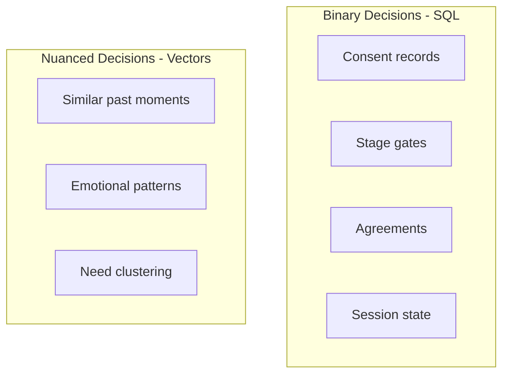

# Data Model

Database design implementing the [Vessel Architecture](../../privacy/vessel-model.md) with PostgreSQL and pgvector.

## Documents

### [Prisma Schema](./prisma-schema.md)
Complete database schema: stage/session tables, consent semantics, Inner Work subsystem, Fact-Ledger memory architecture, Reconciler models, and Needs / People catalogs.

## Quick Reference: Vessel tables

The Vessel Architecture is realized in two Prisma tables plus a synthesis-state concept:

| Concept | Table(s) | Storage Strategy | Access Pattern |
|---------|----------|-----------------|----------------|
| User Vessel | `UserVessel` (+ `notableFacts`, message/session embeddings) | SQL + pgvector | User + AI only |
| Shared Vessel | `SharedVessel` (linked 1:1 to `Session`) | SQL | Both users + AI |
| AI Synthesis | `StageProgress.isSynthesisDirty` / `synthesisLastUpdated` + regenerated on demand | Ephemeral (no dedicated table) | AI only |

`Session.topicFrame` stores the AI-generated Stage 0 invite topic anchor, and `Session.topicFrameConfirmedAt` marks when the inviter finalized that anchor before sharing the invite.

## Related subsystems

The full Prisma schema also covers subsystems that aren't strictly part of the vessel model but share the same database:

- **Inner Work**: `InnerWorkSession`, `InnerWorkMessage`, `MeditationSession`, `MeditationStats`, `MeditationFavorite`, `GratitudeEntry`.
- **Fact-Ledger / memory**: `User.globalFacts`, `UserVessel.notableFacts`, session-level embeddings, `UserMemory` for cross-session AI context.
- **Reconciler + Stage 2 feedback**: `ReconcilerResult`, `ReconcilerShareOffer` (alignment scores, gap summaries, share-suggestion state), plus `ValidationFeedbackDraft` for Feedback Coach drafts before validation feedback is sent.
- **Needs + people catalogs**: `Need` (19 core human needs), `NeedScore`, `Person`, `PersonMention`.

## Dual-Layer Data Strategy

[Back to Backend](../index.md)
