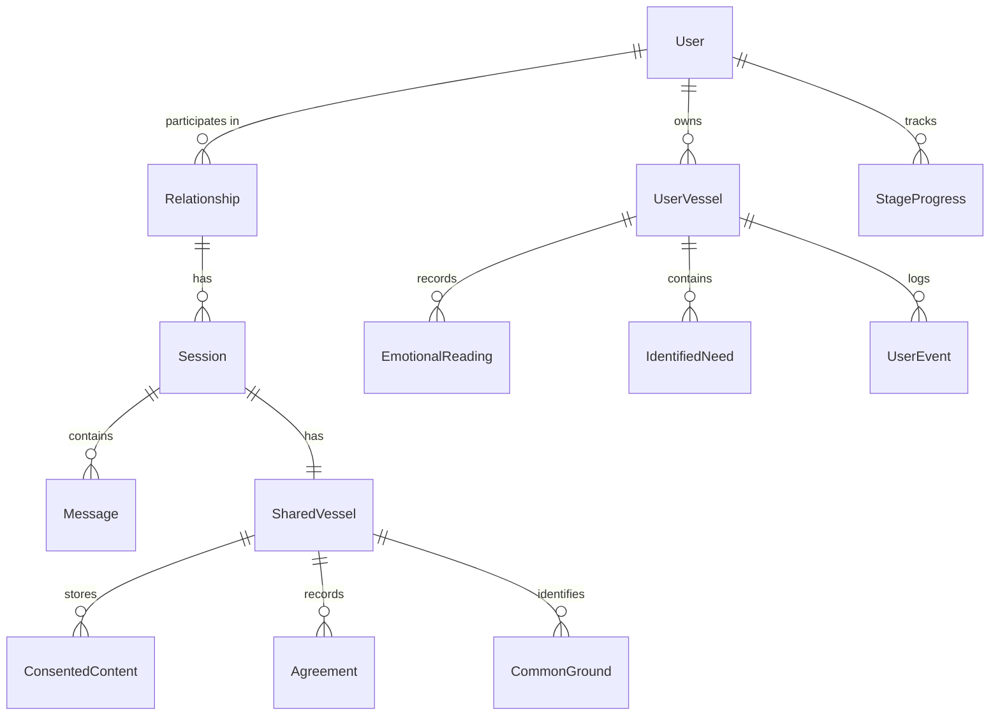

# Prisma Schema

This page documents the **core Vessel Architecture tables** (Users, Relationships, Sessions, UserVessel, SharedVessel, and their direct children) plus notable cross-cutting conventions. For subsystems that live alongside the core — Inner Work, memory, reconciler, needs/people catalogs, telemetry, and pre-session messages — the authoritative source is `backend/prisma/schema.prisma`. Key subsystems summarized near the bottom of this page.

## Schema Overview



## Core Models

### User

```prisma
model User {
  id                      String    @id @default(cuid())
  clerkId                 String?   @unique // Clerk authentication user ID
  email                   String    @unique
  name                    String?   // Full name (computed from firstName + lastName)
  firstName               String?
  lastName                String?
  pushToken               String?   // Expo push token for realtime fallbacks
  biometricEnabled        Boolean   @default(false)
  biometricEnrolledAt     DateTime?
  memoryPreferences       Json?     // MemoryPreferencesDTO - AI memory settings
  notificationPreferences Json?     // NotificationPreferencesDTO - notification settings
  privacyPreferences      Json?     // PrivacyPreferencesDTO - visibility and invitation settings
  lastMoodIntensity       Int?      // Last mood intensity (1-10) for session entry default
  globalFacts             Json?     // Fact-Ledger: consolidated cross-session insights
  createdAt               DateTime  @default(now())
  updatedAt               DateTime  @updatedAt

  // Key relations (see schema.prisma for the full set)
  relationships      RelationshipMember[]
  vessels            UserVessel[]
  stageProgress      StageProgress[]
  messages           Message[]
  memories           UserMemory[]        // "Things to Always Remember"
  innerWorkSessions  InnerWorkSession[]
  gratitudeEntries   GratitudeEntry[]
  meditationSessions MeditationSession[]
  needsAssessments   NeedsAssessmentState[]
  people             Person[]
}
```

### Relationship

```prisma
model Relationship {
  id        String   @id @default(cuid())
  createdAt DateTime @default(now())
  updatedAt DateTime @updatedAt

  // Members (exactly 2 for Meet Without Fear)
  members  RelationshipMember[]
  sessions Session[]
}

model RelationshipMember {
  id             String       @id @default(cuid())
  relationship   Relationship @relation(fields: [relationshipId], references: [id])
  relationshipId String
  user           User         @relation(fields: [userId], references: [id])
  userId         String
  joinedAt       DateTime     @default(now())
  role           String       @default("member")

  @@unique([relationshipId, userId])
}
```

### Session

```prisma
model Session {
  id             String        @id @default(cuid())
  relationship   Relationship  @relation(fields: [relationshipId], references: [id])
  relationshipId String
  status         SessionStatus @default(CREATED)
  createdAt      DateTime      @default(now())
  updatedAt      DateTime      @updatedAt
  resolvedAt     DateTime?
  previousSessionId String?   // Links to the prior session when ContinueChoice = NEW_PROCESS
  previousSession   Session?  @relation("SessionLineage", fields: [previousSessionId], references: [id])
  nextSessions      Session[] @relation("SessionLineage")

  // Explicit topic frame (3-5 word neutral description, e.g., "Tuesday pickup disagreement")
  topicFrame            String?
  topicFrameConfirmedAt DateTime?

  // Related entities
  messages      Message[]
  sharedVessel  SharedVessel?
  stageProgress StageProgress[]
  userVessels   UserVessel[]
}

enum SessionStatus {
  CREATED     // Invitation sent
  INVITED     // Partner invited, awaiting join
  ACTIVE      // Both users engaged
  PAUSED      // Cooling period
  WAITING     // One user ahead, waiting for other
  RESOLVED    // Process completed
  ABANDONED   // Timeout or withdrawal
}
```

### Stage Tracking: No Session.currentStage

**Important**: We intentionally do NOT have a `Session.currentStage` field.

Why? During stages 1-3, users progress independently. A single `currentStage` would be ambiguous (whose stage?).

**Rule**: Each user's stage is derived from `StageProgress`:

```typescript
// Get a user's current stage
const userStage = await prisma.stageProgress.findFirst({
  where: { sessionId, userId, status: { in: ['IN_PROGRESS', 'GATE_PENDING'] } },
  orderBy: { stage: 'desc' }
});

// Get the "shared visibility level" (min of both users)
const bothProgress = await prisma.stageProgress.findMany({
  where: { sessionId, status: 'COMPLETED' }
});
const sharedStage = Math.min(
  ...Object.values(groupByUser(bothProgress)).map(p => Math.max(...p.map(s => s.stage)))
);
```

**Authorization Rule**: Always key off `StageProgress`, never a session-level stage field.

## User Vessel (Private Data)

### UserVessel

```prisma
model UserVessel {
  id        String   @id @default(cuid())
  user      User     @relation(fields: [userId], references: [id])
  userId    String
  session   Session  @relation(fields: [sessionId], references: [id])
  sessionId String
  createdAt DateTime @default(now())
  updatedAt DateTime @updatedAt

  // Private content
  events            UserEvent[]
  emotionalReadings EmotionalReading[]
  identifiedNeeds   IdentifiedNeed[]
  boundaries        Boundary[]
  documents         UserDocument[]

  // Rolling conversation summary for long sessions
  // Stores JSON: { text, keyThemes, emotionalJourney, unresolvedTopics }
  conversationSummary String? @db.Text

  // Session-level content embedding (vector(1024)) for semantic search
  // Embeds combined facts + summary; replaces message-level embedding
  contentEmbedding Unsupported("vector(1024)")?

  // === Session Read State ===
  lastViewedAt         DateTime?  // When user last opened this session's chat
  lastSeenChatItemId   String?    // ID of last chat item seen (for "new messages" line)
  lastViewedShareTabAt DateTime?  // When user last viewed the Share/Partner tab
  lastActiveAt         DateTime?  // When user last actively did something (presence indicator)
  archivedAt           DateTime?  // When user removed session from their conversation list

  // AI-extracted structured facts: [{ category: string, fact: string }]
  // Updated by Haiku after each message; reduces chat history in prompts
  notableFacts Json?

  @@unique([userId, sessionId])
}
```

### UserEvent

```prisma
model UserEvent {
  id            String     @id @default(cuid())
  vessel        UserVessel @relation(fields: [vesselId], references: [id])
  vesselId      String
  description   String     @db.Text
  attributedTo  Attribution
  emotions      String[]
  timestamp     DateTime   @default(now())

  // Embedding for semantic search
  embedding     Unsupported("vector(1536)")?

  // Compound index for retrieval pattern (vesselId + timestamp)
  // Critical: retrieval contracts often limit by recency
  @@index([vesselId, timestamp])
}

enum Attribution {
  SELF
  OTHER
  MUTUAL
  EXTERNAL
}
```

### EmotionalReading

```prisma
model EmotionalReading {
  id        String     @id @default(cuid())
  vessel    UserVessel @relation(fields: [vesselId], references: [id])
  vesselId  String
  intensity Int        // 1-10 scale
  context   String?    @db.Text
  stage     Int        // Stage when reading was taken
  timestamp DateTime   @default(now())

  @@index([vesselId, timestamp])
}
```

### IdentifiedNeed

```prisma
model IdentifiedNeed {
  id                 String           @id @default(cuid())
  vessel             UserVessel       @relation(fields: [vesselId], references: [id], onDelete: Cascade)
  vesselId           String
  need               String           // From universal needs taxonomy
  category           NeedCategory
  evidence           String[]         // Quotes/references supporting this need
  confirmed          Boolean          @default(false) // User confirmed this need
  aiConfidence       Float            // AI confidence in identification
  supersededByNeed   IdentifiedNeed?  @relation("NeedSupersession", fields: [supersededByNeedId], references: [id], onDelete: SetNull)
  supersededByNeedId String?          // Set when this need is replaced by a refined version in Stage 3
  supersedes         IdentifiedNeed[] @relation("NeedSupersession")
  lockedAt           DateTime?        // Set when user confirms needs; prevents further AI modifications
  deletedAt          DateTime?        // Soft-delete; excluded from active need lists
  createdAt          DateTime         @default(now())

  // Link to shared version if consented
  consentedContent ConsentedContent?

  proposalLinks    StrategyProposalNeed[]
  refiningMessages Message[]          // Messages associated with refining this need in Stage 3

  @@index([vesselId])
  @@index([supersededByNeedId])
  @@index([lockedAt])
  @@index([deletedAt])
}

enum NeedCategory {
  SAFETY
  CONNECTION
  AUTONOMY
  RECOGNITION
  MEANING
  FAIRNESS
}
```

### Boundary

```prisma
model Boundary {
  id            String     @id @default(cuid())
  vessel        UserVessel @relation(fields: [vesselId], references: [id])
  vesselId      String
  description   String     @db.Text
  nonNegotiable Boolean    @default(false)
  createdAt     DateTime   @default(now())

  @@index([vesselId])
}
```

## Shared Vessel (Consensual Data)

### SharedVessel

```prisma
model SharedVessel {
  id        String   @id @default(cuid())
  session   Session  @relation(fields: [sessionId], references: [id])
  sessionId String   @unique
  createdAt DateTime @default(now())
  updatedAt DateTime @updatedAt

  // Shared content
  consentedContent ConsentedContent[]
  commonGround     CommonGround[]
  agreements       Agreement[]
}
```

### ConsentedContent

```prisma
model ConsentedContent {
  id                 String       @id @default(cuid())
  sharedVessel       SharedVessel @relation(fields: [sharedVesselId], references: [id])
  sharedVesselId     String
  sourceUser         User         @relation(fields: [sourceUserId], references: [id])
  sourceUserId       String
  originalNeed       IdentifiedNeed? @relation(fields: [originalNeedId], references: [id])
  originalNeedId     String?      @unique
  transformedContent String       @db.Text // Heat removed, need preserved
  consentedAt        DateTime     @default(now())
  consentActive      Boolean      @default(true)
  revokedAt          DateTime?

  // Link to consent record for audit
  consentRecord      ConsentRecord @relation(fields: [consentRecordId], references: [id])
  consentRecordId    String

  @@index([sharedVesselId])
}
```

### CommonGround

```prisma
model CommonGround {
  id             String       @id @default(cuid())
  sharedVessel   SharedVessel @relation(fields: [sharedVesselId], references: [id])
  sharedVesselId String
  need           String
  category       NeedCategory
  confirmedByA   Boolean      @default(false)
  confirmedByB   Boolean      @default(false)
  confirmedAt    DateTime?

  @@index([sharedVesselId])
}
```

### Agreement

```prisma
model Agreement {
  id             String          @id @default(cuid())
  sharedVessel   SharedVessel    @relation(fields: [sharedVesselId], references: [id])
  sharedVesselId String
  description    String          @db.Text
  type           AgreementType
  status         AgreementStatus @default(PROPOSED)
  agreedByA      Boolean         @default(false)
  agreedByB      Boolean         @default(false)
  agreedAt       DateTime?
  followUpDate   DateTime?
  completedAt    DateTime?
  proposal       StrategyProposal? @relation(fields: [proposalId], references: [id])
  proposalId     String?

  @@index([sharedVesselId])
}

enum AgreementType {
  MICRO_EXPERIMENT  // Small, reversible action
  COMMITMENT        // Longer-term agreement
  CHECK_IN          // Scheduled follow-up
}

enum AgreementStatus {
  PROPOSED
  AGREED
  IN_PROGRESS
  COMPLETED
  ABANDONED
}
```

## Consent Management

### ConsentRecord

```prisma
model ConsentRecord {
  id           String        @id @default(cuid())
  user         User          @relation(fields: [userId], references: [id])
  userId       String
  session      Session?      @relation(fields: [sessionId], references: [id])
  sessionId    String?
  targetType   ConsentContentType
  targetId     String?       // e.g., empathy draft id, need id, boundary id
  requestedBy  User          @relation("ConsentRequestedBy", fields: [requestedByUserId], references: [id])
  requestedByUserId String
  decision     ConsentDecision?
  decidedAt    DateTime?
  revokedAt    DateTime?
  metadata     Json?         // Additional context

  // Link to resulting shared content
  consentedContent ConsentedContent[]

  @@index([userId, sessionId, targetType, decidedAt])
}

enum ConsentContentType {
  IDENTIFIED_NEED
  EVENT_SUMMARY
  EMOTIONAL_PATTERN
  BOUNDARY
  EMPATHY_DRAFT
  EMPATHY_ATTEMPT
  STRATEGY_PROPOSAL
}

enum ConsentDecision {
  GRANTED
  DENIED
  REVOKED
}

// Pending/active consent queue item for GET /consent/pending
// ConsentRecord doubles as the request + decision record; decision is null until acted on.
```

## Stage Progress

### StageProgress

```prisma
model StageProgress {
  id        String   @id @default(cuid())
  session   Session  @relation(fields: [sessionId], references: [id])
  sessionId String
  user      User     @relation(fields: [userId], references: [id])
  userId    String
  stage     Int
  status    StageStatus @default(IN_PROGRESS)
  startedAt DateTime @default(now())
  completedAt DateTime?

  // Gate satisfaction tracking
  gatesSatisfied Json? // Stage-specific gate conditions

  // Synthesis cache invalidation
  // When user edits/deletes content, set to true
  // AI regenerates synthesis on next read if dirty
  isSynthesisDirty Boolean @default(true)
  synthesisLastUpdated DateTime?

  @@unique([sessionId, userId, stage])
  @@index([sessionId])
}

enum StageStatus {
  NOT_STARTED
  IN_PROGRESS
  GATE_PENDING   // Requirements met, awaiting partner
  COMPLETED
}

// Emotional regulation exercises (Emotional Barometer)
model EmotionalExerciseCompletion {
  id        String     @id @default(cuid())
  session   Session    @relation(fields: [sessionId], references: [id])
  sessionId String
  user      User       @relation(fields: [userId], references: [id])
  userId    String
  type      ExerciseType
  completedAt DateTime @default(now())
  intensityBefore Int?
  intensityAfter  Int?

  @@index([sessionId, userId, completedAt])
}

enum ExerciseType {
  BREATHING_EXERCISE
  BODY_SCAN
  GROUNDING
  PAUSE_SESSION
}
```

### Synthesis Invalidation Strategy

The "Dirty Flag" pattern avoids expensive regeneration on every read:

```typescript
// When user modifies content
await prisma.userEvent.update({ ... });
await prisma.stageProgress.update({
  where: { sessionId_userId_stage: { sessionId, userId, stage } },
  data: { isSynthesisDirty: true }
});

// When AI needs synthesis
const progress = await prisma.stageProgress.findUnique({ ... });
if (progress.isSynthesisDirty) {
  const synthesis = await regenerateSynthesis(sessionId, userId, stage);
  await prisma.stageProgress.update({
    where: { id: progress.id },
    data: {
      isSynthesisDirty: false,
      synthesisLastUpdated: new Date()
    }
  });
  return synthesis;
} else {
  return getCachedSynthesis(sessionId, userId, stage);
}
```

## Messages

### Message

```prisma
model Message {
  id             String         @id @default(cuid())
  session        Session        @relation(fields: [sessionId], references: [id])
  sessionId      String
  sender         User?          @relation(fields: [senderId], references: [id])
  senderId       String?        // null for AI messages
  forUserId      String?        // Which user the AI was responding to (data isolation)
  role           MessageRole
  content        String         @db.Text
  stage          Int
  timestamp      DateTime       @default(now())
  refiningNeed   IdentifiedNeed? @relation(fields: [refiningNeedId], references: [id], onDelete: SetNull)
  refiningNeedId String?        // Links message to the need it helps refine in Stage 3

  // NOTE: Message-level embedding removed per fact-ledger architecture.
  // Session-level contentEmbedding on UserVessel is used instead.

  // Extracted memory references
  extractedNeeds    String[]
  extractedEmotions String[]

  @@index([sessionId, timestamp])
  @@index([sessionId, forUserId, role])
  @@index([refiningNeedId])
}

## Stage 2: Empathy Attempts

### EmpathyDraft

```prisma
model EmpathyDraft {
  id        String   @id @default(cuid())
  session   Session  @relation(fields: [sessionId], references: [id])
  sessionId String
  user      User     @relation(fields: [userId], references: [id])
  userId    String
  content   String   @db.Text
  readyToShare Boolean @default(false)
  version   Int      @default(1)
  updatedAt DateTime @updatedAt
  createdAt DateTime @default(now())

  attempts  EmpathyAttempt[]

  @@unique([sessionId, userId])
}
```

### EmpathyAttempt

```prisma
model EmpathyAttempt {
  id          String        @id @default(cuid())
  draft       EmpathyDraft  @relation(fields: [draftId], references: [id])
  draftId     String
  session     Session       @relation(fields: [sessionId], references: [id])
  sessionId   String
  sourceUser  User          @relation(fields: [sourceUserId], references: [id])
  sourceUserId String
  content     String        @db.Text
  sharedAt    DateTime      @default(now())
  consentRecord ConsentRecord? @relation(fields: [consentRecordId], references: [id])
  consentRecordId String?

  validations EmpathyValidation[]

  @@index([sessionId, sourceUserId])
}
```

### EmpathyValidation

```prisma
model EmpathyValidation {
  id           String         @id @default(cuid())
  attempt      EmpathyAttempt @relation(fields: [attemptId], references: [id])
  attemptId    String
  session      Session        @relation(fields: [sessionId], references: [id])
  sessionId    String
  user         User           @relation(fields: [userId], references: [id])
  userId       String         // Recipient validating partner attempt
  validated    Boolean
  feedback     String?        @db.Text
  feedbackShared Boolean      @default(false)
  validatedAt  DateTime?      @default(now())

  @@unique([attemptId, userId])
}
```

### ValidationFeedbackDraft

Drafts used by the Stage 2 "Not quite yet" Feedback Coach before the final validation feedback is sent to the partner.

```prisma
model ValidationFeedbackDraft {
  id        String   @id @default(cuid())
  session   Session  @relation(fields: [sessionId], references: [id])
  sessionId String
  user      User     @relation(fields: [userId], references: [id])
  userId    String
  attempt   EmpathyAttempt? @relation(fields: [attemptId], references: [id])
  attemptId String?
  content   String   @db.Text
  readyToShare Boolean @default(false)
  version   Int      @default(1)
  updatedAt DateTime @updatedAt
  createdAt DateTime @default(now())

  @@unique([sessionId, userId])
}
```

## Stage 4: Strategies, Willingness Selection, and Closure

### StrategyProposal

```prisma
model StrategyProposal {
  id          String   @id @default(cuid())
  session     Session  @relation(fields: [sessionId], references: [id])
  sessionId   String
  createdBy   User?    @relation(fields: [createdByUserId], references: [id])
  createdByUserId String?
  description String   @db.Text
  needsAddressed String[]
  duration    String?
  measureOfSuccess String?
  source      StrategySource @default(USER_SUBMITTED) // For audit; not exposed to partner
  // Redesign fields:
  kind        Stage4ProposalKind @default(SHARED_PROPOSAL)
  status      Stage4ProposalStatus @default(ACTIVE)
  removedAt   DateTime?
  removedByUserId String?
  removalReason String? @db.Text
  parentProposalId String?
  coverageSummary Json?
  capturedFromMessageId String?
  createdAt   DateTime @default(now())
  updatedAt   DateTime @updatedAt
  consentRecord ConsentRecord? @relation(fields: [consentRecordId], references: [id])
  consentRecordId String?

  rankings    StrategyRanking[]
  selections  Stage4ProposalSelection[]
  revisions   Stage4ProposalRevision[]
  needLinks   StrategyProposalNeed[]
}

enum StrategySource {
  USER_SUBMITTED
  AI_SUGGESTED
  CURATED
}

enum Stage4ProposalKind {
  SHARED_PROPOSAL        // Proposed to both partners
  INDIVIDUAL_COMMITMENT  // One partner's personal commitment
}

enum Stage4ProposalStatus {
  ACTIVE
  REVISED
  REMOVED
  CONVERTED_TO_AGREEMENT
}
```

### Stage4ProposalSelection

Tracks each user's willingness decision on a proposal.

```prisma
model Stage4ProposalSelection {
  id         String   @id @default(cuid())
  proposal   StrategyProposal @relation(fields: [proposalId], references: [id])
  proposalId String
  session    Session  @relation(fields: [sessionId], references: [id])
  sessionId  String
  user       User     @relation(fields: [userId], references: [id])
  userId     String
  decision   Stage4SelectionDecision
  note       String?
  selectedAt DateTime @default(now())
  updatedAt  DateTime @updatedAt
}

enum Stage4SelectionDecision {
  WILLING
  NOT_WILLING
}
```

### Stage4ProposalRevision

Audit trail for all proposal changes.

```prisma
model Stage4ProposalRevision {
  id           String   @id @default(cuid())
  proposal     StrategyProposal @relation(fields: [proposalId], references: [id])
  proposalId   String
  sessionId    String
  actorUserId  String
  action       String
  before       Json?
  after        Json?
  reason       String?
  messageId    String?
  createdAt    DateTime @default(now())
}
```

### Stage4NeedCoverage

Tracks which identified needs are addressed by proposals.

```prisma
model Stage4NeedCoverage {
  id                  String   @id @default(cuid())
  session             Session  @relation(fields: [sessionId], references: [id])
  sessionId           String
  needId              String?
  needLabel           String
  sourceUserId        String?
  coverageStatus      String   // e.g. "COVERED", "PARTIAL", "UNCOVERED"
  coveringProposalIds String[]
  note                String?
  updatedAt           DateTime @updatedAt
  createdAt           DateTime @default(now())
}
```

### Stage4Closure

Records the final outcome of Stage 4.

```prisma
model Stage4Closure {
  id                   String   @id @default(cuid())
  session              Session  @relation(fields: [sessionId], references: [id])
  sessionId            String   @unique
  kind                 Stage4ClosureKind
  reason               Stage4ClosureReason
  summary              String
  sharedAgreementIds   String[]
  individualProposalIds String[]
  openNeedIds          String[]
  closedByUserId       String
  closedAt             DateTime @default(now())
  checkInAt            DateTime?  // Scheduled follow-up date for all tending entries
  createdAt            DateTime @default(now())
}

enum Stage4ClosureKind {
  SHARED_AGREEMENT
  NO_SHARED_AGREEMENT
}

enum Stage4ClosureReason {
  MUTUAL_SELECTION
  NO_OVERLAP
  BOUNDARY_HONORED
  USER_STOPPED
}
```

### StrategyRanking (Legacy)

Used by the legacy ranking flow only. Not consulted by the redesigned willingness-selection flow.

```prisma
model StrategyRanking {
  id          String   @id @default(cuid())
  session     Session  @relation(fields: [sessionId], references: [id])
  sessionId   String
  user        User     @relation(fields: [userId], references: [id])
  userId      String
  rankedIds   String[] // Ordered StrategyProposal ids
  submittedAt DateTime @default(now())

  @@unique([sessionId, userId])
}
```

### Agreement Link (Stage 4 Outcome)

`Agreement.type = MICRO_EXPERIMENT` (or COMMITMENT / CHECK_IN / HYBRID) links to the chosen `StrategyProposal` via a nullable `proposalId` field. `duration` and `measureOfSuccess` are present on the model but currently returned as `null` by the API.

```prisma
  proposal    StrategyProposal? @relation(fields: [proposalId], references: [id])
  proposalId  String?
  duration    String?
  measureOfSuccess String?
```

`AgreementType` enum also includes `HYBRID` (added alongside the redesign).

```prisma
enum MessageRole {
  USER
  AI
  SYSTEM
  EMPATHY_STATEMENT      // User's shared empathy statement (shown in chat history)
  EMPATHY_REVEAL_INTRO   // AI intro message when revealing partner's empathy to user
  SHARED_CONTEXT         // Context shared by subject to help guesser refine empathy
  VALIDATION_FEEDBACK    // Constructive feedback after subject marks empathy as not quite
  SHARE_SUGGESTION       // Suggested content for subject to share (reconciler)
  EMPATHY_VALIDATION_PROMPT // AI prompt asking user to validate partner's understanding
}
```

`VALIDATION_FEEDBACK` is a targeted partner-visible chat message created when a Stage 2 validator sends Feedback Coach-approved feedback with `validated=false`. The other non-`USER`/`AI`/`SYSTEM` roles represent structured AI-generated messages used in specific stage flows (empathy exchange, reconciler suggestions).

## Tending

Post-resolution check-in and re-entry models. Created when Stage 4 closes with agreements that have follow-up dates, and on-demand when a user initiates passive re-entry on a resolved session. See [Tending API](../api/tending.md).

### TendingEntry

```prisma
model TendingEntry {
  id             String             @id @default(cuid())
  session        Session            @relation(fields: [sessionId], references: [id])
  sessionId      String
  agreement      Agreement?         @relation(fields: [agreementId], references: [id])
  agreementId    String?
  type           TendingEntryType
  status         TendingEntryStatus @default(SCHEDULED)
  scope          TendingEntryScope  @default(SHARED)  // SHARED or INDIVIDUAL
  ownerUserId    String?            // Set for INDIVIDUAL entries; null for SHARED
  optedInShared  Boolean            @default(false)   // INDIVIDUAL owner can share with partner
  scheduledFor   DateTime?
  openedAt       DateTime?
  completedAt    DateTime?
  summary        String?            @db.Text   // Context assembled at creation
  createdAt      DateTime           @default(now())
  updatedAt      DateTime           @updatedAt

  responses       TendingResponse[]
  partialClosures TendingResponsePartialClosure[]
  entryOutcomes   TendingEntryOutcome[]
  reminders       TendingReminder[]
  adjustments     TendingAdjustment[]

  @@index([sessionId, scope, ownerUserId])
}

enum TendingEntryScope {
  SHARED
  INDIVIDUAL
}

enum TendingEntryType {
  SCHEDULED_SHARED_AGREEMENT_CHECKIN
  SCHEDULED_INDIVIDUAL_COMMITMENT_CHECKIN
  USER_INITIATED_REENTRY
}

enum TendingEntryStatus {
  SCHEDULED
  OPEN
  PARTIAL      // At least one partner responded
  COMPLETED    // All partners responded
  EXPIRED
  CANCELLED
}
```

### TendingResponse

One response per entry/user (enforced by upsert in the service).

```prisma
model TendingResponse {
  id             String          @id @default(cuid())
  tendingEntry   TendingEntry    @relation(fields: [tendingEntryId], references: [id], onDelete: Cascade)
  tendingEntryId String
  user           User            @relation(fields: [userId], references: [id], onDelete: Cascade)
  userId         String
  checkin        TendingCheckin? @relation(fields: [checkinId], references: [id], onDelete: SetNull)
  checkinId      String?         // Linked when submitted as part of a structured three-orientation check-in
  status         String          // e.g. "WORKED", "PARTLY", "DID_NOT_WORK"
  reflection     String?         @db.Text
  continueChoice ContinueChoice? // Structured forward path enum (see ContinueChoice below)
  submittedAt    DateTime        @default(now())

  partialClosures TendingResponsePartialClosure[]
  entryOutcomes   TendingEntryOutcome[]

  @@unique([tendingEntryId, userId])
  @@index([checkinId])
}

enum ContinueChoice {
  ANOTHER_ROUND    // Reset Stage 4 to inventory building
  EXTEND           // Reschedule entries 28 days out
  NEW_PROCESS      // Create linked Session; both users restart at Stage 0
  PARTIAL_CLOSURE  // Resolve some entries, continue others
  FULL_CLOSURE     // Mark all entries COMPLETED; session → RESOLVED
}
```

### TendingResponsePartialClosure

Tracks per-entry resolution when `ContinueChoice = PARTIAL_CLOSURE`.

```prisma
model TendingResponsePartialClosure {
  id               String          @id @default(cuid())
  tendingResponse  TendingResponse @relation(fields: [tendingResponseId], references: [id])
  tendingResponseId String
  tendingEntry     TendingEntry    @relation(fields: [tendingEntryId], references: [id])
  tendingEntryId   String
  resolution       PartialClosureResolution  // RESOLVED or CONTINUING
  createdAt        DateTime        @default(now())

  @@unique([tendingResponseId, tendingEntryId])
}

enum PartialClosureResolution {
  RESOLVED
  CONTINUING
}
```

### TendingCheckin

Structured three-orientation check-in submitted by a user at the end of a tending period. Captures how things went across all open entries and needs in one transaction. May be linked to a `TendingCoordinationCycle` when partners co-submit.

```prisma
model TendingCheckin {
  id                  String                    @id @default(cuid())
  session             Session                   @relation(fields: [sessionId], references: [id], onDelete: Cascade)
  sessionId           String
  user                User                      @relation(fields: [userId], references: [id], onDelete: Cascade)
  userId              String
  coordinationCycle   TendingCoordinationCycle? @relation(fields: [coordinationCycleId], references: [id], onDelete: SetNull)
  coordinationCycleId String?
  nextAction          TendingNextAction?
  continueChoice      ContinueChoice?
  reflectionSummary   String?                   @db.Text
  submittedAt         DateTime                  @default(now())
  createdAt           DateTime                  @default(now())

  responses          TendingResponse[]
  entryOutcomes      TendingEntryOutcome[]
  needOutcomes       TendingNeedOutcome[]
  reminders          TendingReminder[]
  adjustments        TendingAdjustment[]
  betweenPeriodNotes TendingBetweenPeriodNote[]

  @@index([sessionId, submittedAt])
  @@index([userId, submittedAt])
  @@index([coordinationCycleId])
}
```

### TendingCoordinationCycle

Coordinates a simultaneous check-in across both partners. Created when a user submits a check-in and the partner has not yet submitted. When both submit (or a deadline passes), the cycle resolves and their outcomes are merged.

```prisma
model TendingCoordinationCycle {
  id                 String                    @id @default(cuid())
  session            Session                   @relation(fields: [sessionId], references: [id], onDelete: Cascade)
  sessionId          String
  createdBy          User                      @relation(fields: [createdByUserId], references: [id], onDelete: Cascade)
  createdByUserId    String
  coordinationKey    String?                   // Deduplication key; prevents duplicate cycles for the same set of entries
  status             TendingCoordinationStatus @default(WAITING_FOR_PARTNER)
  entryIds           String[]
  participantUserIds String[]
  submittedUserIds   String[]
  responseDeadlineAt DateTime
  resolvedAt         DateTime?
  resultSummary      String?                   @db.Text
  createdAt          DateTime                  @default(now())
  updatedAt          DateTime                  @updatedAt

  checkins TendingCheckin[]

  @@index([sessionId, status])
  @@index([coordinationKey])
  @@index([responseDeadlineAt])
}

enum TendingCoordinationStatus {
  WAITING_FOR_PARTNER
  READY_TO_RESOLVE
  RESOLVED
  TIMED_OUT
}
```

### TendingEntryOutcome

Per-entry follow-through assessment recorded during a structured check-in. One row per entry per check-in.

```prisma
model TendingEntryOutcome {
  id                  String                     @id @default(cuid())
  checkin             TendingCheckin             @relation(fields: [checkinId], references: [id], onDelete: Cascade)
  checkinId           String
  tendingEntry        TendingEntry               @relation(fields: [tendingEntryId], references: [id], onDelete: Cascade)
  tendingEntryId      String
  response            TendingResponse?           @relation(fields: [responseId], references: [id], onDelete: SetNull)
  responseId          String?
  user                User                       @relation(fields: [userId], references: [id], onDelete: Cascade)
  userId              String
  followThroughStatus TendingFollowThroughStatus
  helpfulnessStatus   TendingHelpfulnessStatus?
  blockerCategories   TendingBlockerCategory[]
  whatHappened        String?                    @db.Text
  helpedNeed          String?                    @db.Text
  blockerNote         String?                    @db.Text
  stillWorthTrying    Boolean?
  createdAt           DateTime                   @default(now())

  @@unique([checkinId, tendingEntryId])
  @@index([tendingEntryId])
  @@index([userId, createdAt])
}

enum TendingFollowThroughStatus {
  HAPPENED
  PARTLY_HAPPENED
  DID_NOT_HAPPEN
  NOT_SURE
}

enum TendingHelpfulnessStatus {
  HELPED
  PARTLY_HELPED
  DID_NOT_HELP
  NOT_SURE
}

enum TendingBlockerCategory {
  FORGOT
  TOO_HARD
  TOO_FREQUENT
  UNCLEAR
  PARTNER_DID_NOT_DO_PART
  I_DID_NOT_DO_PART
  CIRCUMSTANCES_CHANGED
  NO_LONGER_WANTED
  OTHER
}
```

### TendingNeedOutcome

Per-need resolution assessment recorded during a structured check-in.

```prisma
model TendingNeedOutcome {
  id               String                      @id @default(cuid())
  checkin          TendingCheckin              @relation(fields: [checkinId], references: [id], onDelete: Cascade)
  checkinId        String
  session          Session                     @relation(fields: [sessionId], references: [id], onDelete: Cascade)
  sessionId        String
  needId           String?
  needLabel        String
  sourceUserId     String?
  resolutionStatus TendingNeedResolutionStatus
  note             String?                     @db.Text
  changedNeedLabel String?
  nextAction       TendingNextAction?
  createdAt        DateTime                    @default(now())

  @@index([sessionId, createdAt])
  @@index([checkinId])
  @@index([needId])
}

enum TendingNeedResolutionStatus {
  RESOLVED
  IMPROVING
  STILL_OPEN
  CHANGED
  NOT_SURE
}
```

### TendingReminder

A reminder scheduled for a user about a tending entry. Created during a check-in to follow up on open commitments.

```prisma
model TendingReminder {
  id             String               @id @default(cuid())
  session        Session              @relation(fields: [sessionId], references: [id], onDelete: Cascade)
  sessionId      String
  checkin        TendingCheckin?      @relation(fields: [checkinId], references: [id], onDelete: SetNull)
  checkinId      String?
  tendingEntry   TendingEntry?        @relation(fields: [tendingEntryId], references: [id], onDelete: Cascade)
  tendingEntryId String?
  user           User                 @relation(fields: [userId], references: [id], onDelete: Cascade)
  userId         String
  scope          TendingReminderScope
  remindAt       DateTime
  cadence        String?              // e.g. "WEEKLY", "MONTHLY", "BIMONTHLY", "ONCE"
  note           String?              @db.Text
  status         String               @default("SCHEDULED")
  createdAt      DateTime             @default(now())
  updatedAt      DateTime             @updatedAt

  @@index([sessionId, remindAt])
  @@index([userId, remindAt])
  @@index([checkinId])
  @@index([tendingEntryId])
}

enum TendingReminderScope {
  PRIVATE  // Visible only to the user who created it
  SHARED   // Visible to both partners
}
```

### TendingAdjustment

Records a modification to a commitment (text, cadence, scope, or success criteria) made during a check-in.

```prisma
model TendingAdjustment {
  id                     String               @id @default(cuid())
  session                Session              @relation(fields: [sessionId], references: [id], onDelete: Cascade)
  sessionId              String
  checkin                TendingCheckin       @relation(fields: [checkinId], references: [id], onDelete: Cascade)
  checkinId              String
  tendingEntry           TendingEntry         @relation(fields: [tendingEntryId], references: [id], onDelete: Cascade)
  tendingEntryId         String
  user                   User                 @relation(fields: [userId], references: [id], onDelete: Cascade)
  userId                 String
  privacyScope           TendingReminderScope @default(PRIVATE)
  revisedCommitmentText  String?              @db.Text
  revisedCadence         String?
  revisedScope           String?              @db.Text
  revisedSuccessCriteria String?              @db.Text
  reason                 String?              @db.Text
  blockerAddressed       TendingBlockerCategory[]
  createdAt              DateTime             @default(now())

  @@index([sessionId, createdAt])
  @@index([checkinId])
  @@index([tendingEntryId])
  @@index([userId, createdAt])
}
```

### TendingBetweenPeriodNote

A reflection note written between tending check-ins. Can optionally be carried forward and shared with the partner during the next check-in.

```prisma
model TendingBetweenPeriodNote {
  id                        String          @id @default(cuid())
  session                   Session         @relation(fields: [sessionId], references: [id], onDelete: Cascade)
  sessionId                 String
  user                      User            @relation(fields: [userId], references: [id], onDelete: Cascade)
  userId                    String
  content                   String          @db.Text   // max 4000 chars
  carryForwardSelected      Boolean         @default(false)
  consentToShareWithPartner Boolean         @default(false)
  shareConsentAt            DateTime?
  selectedForCheckin        TendingCheckin? @relation(fields: [selectedForCheckinId], references: [id], onDelete: SetNull)
  selectedForCheckinId      String?
  createdAt                 DateTime        @default(now())
  updatedAt                 DateTime        @updatedAt

  @@index([sessionId, userId, createdAt])
  @@index([selectedForCheckinId])
}
```

### Tending Enums (new in Phase 5)

```prisma
enum TendingNextAction {
  FULL_CLOSURE        // Mark all entries COMPLETED; session → RESOLVED
  EXTEND              // Reschedule open entries with a new date
  ADJUST_COMMITMENT   // Modify commitment text/cadence/scope
  REOPEN_STRATEGY_WORK // Return to Stage 4 inventory building
  NEW_PROCESS         // Create a fresh linked session
  PARTIAL_CLOSURE     // Close some entries, continue others
}
```

---

## Stage 4 Sub-Chat

Guided AI sub-conversations anchored to proposal refinement, needs brainstorming, or no-overlap recovery.

### Stage4SubChat

```prisma
model Stage4SubChat {
  id         String             @id @default(cuid())
  session    Session            @relation(fields: [sessionId], references: [id])
  sessionId  String
  user       User               @relation(fields: [userId], references: [id])
  userId     String
  anchorKind Stage4SubChatAnchor
  anchorId   String?            // proposalId for PROPOSAL_REFINEMENT; needId for NEEDS_BRAINSTORM
  status     Stage4SubChatStatus @default(ACTIVE)
  createdAt  DateTime           @default(now())
  resolvedAt DateTime?

  messages   Stage4SubChatMessage[]
}

model Stage4SubChatMessage {
  id         String      @id @default(cuid())
  subChat    Stage4SubChat @relation(fields: [subChatId], references: [id])
  subChatId  String
  role       MessageRole
  content    String      @db.Text
  createdAt  DateTime    @default(now())
}

enum Stage4SubChatAnchor {
  NEEDS_BRAINSTORM     // Brainstorm proposals for an unaddressed need
  PROPOSAL_REFINEMENT  // Refine an existing proposal
  NO_OVERLAP           // Guided recovery when no mutual willing proposals
}

enum Stage4SubChatStatus {
  ACTIVE
  RESOLVED
}
```

---

## Need–Proposal Linkage

### StrategyProposalNeed

Junction table linking proposals to identified needs. Created when `stage4-prompts.ts` populates the `needLinks` relation.

```prisma
model StrategyProposalNeed {
  proposal   StrategyProposal @relation(fields: [proposalId], references: [id])
  proposalId String
  needId     String
  createdAt  DateTime         @default(now())

  @@id([proposalId, needId])
}
```

---

## Global Library (Stage 4 Suggestions)

### GlobalLibraryItem

Anonymized micro-experiment suggestions for Stage 4. See [Stage 4 Global Library Invariants](../state-machine/retrieval-contracts.md#global-library-invariants).

```prisma
model GlobalLibraryItem {
  id          String   @id @default(cuid())
  title       String
  description String   @db.Text
  category    String   // e.g., "communication", "quality-time", "conflict-resolution"
  source      GlobalLibrarySource
  createdAt   DateTime @default(now())
  updatedAt   DateTime @updatedAt

  // Embedding for semantic search
  embedding   Unsupported("vector(1536)")?

  // For user-contributed items only
  contributedBy    String?  // User ID if contributed (anonymized in results)
  contributionConsent DateTime? // When user consented to anonymized contribution

  @@index([category])
}

enum GlobalLibrarySource {
  CURATED       // Admin/expert authored
  CONTRIBUTED   // User-contributed with explicit consent
}
```

**Invariants enforced by this model:**
- `CURATED` items have no `contributedBy` - they are admin-authored
- `CONTRIBUTED` items require both `contributedBy` AND `contributionConsent`
- Embeddings for `CONTRIBUTED` items are generated from the anonymized description only, never from the original user content

## System Actors

### AI System Access

The AI does NOT have a special user ID with blanket access. Context assembly
uses the user and session being served to apply explicit Prisma filters before
data is included in prompts.

This means:
- AI can only receive the specific user's data it is currently serving
- AI can only receive data within the specific session context
- Application-layer filters and retrieval contracts are the active enforcement boundary

See [Architecture: Access Control Boundary](../overview/architecture.md#access-control-boundary) for the current implementation model.

## pgvector Configuration

### Current state (embeddings disabled)

The `pgvector` extension is **not currently enabled** on the live database. In the schema:

- `datasource db` keeps `extensions = [vector]` commented out.
- All `embedding` / `contentEmbedding` fields on `UserEvent`, `PreSessionMessage`, `GlobalLibraryItem`, `GratitudeEntry`, etc. are either commented out or typed with `Unsupported("vector(1024)")?` — placeholders for the day pgvector is turned on.
- Retrieval today is SQL-only (keyword/category filters, JOINs on consent). See [Prompting architecture](../prompting-architecture.md) and [Retrieval contracts](../state-machine/retrieval-contracts.md) for how context is assembled without vector search.

### Enabling Vector Search (future)

When pgvector is re-enabled:

```sql
-- Enable the pgvector extension
CREATE EXTENSION IF NOT EXISTS vector;

-- Create index for similarity search on user events
CREATE INDEX user_event_embedding_idx ON "UserEvent"
USING ivfflat (embedding vector_cosine_ops)
WITH (lists = 100);

-- Create index for message embeddings
CREATE INDEX message_embedding_idx ON "Message"
USING ivfflat (embedding vector_cosine_ops)
WITH (lists = 100);
```

### Similarity Search Example (future)

```sql
-- Find similar past events for a user (Stage 1 context)
SELECT id, description, 1 - (embedding <=> $1) as similarity
FROM "UserEvent"
WHERE "vesselId" = $2
ORDER BY embedding <=> $1
LIMIT 5;
```

## Data Access Patterns

### Binary Decisions (SQL)

```typescript
// Check if user can advance to next stage
const canAdvance = await prisma.stageProgress.findFirst({
  where: {
    sessionId,
    userId,
    stage: currentStage,
    status: 'COMPLETED'
  }
});

// Check consent status
const hasConsent = await prisma.consentRecord.findFirst({
  where: {
    userId,
    contentType: 'IDENTIFIED_NEED',
    decision: 'GRANTED',
    revokedAt: null
  }
});
```

### Nuanced Decisions (Vectors)

```typescript
// Find similar emotional moments (internal grounding)
const similarMoments = await prisma.$queryRaw`
  SELECT id, description, intensity
  FROM "EmotionalReading" er
  JOIN "UserVessel" uv ON er."vesselId" = uv.id
  WHERE uv."userId" = ${userId}
    AND 1 - (er.embedding <=> ${currentEmbedding}) > 0.8
  ORDER BY er.timestamp DESC
  LIMIT 3
`;
```

## Other subsystems (pointers into schema.prisma)

These subsystems share the same database but aren't documented in full here. Consult `backend/prisma/schema.prisma` for field-level detail.

### Inner Work (solo reflection + practices)
- `InnerWorkSession` / `InnerWorkMessage` — solo reflection sessions that can be linked to a partner session via `linkedPartnerSessionId`. Branch-point metadata added in the partner-branch flow: `linkedAtMessageId` (which Inner Thoughts message triggered the link), `linkedAtStage` (partner session stage at link time), and `contextSummarySnapshot` (point-in-time context snapshot passed when the new partner session was started).
- `SessionTakeaway` + `TakeawayLink` — distilled takeaways that can be attached to partner sessions.
- `GratitudeEntry` — gratitude practice logs.
- `MeditationSession`, `MeditationStats`, `MeditationFavorite`, `SavedMeditation` — meditation tracking + generated scripts.
- `Need`, `NeedScore`, `NeedsAssessmentState` — needs catalog (19 core human needs) and the user's scored assessment state.

### People graph
- `Person` — people the user talks about in-session.
- `PersonMention` — links from messages to people mentioned (used to build relational context).

### Memory & Fact-Ledger
- `UserMemory` (+ `MemoryCategory` enum) — persisted AI instructions and remembered preferences ("Things to Always Remember").
- `UserVessel.notableFacts` (JSON) — session-level extracted facts.
- `User.globalFacts` (JSON) — consolidated cross-session insights generated at Stage 1 completion.
- `Insight`, `RecurringTheme` — derived patterns surfaced across sessions.

### Reconciler
- `ReconcilerResult` — alignment score, gap summary, and decision (PROCEED / OFFER_OPTIONAL / OFFER_SHARING) per Stage-2 attempt pair.
- `ReconcilerShareOffer` — share-suggestion flow state (`NOT_OFFERED` / `ACCEPTED` / `DECLINED` / `EXPIRED` / `SKIPPED`).
- `RefinementAttemptCounter` — bounded refinement-loop counter, used by the asymmetric reconciler circuit breaker.
- `ValidationFeedbackDraft` — transient Feedback Coach draft text for the Stage 2 "Not quite yet" validation path.

### Empathy state machine
`EmpathyStatus` enum: `HELD`, `ANALYZING`, `AWAITING_SHARING`, `REFINING`, `VALIDATED`, etc. — state transitions drive `/empathy/status` and the reconciler flow.

### Agreements
`AgreementType` = `MICRO_EXPERIMENT` | `COMMITMENT` | `CHECK_IN` | `HYBRID`. Sessions are capped at **2** agreements (enforced in `createAgreement`).

### Telemetry + pre-session
- `BrainActivity` — per-LLM-call telemetry (tokens, cost, duration, operation), keyed by `sessionId` / `turnId`.
- `PreSessionMessage` — messages authored before a session has been created (landing-page / invitation warm-up flow).

---

## Related Documentation

- [Vessel Model](../../privacy/vessel-model.md) - Conceptual privacy architecture
- [Retrieval Contracts](../state-machine/retrieval-contracts.md) - Stage-scoped access rules
- [Architecture](../overview/architecture.md) - System architecture

[Back to Data Model](./index.md) | [Back to Backend](../index.md)
