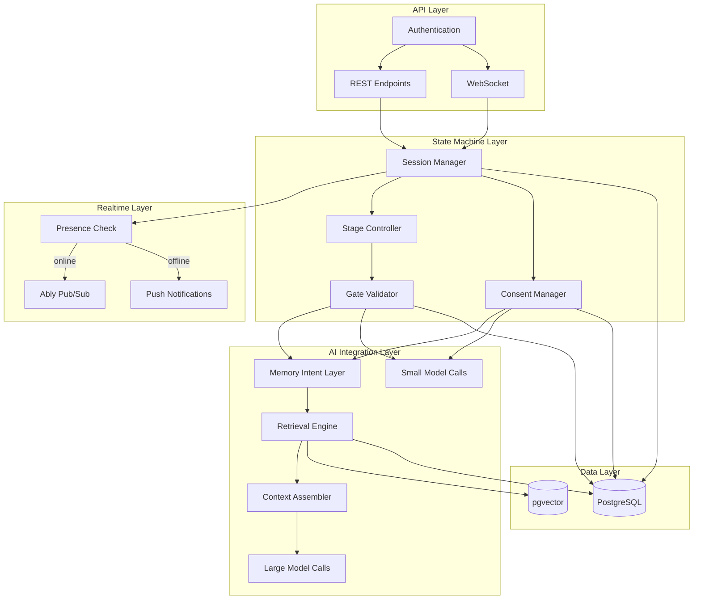
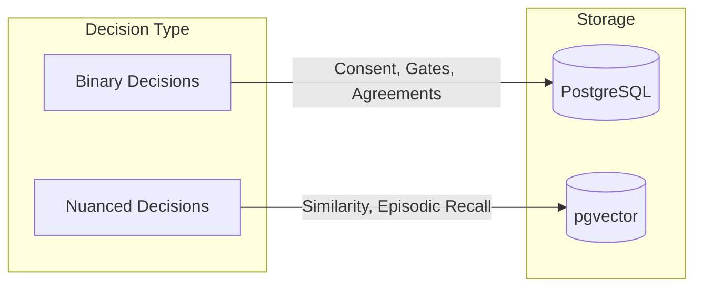
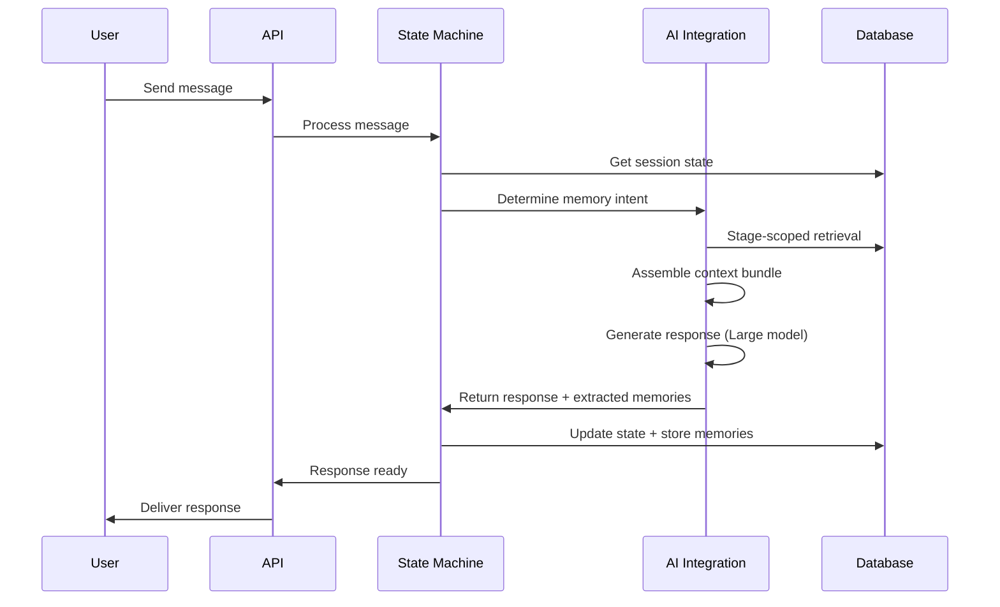

# System Architecture

Meet Without Fear is built as a **Finite State Machine with Typed Memory Objects and Role-segmented Models**.

## Core Mental Model

```
FSM (Session States) + Typed Memory (Vessels) + Model Stratification (Small/Large)
```

This is fundamentally different from a chatbot architecture. The system enforces process, not conversation.

## Three-Layer Architecture



## Layer Responsibilities

### API Layer

| Component | Responsibility |
|-----------|----------------|
| REST Endpoints | CRUD operations, session management, user actions |
| WebSocket | Real-time updates for Stage 0 and Stage 4 coordination |
| Authentication | JWT tokens, user identity, relationship membership |

### State Machine Layer

| Component | Responsibility |
|-----------|----------------|
| Session Manager | Lifecycle states (Created, Active, Paused, Resolved) |
| Stage Controller | Stage transitions, parallel vs sequential handling |
| Gate Validator | Advancement condition checking per stage |
| Consent Manager | Request, approve, deny, revoke consent flows |

### AI Integration Layer

| Component | Responsibility |
|-----------|----------------|
| Memory Intent Layer | Determines what kind of remembering is appropriate |
| Retrieval Engine | Stage-scoped data access following contracts |
| Context Assembler | Builds pre-assembled bundles for Large model |
| Small Model | Mechanics (classification, detection, planning) |
| Large Model | Empathetic response generation |

### Realtime Layer (Presence-Based Notifications)

| Component | Responsibility |
|-----------|----------------|
| Ably Pub/Sub | Real-time updates for online users |
| Presence Check | Determine if partner is currently in-app |
| Push Notifications | Immediate notification for offline users |

**Why Presence-Based Routing:**

When User A completes Stage 1, User B needs to know immediately. Instead of a job queue, we check if User B is online and route accordingly:

- **Online**: Ably delivers instantly (sub-second)
- **Offline**: Push notification fires immediately

```typescript
async function notifyPartner(sessionId: string, partnerId: string, event: StageEvent) {
  const channel = ably.channels.get(`user:${partnerId}`);

  // Check if partner is subscribed (online in app)
  const presence = await channel.presence.get();
  const isOnline = presence.some(member => member.clientId === partnerId);

  if (isOnline) {
    // They're watching - Ably delivers instantly
    await channel.publish('stage_update', event);
  } else {
    // They're offline - send push notification immediately
    await sendPushNotification(partnerId, {
      title: 'Partner update',
      body: 'Your partner completed their reflection',
      data: { sessionId, type: event.type }
    });
  }

  // Log for audit
  await prisma.notification.create({
    data: { userId: partnerId, sessionId, type: event.type, deliveredVia: isOnline ? 'ably' : 'push' }
  });
}
```

**Edge Case Handling:**

If User B disconnects between presence check and Ably publish (rare race condition), the client fetches missed notifications on app open:

```typescript
// Client: on app foreground
const missed = await api.get('/notifications/unread');
```

## Access Control Boundary

Meet Without Fear currently enforces data isolation in the application layer.
PostgreSQL RLS is not active runtime protection; see
[Database Row-Level Security](../security/rls-policies.md) for the current
status and future requirements.

Controllers and services must scope Prisma queries with authenticated user
context and session membership checks:

```typescript
const userEvents = await prisma.userEvent.findMany({
  where: {
    vessel: {
      userId: currentUserId,
      session: { relationship: { members: { some: { userId: currentUserId } } } },
    },
  },
});
```

AI reads use the same boundary. The AI does not get a blanket user or service
identity for relationship data; context assembly must retrieve only the data
allowed for the user and session being served.

Stage enforcement is also application-layer: retrieval contracts and
`StageProgress` gates are authoritative. Missing `userId`, `sessionId`,
relationship membership, consent, or stage filters are security defects.

## Dual-Layer Data Strategy



### When to Use SQL (Deterministic)

- **Consent decisions**: Has user X consented to share item Y?
- **Stage gates**: Has user completed Stage 1 requirements?
- **Agreements**: What micro-experiments were agreed upon?
- **Session state**: What stage is each user in?
- **Audit trails**: When was consent granted/revoked?

### When to Use Vectors (Semantic)

- **Episodic recall**: Find similar past moments in this relationship
- **Emotional pattern matching**: When has user felt this way before?
- **Need clustering**: Group similar expressed needs
- **Internal grounding**: Support AI synthesis with evidence

**Critical Rule**: If something can affect trust, it must not rely on similarity search alone.

## Model Stratification

### Small Model (frequent, auditable)

Used for mechanics that require speed and consistency:

```typescript
// Example small model calls
await classifyStage(userMessage);           // Stage classification
await detectMirrorIntervention(userMessage); // Attack/judgment detection
await analyzeBarometerTrend(readings);       // Emotional intensity analysis
await planRetrieval(context);                // What to retrieve
await extractMemoryObjects(conversation);    // Memory extraction candidates
```

### Large Model (once per turn)

Used for empathetic, nuanced responses:

```typescript
// Example large model call - receives pre-assembled context
const response = await generateFacilitationResponse({
  stage: currentStage,
  userMessage: message,
  memoryContext: assembledContext,  // Pre-built, not model-decided
  constraints: stageConstraints,
});
```

**Important**: The large model receives a pre-assembled context bundle. It does not decide what to retrieve.

## Request Flow Example



## Related Documentation

- [Mental Model](./mental-model.md) - Why this architecture was chosen
- [Retrieval Contracts](../state-machine/retrieval-contracts.md) - Stage-scoped data access rules
- [Prisma Schema](../data-model/prisma-schema.md) - Database implementation

[Back to Overview](./index.md) | [Back to Backend](../index.md)
