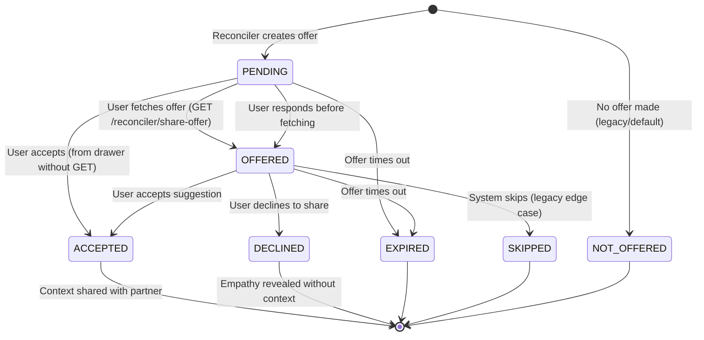
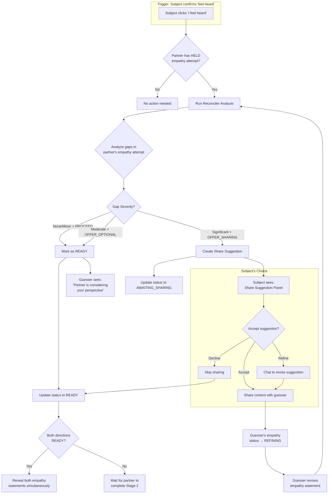
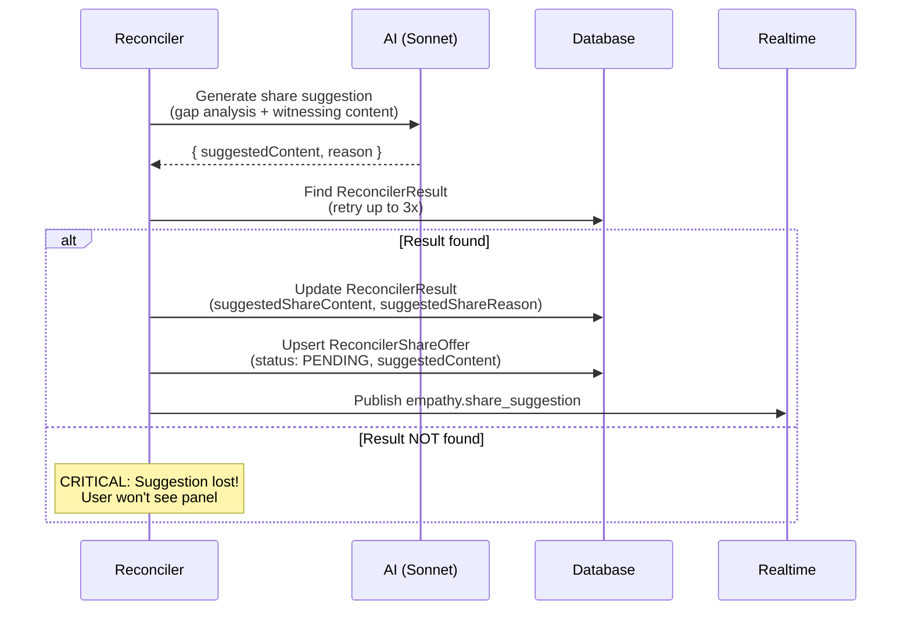
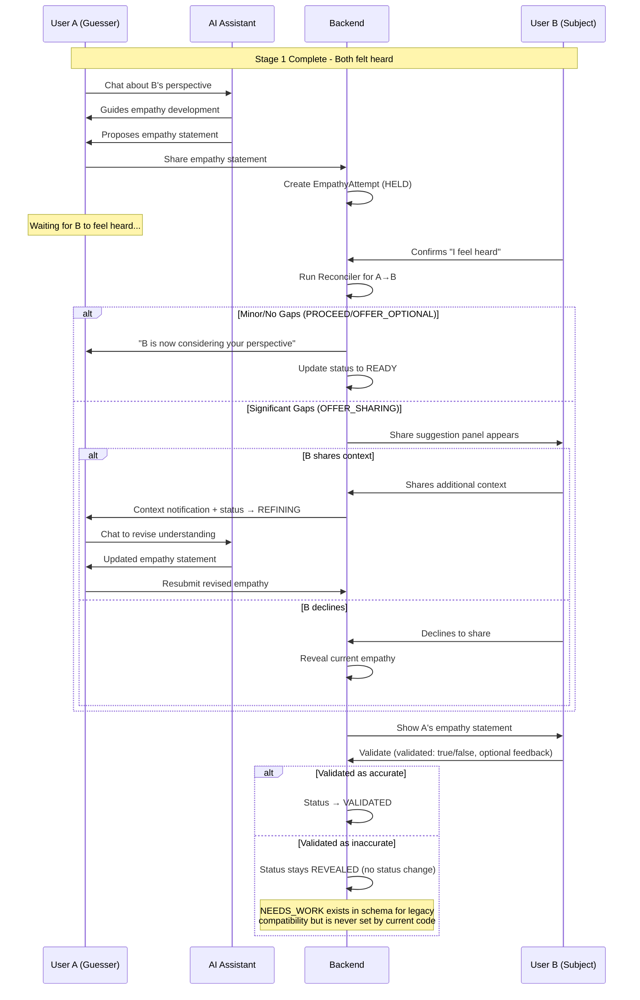
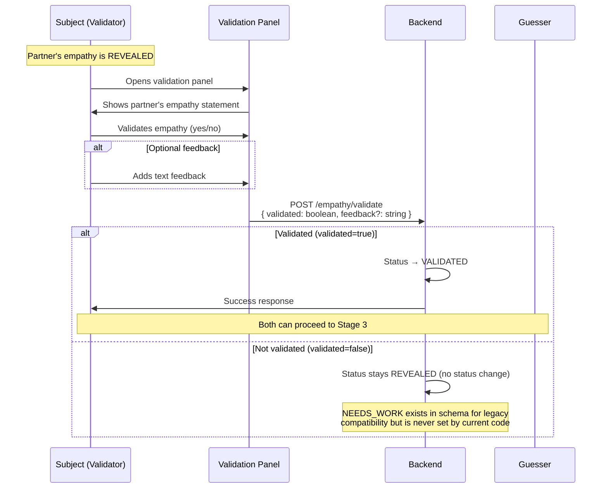
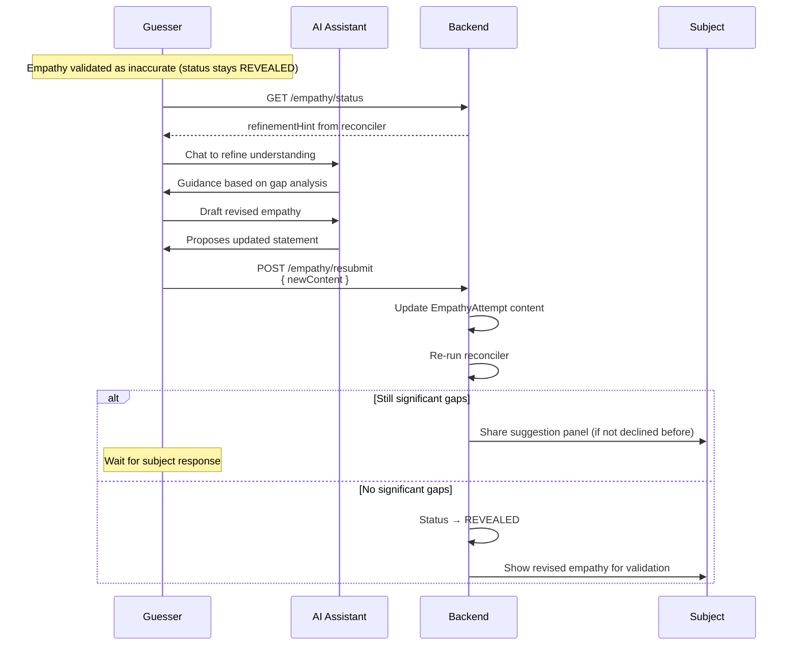
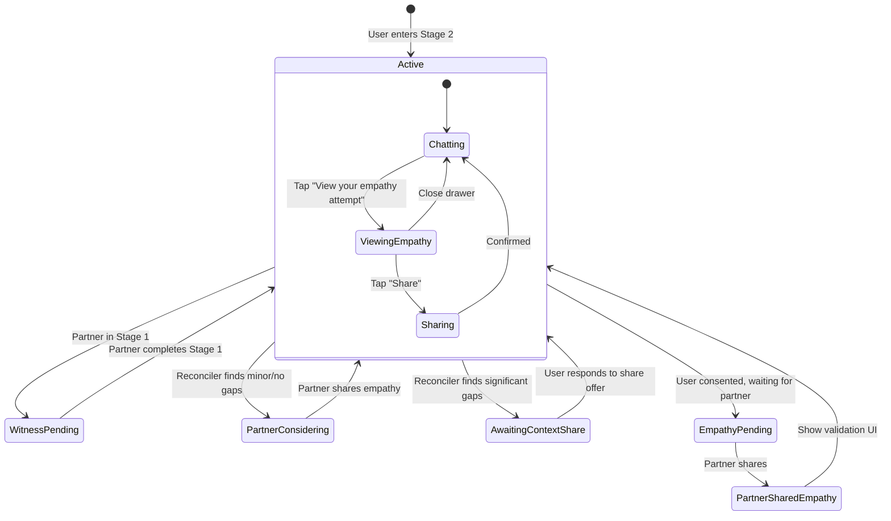

# Stage 2: Perspective Stretch - Empathy Exchange Flow

This document describes the empathy exchange flow in Stage 2, including the reconciler system that analyzes empathy accuracy and manages the sharing of additional context.

## Overview

In Stage 2, both users work to imagine each other's perspective. Each user:
1. Chats with AI to develop their attempt to imagine their partner's experience
2. Creates an empathy statement expressing that attempt
3. Shares the statement with their partner
4. Receives validation feedback on their empathy attempt

The **Reconciler** analyzes how well each person's attempt resonated with the other and may suggest sharing additional context to help bridge gaps.

## Empathy Attempt States

```mermaid
stateDiagram-v2
    [*] --> HELD: User shares empathy statement

    HELD --> READY: Reconciler finds minor/no gaps (direct)
    HELD --> AWAITING_SHARING: Reconciler finds significant gaps (direct)

    AWAITING_SHARING --> REFINING: Subject shares context
    REFINING --> READY: Guesser revises empathy (re-analyzed, circuit breaker forces READY)
    REFINING --> AWAITING_SHARING: Guesser revises empathy (re-analyzed, gaps still found)

    AWAITING_SHARING --> READY: Subject declines to share

    READY --> REVEALED: Both directions are READY (mutual reveal)

    REVEALED --> VALIDATED: Subject validates empathy as accurate
    REVEALED --> REVEALED: Subject says empathy is inaccurate (validated=false; status stays REVEALED)

    note right of HELD
        The ANALYZING state exists in empathy-state-machine.ts
        but is never triggered by the reconciler code.
        The reconciler transitions directly from HELD
        to READY or AWAITING_SHARING.
    end note

    note right of REVEALED
        NEEDS_WORK is marked as legacy in Prisma schema.
        Current code does NOT transition to NEEDS_WORK.
        When validated=false, the status remains REVEALED.
    end note

    VALIDATED --> [*]
```



> **Mutual Reveal**: Empathy statements are only revealed when BOTH users have completed Stage 2 and had their empathy analyzed. The `READY` status means "reconciler complete, waiting for partner to also finish Stage 2".

## Share Offer States

The `ReconcilerShareOffer` tracks the suggestion lifecycle:



## Reconciler Flow

The reconciler runs when one user confirms "feel heard" (completing Stage 1) and their partner has an empathy attempt in `HELD` status.

> **Implementation Note:** The reconciler has been refactored into a modular `backend/src/services/reconciler/` directory:
> - `state.ts` — Empathy status transitions, reveal logic. Contains `runReconcilerForDirection()` (asymmetric) and `checkAndRevealBothIfReady()` (serializable transaction for mutual reveal).
> - `analysis.ts` — Core AI gap analysis (`analyzeEmpathyGap()`), theme extraction, witnessing content retrieval.
> - `sharing.ts` — Share suggestion generation, refinement, and response handling.
> - `circuit-breaker.ts` — Attempt counting to prevent infinite refinement loops (max 3 per direction).
> - `index.ts` — Barrel re-exports.
>
> Status transitions are formally validated by `backend/src/services/empathy-state-machine.ts` which enforces a strict transition table.

### Reconciler Decision Tree



### Reconciler Actions by Gap Severity

| Gap Severity | Recommended Action | Effect on Guesser | Effect on Subject |
|--------------|-------------------|-------------------|-------------------|
| None | `PROCEED` | Status → READY (waiting for mutual reveal) | Continues with their empathy |
| Minor | `PROCEED` | Status → READY (waiting for mutual reveal) | Continues with their empathy |
| Moderate | `OFFER_OPTIONAL` | If AI returned a `suggestedShareFocus` → Status `AWAITING_SHARING` (Sharer gets a share prompt). If no `suggestedShareFocus` → treated as `PROCEED` (US-8 rule) and Status → `READY`. | Sees share suggestion panel when `AWAITING_SHARING`, otherwise continues |
| Significant | `OFFER_SHARING` | Status → `AWAITING_SHARING` | Sees share suggestion panel |

> **Note**: When both directions are in `READY` status, both empathy statements are revealed simultaneously. Neither user sees their partner's empathy until both have completed Stage 2.

> **UI Note:** The guesser sees a UX status message when their empathy status reaches READY
> (not at REVEALED as the earlier state diagram might suggest). The READY → REVEALED transition
> happens automatically when both directions are READY.

### Share Suggestion Generation Flow



> **Implementation:** Share suggestion generation is handled by `reconciler/sharing.ts` which contains
> `generateShareSuggestion()`, `respondToShareSuggestion()`, `generatePostShareContinuation()`, and
> `generateContextReceivedReflection()`. The module includes delivery status tracking and fallback messages for AI failures.

### Slack Gentle Interrupt

When the subject shares context and `refinementFinalizeHandler` delivers it to the guesser, an async Slack DM notification is sent to the guesser (if they are a Slack user) via `notifyGuesserOfShareViaSlack()` in `slack-reconciler-notify.ts`.

This is fire-and-forget: it runs non-blocking (`catch` logs the error) so a Slack outage cannot affect the mobile delivery path. Mobile users receive no Slack notification — the in-app Ably event is the only signal for them.

## User Experience: Both Users' Perspective

### User A (Guesser) Flow



### Validation Flow (After Empathy Revealed)



### Refinement Flow (When Validation is Inaccurate)



## UI State Machine

The chat input visibility and above-input panels are controlled by the waiting status:



## Input Visibility Rules

| Waiting Status | Hide Input? | Show Banner? | Show Inner Thoughts? |
|---------------|-------------|--------------|---------------------|
| `null` | No | No | Depends on stage |
| `witness-pending` | Yes | Yes | Yes |
| `empathy-pending` | Yes | Yes | Yes |
| `partner-considering-perspective` | Yes | Yes | Yes |
| `reconciler-analyzing` | Yes | Yes (with spinner) | Yes | <!-- Note: This UI state exists but the ANALYZING empathy status is never set by current code -->
| `awaiting-context-share` | No | Yes | No |
| `refining-empathy` | No | No | No |

## Panel Priority

Only one panel shows at a time, in this priority order:

1. **Compact Agreement Bar** - During onboarding
2. **Invitation Panel** - After signing, before sending invite
3. **Feel Heard Panel** - Stage 1 completion
4. **Share Suggestion Panel** - Subject must respond to share suggestion
5. **Accuracy Feedback Panel** - Partner's empathy available for validation
6. **Empathy Statement Panel** - User's empathy ready to review
7. **Waiting Banner** - Any waiting status

## Realtime Events

| Event | Trigger | Cache Invalidation | UI Update |
|-------|---------|-------------------|-----------|
| `empathy.status_updated` (status=`AWAITING_SHARING`) | Reconciler offers a share prompt (Moderate+focus or Significant gap) | `shareOffer`, `empathyStatus` | Show share suggestion panel (message: "&lt;name&gt; is considering a suggestion to share more") |
| `empathy.context_shared` | Subject shares additional context | `empathyStatus`, `shareOffer`, `messages` | Guesser sees shared context |
| `empathy.revealed` | Empathy revealed (no significant gaps) | `empathyStatus`, `partnerEmpathy` | Subject can validate |
| `partner.stage_completed` | Partner completes a stage | `empathyStatus`, `progress` | Update waiting status |
| `partner.session_viewed` | Partner views session | `empathyStatus` (delivery status) | Update delivery indicator |
| `empathy.validated` | Partner validates empathy | `empathyStatus` | Show validation result |

## Data Models

### EmpathyAttempt

```typescript
{
  id: string;
  sessionId: string;
  sourceUserId: string;       // The guesser
  draftId: string | null;     // FK to EmpathyDraft (the source draft)
  consentRecordId: string | null; // FK to ConsentRecord (consent to share)
  content: string;            // The empathy statement
  status: 'HELD' | 'ANALYZING' | 'AWAITING_SHARING' | 'REFINING' |
          'READY' | 'REVEALED' | 'VALIDATED' | 'NEEDS_WORK';
  // READY = reconciler complete, waiting for partner to also complete Stage 2
  // ANALYZING exists in empathy-state-machine.ts but is never set by the reconciler code
  // NEEDS_WORK exists for legacy compatibility but is never set by current code
  statusVersion: number;      // Incremented on every status change for event ordering
  sharedAt: Date;             // When initially shared
  revealedAt: Date | null;    // When revealed to subject (after mutual reveal)
  revisionCount: number;      // Number of times empathy was revised
  deliveryStatus: 'PENDING' | 'DELIVERED' | 'SEEN';
  deliveredAt: Date | null;
  seenAt: Date | null;
}
```

### ReconcilerResult

```typescript
{
  id: string;
  sessionId: string;
  guesserId: string;
  subjectId: string;
  guesserName: string;
  subjectName: string;

  // Alignment Analysis
  alignmentScore: number;       // 0-100
  alignmentSummary: string;     // Text summary of alignment
  correctlyIdentified: string[]; // Feelings/needs correctly identified

  // Gap Analysis
  gapSeverity: 'none' | 'minor' | 'moderate' | 'significant';
  gapSummary: string;
  missedFeelings: string[];     // Feelings/needs that were missed
  misattributions: string[];    // Incorrect assumptions made
  mostImportantGap: string | null;

  // Recommendation
  recommendedAction: 'PROCEED' | 'OFFER_OPTIONAL' | 'OFFER_SHARING';
  rationale: string;
  sharingWouldHelp: boolean;
  suggestedShareFocus: string | null;

  // Abstract guidance for refinement (no specific partner content)
  areaHint: string | null;      // e.g., "work and effort"
  guidanceType: string | null;  // e.g., "explore_deeper_feelings"
  promptSeed: string | null;    // e.g., "what might be underneath"

  // Suggestion for subject to share (generated when gaps are significant)
  suggestedShareContent: string | null;   // From generateShareSuggestion
  suggestedShareReason: string | null;

  // Reconciler loop tracking
  iteration: number;              // Which iteration produced this result (1 = first run)
  wasCircuitBreakerTrip: boolean; // Whether circuit breaker forced READY
  supersededAt: Date | null;      // When superseded by a newer analysis
}
```

### ReconcilerShareOffer

```typescript
{
  id: string;
  resultId: string;           // FK to ReconcilerResult
  userId: string;             // The subject who can share
  status: 'PENDING' | 'OFFERED' | 'ACCEPTED' | 'DECLINED' | 'EXPIRED' | 'NOT_OFFERED' | 'SKIPPED';
  // NOT_OFFERED = legacy, no offer was made
  // EXPIRED = offer expired (timeout)
  // SKIPPED = legacy, user skipped without responding
  suggestedContent: string | null;        // AI-generated suggestion
  suggestedReason: string | null;
  offerMessage: string | null;            // AI-generated message shown to user
  refinedContent: string | null;          // User's edited version of suggestion
  sharedContent: string | null;           // Final content that was shared
  deliveryStatus: 'PENDING' | 'DELIVERED' | 'SEEN';
  deliveredAt: Date | null;
  seenAt: Date | null;
  createdAt: Date;
  sharedAt: Date | null;
  declinedAt: Date | null;
  skippedAt: Date | null;

  // Reconciler loop tracking
  iteration: number;                      // Which iteration this offer belongs to
  refinementChatUsed: boolean;            // Whether refinement chat was used before responding

  // Notification tracking
  lastDeliveryNotifiedAt: Date | null;    // Last notified about delivery status change
  lastSeenNotifiedAt: Date | null;        // Last notified about seen status change
}
```

### EmpathyValidation

```typescript
{
  id: string;
  attemptId: string;          // FK to EmpathyAttempt
  sessionId: string;
  userId: string;             // The validator (subject)
  validated: boolean;         // Overall validation (true/false, no rating scale)
  feedback: string | null;    // Optional text feedback
  feedbackShared: boolean;    // Whether feedback was shared with guesser
  validatedAt: Date;
}
```

## Known Edge Cases

### Case 1: Race Condition on Reveal
If both users share empathy at nearly the same time, both reconcilers run. Need to handle:
- Both returning PROCEED → both reveal immediately
- One returning OFFER_SHARING → only one gets share suggestion

### Case 2: Refresh During Share Suggestion
If user refreshes while share suggestion is pending:
- Frontend fetches `GET /api/v1/sessions/:id/reconciler/share-offer`
- If status is `PENDING`, it becomes `OFFERED`
- Panel should reappear with suggestion

### Case 3: Validation Before Reconciler Completes
If user tries to validate partner's empathy before reconciler finishes:
- Frontend should wait for `empathy.revealed` event
- Or poll `empathyStatus` until attempt is in `REVEALED` status

### Case 4: Share Suggestion Without suggestedContent
**Issue discovered during debugging**: If `generateShareSuggestion` fails to find the `ReconcilerResult` (race condition), the `suggestedContent` will be null. The fix includes:
- Retry logic (3 attempts with 100ms delay) in `generateShareSuggestion`
- Frontend fallback to display `offerMessage` if `suggestedContent` is missing

### Case 5: User Responds Before Fetching Share Offer
If user accepts/declines before the GET endpoint marks offer as `OFFERED`:
- `respondToShareSuggestion` accepts both `PENDING` and `OFFERED` status, and supports three actions: `accept`, `decline`, and `refine` (re-runs suggestion generation with `refinedContent` feedback from the user)
- After the circuit-breaker trips, the Guesser's alignment message is softened from the default "your attempt to imagine what they're feeling was quite accurate" to the more honest "You've shared your perspective… Let's move forward" to avoid overclaiming accuracy when refinement was exhausted or context was already shared
- Marks as `OFFERED` before processing for proper audit trail

## Debugging Tips

### Analyze Session State
Use the diagnostic script to get a complete view of a session:
```bash
cd backend
npx ts-node src/scripts/analyze-session.ts <sessionId>
```

This shows:
- Participant info
- Stage progress for each user
- Empathy drafts and attempts
- Reconciler results and share offers
- Chronological timeline of all events
- Potential issues detected

### Check Reconciler Logs
Look for these key log messages (now using Winston structured logger — search JSON logs in production):
- `Running asymmetric reconciliation` - Start of analysis (in `reconciler/state.ts`)
- `AI analysis complete` (in `reconciler/analysis.ts`) — AI analysis done; fields: `alignmentScore`, `gapSeverity`, `action`
- `Reconciler outcome` (in `reconciler/state.ts`) — state transition committed; fields: `severity`, `action`, `empathyStatus`
- `Share suggestion generated` - Suggestion created (in `reconciler/sharing.ts`)
- `Could not find reconcilerResult` - Race condition error (in `reconciler/sharing.ts`)

### Frontend Cache Issues
If UI doesn't update after Ably events:
- Check that `empathy.revealed` handler invalidates `empathyStatus`
- Verify `shareOffer` query is invalidated after `empathy.status_updated` (status=`AWAITING_SHARING`)
- Use React Query DevTools to inspect cache state
