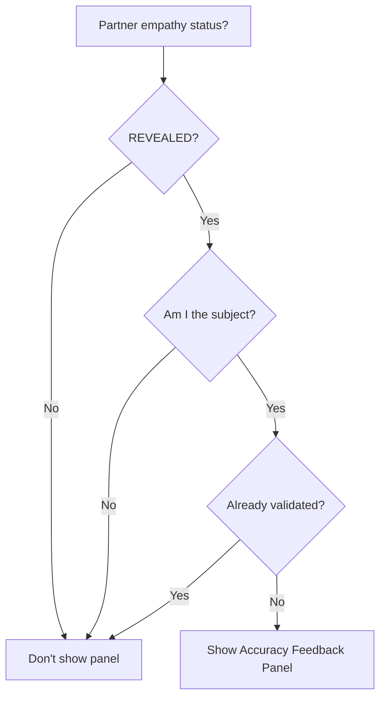
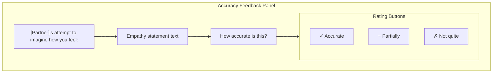
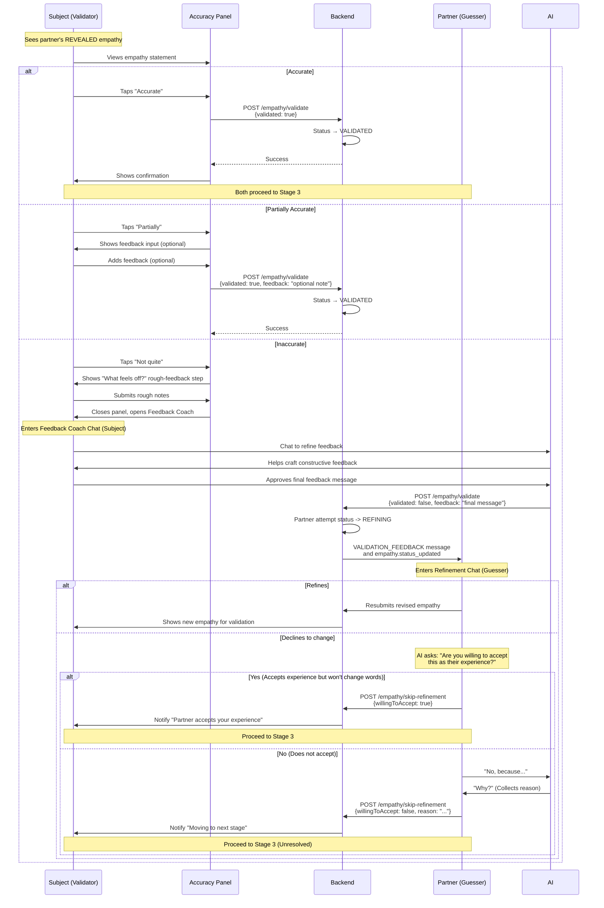

# Accuracy Feedback Flow

This document describes how users validate their partner's empathy attempt, including the UI component behavior and API interactions.

## Overview

After a user's empathy attempt is **REVEALED** to their partner (the subject), the subject can provide feedback on how accurately the guesser's attempt resonates with their actual feelings. This feedback determines whether the guesser needs to revise their empathy attempt.

## When Accuracy Feedback Appears

The accuracy feedback panel appears when:
1. Partner's empathy status is `REVEALED` (not yet validated)
2. Current user is the "subject" (the one whose perspective the partner attempted to imagine)
3. No share suggestion panel is pending
4. User hasn't already submitted validation



## UI Components

### Panel Location

The accuracy feedback panel appears **above the chat input** and follows the panel priority system:

```
┌─────────────────────────────────────┐
│           Chat Messages             │
│                                     │
│    [Partner's message]              │
│              [My message]           │
│    [AI message]                     │
│                                     │
├─────────────────────────────────────┤
│  ┌─────────────────────────────┐   │
│  │  Accuracy Feedback Panel    │   │  ← Panel area (above input)
│  │  [Partner name]'s           │   │
│  │  attempt to imagine         │   │
│  │  how you feel:              │   │
│  │  "Empathy statement..."     │   │
│  │                             │   │
│  │  How accurate is this?      │   │
│  │  [✓ Accurate] [~ Partial]   │   │
│  │  [✗ Inaccurate]             │   │
│  └─────────────────────────────┘   │
├─────────────────────────────────────┤
│  [Chat input box]                   │  ← Input area
└─────────────────────────────────────┘
```

### Panel Content



## User Interaction Flow



## AI Feedback Coach (Subject's Experience)

The "Not quite" path starts with a lightweight rough-feedback step in the
`AccuracyFeedbackDrawer`: **"What feels off?"** The drawer requires non-empty rough notes
before opening the Feedback Coach. The coach then helps the subject turn those notes into
constructive feedback that focuses on their experience instead of the partner's failure.

When the subject approves the final coach draft, mobile sends it through
`POST /sessions/:id/empathy/validate` with `validated: false` and the final `feedback`.
The backend stores an `EmpathyValidation` with `feedbackShared: true`, creates a targeted
`VALIDATION_FEEDBACK` chat message for the partner, moves the partner's empathy attempt to
`REFINING`, and publishes `empathy.status_updated` with `status: 'REFINING'`,
`feedbackShared: true`, and the `validationFeedback` text.

## Acceptance Check (Guesser's Experience)
If the Guesser cannot/will not refine their statement to match the Subject's feedback:
1. **AI Presentation**: "You said [Original], and they say [Feedback]. With this adjustment, they say their experience is accurately reflected."
2. **The Question**: "Are you willing to accept this as their experience?"
3. **Outcomes**:
    - **Yes**: "I accept that is their experience (even if I see it differently)." -> **Proceed**.
    - **No**: "I cannot accept that is their experience." -> AI asks **Why?** -> User answers -> **Proceed** (with disagreement logged).

## API Contract

### POST /sessions/:id/empathy/validate

**Request:**
```typescript
{
  validated: boolean;     // true for accurate/partially_accurate, false for not quite
  feedback?: string;      // Required when validated is false; optional note when true
  // Note: there is NO "rating" field in the actual API.
  // "Partially Accurate" and "Accurate" both send validated: true (no distinction).
}
```

**Response:**
```typescript
{
  validated: boolean;
  validatedAt: string;
  feedbackShared: boolean;
  awaitingRevision: boolean;
  canAdvance: boolean;
  partnerValidated: boolean;       // Whether partner has validated current user's empathy
}
```

## State Transitions

### EmpathyAttempt Status

| Current Status | Validation Result | New Status |
|---------------|-------------------|------------|
| REVEALED | Accurate (validated: true) | VALIDATED |
| REVEALED | Partially accurate (validated: true) | VALIDATED |
| REVEALED | Inaccurate (validated: false, feedback present) | REFINING |

### What Happens Next

| New Status | For Subject | For Guesser |
|------------|-------------|-------------|
| VALIDATED | Panel closes, can proceed | Can proceed to Stage 3 |
| REFINING | Feedback Coach final send completes | Partner receives `VALIDATION_FEEDBACK` and can refine or skip refinement |

## Frontend Implementation

### Query Dependencies

```typescript
// Fetch partner's empathy for validation
const { data: partnerEmpathy } = useQuery({
  queryKey: ['partnerEmpathy', sessionId],
  queryFn: () => api.getPartnerEmpathy(sessionId),
  enabled: !!sessionId,
});

// Check if validation panel should show
const shouldShowValidationPanel =
  partnerEmpathy?.status === 'REVEALED' &&
  !partnerEmpathy?.validation?.validatedAt;
```

### Cache Invalidation

After validation:
```typescript
// Actual implementation invalidates 7 query key families:
queryClient.invalidateQueries(stageKeys.empathyStatus(sessionId));
queryClient.invalidateQueries(stageKeys.shareOffer(sessionId));
queryClient.invalidateQueries(stageKeys.empathyDraft(sessionId));
queryClient.invalidateQueries(sessionKeys.state(sessionId));
queryClient.invalidateQueries(sessionKeys.detail(sessionId));
queryClient.invalidateQueries(messageKeys.list(sessionId));
queryClient.invalidateQueries(messageKeys.timeline(sessionId));
```

### Panel Visibility Logic

```typescript
// In panel priority calculation
const panels = [
  { show: showCompactAgreementBar, priority: 1, component: CompactAgreementBar },
  { show: showInvitationPanel, priority: 2, component: InvitationPanel },
  { show: showFeelHeardPanel, priority: 3, component: FeelHeardPanel },
  { show: showShareSuggestionPanel, priority: 4, component: ShareSuggestionPanel },
  { show: shouldShowValidationPanel, priority: 5, component: AccuracyFeedbackPanel }, // <-- Here
  { show: showEmpathyPanel, priority: 6, component: EmpathyStatementPanel },
  { show: showWaitingBanner, priority: 7, component: WaitingBanner },
];

const activePanel = panels
  .filter(p => p.show)
  .sort((a, b) => a.priority - b.priority)[0];
```

## Debugging

### Check if partner empathy is available
```typescript
// In React Query DevTools or console
queryClient.getQueryData(['partnerEmpathy', sessionId])
```

### Verify empathy status
```bash
cd backend
npx ts-node src/scripts/analyze-session.ts <sessionId>
```
Look for:
- Partner's empathy attempt status (should be `REVEALED`)
- Validation records (should be empty if not yet validated)
