# Chat Interface

The primary conversation interface where users interact with the AI.

## Core Chat Layout

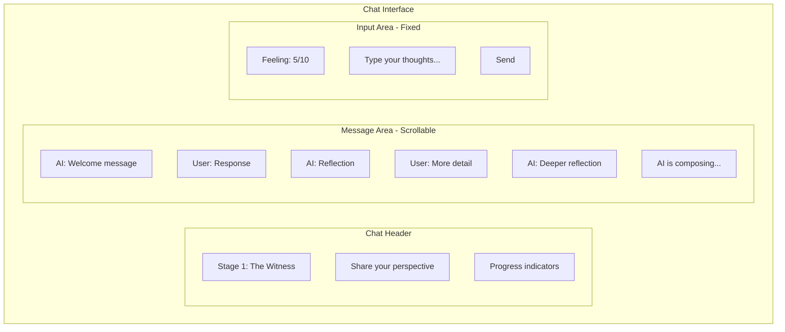

## Message Bubbles

### AI Message

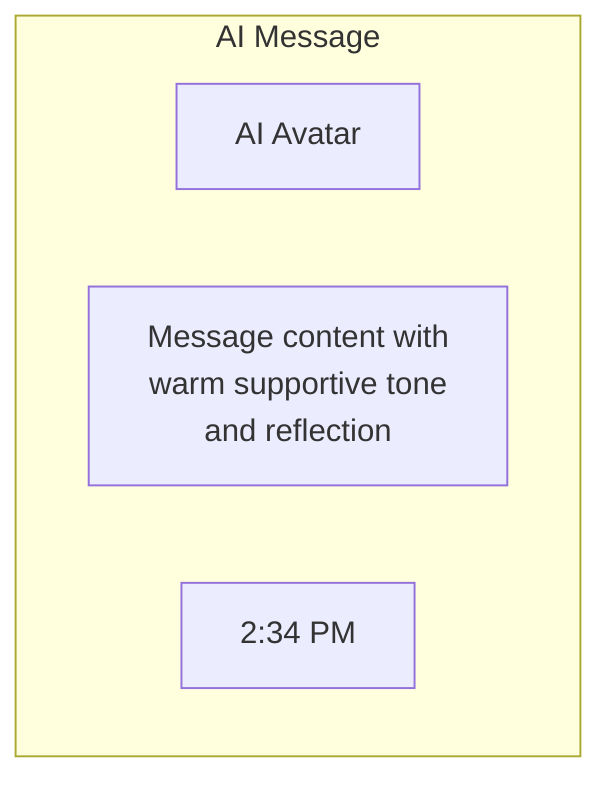

Characteristics:
- Left-aligned
- Subtle background color
- AI avatar/icon
- A typing indicator ("ghost dots") appears while the user is waiting for the AI's reply — it's derived from cache state (the last message role is `USER`, meaning the AI hasn't answered yet) and from pending mutations like `isFetchingInitialMessage` / `isConfirmingFeelHeard` / `isSharingEmpathy` / `isConfirmingInvitation`. Dots hide as soon as the first AI chunk arrives via SSE / Ably.
- **AI error feedback**: when an Ably `onAIError` event arrives (e.g. the backend failed to process the user's message), the optimistic message is rolled back (dots hide automatically) and a toast is shown: *"Something went wrong — Your message could not be processed. Please try again."* This is triggered via `useToast().showError` in `UnifiedSessionScreen`.

### User Message

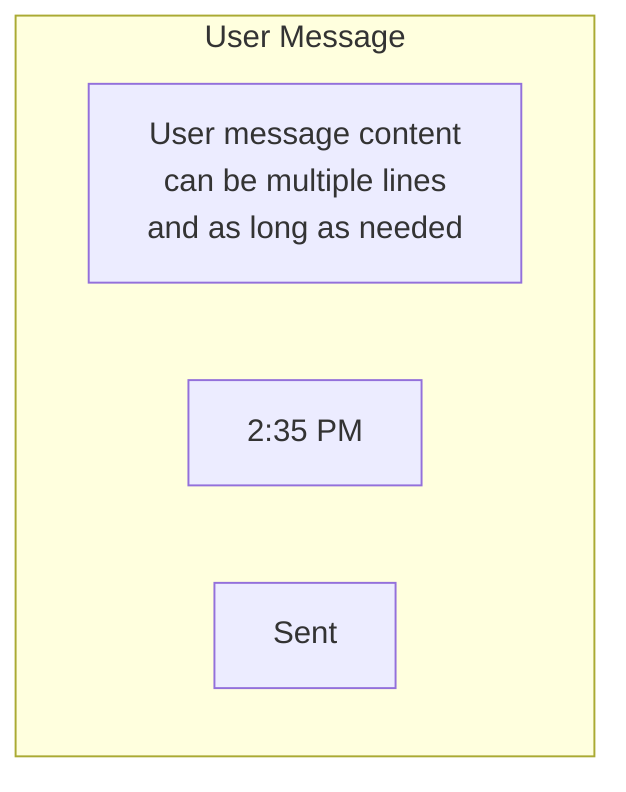

Characteristics:
- Right-aligned
- User-colored background
- Timestamp
- Sent/read status

## Stage-Specific Variations

### Stage 0: Onboarding Chat

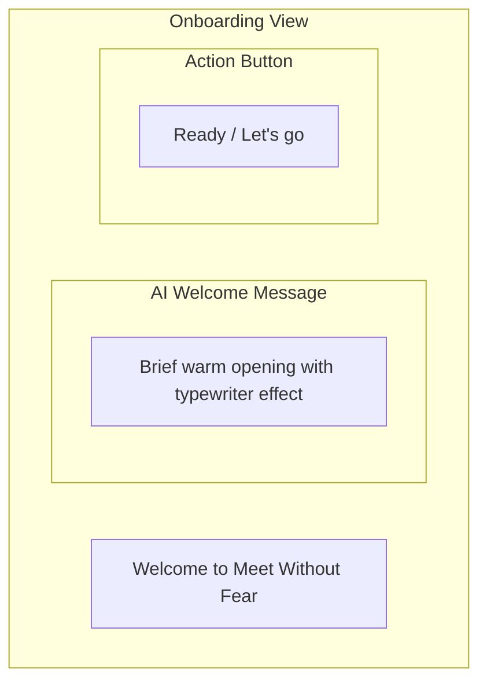

### Stage 1: The Witness Chat

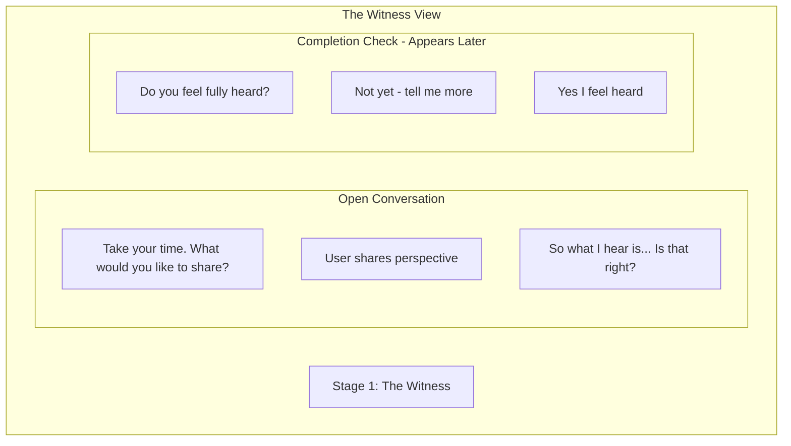

### Stage 2: Perspective Stretch Chat

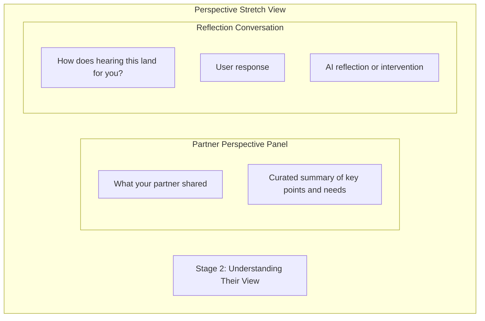

### Stage 3: Need Mapping Chat

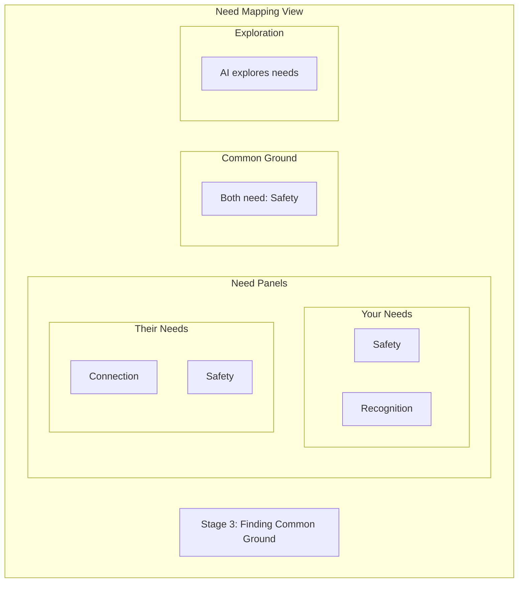

### Stage 4: Strategic Repair ("Moving Forward Together")

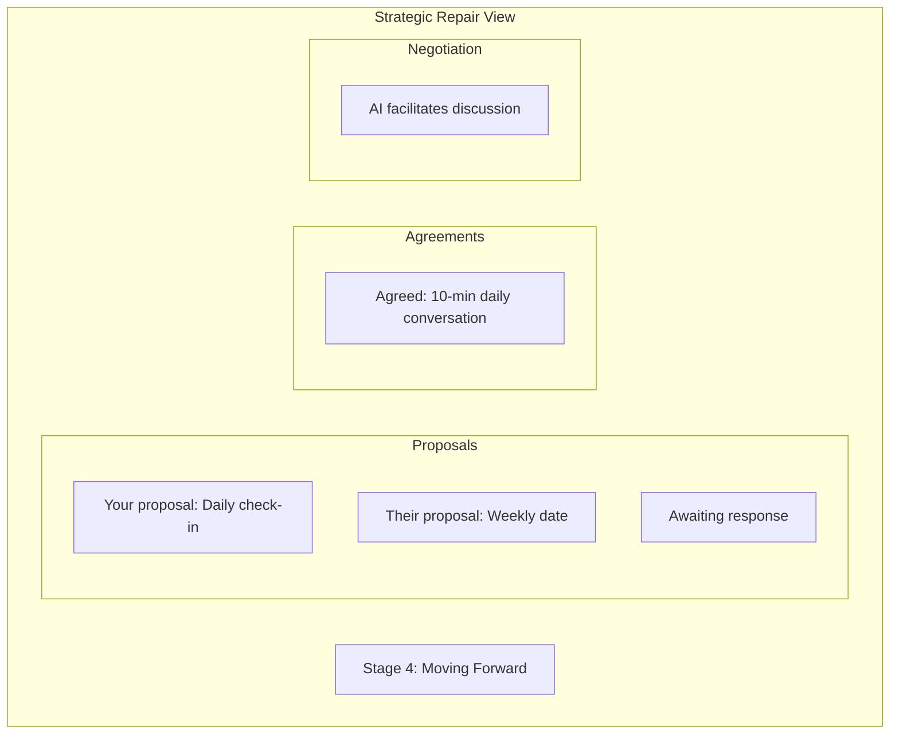

## Session entry flow

Before the chat list renders, `UnifiedSessionScreen` can swap in a full-screen mood check (`SessionEntryMoodCheck`) — this is the default entry when `shouldShowMoodCheck` is true. Only after the user submits (or dismisses) the mood reading does the usual chat layout show.

## Empty States

### Opening not acknowledged (onboarding)

If the caller enters a session but hasn't acknowledged the opening message, the list replaces its usual empty state with a `CompactChatItem` (a brief AI welcome message). A "Ready" button appears above the input via `CompactAgreementBar`. This is controlled by `isInOnboardingUnsigned` / `customEmptyState`.

### Waiting for Partner

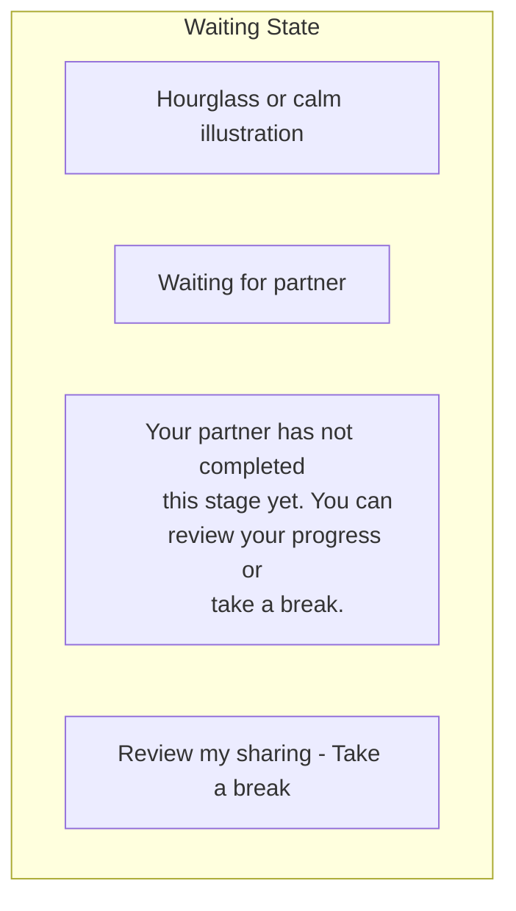

### Session Not Started

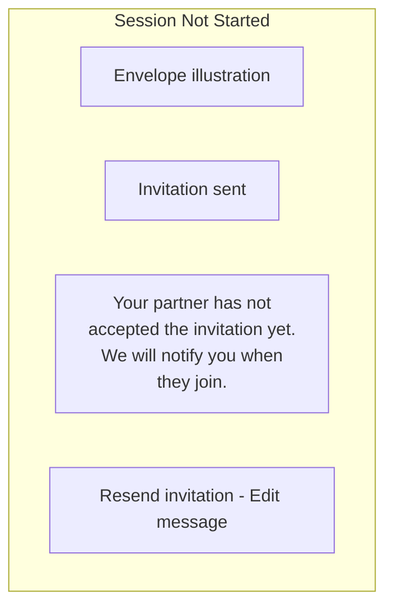

## Input Area Details

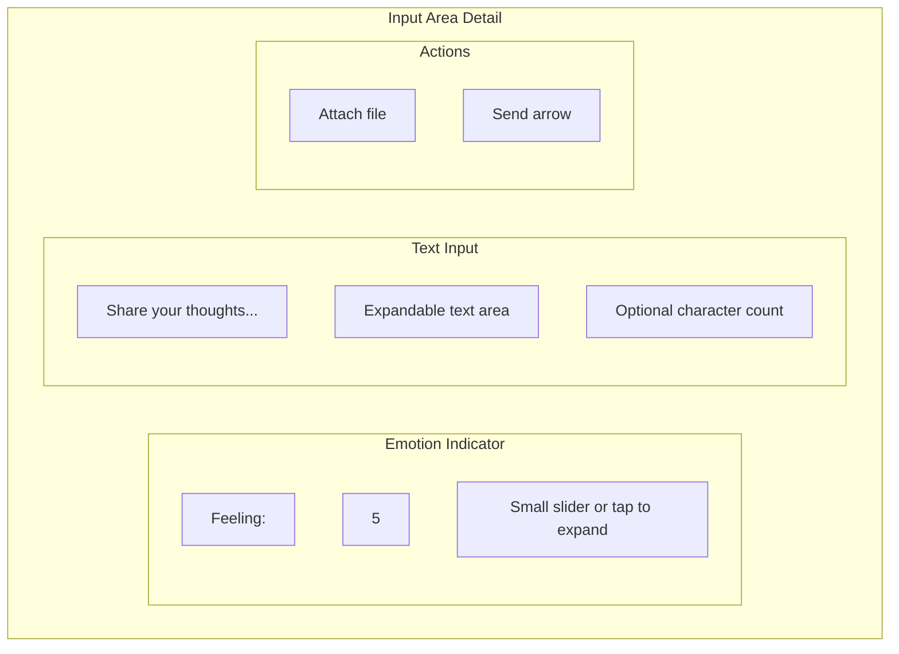

## Attachment Support

Not implemented. The message input accepts text only (`sendMessage(message: string)`); there is no attachment button, file picker, or attachment preview in `UnifiedSessionScreen` or `ChatInterface`. Documented here only as a deferred design idea — remove from wireframes before shipping if it doesn't make the roadmap.

## Integrated emotional barometer

The chat input hosts an inline emotion slider (`barometerValue` / `handleBarometerChange`). Readings ≥9 automatically open the `support-options` overlay to surface coping exercises before the user continues typing.

## Typewriter + inline Stage 2 cards

The chat list tracks `isTypewriterAnimating` (set while a new AI message is being typed in) so it can delay the appearance of inline cards until the text has finished. In Stage 2 (`PERSPECTIVE_STRETCH`), the list renders **validation cards** directly in the timeline (`validationCards`) with "Accurate / Partially / Off" buttons wired to `handleValidationAccurate` / `handleValidationNotQuite` instead of routing users to a separate screen.

## Stage label map

The screen uses this friendly-name map when rendering the stage header:

| Internal enum | UI label |
|---|---|
| `Stage.ONBOARDING` | Welcome |
| `Stage.WITNESS` | Share what's on your mind |
| `Stage.PERSPECTIVE_STRETCH` | Imagine their side |
| `Stage.NEED_MAPPING` | Find what you both need |
| `Stage.INFORMED_EMPATHY` | Deeper Understanding |
| `Stage.STRATEGIC_REPAIR` | Moving Forward Together |

---

## Related Documents

- [Core Layout](./core-layout.md)
- [Stage Controls](./stage-controls.md)
- [Emotional Barometer UI](./emotional-barometer-ui.md)

---

[Back to Wireframes](./index.md) | [Back to Plans](../index.md)
