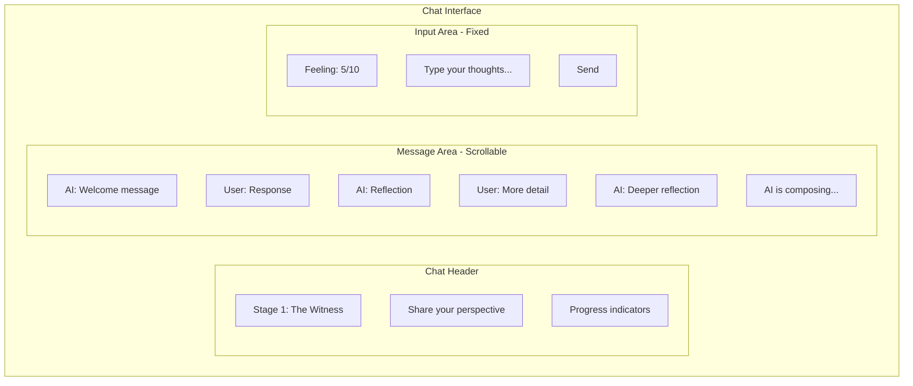
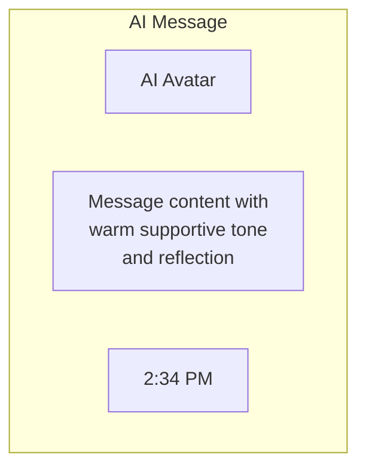
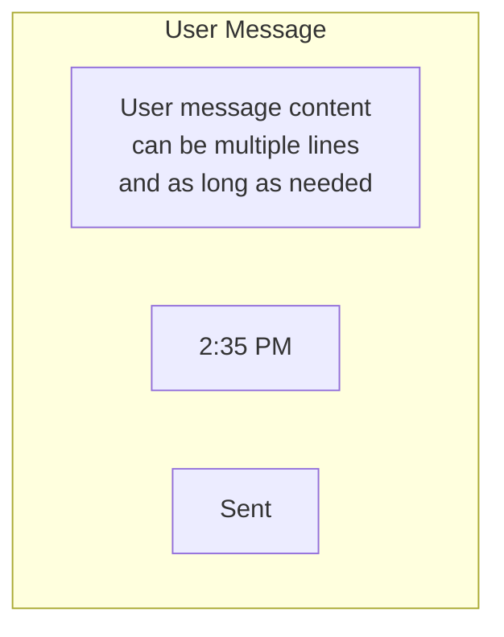
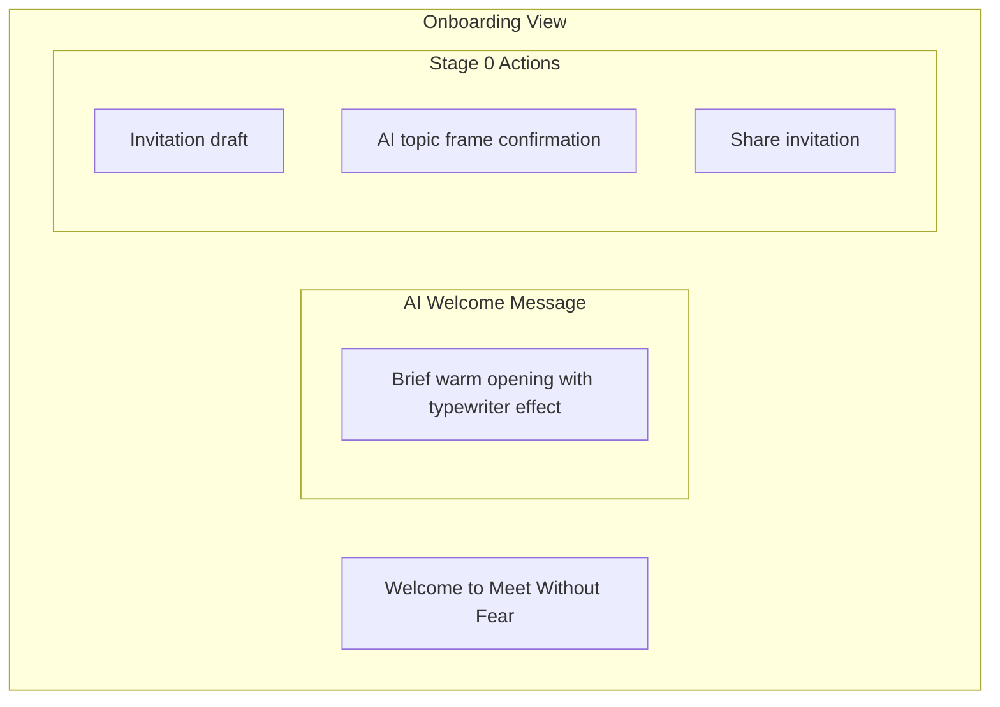
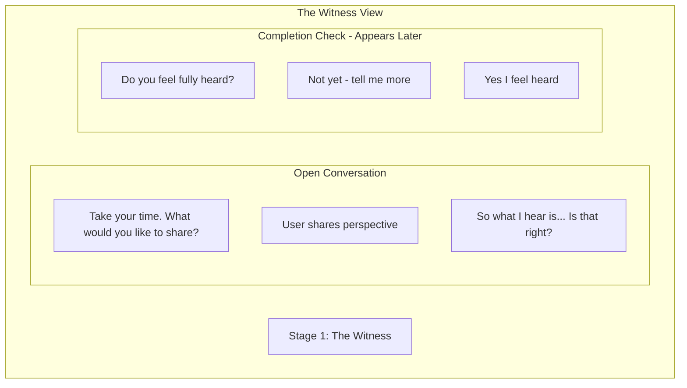
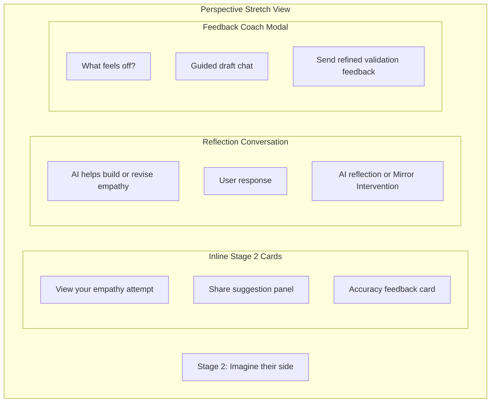
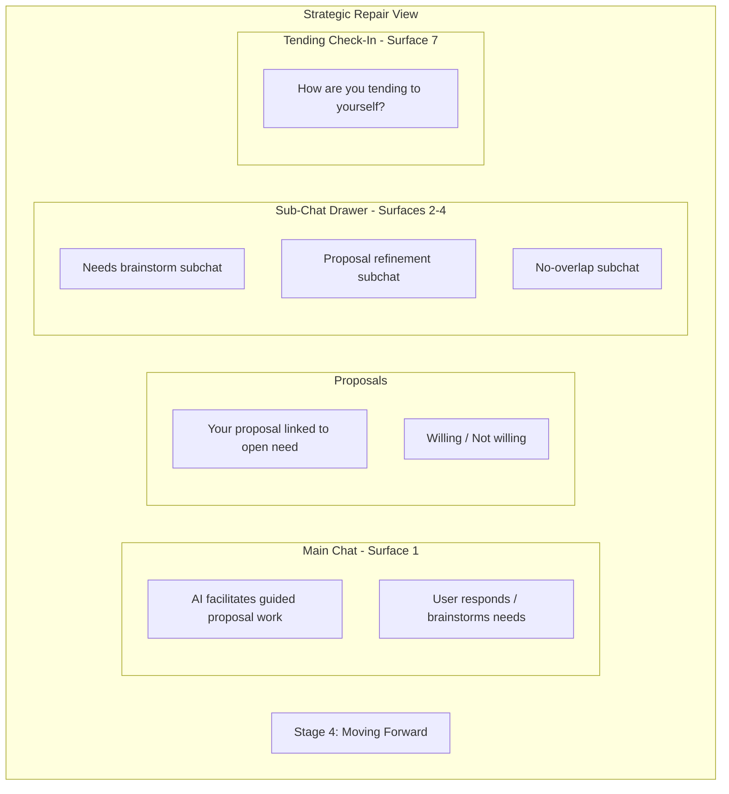
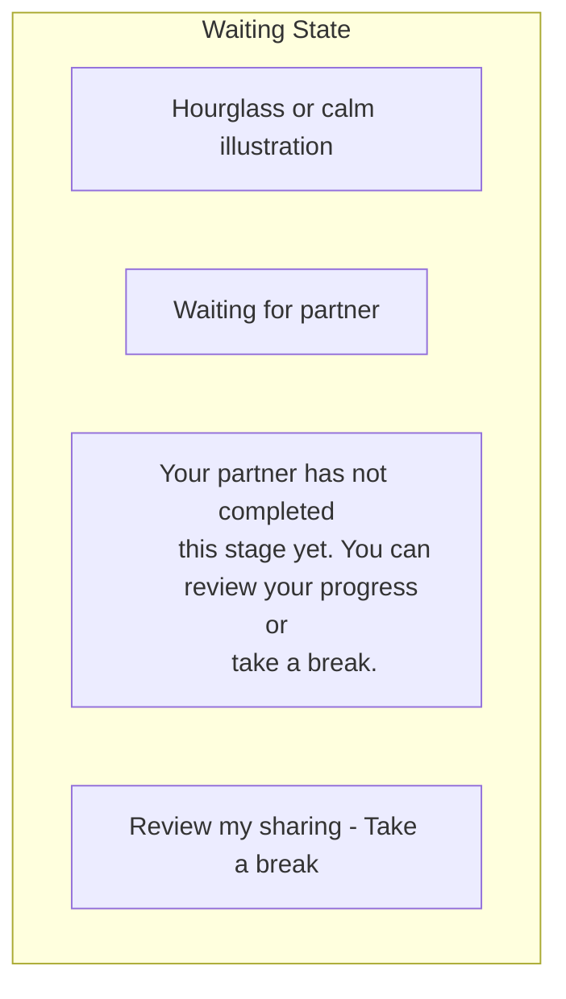
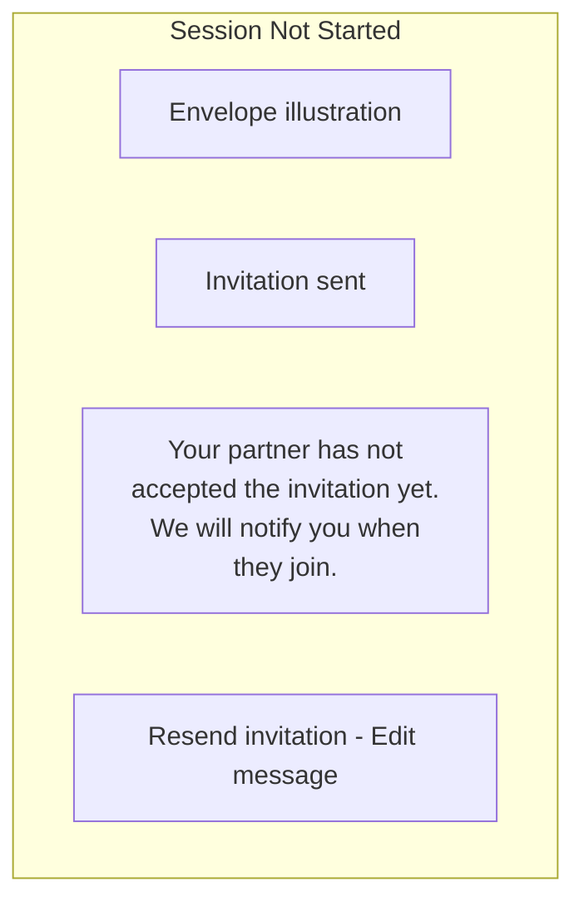
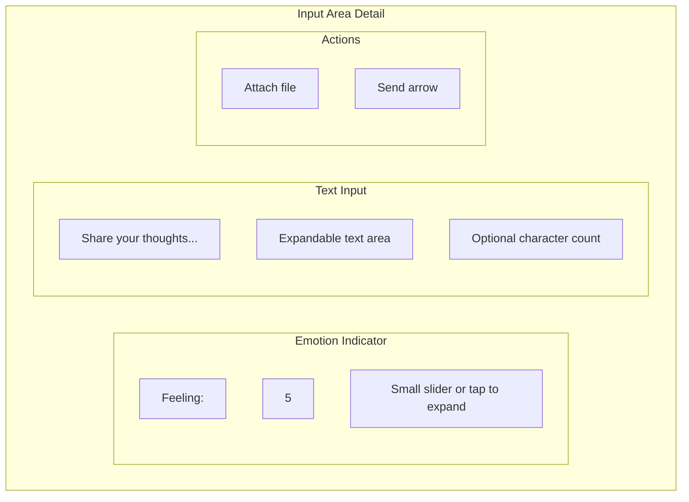

# Chat Interface

The primary conversation interface where users interact with the AI.

## Core Chat Layout

## Message Bubbles

### AI Message

Characteristics:
- Left-aligned
- Subtle background color
- AI avatar/icon
- A typing indicator ("ghost dots") appears while the user is waiting for the AI's reply — it's derived from cache state (the last message role is `USER`, meaning the AI hasn't answered yet) and from pending mutations like `isFetchingInitialMessage` / `isConfirmingFeelHeard` / `isSharingEmpathy` / `isConfirmingInvitation`. Dots hide as soon as the first AI chunk arrives via SSE / Ably.
- **AI error feedback**: when an Ably `onAIError` event arrives (e.g. the backend failed to process the user's message), the optimistic message is rolled back (dots hide automatically) and a toast is shown: *"Something went wrong — Your message could not be processed. Please try again."* This is triggered via `useToast().showError` in `UnifiedSessionScreen`.

### User Message

Characteristics:
- Right-aligned
- User-colored background
- Timestamp
- Sent/read status

### Shared Context Card

When a user shares their Stage 2 context (empathy attempt) with their partner, it appears inline in the chat timeline as a distinct card (`isSharedContext` bubble type):

- **Receiver-side**: left-aligned — partner sees it on the left like an AI message
- **Sender-side**: right-aligned — the sharing user sees their own card on the right (`message.sharedContentDirection === 'sent'` triggers `sharedContextSentContainer`)
- After sharing, the activity drawer does **not** auto-open; the shared context card appears inline and the activity menu data refreshes silently so it's current if the user opens it manually.

## Stage-Specific Variations

### Stage 0: Onboarding Chat

The invite drafting phase uses a two-step bottom panel:

1. **Topic confirmation** — The panel first shows only the AI-proposed neutral 3-5 word topic frame with an optional steering input and a confirm button. The invitation message and share controls are hidden.
2. **Invitation sharing** — Once the topic is confirmed, the panel transitions to show the drafted invite message, the confirmed topic, the share button, a refine option, and the "sent it" continuation.

### Stage 1: The Witness Chat

### Stage 2: Perspective Stretch Chat

### Stage 3: What Matters Chat

### Stage 4: Strategic Repair ("Moving Forward Together")

**Sub-chat drawer pattern**: Surfaces 2–4 open as a bottom drawer (guided sub-chat) layered over the main chat. Each sub-chat has its own AI persona and is dismissed when the user completes the guided flow, returning them to the main chat (Surface 1) with any generated content (needs list, refined proposal, etc.) carried forward.

**Proposal responses use two options only**: "Willing" / "Not willing" — there is no "Discuss" / `NEEDS_DISCUSSION` option in the UI.

### Resolved session history view

When a session is in `RESOLVED` status, users can scroll back through the full chat history (`viewingResolvedHistory = true`). While in this mode a `GuidedActionPanel` (tone `review`) appears above the input:

- **Eyebrow**: "Resolved"
- **Title**: "A Path Forward"
- **Subtitle**: "Return to the summary of what you and your partner agreed."
- **Primary action**: "View summary" — tapping sets `viewingResolvedHistory` back to `false` and returns the user to the Stage 4 summary view.

This panel is rendered by `renderAboveInput` and wired via the condition `session?.status === SessionStatus.RESOLVED && viewingResolvedHistory`.

## Session entry flow

Before the chat list renders, `UnifiedSessionScreen` checks three guard states in order:

1. **Loading** — shows spinner + "Loading session..." while the `/state` endpoint (and retries) are in flight.
2. **Load error** — if the state fetch fails (network timeout, offline, server error) after React Query retries are exhausted, shows "Couldn't load session" with a **Retry** button and a **Go back** link. The existing `AppState` foreground listener also auto-retries when the app returns from background.
3. **Access denied** — 403/404 shows "You don't have access to this session." with a Go back link.

After these guards pass, the mood check may appear (`SessionEntryMoodCheck`) if `shouldShowMoodCheck` is true. Only after the user submits (or dismisses) the mood reading does the usual chat layout show.

## App-level overlays

### Biometric Lock (`BiometricLockOverlay`)

When the app returns from background after ≥5 seconds, `BiometricLockOverlay` covers the entire screen and prompts the user for biometric or device passcode authentication. On success the overlay dismisses. The context (`BiometricLockContext`) tracks lock state; the web variant is a no-op.

### Notification Permission (`NotificationPermissionDrawer`)

After a session turn completes, `useNotifications.ts` evaluates `shouldAskForSessionNotifications()`. When conditions are met the app shows a full-screen `NotificationPermissionDrawer` with the copy: *"Know when it is your turn again"* and a preview of the notification ("Your partner is ready"). Accepting calls `requestSessionNotifications()` which triggers the OS permission dialog and registers the Expo push token.

## Empty States

### Opening not acknowledged (onboarding)

If the caller enters a session but hasn't acknowledged the opening message, the list replaces its usual empty state with a `CompactChatItem` (a brief AI welcome message). A "Ready" button appears above the input via `CompactAgreementBar`. This is controlled by `isInOnboardingUnsigned` / `customEmptyState`.

### Waiting for Partner

### Session Not Started

## Input Area Details

## Attachment Support

Not implemented. The message input accepts text only (`sendMessage(message: string)`); there is no attachment button, file picker, or attachment preview in `UnifiedSessionScreen` or `ChatInterface`. Documented here only as a deferred design idea — remove from wireframes before shipping if it doesn't make the roadmap.

## Integrated emotional barometer

The chat input hosts an inline emotion slider (`barometerValue` / `handleBarometerChange`). Readings ≥9 automatically open the `support-options` overlay to surface coping exercises before the user continues typing.

## Guided Action Panel

`GuidedActionPanel` is a unified component (added in #446) that replaced six separate inline action surfaces with a single consistent pattern. It accepts a `tone` prop that controls color/icon and a `primaryAction` (and optional secondary). Current tones:

| Tone | Used for |
|---|---|
| `topic` | Stage 0 — topic-frame confirmation above the input |
| `review` | Stage 2 — empathy draft review / revisit; resolved sessions — back-to-summary CTA while viewing chat history |
| `share` | Stage 2 — share suggestion |
| `success` | Stage 1 — feel-heard confirmation |
| `needs` | Stage 3 — needs reveal / validate |

Each panel shows an eyebrow label, title, optional subtitle, and one or two action buttons. The input field remains visible while any `GuidedActionPanel` is displayed — it is not hidden by the panel (this is intentional: users can continue the conversation even while an action is pending).

## Typewriter + inline Stage 2 cards

The chat list tracks `isTypewriterAnimating` (set while a new AI message is being typed in) so it can delay the appearance of inline cards until the text has finished. In Stage 2 (`PERSPECTIVE_STRETCH`), the list renders **validation cards** directly in the timeline (`validationCards`) with "Accurate / Partially / Off" buttons wired to `handleValidationAccurate` / `handleValidationNotQuite` instead of routing users to a separate screen. The "Not quite yet" path opens `AccuracyFeedbackDrawer` for rough notes and then `GuidedDraftChatModal` as the Feedback Coach before the final feedback is submitted.

## Stage label map

The screen uses this friendly-name map when rendering the stage header:

| Internal enum | UI label |
|---|---|
| `Stage.ONBOARDING` | Welcome |
| `Stage.WITNESS` | Share what's on your mind |
| `Stage.PERSPECTIVE_STRETCH` | Imagine their side |
| `Stage.NEED_MAPPING` | Find what you both need |
| `Stage.INFORMED_EMPATHY` | Deeper Understanding |
| `Stage.STRATEGIC_REPAIR` | Moving Forward Together |

---

## Related Documents

- [Core Layout](./core-layout.md)
- [Stage Controls](./stage-controls.md)
- [Emotional Barometer UI](./emotional-barometer-ui.md)

---

[Back to Wireframes](./index.md) | [Back to Plans](../index.md)
