# Gold Flow Mockups

Status: planning draft
Related: #282, #247, #212, #244
Purpose: low-fidelity interaction mockups for the Stage 3, Stage 4, and Tending redesigns. These are not visual polish specs. They define what appears in chat, what appears as a formatted card, and where user action remains conversational.

## Design Principle

The redesigned flow is conversation-led. UI cards should clarify and preserve state, not replace the dialogue with forms.

- Users answer, select, remove, and revise through text.
- Cards summarize what the AI has heard and what the system is holding.
- Buttons are acceptable for clear consent or navigation gates, but not for replacing the core reflective work.
- The mobile UI should feel like a guided conversation with structured receipts.

## Stage 3 Overview

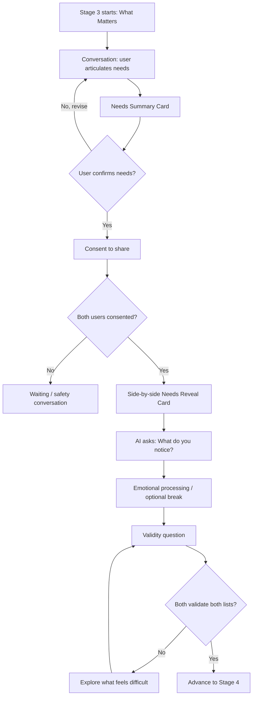

## Stage 3 Chat Layout

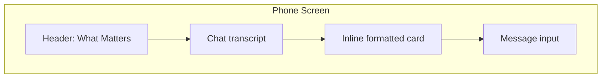

### Needs Summary Card

Appears when the AI believes the user has articulated enough to confirm.

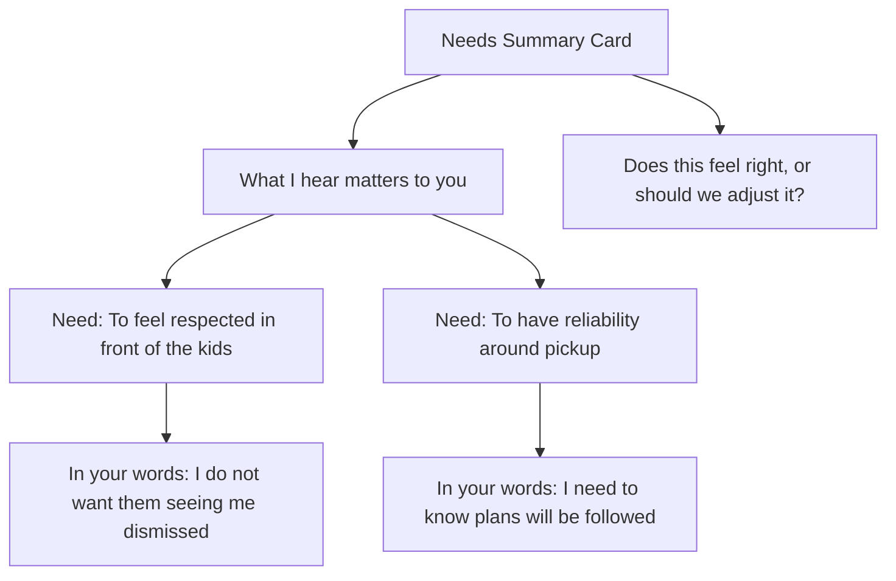

Interaction:

- User confirms in chat: "Yes, that feels right."
- User revises in chat: "The second one is more about trust than pickup."
- System updates the summary card after revision.

Open design detail:

- Decide whether the card is rendered from a structured message type or from tagged content in an AI message.

### Consent Moment

Consent can use a small explicit affordance because it is a gate, but the copy should stay in the conversation.

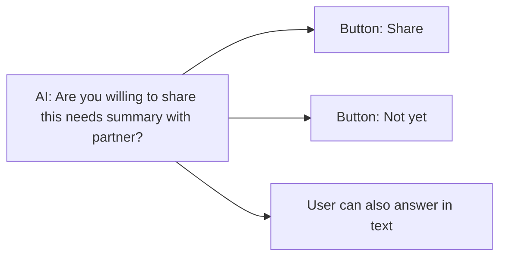

### Side-by-side Needs Reveal Card

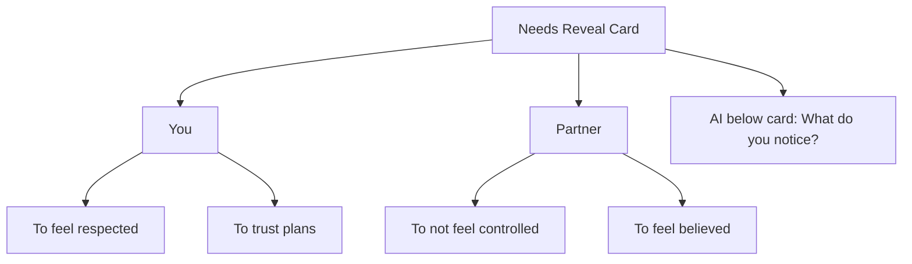

Rules:

- No overlap badges.
- No "shared need" highlighting.
- No AI-authored common-ground summary.
- Both columns use neutral styling.

### Break / Processing State

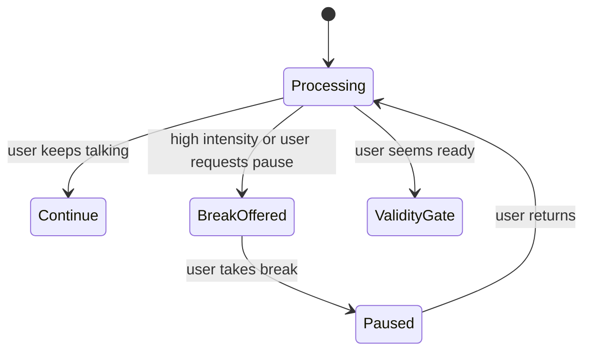

UI implication:

- A "Take a break" action can exist as a subtle option.
- The primary flow should still work by text: "I need a minute."

## Stage 4 Overview

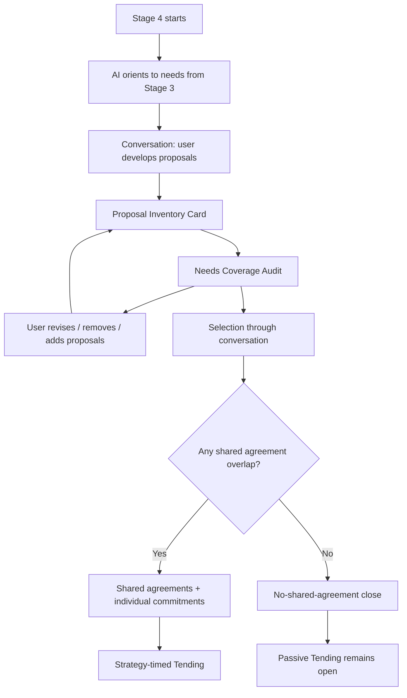

## Stage 4 Proposal Inventory Card

The proposal inventory is a formatted receipt of the conversation. It should not be a form-first interaction.

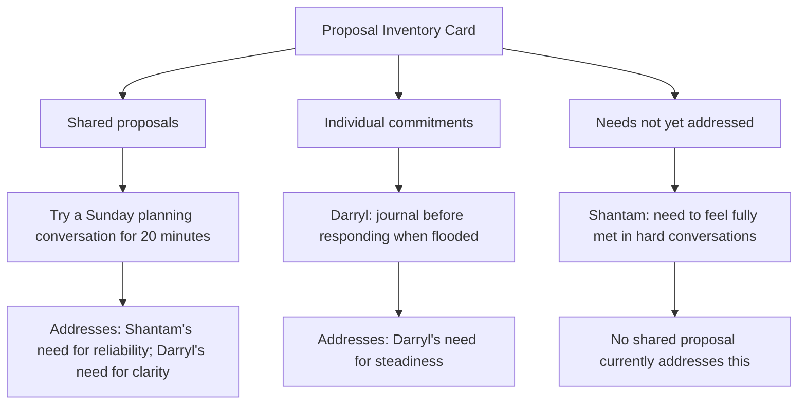

Interaction:

- Add: "I want to add one about bedtime."
- Remove: "The kids conversation comes off the list."
- Select: "I am willing to try the Sunday planning one, but not the daily check-in."
- Preserve boundaries without arguing.

### Needs Coverage Audit Card

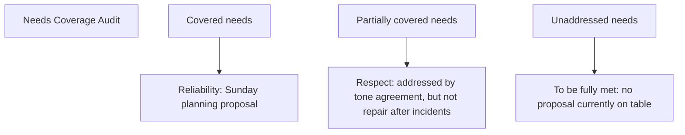

Tone:

- Name gaps honestly.
- Do not imply the gap is a failure.
- Ask whether the user wants to keep exploring or leave the gap named.

### Shared Agreement Outcome

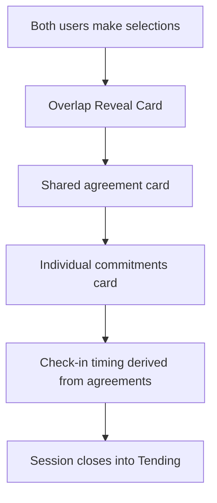

### No-shared-agreement Outcome

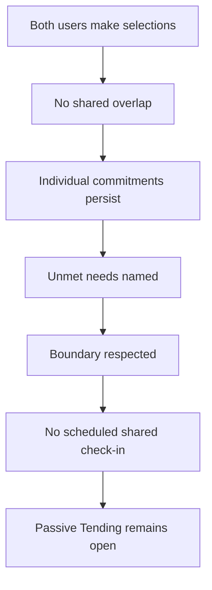

Mockup requirements:

- Show this as a legitimate close state, not an error.
- Avoid copy like "failed to agree."
- Make individual commitments and unmet needs visible enough that the work still feels meaningful.

## Tending Overview

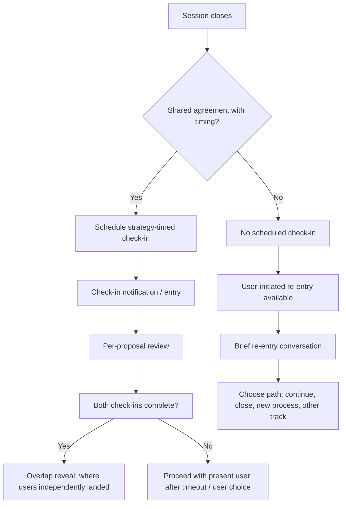

## Tending Re-entry Surface

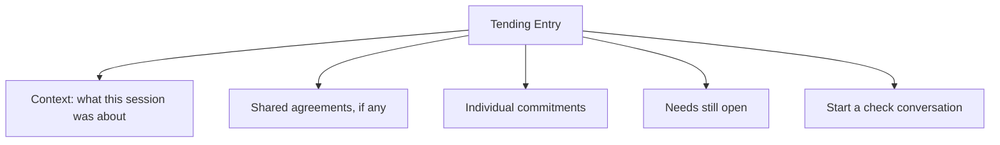

Design questions:

- Is Tending entered from the session detail screen, a notification, or both?
- Does no-agreement Tending show a different header than agreement-based Tending?
- How much of the original session transcript should be visible vs summarized?

## Low-Fidelity Screen States

These sketches show mobile chat-first states. Cards are inline receipts inside the transcript, not standalone forms.

### 1. Stage 3 Needs Summary Card In Chat

State: the user has talked through what matters and the AI is ready to check whether it heard the needs accurately.

```text
+------------------------------------+
| What Matters                  ...  |
+------------------------------------+
| AI                                 |
| I want to pause and reflect back   |
| what I think matters most here.    |
|                                    |
|   +----------------------------+   |
|   | What I hear matters to you |   |
|   |                            |   |
|   | 1. To feel respected       |   |
|   |    "I do not want to feel  |   |
|   |    dismissed in front of   |   |
|   |    the kids."             |   |
|   |                            |   |
|   | 2. To trust plans will     |   |
|   |    hold                    |   |
|   |    "Pickup changing last   |   |
|   |    minute makes me feel    |   |
|   |    like I cannot count on  |   |
|   |    anything."             |   |
|   |                            |   |
|   | Still uncertain            |   |
|   | - Is this respect,         |   |
|   |   reliability, or both?    |   |
|   +----------------------------+   |
|                                    |
| AI                                 |
| Does this feel right, or should we |
| adjust part of it?                 |
|                                    |
| You                                |
| The second one is more about trust.|
|                                    |
| [Message...]                  Send |
+------------------------------------+
```

Behavior notes:

- User revision happens in chat, not by tapping edit rows.
- The refreshed card replaces or follows the previous receipt with a short "Updated" label.
- If the user says "yes," the next AI message asks for consent to share.

### 2. Stage 3 Side-By-Side Reveal Card

State: both users have confirmed their needs summaries and consented to reveal them.

```text
+------------------------------------+
| What Matters                  ...  |
+------------------------------------+
| AI                                 |
| Both of you said these summaries   |
| are ready to share. Here they are  |
| side by side.                      |
|                                    |
|   +----------------------------+   |
|   | Needs on the table         |   |
|   |                            |   |
|   | You          Partner       |   |
|   | -----------  ------------  |   |
|   | To feel      To not feel   |   |
|   | respected    controlled    |   |
|   |                            |   |
|   | To trust     To feel       |   |
|   | plans will   believed when |   |
|   | hold         explaining    |   |
|   +----------------------------+   |
|                                    |
| AI                                 |
| Before we try to solve anything,   |
| what do you notice as you read     |
| both lists?                        |
|                                    |
| [Message...]                  Send |
+------------------------------------+
```

Rules:

- The card does not call anything "shared" yet.
- The AI asks for noticing, not agreement.
- If one user reacts strongly, the chat remains in processing before validation.

### 3. Stage 3 Validation / Not-Valid-Yet Continuation

State: the reveal has happened, but one user cannot yet validate the other person's needs.

```text
+------------------------------------+
| What Matters                  ...  |
+------------------------------------+
| You                                |
| I can see why they wrote it, but I |
| cannot say it feels valid yet.     |
|                                    |
| AI                                 |
| That is okay. We do not need to    |
| force validation. Let's stay with  |
| what makes it hard to acknowledge. |
|                                    |
|   +----------------------------+   |
|   | Validation status          |   |
|   |                            |   |
|   | Your needs                 |   |
|   | - Heard by partner         |   |
|   |                            |   |
|   | Partner's needs            |   |
|   | - Not valid yet            |   |
|   |                            |   |
|   | Current work               |   |
|   | - Understand what gets in  |   |
|   |   the way before moving to |   |
|   |   proposals                |   |
|   +----------------------------+   |
|                                    |
| AI                                 |
| When you read "to not feel         |
| controlled," what feels untrue,    |
| unfair, or hard to make room for?  |
|                                    |
| [Message...]                  Send |
+------------------------------------+
```

Continuation paths:

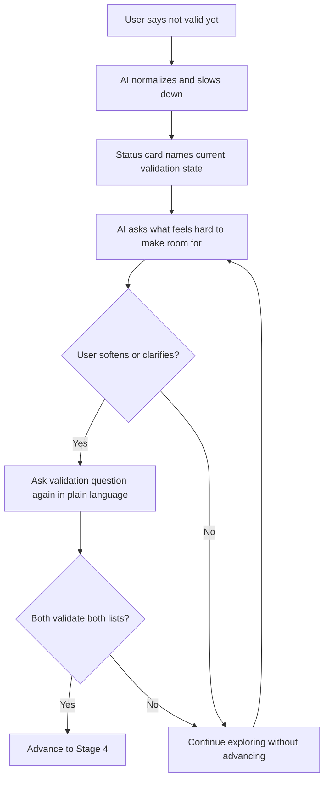

### 4. Stage 4 Proposal Inventory Card

State: the user has named several possible strategies and the AI has organized them into a receipt.

```text
+------------------------------------+
| Agreements                    ...  |
+------------------------------------+
| AI                                 |
| Here is what is currently on the   |
| table. You can add, remove, or     |
| revise any of this in your words.  |
|                                    |
|   +----------------------------+   |
|   | Proposal inventory         |   |
|   |                            |   |
|   | Shared proposals           |   |
|   | 1. Sunday planning for     |   |
|   |    20 minutes              |   |
|   |    Covers: reliability,    |   |
|   |    clarity                 |   |
|   |                            |   |
|   | 2. Text before changing    |   |
|   |    pickup                  |   |
|   |    Covers: trust in plans  |   |
|   |                            |   |
|   | Individual commitments     |   |
|   | - You: say "I need a       |   |
|   |   pause" before leaving    |   |
|   | - Partner: write down      |   |
|   |   schedule changes first   |   |
|   |                            |   |
|   | Not addressed yet          |   |
|   | - Repair after dismissive  |   |
|   |   comments                 |   |
|   +----------------------------+   |
|                                    |
| AI                                 |
| What would you like to keep,       |
| change, or take off the table?     |
|                                    |
| [Message...]                  Send |
+------------------------------------+
```

Example chat edits:

- "Keep Sunday planning, remove the pickup text one."
- "Add that if one of us is late we send a new ETA."
- "I can commit to naming when I need a pause, but I do not want it framed as leaving."

### 5. Stage 4 Needs Coverage Audit Card

State: there are proposals on the table, but the AI checks whether the validated needs from Stage 3 are actually covered.

```text
+------------------------------------+
| Agreements                    ...  |
+------------------------------------+
| AI                                 |
| I want to check the proposals      |
| against the needs you both named.  |
|                                    |
|   +----------------------------+   |
|   | Needs coverage audit       |   |
|   |                            |   |
|   | Covered                    |   |
|   | - Reliability              |   |
|   |   Sunday planning          |   |
|   |                            |   |
|   | Partly covered             |   |
|   | - Feeling respected        |   |
|   |   Tone agreement helps,    |   |
|   |   but repair after         |   |
|   |   incidents is unnamed     |   |
|   |                            |   |
|   | Still open                 |   |
|   | - Feeling believed         |   |
|   |   No current proposal      |   |
|   |   directly addresses this  |   |
|   +----------------------------+   |
|                                    |
| AI                                 |
| Do you want to keep looking for a  |
| proposal around feeling believed,  |
| or leave that gap named for now?   |
|                                    |
| [Message...]                  Send |
+------------------------------------+
```

Behavior notes:

- The audit can appear more than once as proposals change.
- The card must not imply every need has to be solved in one session.
- "Leave it named" is a valid conversational answer.

### 6. Stage 4 Shared-Agreement Outcome

State: both users independently selected at least one shared proposal they are willing to try.

```text
+------------------------------------+
| Agreements                    ...  |
+------------------------------------+
| AI                                 |
| You both independently selected    |
| one proposal you are willing to    |
| try.                               |
|                                    |
|   +----------------------------+   |
|   | Shared agreement           |   |
|   |                            |   |
|   | Try for the next week      |   |
|   | - Sunday planning for      |   |
|   |   20 minutes               |   |
|   |                            |   |
|   | Why it is here             |   |
|   | - Supports reliability     |   |
|   | - Supports clarity         |   |
|   |                            |   |
|   | Individual commitments     |   |
|   | - You: name when you need  |   |
|   |   a pause before leaving   |   |
|   | - Partner: bring schedule  |   |
|   |   changes with a concrete  |   |
|   |   ask                      |   |
|   |                            |   |
|   | Check-in                   |   |
|   | - After the next Sunday    |   |
|   |   planning conversation    |   |
|   +----------------------------+   |
|                                    |
| AI                                 |
| I will bring this back after the   |
| next planned conversation so each  |
| of you can say how it went.        |
|                                    |
| [Close for now]                    |
+------------------------------------+
```

Closing behavior:

- The shared card is the main receipt.
- Individual commitments stay visible, but do not get described as shared agreements.
- The Tending check-in is based on the strategy timing, not a generic reminder.

### 7. Stage 4 No-Shared-Agreement Close State

State: both users made selections, but there is no overlap in shared proposals.

```text
+------------------------------------+
| Agreements                    ...  |
+------------------------------------+
| AI                                 |
| It looks like there is not a       |
| shared proposal you both want to   |
| try right now. We can still close  |
| with what became clearer.          |
|                                    |
|   +----------------------------+   |
|   | Where this session landed  |   |
|   |                            |   |
|   | No shared agreement chosen |   |
|   | - Sunday planning: chosen  |   |
|   |   by you only              |   |
|   | - Daily check-in: chosen   |   |
|   |   by partner only          |   |
|   |                            |   |
|   | Individual commitments     |   |
|   | - You: give a direct       |   |
|   |   heads-up when plans feel |   |
|   |   shaky                    |   |
|   | - Partner: pause before    |   |
|   |   responding defensively   |   |
|   |                            |   |
|   | Needs still open           |   |
|   | - Feeling respected after  |   |
|   |   conflict                 |   |
|   | - Feeling believed when    |   |
|   |   explaining constraints   |   |
|   +----------------------------+   |
|                                    |
| AI                                 |
| Do you want to close here, or name |
| one thing you want to remember     |
| from this before we stop?          |
|                                    |
| [Message...]                  Send |
+------------------------------------+
```

Behavior notes:

- The state is a valid close, not an error or retry screen.
- Passive Tending remains available from the session record.
- There is no scheduled shared check-in unless a timed agreement exists.

### 8. Tending Re-entry Surface

State: the user returns to a past session from history, a notification, or a passive entry point.

```text
+------------------------------------+
| Tending                       ...  |
+------------------------------------+
|   +----------------------------+   |
|   | Last session               |   |
|   |                            |   |
|   | Topic                      |   |
|   | Pickup changes and feeling |   |
|   | dismissed                  |   |
|   |                            |   |
|   | Shared agreements          |   |
|   | - Sunday planning          |   |
|   |                            |   |
|   | Individual commitments     |   |
|   | - You: name when you need  |   |
|   |   a pause                  |   |
|   | - Partner: bring schedule  |   |
|   |   changes with a concrete  |   |
|   |   ask                      |   |
|   |                            |   |
|   | Needs still open           |   |
|   | - Repair after dismissive  |   |
|   |   comments                 |   |
|   +----------------------------+   |
|                                    |
| AI                                 |
| What would be useful today: check  |
| how the agreement went, keep       |
| talking about an open need, or     |
| start a new conversation?          |
|                                    |
| [Check agreement] [Open need]      |
| [New conversation]                 |
|                                    |
| [Message...]                  Send |
+------------------------------------+
```

No-agreement variant:

```text
+------------------------------------+
| Tending                       ...  |
+------------------------------------+
|   +----------------------------+   |
|   | Last session               |   |
|   |                            |   |
|   | No shared agreement was    |   |
|   | chosen                     |   |
|   |                            |   |
|   | What still exists          |   |
|   | - Individual commitments   |   |
|   | - Needs still open         |   |
|   | - The option to continue   |   |
|   |   later                    |   |
|   +----------------------------+   |
|                                    |
| AI                                 |
| Do you want to continue from that  |
| session, close it for now, or      |
| start somewhere else?              |
|                                    |
| [Message...]                  Send |
+------------------------------------+
```

### 9. Strategy-Timed Tending Check-In

State: a shared agreement had an event-based timing, so Tending asks after that strategy should have happened.

```text
+------------------------------------+
| Tending                       ...  |
+------------------------------------+
| AI                                 |
| You planned to try a Sunday        |
| planning conversation. I am        |
| checking in after that window.     |
|                                    |
|   +----------------------------+   |
|   | Check-in: Sunday planning  |   |
|   |                            |   |
|   | Agreement                  |   |
|   | Talk for 20 minutes about  |   |
|   | the coming week            |   |
|   |                            |   |
|   | Needs it was meant to      |   |
|   | support                    |   |
|   | - Reliability              |   |
|   | - Clarity                  |   |
|   |                            |   |
|   | Your reflection            |   |
|   | Not answered yet           |   |
|   |                            |   |
|   | Partner reflection         |   |
|   | Waiting / not shown yet    |   |
|   +----------------------------+   |
|                                    |
| AI                                 |
| Did the planning conversation      |
| happen? If it did, what changed or |
| did not change for you?            |
|                                    |
| [Message...]                  Send |
+------------------------------------+
```

After both users answer:

```text
+------------------------------------+
| Tending                       ...  |
+------------------------------------+
| AI                                 |
| Both check-ins are in. Here is     |
| where you each landed.             |
|                                    |
|   +----------------------------+   |
|   | Check-in reveal            |   |
|   |                            |   |
|   | You                        |   |
|   | - It happened              |   |
|   | - Helped reliability a     |   |
|   |   little                   |   |
|   | - Still need repair after  |   |
|   |   tone                     |   |
|   |                            |   |
|   | Partner                    |   |
|   | - It happened              |   |
|   | - Helped clarity           |   |
|   | - Felt tense at the start  |   |
|   +----------------------------+   |
|                                    |
| AI                                 |
| What do you want to do with this:  |
| keep the agreement, revise it, or  |
| talk about what remained hard?     |
|                                    |
| [Message...]                  Send |
+------------------------------------+
```
