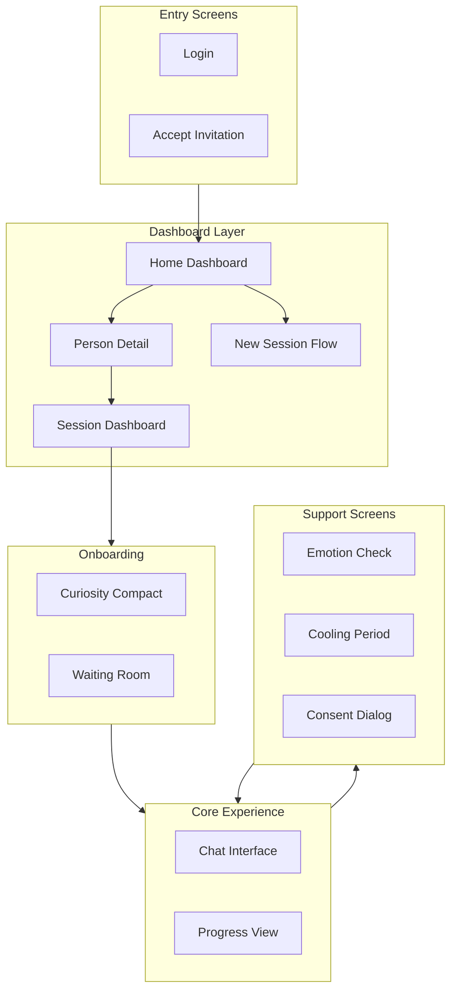

# Wireframes

UI concepts and screen layouts for key Meet Without Fear interfaces.

## Documents

### Navigation & Session Surfaces
- **[Person Detail](./person-detail.md)** - Relationship view with session history (primary landing)
- **[New Session Flow](./new-session-flow.md)** - Invitation and session creation

### Core Experience
- **[Chat Interface](./chat-interface.md)** - The primary `UnifiedSessionScreen` — chat + inline stage cards + integrated barometer

### Inner Work (solo reflection)
The mobile app ships an Inner Work hub alongside partner sessions. These surfaces don't have dedicated wireframe pages yet; refer to the components directly:
- `InnerWorkHubScreen` — list of private Inner Work sessions + quick-entry practices
- `InnerThoughtsScreen` — chat for solo reflection (can link a partner session)
- `GratitudeScreen` — "See the Positive" journaling practice
- `MeditationScreen` — guided + AI-generated meditation sessions
- `NeedsAssessmentScreen` — "Am I OK?" self-assessment across the 19-need catalog
- `KnowledgeBaseIndexScreen` / `KnowledgeBaseTopicScreen` — browse reflections by topic, person, theme

> Some previously listed wireframes (Home Dashboard with hero card, Stage Controls, standalone Emotional Barometer UI, Authentication & First-Run, Notifications UX) don't correspond to screens that currently exist — the app consolidates stage UI inside `UnifiedSessionScreen`, and auth is handled entirely by the Clerk-provided UI. Those pages are omitted from this index rather than pointing at missing docs.

## Design Principles

| Principle | Rationale |
|-----------|-----------|
| Minimalist | Reduce cognitive load during emotional work |
| Typing indicators surface waiting state | Ghost-dots in both partner chat and Inner Thoughts signal "AI is responding", derived from cache — they're part of the UX, not avoided |
| Stage-controlled | `UnifiedSessionScreen` swaps inline cards + overlays per stage; stage labels come from `STAGE_FRIENDLY_NAMES` (e.g., Stage 3 = "What Matters Most", Stage 4 = "Moving Forward Together") |
| Integrated safety surfacing | Barometer readings ≥9 auto-open the `support-options` overlay |
| Calm aesthetic | Support emotional regulation |
| Clear boundaries | Visual separation of private/shared content; chapter markers in the timeline mark stage transitions |

## Screen Overview

---

[Back to Plans](../index.md)
