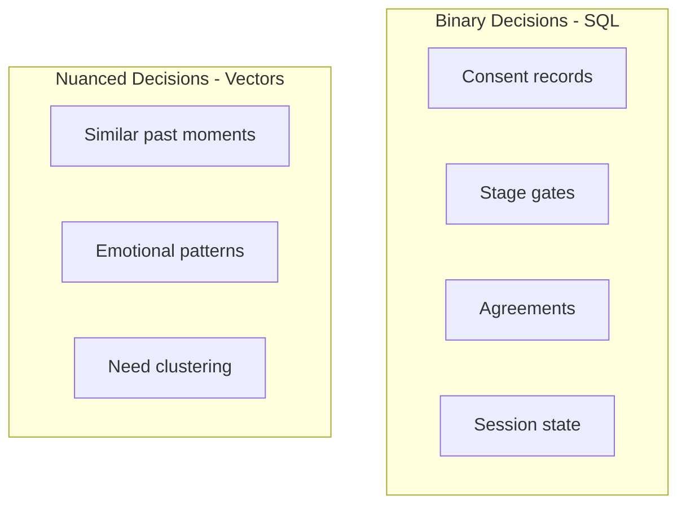

# Data Model

Database design implementing the [Vessel Architecture](../../privacy/vessel-model.md) with PostgreSQL and pgvector.

## Documents

### [Prisma Schema](./prisma-schema.md)
Complete database schema with dual SQL/Vector strategy

### User Vessel (coming soon)
Private user data implementation details

### Shared Vessel (coming soon)
Consensual shared data implementation details

### AI Synthesis (coming soon)
Ephemeral synthesis with regeneration strategy

## Quick Reference: Three Vessels

| Vessel | Storage Strategy | Access Pattern |
|--------|-----------------|----------------|
| User Vessel | SQL (structured) + pgvector (embeddings) | User + AI only |
| AI Synthesis | Ephemeral + regenerated | AI only |
| Shared Vessel | SQL (permanent record) | Both users + AI |

## Dual-Layer Data Strategy

[Back to Backend](../index.md)
