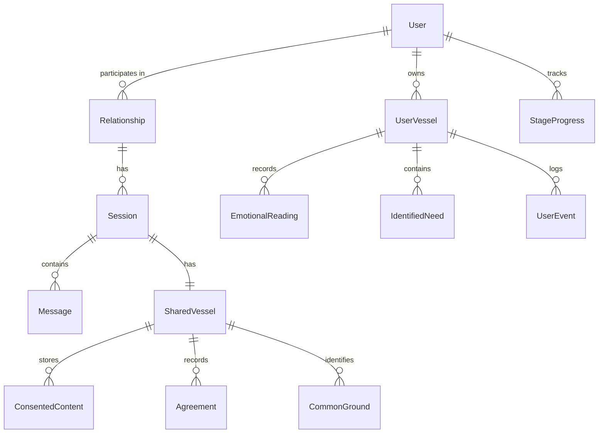

# Prisma Schema

Complete database schema implementing the [Vessel Architecture](../../privacy/vessel-model.md).

## Schema Overview



## Core Models

### User

```prisma
model User {
  id            String   @id @default(cuid())
  email         String   @unique
  name          String?
  createdAt     DateTime @default(now())
  updatedAt     DateTime @updatedAt

  // Relationships
  relationships RelationshipMember[]
  vessels       UserVessel[]
  stageProgress StageProgress[]
  messages      Message[]
  consents      ConsentRecord[]
}
```

### Relationship

```prisma
model Relationship {
  id        String   @id @default(cuid())
  createdAt DateTime @default(now())
  updatedAt DateTime @updatedAt

  // Members (exactly 2 for BeHeard)
  members  RelationshipMember[]
  sessions Session[]
}

model RelationshipMember {
  id             String       @id @default(cuid())
  relationship   Relationship @relation(fields: [relationshipId], references: [id])
  relationshipId String
  user           User         @relation(fields: [userId], references: [id])
  userId         String
  joinedAt       DateTime     @default(now())
  role           String       @default("member")

  @@unique([relationshipId, userId])
}
```

### Session

```prisma
model Session {
  id             String        @id @default(cuid())
  relationship   Relationship  @relation(fields: [relationshipId], references: [id])
  relationshipId String
  status         SessionStatus @default(CREATED)
  createdAt      DateTime      @default(now())
  updatedAt      DateTime      @updatedAt
  resolvedAt     DateTime?

  // Related entities
  messages      Message[]
  sharedVessel  SharedVessel?
  stageProgress StageProgress[]
  userVessels   UserVessel[]
}

enum SessionStatus {
  CREATED     // Invitation sent
  INVITED     // Partner invited, awaiting join
  ACTIVE      // Both users engaged
  PAUSED      // Cooling period
  WAITING     // One user ahead, waiting for other
  RESOLVED    // Process completed
  ABANDONED   // Timeout or withdrawal
}
```

### Stage Tracking: No Session.currentStage

**Important**: We intentionally do NOT have a `Session.currentStage` field.

Why? During stages 1-3, users progress independently. A single `currentStage` would be ambiguous (whose stage?).

**Rule**: Each user's stage is derived from `StageProgress`:

```typescript
// Get a user's current stage
const userStage = await prisma.stageProgress.findFirst({
  where: { sessionId, userId, status: { in: ['IN_PROGRESS', 'GATE_PENDING'] } },
  orderBy: { stage: 'desc' }
});

// Get the "shared visibility level" (min of both users)
const bothProgress = await prisma.stageProgress.findMany({
  where: { sessionId, status: 'COMPLETED' }
});
const sharedStage = Math.min(
  ...Object.values(groupByUser(bothProgress)).map(p => Math.max(...p.map(s => s.stage)))
);
```

**Authorization Rule**: Always key off `StageProgress`, never a session-level stage field.

## User Vessel (Private Data)

### UserVessel

```prisma
model UserVessel {
  id        String   @id @default(cuid())
  user      User     @relation(fields: [userId], references: [id])
  userId    String
  session   Session  @relation(fields: [sessionId], references: [id])
  sessionId String
  createdAt DateTime @default(now())
  updatedAt DateTime @updatedAt

  // Private content
  events           UserEvent[]
  emotionalReadings EmotionalReading[]
  identifiedNeeds  IdentifiedNeed[]
  boundaries       Boundary[]
  documents        UserDocument[]

  // Embedding for semantic search within user's own content
  embedding        Unsupported("vector(1536)")?

  @@unique([userId, sessionId])
}
```

### UserEvent

```prisma
model UserEvent {
  id            String     @id @default(cuid())
  vessel        UserVessel @relation(fields: [vesselId], references: [id])
  vesselId      String
  description   String     @db.Text
  attributedTo  Attribution
  emotions      String[]
  timestamp     DateTime   @default(now())

  // Embedding for semantic search
  embedding     Unsupported("vector(1536)")?

  // Compound index for retrieval pattern (vesselId + timestamp)
  // Critical: retrieval contracts often limit by recency
  @@index([vesselId, timestamp])
}

enum Attribution {
  SELF
  OTHER
  MUTUAL
  EXTERNAL
}
```

### EmotionalReading

```prisma
model EmotionalReading {
  id        String     @id @default(cuid())
  vessel    UserVessel @relation(fields: [vesselId], references: [id])
  vesselId  String
  intensity Int        // 1-10 scale
  context   String?    @db.Text
  stage     Int        // Stage when reading was taken
  timestamp DateTime   @default(now())

  @@index([vesselId, timestamp])
}
```

### IdentifiedNeed

```prisma
model IdentifiedNeed {
  id          String     @id @default(cuid())
  vessel      UserVessel @relation(fields: [vesselId], references: [id])
  vesselId    String
  need        String     // From universal needs taxonomy
  category    NeedCategory
  evidence    String[]   // Quotes/references supporting this need
  confirmed   Boolean    @default(false) // User confirmed this need
  aiConfidence Float     // AI confidence in identification
  createdAt   DateTime   @default(now())

  // Link to shared version if consented
  consentedContent ConsentedContent?

  @@index([vesselId])
}

enum NeedCategory {
  SAFETY
  CONNECTION
  AUTONOMY
  RECOGNITION
  MEANING
  FAIRNESS
}
```

### Boundary

```prisma
model Boundary {
  id            String     @id @default(cuid())
  vessel        UserVessel @relation(fields: [vesselId], references: [id])
  vesselId      String
  description   String     @db.Text
  nonNegotiable Boolean    @default(false)
  createdAt     DateTime   @default(now())

  @@index([vesselId])
}
```

## Shared Vessel (Consensual Data)

### SharedVessel

```prisma
model SharedVessel {
  id        String   @id @default(cuid())
  session   Session  @relation(fields: [sessionId], references: [id])
  sessionId String   @unique
  createdAt DateTime @default(now())
  updatedAt DateTime @updatedAt

  // Shared content
  consentedContent ConsentedContent[]
  commonGround     CommonGround[]
  agreements       Agreement[]
}
```

### ConsentedContent

```prisma
model ConsentedContent {
  id                 String       @id @default(cuid())
  sharedVessel       SharedVessel @relation(fields: [sharedVesselId], references: [id])
  sharedVesselId     String
  sourceUser         User         @relation(fields: [sourceUserId], references: [id])
  sourceUserId       String
  originalNeed       IdentifiedNeed? @relation(fields: [originalNeedId], references: [id])
  originalNeedId     String?      @unique
  transformedContent String       @db.Text // Heat removed, need preserved
  consentedAt        DateTime     @default(now())
  consentActive      Boolean      @default(true)
  revokedAt          DateTime?

  // Link to consent record for audit
  consentRecord      ConsentRecord @relation(fields: [consentRecordId], references: [id])
  consentRecordId    String

  @@index([sharedVesselId])
}
```

### CommonGround

```prisma
model CommonGround {
  id             String       @id @default(cuid())
  sharedVessel   SharedVessel @relation(fields: [sharedVesselId], references: [id])
  sharedVesselId String
  need           String
  category       NeedCategory
  confirmedByA   Boolean      @default(false)
  confirmedByB   Boolean      @default(false)
  confirmedAt    DateTime?

  @@index([sharedVesselId])
}
```

### Agreement

```prisma
model Agreement {
  id             String          @id @default(cuid())
  sharedVessel   SharedVessel    @relation(fields: [sharedVesselId], references: [id])
  sharedVesselId String
  description    String          @db.Text
  type           AgreementType
  status         AgreementStatus @default(PROPOSED)
  agreedByA      Boolean         @default(false)
  agreedByB      Boolean         @default(false)
  agreedAt       DateTime?
  followUpDate   DateTime?
  completedAt    DateTime?

  @@index([sharedVesselId])
}

enum AgreementType {
  MICRO_EXPERIMENT  // Small, reversible action
  COMMITMENT        // Longer-term agreement
  CHECK_IN          // Scheduled follow-up
}

enum AgreementStatus {
  PROPOSED
  AGREED
  IN_PROGRESS
  COMPLETED
  ABANDONED
}
```

## Consent Management

### ConsentRecord

```prisma
model ConsentRecord {
  id           String        @id @default(cuid())
  user         User          @relation(fields: [userId], references: [id])
  userId       String
  contentType  ConsentContentType
  decision     ConsentDecision
  decidedAt    DateTime      @default(now())
  revokedAt    DateTime?
  metadata     Json?         // Additional context

  // Link to resulting shared content
  consentedContent ConsentedContent[]

  @@index([userId, decidedAt])
}

enum ConsentContentType {
  IDENTIFIED_NEED
  EVENT_SUMMARY
  EMOTIONAL_PATTERN
  BOUNDARY
}

enum ConsentDecision {
  GRANTED
  DENIED
  REVOKED
}
```

## Stage Progress

### StageProgress

```prisma
model StageProgress {
  id        String   @id @default(cuid())
  session   Session  @relation(fields: [sessionId], references: [id])
  sessionId String
  user      User     @relation(fields: [userId], references: [id])
  userId    String
  stage     Int
  status    StageStatus @default(IN_PROGRESS)
  startedAt DateTime @default(now())
  completedAt DateTime?

  // Gate satisfaction tracking
  gatesSatisfied Json? // Stage-specific gate conditions

  // Synthesis cache invalidation
  // When user edits/deletes content, set to true
  // AI regenerates synthesis on next read if dirty
  isSynthesisDirty Boolean @default(true)
  synthesisLastUpdated DateTime?

  @@unique([sessionId, userId, stage])
  @@index([sessionId])
}

enum StageStatus {
  NOT_STARTED
  IN_PROGRESS
  GATE_PENDING   // Requirements met, awaiting partner
  COMPLETED
}
```

### Synthesis Invalidation Strategy

The "Dirty Flag" pattern avoids expensive regeneration on every read:

```typescript
// When user modifies content
await prisma.userEvent.update({ ... });
await prisma.stageProgress.update({
  where: { sessionId_userId_stage: { sessionId, userId, stage } },
  data: { isSynthesisDirty: true }
});

// When AI needs synthesis
const progress = await prisma.stageProgress.findUnique({ ... });
if (progress.isSynthesisDirty) {
  const synthesis = await regenerateSynthesis(sessionId, userId, stage);
  await prisma.stageProgress.update({
    where: { id: progress.id },
    data: {
      isSynthesisDirty: false,
      synthesisLastUpdated: new Date()
    }
  });
  return synthesis;
} else {
  return getCachedSynthesis(sessionId, userId, stage);
}
```

## Messages

### Message

```prisma
model Message {
  id        String      @id @default(cuid())
  session   Session     @relation(fields: [sessionId], references: [id])
  sessionId String
  sender    User?       @relation(fields: [senderId], references: [id])
  senderId  String?     // null for AI messages
  role      MessageRole
  content   String      @db.Text
  stage     Int
  timestamp DateTime    @default(now())

  // Embedding for semantic search
  embedding Unsupported("vector(1536)")?

  // Extracted memory references
  extractedNeeds String[]
  extractedEmotions String[]

  @@index([sessionId, timestamp])
}

enum MessageRole {
  USER
  AI
  SYSTEM
}
```

## Global Library (Stage 4 Suggestions)

### GlobalLibraryItem

Anonymized micro-experiment suggestions for Stage 4. See [Stage 4 Global Library Invariants](../state-machine/retrieval-contracts.md#global-library-invariants).

```prisma
model GlobalLibraryItem {
  id          String   @id @default(cuid())
  title       String
  description String   @db.Text
  category    String   // e.g., "communication", "quality-time", "conflict-resolution"
  source      GlobalLibrarySource
  createdAt   DateTime @default(now())
  updatedAt   DateTime @updatedAt

  // Embedding for semantic search
  embedding   Unsupported("vector(1536)")?

  // For user-contributed items only
  contributedBy    String?  // User ID if contributed (anonymized in results)
  contributionConsent DateTime? // When user consented to anonymized contribution

  @@index([category])
}

enum GlobalLibrarySource {
  CURATED       // Admin/expert authored
  CONTRIBUTED   // User-contributed with explicit consent
}
```

**Invariants enforced by this model:**
- `CURATED` items have no `contributedBy` - they are admin-authored
- `CONTRIBUTED` items require both `contributedBy` AND `contributionConsent`
- Embeddings for `CONTRIBUTED` items are generated from the anonymized description only, never from the original user content

## System Actors

### AI System Access

The AI does NOT have a special user ID with blanket access. Instead, RLS uses three locals:

- `app.actor_id` - The user being served (not an AI ID)
- `app.actor_role` - Set to `'ai'` when AI is querying
- `app.current_session_id` - The specific session being processed

This means:
- AI can only access the specific user's data it is currently serving
- AI can only access within the specific session context
- RLS enforces this at the database level, not just app layer

See [Architecture: RLS Middleware](../overview/architecture.md#row-level-security-rls) for the full implementation pattern.

## pgvector Configuration

### Enabling Vector Search

```sql
-- Enable the pgvector extension
CREATE EXTENSION IF NOT EXISTS vector;

-- Create index for similarity search on user events
CREATE INDEX user_event_embedding_idx ON "UserEvent"
USING ivfflat (embedding vector_cosine_ops)
WITH (lists = 100);

-- Create index for message embeddings
CREATE INDEX message_embedding_idx ON "Message"
USING ivfflat (embedding vector_cosine_ops)
WITH (lists = 100);
```

### Similarity Search Example

```sql
-- Find similar past events for a user (Stage 1 context)
SELECT id, description, 1 - (embedding <=> $1) as similarity
FROM "UserEvent"
WHERE "vesselId" = $2
ORDER BY embedding <=> $1
LIMIT 5;
```

## Data Access Patterns

### Binary Decisions (SQL)

```typescript
// Check if user can advance to next stage
const canAdvance = await prisma.stageProgress.findFirst({
  where: {
    sessionId,
    userId,
    stage: currentStage,
    status: 'COMPLETED'
  }
});

// Check consent status
const hasConsent = await prisma.consentRecord.findFirst({
  where: {
    userId,
    contentType: 'IDENTIFIED_NEED',
    decision: 'GRANTED',
    revokedAt: null
  }
});
```

### Nuanced Decisions (Vectors)

```typescript
// Find similar emotional moments (internal grounding)
const similarMoments = await prisma.$queryRaw`
  SELECT id, description, intensity
  FROM "EmotionalReading" er
  JOIN "UserVessel" uv ON er."vesselId" = uv.id
  WHERE uv."userId" = ${userId}
    AND 1 - (er.embedding <=> ${currentEmbedding}) > 0.8
  ORDER BY er.timestamp DESC
  LIMIT 3
`;
```

## Related Documentation

- [Vessel Model](../../privacy/vessel-model.md) - Conceptual privacy architecture
- [Retrieval Contracts](../state-machine/retrieval-contracts.md) - Stage-scoped access rules
- [Architecture](../overview/architecture.md) - System architecture

[Back to Data Model](./index.md) | [Back to Backend](../index.md)
