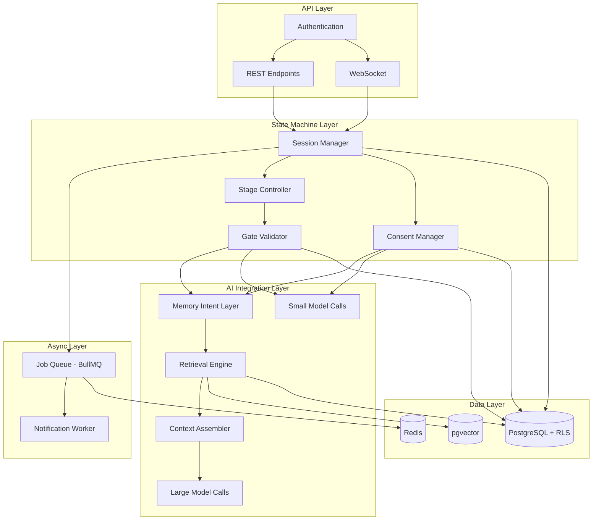
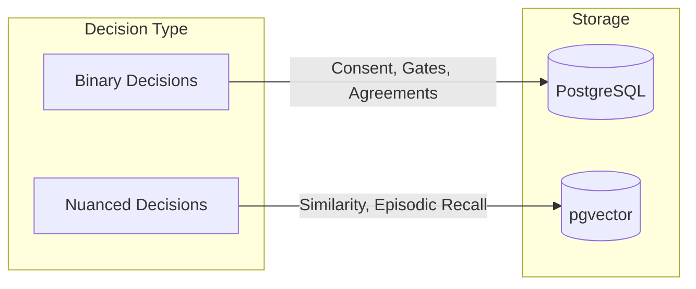
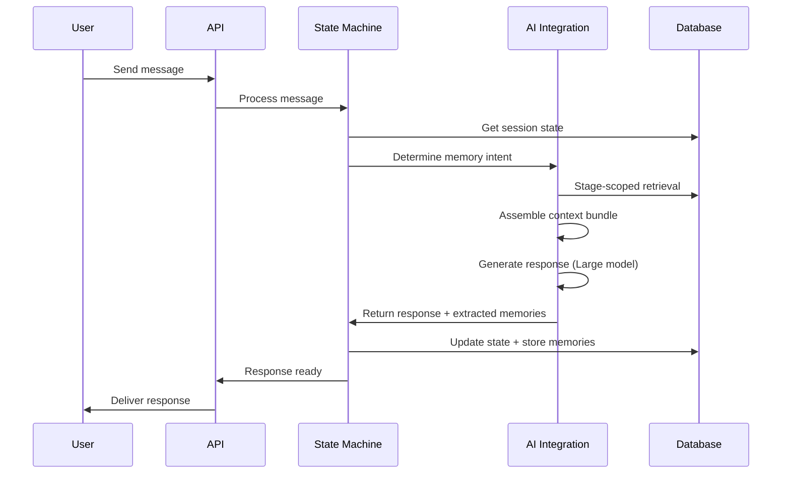

# System Architecture

BeHeard is built as a **Finite State Machine with Typed Memory Objects and Role-segmented Models**.

## Core Mental Model

```
FSM (Session States) + Typed Memory (Vessels) + Model Stratification (Small/Large)
```

This is fundamentally different from a chatbot architecture. The system enforces process, not conversation.

## Three-Layer Architecture



## Layer Responsibilities

### API Layer

| Component | Responsibility |
|-----------|----------------|
| REST Endpoints | CRUD operations, session management, user actions |
| WebSocket | Real-time updates for Stage 0 and Stage 4 coordination |
| Authentication | JWT tokens, user identity, relationship membership |

### State Machine Layer

| Component | Responsibility |
|-----------|----------------|
| Session Manager | Lifecycle states (Created, Active, Paused, Resolved) |
| Stage Controller | Stage transitions, parallel vs sequential handling |
| Gate Validator | Advancement condition checking per stage |
| Consent Manager | Request, approve, deny, revoke consent flows |

### AI Integration Layer

| Component | Responsibility |
|-----------|----------------|
| Memory Intent Layer | Determines what kind of remembering is appropriate |
| Retrieval Engine | Stage-scoped data access following contracts |
| Context Assembler | Builds pre-assembled bundles for Large model |
| Small Model | Mechanics (classification, detection, planning) |
| Large Model | Empathetic response generation |

### Async Layer (Airlock Queue)

| Component | Responsibility |
|-----------|----------------|
| Job Queue (BullMQ) | Handles async operations when users are offline |
| Notification Worker | Sends push notifications, emails for stage events |
| Redis | Queue persistence and job state |

**Why an Airlock is Required:**

When User A completes Stage 1, User B might be offline. The Session Manager cannot just update state; it must enqueue a `notify_partner` job. This decouples:
- State transition (fast, synchronous)
- Notification logic (slow, external, may fail)

```typescript
// When User A completes a stage
await prisma.stageProgress.update({ ... });

// Enqueue notification - don't wait for delivery
await notificationQueue.add('stage_complete', {
  sessionId,
  userId: partnerUserId,
  stage: completedStage,
  type: 'partner_ready',
});
```

## Row-Level Security (RLS)

BeHeard uses Postgres RLS to enforce vessel isolation at the database level.

### The Prisma + RLS Challenge

Prisma connects as a single app user, which bypasses RLS by default. We solve this with **Interactive Transactions with Local Settings**.

### RLS Middleware Pattern

Every query sets three locals for RLS evaluation:

```typescript
type ActorRole = 'user' | 'ai' | 'admin';

// Middleware wraps every Prisma query
async function withRLS<T>(
  actorId: string,
  actorRole: ActorRole,
  sessionId: string | null,
  operation: (tx: PrismaClient) => Promise<T>
): Promise<T> {
  return prisma.$transaction(async (tx) => {
    // Always set all three locals - use empty string for null to fail closed
    await tx.$executeRaw`SET LOCAL app.actor_id = ${actorId}`;
    await tx.$executeRaw`SET LOCAL app.actor_role = ${actorRole}`;
    await tx.$executeRaw`SET LOCAL app.current_session_id = ${sessionId ?? ''}`;

    // Now run the actual query - RLS policies will apply
    return operation(tx);
  });
}

// User query - scoped to their own vessels (keyed by userId, not vesselId)
const userEvents = await withRLS(currentUserId, 'user', null, async (tx) => {
  return tx.userEvent.findMany({
    where: { vessel: { userId: currentUserId } }
  });
});

// AI query - scoped to specific session + user being served
// Key by (sessionId, userId), let DB join to vessel - avoids vesselId foot-gun
const aiContext = await withRLS(targetUserId, 'ai', sessionId, async (tx) => {
  return tx.userEvent.findMany({
    where: { vessel: { sessionId, userId: targetUserId } }
  });
});
```

### AI System Actor (Session-Scoped Access)

The AI does NOT get blanket read access. RLS enforces that AI can only access:
- The specific user's data it is currently serving
- Within the specific session it is processing

```sql
-- RLS policy for UserEvent (strict session-scoped AI access)
CREATE POLICY user_event_access ON "UserEvent"
FOR SELECT
USING (
  -- User access: only their own vessels
  (
    current_setting('app.actor_role', true) = 'user'
    AND "vesselId" IN (
      SELECT id FROM "UserVessel"
      WHERE "userId" = current_setting('app.actor_id', true)
    )
  )
  OR
  -- AI access: only within explicit scoped session context
  (
    current_setting('app.actor_role', true) = 'ai'
    -- Require non-null AND non-empty session ID (fail closed)
    AND NULLIF(current_setting('app.current_session_id', true), '') IS NOT NULL
    AND "vesselId" IN (
      SELECT uv.id FROM "UserVessel" uv
      WHERE uv."sessionId" = current_setting('app.current_session_id', true)
        -- AI can only access the user it is currently serving
        AND uv."userId" = current_setting('app.actor_id', true)
    )
  )
);
```

**Critical**: This keeps "RLS is truth" true. The AI cannot access partner data even if app-layer validation fails - the database enforces it.

**Future hardening note**: If DB-level stage enforcement is needed later, add `app.current_stage` and `app.user_stage_status` locals. Currently stage enforcement is in the app layer via retrieval contracts.

## Dual-Layer Data Strategy



### When to Use SQL (Deterministic)

- **Consent decisions**: Has user X consented to share item Y?
- **Stage gates**: Has user completed Stage 1 requirements?
- **Agreements**: What micro-experiments were agreed upon?
- **Session state**: What stage is each user in?
- **Audit trails**: When was consent granted/revoked?

### When to Use Vectors (Semantic)

- **Episodic recall**: Find similar past moments in this relationship
- **Emotional pattern matching**: When has user felt this way before?
- **Need clustering**: Group similar expressed needs
- **Internal grounding**: Support AI synthesis with evidence

**Critical Rule**: If something can affect trust, it must not rely on similarity search alone.

## Model Stratification

### Small Model (frequent, auditable)

Used for mechanics that require speed and consistency:

```typescript
// Example small model calls
await classifyStage(userMessage);           // Stage classification
await detectMirrorIntervention(userMessage); // Attack/judgment detection
await analyzeBarometerTrend(readings);       // Emotional intensity analysis
await planRetrieval(context);                // What to retrieve
await extractMemoryObjects(conversation);    // Memory extraction candidates
```

### Large Model (once per turn)

Used for empathetic, nuanced responses:

```typescript
// Example large model call - receives pre-assembled context
const response = await generateFacilitationResponse({
  stage: currentStage,
  userMessage: message,
  memoryContext: assembledContext,  // Pre-built, not model-decided
  constraints: stageConstraints,
});
```

**Important**: The large model receives a pre-assembled context bundle. It does not decide what to retrieve.

## Request Flow Example



## Related Documentation

- [Mental Model](./mental-model.md) - Why this architecture was chosen
- [Retrieval Contracts](../state-machine/retrieval-contracts.md) - Stage-scoped data access rules
- [Prisma Schema](../data-model/prisma-schema.md) - Database implementation

[Back to Overview](./index.md) | [Back to Backend](../index.md)
