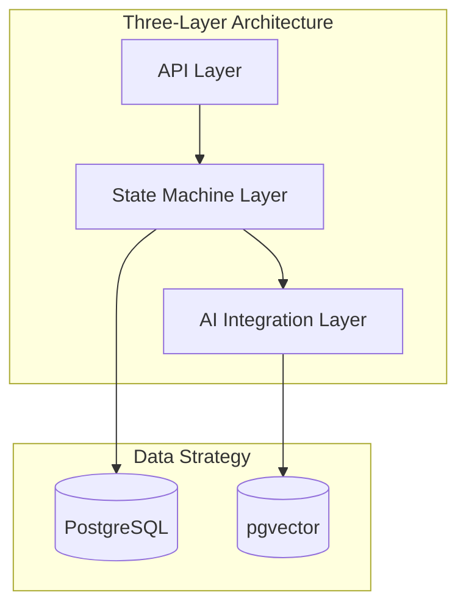

# Backend Overview

High-level architecture and design philosophy for the BeHeard backend.

## Documents

### [Architecture](./architecture.md)
Three-layer architecture, FSM mental model, and system flow diagrams

### [Mental Model](./mental-model.md)
Why BeHeard is NOT a chatbot - Process Guardian role explained

### Turn Lifecycle (coming soon)
Complete diagram of user turn processing

## Quick Reference

[Back to Backend](../index.md)
