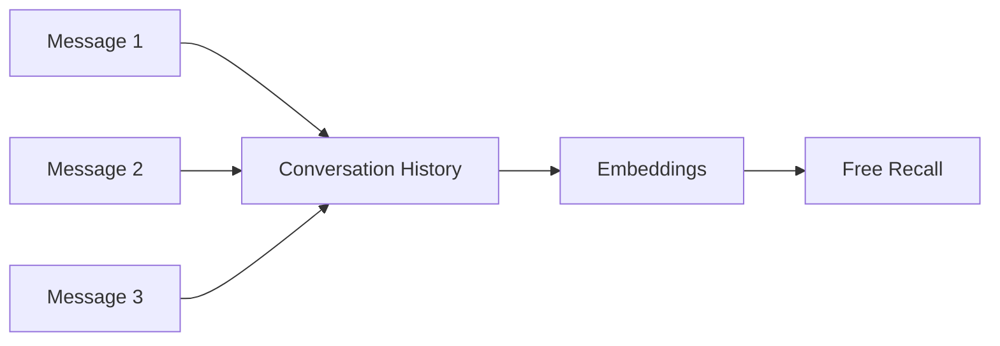
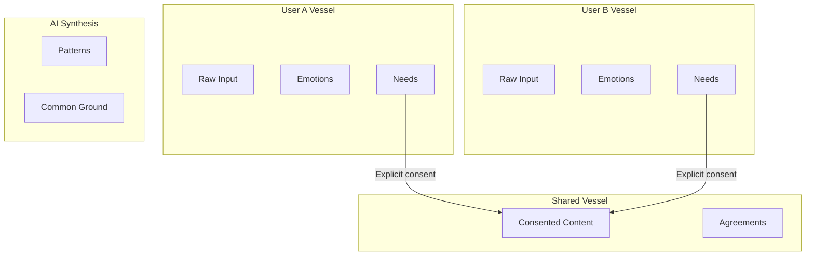

# Mental Model: Process Guardian, Not Chatbot

This document explains why BeHeard requires a fundamentally different architecture than typical LLM applications.

## What BeHeard Is NOT

### Not a Conversational Chatbot

```
WRONG: User → AI → Response → History → Recall
```

Chatbots maintain conversation history and use it freely for context. BeHeard cannot do this because:

- Partner A's venting must never leak to Partner B
- Consent is required before any sharing
- Different stages have different data access rules

### Not a Generic AI Therapist

```
WRONG: User → AI with empathy → Therapeutic response
```

AI therapists guide individual healing. BeHeard facilitates mutual understanding between two people with strict privacy boundaries.

### Not a Simple RAG System

```
WRONG: Query → Vector search → Retrieved context → Response
```

RAG systems retrieve based on similarity. BeHeard cannot rely on similarity for trust-affecting decisions.

## What BeHeard IS

### A Stateful Stage-Gated Facilitation Engine

```
RIGHT: Input → Stage Context → Scoped Retrieval → Assembled Context → Facilitated Response
```

The AI acts as a **Process Guardian** that:

1. Knows which stage each user is in
2. Enforces what data can be accessed
3. Facilitates according to stage-specific protocols
4. Never decides on its own what to remember or share

## Memory is NOT Conversation History

### Chatbot Memory Model (Wrong for BeHeard)



### BeHeard Memory Model (Correct)



Memory in BeHeard is:

| Property | Description |
|----------|-------------|
| **Typed** | Specific object structures (Need, Emotion, Agreement) |
| **Scoped** | Belongs to User Vessel, Shared Vessel, or AI Synthesis |
| **Gated** | Access controlled by stage and consent |

## Vector Search: Support Tool, Not Backbone

### Where Vector Search IS Appropriate

- Finding similar past moments within the same relationship
- Detecting patterns in emotional expression over time
- Internal AI synthesis (never directly exposed to users)
- Stage 4 follow-ups referencing earlier insights

### Where Vector Search MUST NOT Be Used

| Use Case | Why SQL Instead |
|----------|-----------------|
| Consent decisions | Must be deterministic binary result |
| Stage gate validation | Must be auditable boolean logic |
| Recalling agreements | Trust requires exact records |
| Partner data access | Consent status is binary |

**Rule**: If it affects trust, use SQL.

## The Process Guardian Role

The AI in BeHeard is not a participant in the conflict. It is a Process Guardian that:

### 1. Witnesses Without Judgment

In Stage 1, the AI reflects back what it hears without:
- Offering solutions
- Taking sides
- Revealing anything to the partner

### 2. Guides Without Steering

In Stage 2, the AI helps users build empathy by:
- Asking questions, not providing answers
- Detecting judgment and redirecting to curiosity
- Never revealing partner's raw content

### 3. Maps Without Prescribing

In Stage 3, the AI helps identify needs by:
- Translating complaints to universal needs
- Finding common ground
- Not telling users what they should want

### 4. Facilitates Without Deciding

In Stage 4, the AI helps design experiments by:
- Presenting options without attribution
- Revealing overlap in preferences
- Not prescribing specific actions

## Two-Stage Retrieval Pattern

When the AI needs to reference past content:

### Stage 1: Coarse Retrieval (Scoped)

```sql
-- What prior episodes might be relevant?
SELECT episode_id FROM episodes
WHERE relationship_id = ?
  AND stage IN (allowed_stages_for_current_stage)
  AND (user_id = ? OR consent_given = true)
```

### Stage 2: Deterministic Expansion

```sql
-- Pull exact content for grounding
SELECT message_content, memory_objects
FROM messages
WHERE episode_id IN (retrieved_episode_ids)
ORDER BY created_at
```

The final response is grounded in excerpts, but phrased gently:

> "Earlier you shared that you sometimes feel overlooked..."

If the AI says "Earlier you shared...", it must be traceable to source.

## Memory Intent Layer

Before any retrieval, the system answers:

> "What kind of remembering is appropriate right now?"

### Intent Types

| Intent | When Used | Retrieval Depth |
|--------|-----------|-----------------|
| Emotional Validation | User expressing current feelings | Minimal - stay present |
| Stage Enforcement | User trying to skip ahead | None - enforce rules |
| Recall Commitment | Referencing agreed experiment | Full - exact records |
| Offer Continuity | Starting new session | Light - last session summary |
| Avoid Recall | User in distress | None - focus on safety |

This prevents:
- Over-recalling (feeling like surveillance)
- Inappropriate context injection
- Retraumatization from past content

## AI Synthesis: Regenerable, Not Canonical

The AI Synthesis Map (patterns, common ground, progress) is:

```
STORED: Inputs (events, needs, confirmations)
REGENERATED: Synthesis when needed
CACHED: Short-term for latency
```

This approach:
- Avoids privacy leakage
- Prevents drift from user's actual statements
- Supports clean consent revocation

## Summary

| Chatbot Approach | BeHeard Approach |
|------------------|------------------|
| Free conversation history | Typed, scoped, gated memory |
| Vector search for recall | SQL for trust, vectors for support |
| AI decides what to remember | System decides based on stage rules |
| One context for all | Stage-scoped retrieval contracts |
| AI as conversational partner | AI as Process Guardian |

## Related Documentation

- [Architecture](./architecture.md) - Technical implementation
- [Retrieval Contracts](../state-machine/retrieval-contracts.md) - Per-stage access rules
- [Vessel Model](../../privacy/vessel-model.md) - Privacy architecture concepts

[Back to Overview](./index.md) | [Back to Backend](../index.md)
