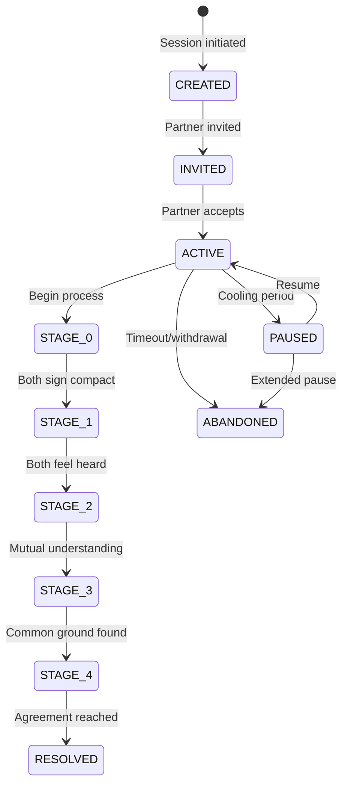

# State Machine

Session lifecycle management and stage-scoped data access rules.

## Documents

### Session States (coming soon)
Session lifecycle FSM with state transitions

### Stage Gates (coming soon)
Advancement conditions linked to stage documentation

### [Retrieval Contracts](./retrieval-contracts.md)
**Critical** - Per-stage data access rules that enforce privacy

## Core Concept

The State Machine Layer enforces:

1. **Session Lifecycle**: Created → Active → Stages → Resolved
2. **Stage Progression**: Gate conditions that must be satisfied
3. **Data Access Rules**: What can be retrieved at each stage

## Key Principles

| Principle | Implementation |
|-----------|----------------|
| Parallel work in Stages 1-3 | Each user progresses independently |
| Sequential work in Stages 0 & 4 | Requires real-time coordination |
| Gate enforcement | No advancement until conditions met |
| Retrieval contracts | Hard rules on data access per stage |

[Back to Backend](../index.md)
