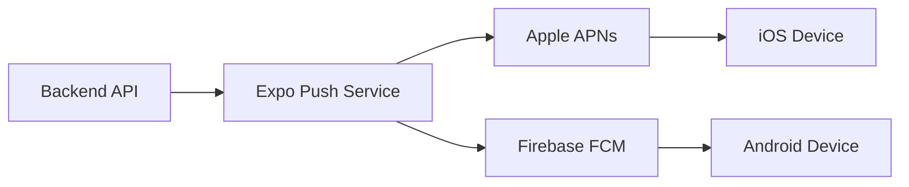

# Push Notifications

Expo Push Notification setup for Meet Without Fear mobile apps.

## Overview

Meet Without Fear uses [Expo Push Notifications](https://docs.expo.dev/push-notifications/overview/) for notifying users when:
- Partner signs the Curiosity Compact
- Partner completes a stage
- Partner shares content (empathy attempt, needs)
- Agreement is proposed or confirmed
- Session is resolved

## Architecture



## Mobile Setup

### Install Dependencies

```bash
npx expo install expo-notifications expo-device expo-constants
```

### Request Permission

```typescript
// app/hooks/useNotifications.ts
import * as Notifications from 'expo-notifications';
import * as Device from 'expo-device';
import Constants from 'expo-constants';

export async function registerForPushNotifications() {
  if (!Device.isDevice) {
    console.log('Push notifications require a physical device');
    return null;
  }

  const { status: existingStatus } = await Notifications.getPermissionsAsync();
  let finalStatus = existingStatus;

  if (existingStatus !== 'granted') {
    const { status } = await Notifications.requestPermissionsAsync();
    finalStatus = status;
  }

  if (finalStatus !== 'granted') {
    console.log('Push notification permission denied');
    return null;
  }

  const token = await Notifications.getExpoPushTokenAsync({
    projectId: Constants.expoConfig?.extra?.eas?.projectId,
  });

  return token.data;
}
```

### Register Token with Backend

```typescript
// After getting token, send to backend
async function registerPushToken(token: string) {
  await api.post('/auth/push-token', {
    pushToken: token,
    platform: Platform.OS,
  });
}
```

### Handle Incoming Notifications

```typescript
// app/providers/NotificationProvider.tsx
import * as Notifications from 'expo-notifications';

// Configure notification behavior
Notifications.setNotificationHandler({
  handleNotification: async () => ({
    shouldShowAlert: true,
    shouldPlaySound: true,
    shouldSetBadge: true,
  }),
});

export function NotificationProvider({ children }) {
  useEffect(() => {
    // Handle notification when app is foregrounded
    const subscription = Notifications.addNotificationReceivedListener(
      (notification) => {
        console.log('Notification received:', notification);
      }
    );

    // Handle notification tap
    const responseSubscription =
      Notifications.addNotificationResponseReceivedListener((response) => {
        const { sessionId, event } = response.notification.request.content.data;
        // Navigate to relevant screen
        navigation.navigate('Session', { sessionId });
      });

    return () => {
      subscription.remove();
      responseSubscription.remove();
    };
  }, []);

  return children;
}
```

## Backend Implementation

### Install SDK

```bash
npm install expo-server-sdk
```

### Send Notifications

```typescript
// src/services/notifications.ts
import { Expo, ExpoPushMessage } from 'expo-server-sdk';

const expo = new Expo();

interface NotificationPayload {
  userId: string;
  title: string;
  body: string;
  data?: Record<string, unknown>;
}

export async function sendPushNotification(payload: NotificationPayload) {
  const user = await prisma.user.findUnique({
    where: { id: payload.userId },
    select: { pushToken: true },
  });

  if (!user?.pushToken) {
    console.log(`No push token for user ${payload.userId}`);
    return;
  }

  if (!Expo.isExpoPushToken(user.pushToken)) {
    console.log(`Invalid push token for user ${payload.userId}`);
    return;
  }

  const message: ExpoPushMessage = {
    to: user.pushToken,
    sound: 'default',
    title: payload.title,
    body: payload.body,
    data: payload.data,
  };

  try {
    const [ticket] = await expo.sendPushNotificationsAsync([message]);

    if (ticket.status === 'error') {
      console.error(`Push notification error: ${ticket.message}`);

      // Handle invalid tokens
      if (ticket.details?.error === 'DeviceNotRegistered') {
        await prisma.user.update({
          where: { id: payload.userId },
          data: { pushToken: null },
        });
      }
    }
  } catch (error) {
    console.error('Failed to send push notification:', error);
  }
}
```

### Notification Messages

```typescript
// src/services/notifications.ts

const NOTIFICATION_MESSAGES: Record<string, (data: any) => { title: string; body: string }> = {
  'partner.signed_compact': () => ({
    title: 'Partner is ready',
    body: 'They signed the Curiosity Compact. Your turn!',
  }),

  'partner.stage_completed': ({ stage }) => ({
    title: 'Partner finished a stage',
    body: `They completed Stage ${stage}. Check in when ready.`,
  }),

  'partner.empathy_shared': () => ({
    title: 'Partner shared their empathy attempt',
    body: 'See how they imagine you might be feeling.',
  }),

  'partner.needs_shared': () => ({
    title: 'Partner shared their needs',
    body: 'Discover your common ground.',
  }),

  'agreement.proposed': () => ({
    title: 'New experiment proposed',
    body: 'Review and confirm the agreement.',
  }),

  'agreement.confirmed': () => ({
    title: 'Agreement confirmed!',
    body: 'You both agreed on a path forward.',
  }),

  'session.resolved': () => ({
    title: 'Session complete',
    body: 'Congratulations on working through this together.',
  }),
};

export function getNotificationMessage(event: string, data: any) {
  const getMessage = NOTIFICATION_MESSAGES[event];
  return getMessage ? getMessage(data) : { title: 'Meet Without Fear', body: 'You have an update' };
}
```

### Integration with Ably

Send push when partner is offline:

```typescript
// src/services/realtime.ts

async function notifyPartner(
  sessionId: string,
  partnerId: string,
  event: string,
  data: any
) {
  const presenceChannel = ably.channels.get(
    `meetwithoutfear:session:${sessionId}:presence`
  );

  const members = await presenceChannel.presence.get();
  const partnerOnline = members.some((m) => m.clientId === partnerId);

  if (partnerOnline) {
    // Partner online - use Ably
    const channel = ably.channels.get(`meetwithoutfear:session:${sessionId}`);
    await channel.publish(event, data);
  } else {
    // Partner offline - send push
    const { title, body } = getNotificationMessage(event, data);
    await sendPushNotification({
      userId: partnerId,
      title,
      body,
      data: { sessionId, event },
    });
  }
}
```

## Testing

### Expo Push Notification Tool

Use [Expo's push notification tool](https://expo.dev/notifications) to test:

1. Get your device's push token from the app
2. Send test notification via Expo dashboard
3. Verify delivery on device

### Local Testing

```typescript
// Send test notification
await sendPushNotification({
  userId: 'test-user-id',
  title: 'Test Notification',
  body: 'This is a test',
  data: { test: true },
});
```

## Error Handling

### Invalid Tokens

Remove invalid tokens from database:

```typescript
if (ticket.details?.error === 'DeviceNotRegistered') {
  await prisma.user.update({
    where: { id: userId },
    data: { pushToken: null },
  });
}
```

### Rate Limiting

Expo has rate limits. Batch notifications when sending to many users:

```typescript
const chunks = expo.chunkPushNotifications(messages);

for (const chunk of chunks) {
  try {
    await expo.sendPushNotificationsAsync(chunk);
  } catch (error) {
    console.error('Chunk failed:', error);
  }
}
```

## Related Documentation

- [Realtime Integration](../backend/api/realtime.md)
- [Expo Push Notifications Docs](https://docs.expo.dev/push-notifications/overview/)

---

[Back to Deployment](./index.md)
