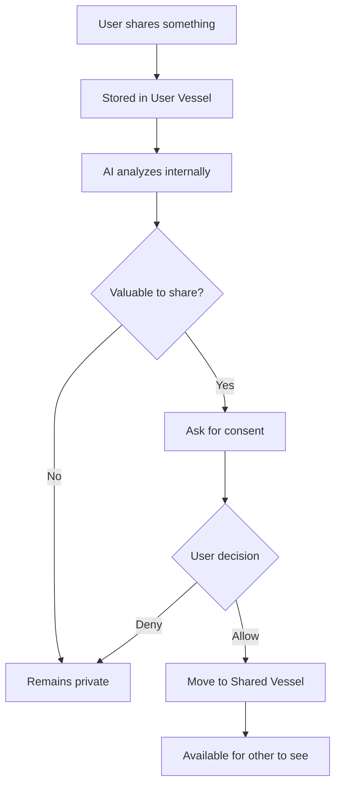
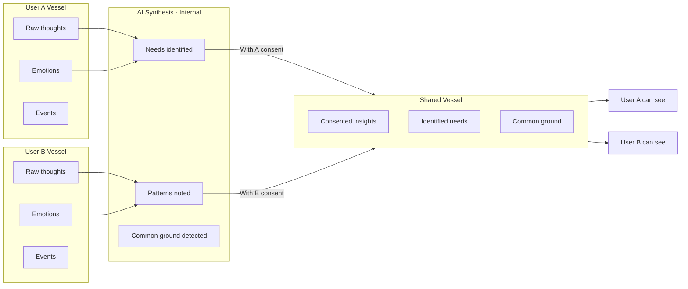
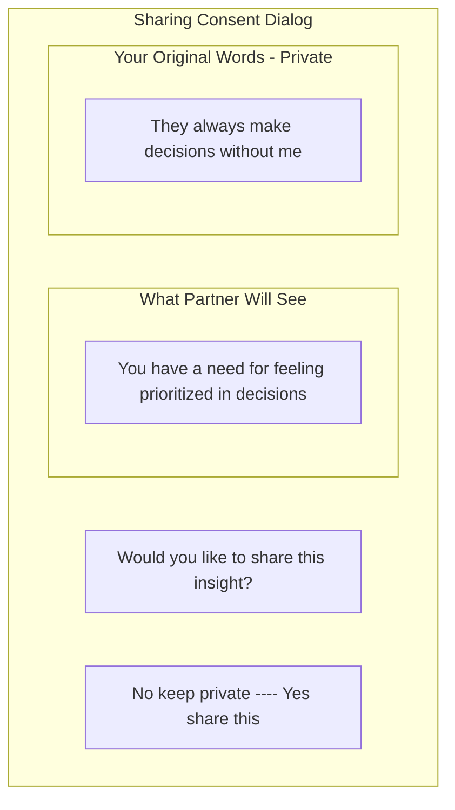
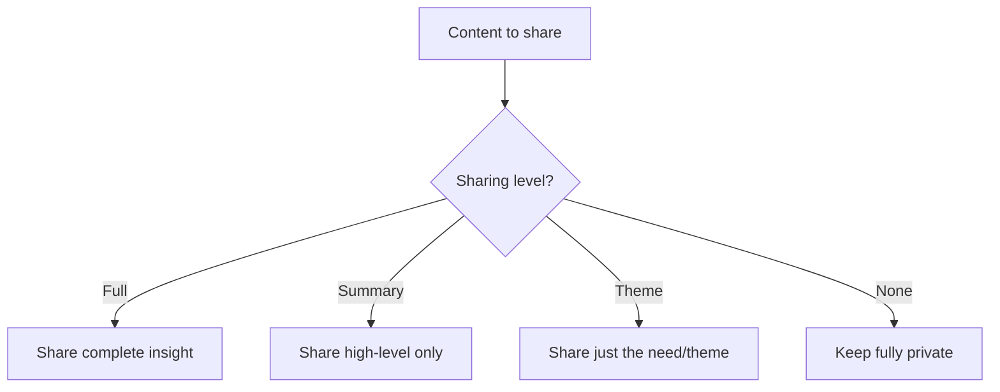
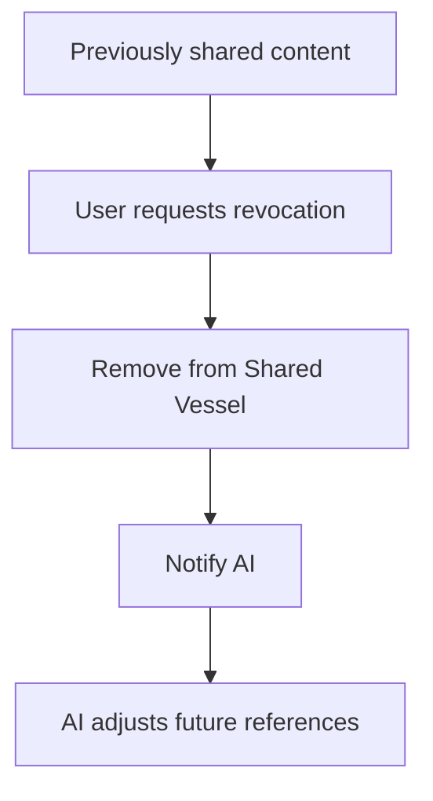

# Consensual Bridge

:::tip See it in action
[Try the Consensual Bridge demo](/demo/features/consensual-bridge.html) - Explore explicit consent prompts for sharing reflections with your partner.
:::

## Purpose

Control what information flows between users, ensuring nothing is shared without explicit consent.

## Core Principle

**The AI never auto-summarizes or shares user input.** Every piece of information that moves from one users private space to shared visibility requires explicit consent.

## How It Works



## Consent Request Pattern

When the AI identifies something valuable to share:

```
AI: "You mentioned that [Event X] felt like betrayal.
    Would you like me to highlight 'Trust' as a core need
    for [Partner] to reflect on?"

    [Yes, share this]  [No, keep private]
```

## What Can Be Shared

The AI curates and transforms content before requesting sharing:

| Original Content | Transformed for Sharing |
|-----------------|------------------------|
| "They completely ignored me at the party" | "Feeling overlooked in social situations" |
| "I hate how they always take their side" | "Need for feeling supported and prioritized" |
| "They never listen to anything I say" | "Need for being heard and understood" |

## What Never Gets Shared

Even with consent, some content remains private:

- Raw venting language
- Direct accusations
- Character attacks
- Detailed grievance lists
- Anything the user explicitly wants private

## Flow Between Vessels



## Consent Tracking

The system tracks what has been consented:

```
Consent Record for User A:
- Need: Trust - SHARED
- Need: Recognition - SHARED
- Event: Work argument - PRIVATE
- Emotion: Feeling betrayed - SHARED (as "trust concern")
- Detail: Specific conversation - PRIVATE
```

## Wireframe: Consent Request



## Granular Control

Users can consent to different levels:



## Revoking Consent

Users can revoke sharing consent:



## Implementation Notes

- Every share request must be explicit
- Transformations should preserve meaning while removing heat
- Track all consent decisions for transparency
- Allow users to review what they have shared
- Provide easy revocation mechanism

---

## Related Documents

- [Privacy Model](../privacy/index.md)
- [Stage 2: Perspective Stretch](../stages/stage-2-perspective-stretch.md)
- [System Guardrails](./guardrails.md)

---

[Back to Mechanisms](./index.md) | [Back to Plans](../index.md)
