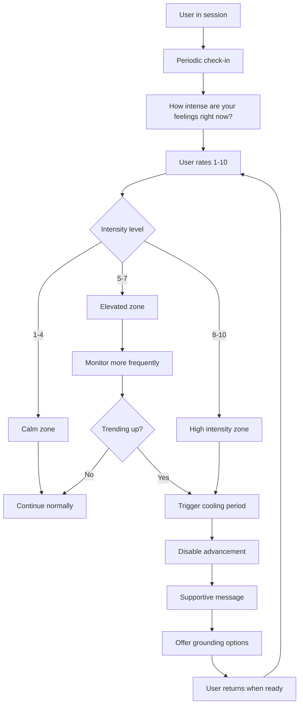
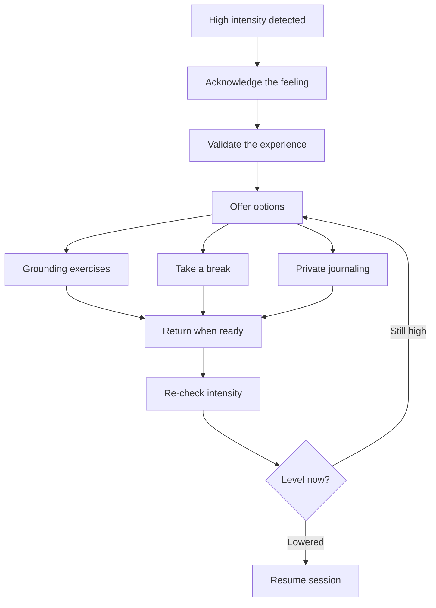
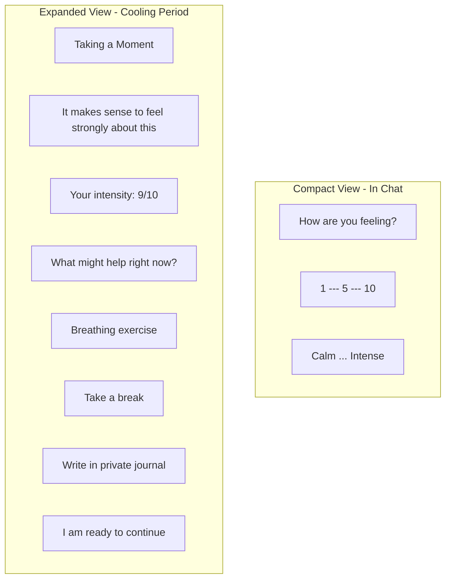
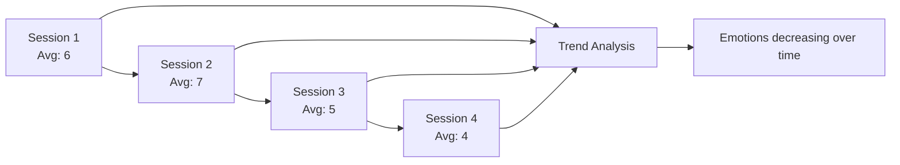

# Emotional Barometer

## Purpose

Monitor emotional intensity throughout the process and enforce pacing controls when intensity is too high for productive work.

## How It Works



## Intensity Zones

| Rating | Zone | AI Behavior |
|--------|------|-------------|
| 1-4 | Calm | Normal pace; occasional check-ins |
| 5-7 | Elevated | More frequent check-ins; watch for trends |
| 8-10 | High | Cooling period required before advancing |

## Triggering a Cooling Period

When intensity exceeds threshold:

```
if user_emotion > 8:
    disable_advance_button()
    send_message("High emotional intensity detected.
                  Cooling period recommended.
                  Return when ready.")
```

## Cooling Period Flow



## Wireframe: Emotional Barometer UI



## Multi-Session Persistence

The barometer tracks patterns over time:



## Privacy of Emotional Data

- Ratings are **private by default**
- Stored in User Vessel only
- AI may ask consent to share if it helps:

```
AI: "I noticed you have been feeling quite intense during our
    conversations. Would it be helpful for [Partner] to know
    that this process brings up strong feelings for you?"
```

## Grounding Options

When cooling period is triggered, the AI may offer:

| Option | Description |
|--------|-------------|
| Breathing exercise | Guided 4-7-8 breathing or similar |
| Body scan | Brief check-in with physical sensations |
| Take a break | Log off and return later |
| Private journaling | Write without sharing |
| Pause timer | Set a timer before returning |

## Display Options

The barometer can be presented in two ways:

1. **Always visible** - A persistent slider at the bottom of the chat interface that users can adjust at any time
2. **Periodic popup** - The barometer appears as a gentle popup at key moments (stage transitions, after intense exchanges, or on a timer)

Either approach is valid. The always-visible option provides continuous awareness, while the popup approach can feel less intrusive and more intentional.

## Implementation Notes

- Check-ins should feel natural, not intrusive
- Frequency adapts to user pattern (more often if volatile)
- Never shame or judge high intensity ratings
- Cooling periods are framed as wisdom, not failure

---

## Related Documents

- [User Journey](../overview/user-journey.md)
- [Stage 1: The Witness](../stages/stage-1-witness.md)
- [System Guardrails](./guardrails.md)

---

[Back to Mechanisms](./index.md) | [Back to Plans](../index.md)
