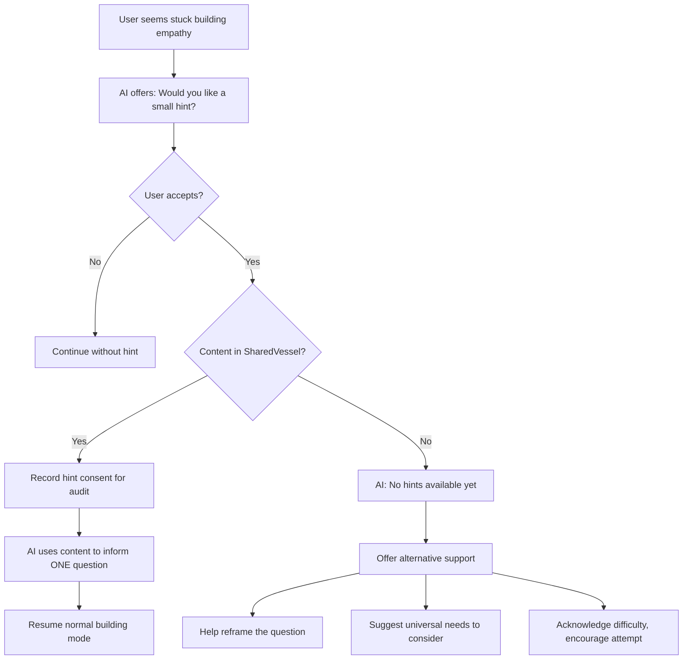

# AI-Assisted Hint System

## Status: Design Proposal

This document addresses an undefined flow in Stage 2: what happens when a user is stuck building their empathy guess and requests a hint about their partner's perspective.

## The Problem

Stage 2 asks users to build empathy guesses independently. But what if they're truly stuck?

The Stage 2 docs mention:
> "AI-Assisted Hints: If a user is stuck or their attempt is significantly off, the AI may offer (with consent) to share a helpful quotation or sentiment from the partner."

But the following questions were never answered:

| Question | Gap |
|----------|-----|
| When does partner consent to share content? | Unclear timing |
| Is general sharing consent sufficient for hints? | Undefined |
| What if partner hasn't shared anything yet? | No fallback defined |
| Does user requesting hint have to wait? | Async timing unclear |
| Can hints happen if partner is behind in stages? | Stage dependency undefined |

## The Timing Problem

```
Scenario A: Partner ahead
- User A: Stage 2, stuck, wants hint
- User B: Already completed Stage 2, has shared content
→ Hint available immediately

Scenario B: Partner behind
- User A: Stage 2, stuck, wants hint
- User B: Still in Stage 1, hasn't consented to share anything
→ No content available. What happens?

Scenario C: Partner shared nothing
- User A: Stage 2, stuck, wants hint
- User B: Completed Stage 2 but declined all sharing requests
→ Nothing in SharedVessel. What happens?
```

## Proposed Design: "Hints from SharedVessel Only"

### Core Principle

**Hints are only available if partner has already consented to share content.** No new consent requests, no waiting, no stage dependencies.

### Why This Approach

1. **No waiting** - User gets immediate answer (hint available or not)
2. **No new consent complexity** - Uses existing SharedVessel content
3. **Partner already consented** - They chose to share this content
4. **Graceful degradation** - If nothing available, AI helps differently

### Flow



### What the AI Says

**When hint IS available:**
```
AI: "Would you like a small hint about what {{partner_name}} might be experiencing?"

User: "Yes"

AI: (Uses SharedVessel content to inform a question)
    "I wonder if they might be feeling some pressure around expectations?"
```

**When hint is NOT available:**
```
AI: "Would you like a small hint about what {{partner_name}} might be experiencing?"

User: "Yes"

AI: "I don't have anything to share yet - {{partner_name}} hasn't shared
    their perspective with the process yet. But I can help you think through
    this differently.

    Sometimes it helps to consider universal needs - things like safety,
    recognition, autonomy. Which of these might be at play for them?"
```

### Consent Model

| Layer | Who Consents | When | What They're Consenting To |
|-------|--------------|------|---------------------------|
| Partner sharing | Partner | During their Stage 1/2 | "Share this insight with my partner" |
| User receiving hint | User | When stuck | "Show me a hint from what partner shared" |

**Key insight:** Partner already consented to share when content entered SharedVessel. The user requesting a hint is just accessing content that was already shared for them.

**No new consent request to partner is needed** - they already said yes to sharing.

### What Qualifies as "Stuck"

The AI should offer hints when:
- User has attempted empathy guess but it's very surface-level
- User explicitly says they don't know ("I have no idea what they're feeling")
- User has been in building mode for 3+ turns without progress
- User asks directly ("Can you give me a hint?")

The AI should NOT offer hints:
- In the first 2 turns of building mode (give them a chance first)
- If user is making genuine attempts (even if imperfect)
- If user is still venting (wrong phase)

### Backend Implementation

```typescript
interface HintContext {
  available: boolean;
  content?: string;  // Only populated if available AND user consented
}

async function getHintContext(
  sessionId: string,
  userId: string,
  userConsentedToHint: boolean
): Promise<HintContext> {
  // Check if partner has shared anything
  const sharedContent = await prisma.consentedContent.findFirst({
    where: {
      sharedVessel: { sessionId },
      sourceUserId: { not: userId },  // Partner's content
      consentActive: true
    }
  });

  if (!sharedContent) {
    return { available: false };
  }

  if (!userConsentedToHint) {
    // Content exists but user hasn't asked for hint yet
    return { available: true };
  }

  // User consented - provide the content
  await recordHintAccess(sessionId, userId);  // Audit trail

  return {
    available: true,
    content: sharedContent.transformedContent
  };
}
```

### Prompt Integration

```handlebars
{{#if hint_available}}
If user seems stuck (3+ turns without progress, or explicitly asks), you may offer:
"Would you like a small hint about what {{partner_name}} might be experiencing?"
{{else}}
Partner has not shared content yet. If user asks for hints, explain they are not
available and offer alternative support (reframing, universal needs).
{{/if}}

{{#if hint_mode_active}}
HINT MODE: User accepted hint. Use this to inform ONE question, then return to
normal building mode.

Partner context (never quote directly):
{{shared_partner_content}}
{{/if}}
```

### Edge Cases

| Scenario | Handling |
|----------|----------|
| Partner revokes consent after hint was given | Hint already delivered can't be "unseen" - this is documented in consent revocation |
| User asks for multiple hints | Limit to 1-2 hints per session to preserve independent empathy building |
| Partner content is very limited | AI works with what's available; may only inform a vague question |
| Partner shared only boundaries, not needs | Boundaries are still useful context for empathy |

### What This Means for Stage 2 Flow

1. **Early Stage 2**: Hints unlikely to be available (partner probably hasn't shared yet)
2. **Mid Stage 2**: Hints may become available as partner progresses and shares
3. **Late Stage 2**: Hints most likely available
4. **Phase 2 (Exchange)**: Hints irrelevant - users see each other's attempts directly

### Metrics to Track

- How often are hints offered?
- How often are hints accepted?
- How often are hints unavailable when requested?
- Does hint usage correlate with better empathy validation scores?

---

## Alternative Considered: Hint Triggers Consent Request

We considered having the hint request trigger a new consent request to the partner:

```
User A: "Can I get a hint?"
→ System sends request to User B: "Would you like to share a hint with User A?"
→ User A waits for response
```

**Rejected because:**
- Creates waiting in an async system (could be hours/days)
- Adds complexity to consent model
- Partner may feel pressured
- If partner already shared content, asking again is redundant

---

## Related Documents

- [Stage 2: Perspective Stretch](../stages/stage-2-perspective-stretch.md)
- [Consensual Bridge](./consensual-bridge.md)
- [Consent API](../backend/api/consent.md)
- [Stage 2 Prompt](../backend/prompts/stage-2-perspective.md)

---

[Back to Mechanisms](./index.md) | [Back to Plans](../index.md)
