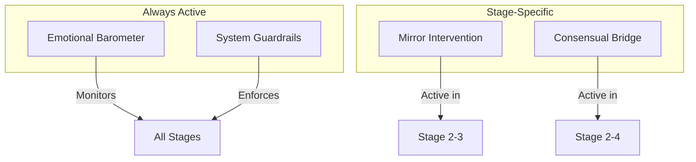

# Mechanisms

Key behavioral mechanics that govern how BeHeard operates across all stages.

## Documents

- **[Emotional Barometer](./emotional-barometer.md)** - Intensity monitoring and pacing control
- **[Mirror Intervention](./mirror-intervention.md)** - Redirecting judgment to self-reflection
- **[Consensual Bridge](./consensual-bridge.md)** - Controlling what gets shared between users
- **[Hint System](./hint-system.md)** - AI-assisted hints when users are stuck building empathy
- **[System Guardrails](./guardrails.md)** - Rules the AI always follows

## Overview

## Quick Reference

| Mechanism | Purpose | When Active |
|-----------|---------|-------------|
| [Emotional Barometer](./emotional-barometer.md) | Monitor intensity; trigger pauses | All stages |
| [Mirror Intervention](./mirror-intervention.md) | Redirect judgment to curiosity | Stage 2-3 |
| [Consensual Bridge](./consensual-bridge.md) | Control data sharing | Stage 2-4 |
| [Hint System](./hint-system.md) | Help stuck users with partner context | Stage 2 |
| [System Guardrails](./guardrails.md) | Enforce core principles | Always |

---

[Back to Plans](../index.md)
