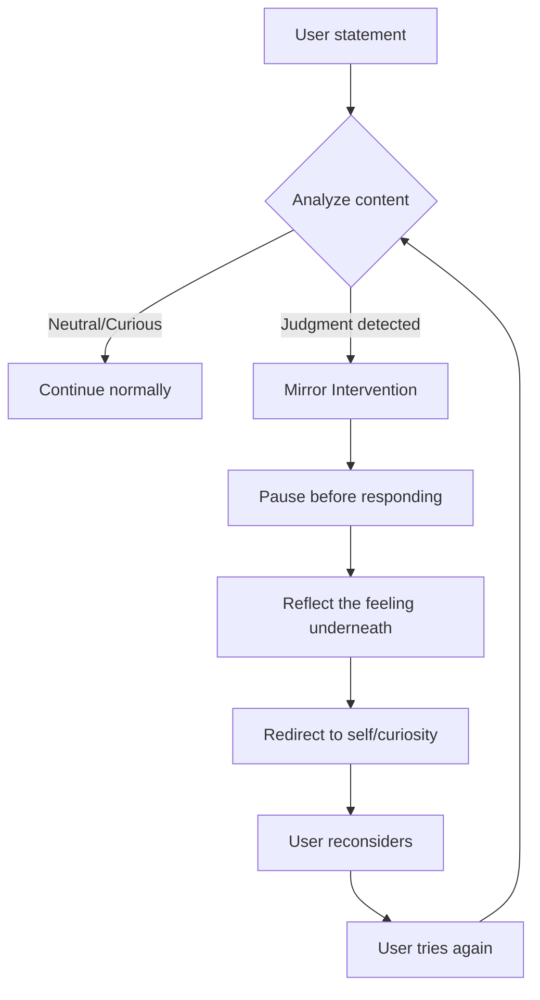
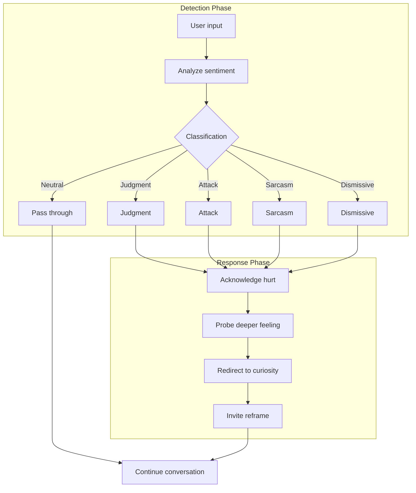
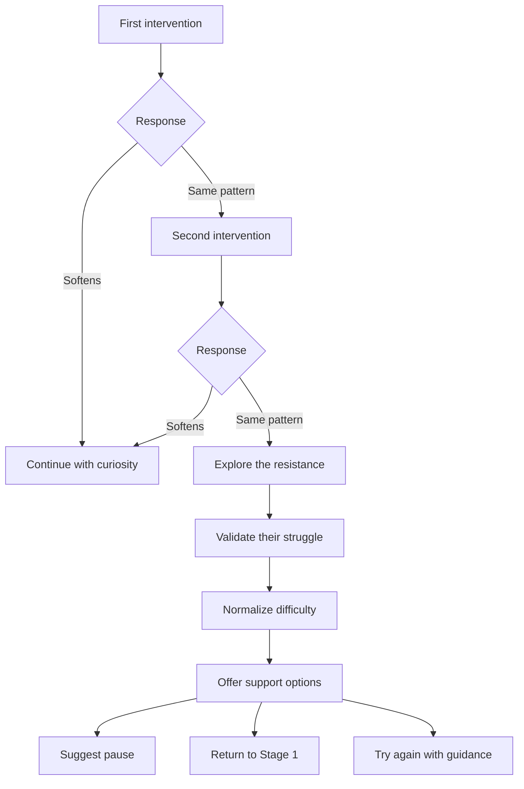

# Mirror Intervention

:::tip See it in action
<a href="/demo/features/process-explanation.html" onClick="window.location.href='/demo/features/process-explanation.html'; return false;">Try the Process Explanation demo</a> - See how the AI explains the stages upfront.

<a href="/demo/features/accuracy-loops.html" onClick="window.location.href='/demo/features/accuracy-loops.html'; return false;">Try the Accuracy Loops demo</a> - See how the AI refines its understanding.
:::

## Purpose

When a user expresses judgment, attack, or sarcasm about the other person, redirect them to self-reflection and curiosity rather than allowing escalation.

## When It Activates

The Mirror Intervention is used primarily in Stages 2 and 3 when users are engaging with the other persons perspective.

Triggers:
- Direct judgment ("They are so selfish")
- Attacks ("They do not care about anyone but themselves")
- Sarcasm ("Oh I am sure they are just devastated")
- Dismissiveness ("That is just an excuse")
- Mind-reading ("They are just trying to manipulate me")

## How It Works



## Intervention Pattern

The AI follows a consistent pattern:

1. **Acknowledge** the feeling behind the judgment
2. **Reflect** what might be driving their statement
3. **Redirect** toward curiosity about the other person
4. **Invite** a reframe

## Example Interventions

### Example 1: Sarcasm

```
User: "I bet they are just happy I am miserable."

AI: "That sounds like a thought born of your own hurt.
    If you look past your pain for a moment,
    what fear might be driving their behavior?"
```

### Example 2: Character Attack

```
User: "They are completely selfish and always have been."

AI: "When you say selfish, I hear a lot of pain about
    not feeling considered. What need of yours goes
    unmet when they act in ways that feel selfish?"
```

### Example 3: Mind Reading

```
User: "They are only doing this to look good."

AI: "That is one possibility. What would it mean for you
    if that were true? And what would it mean if there
    were other reasons you have not considered yet?"
```

### Example 4: Dismissiveness

```
User: "Their reasons are just excuses."

AI: "I notice some frustration there. Even if their
    reasons do not feel valid to you, what might they
    be protecting or needing when they offer them?"
```

## Flow Diagram



## Escalation Handling

If a user continues with judgment after intervention:



## Key Principles

| Principle | Application |
|-----------|-------------|
| No shame | Never criticize user for their reaction |
| Validate first | Acknowledge the feeling before redirecting |
| Curiosity over correction | Invite wonder, dont lecture |
| Persistence | Keep redirecting gently until pattern breaks |
| Patience | Some users need many interventions |

## What the AI Never Does

- Judge the user for judging
- Side with either party
- Confirm negative characterizations
- Allow attacks to pass unchallenged
- Force immediate change

## Implementation Notes

- Mirror Interventions should feel natural, not formulaic
- Vary the language to avoid feeling repetitive
- Track intervention frequency (may indicate user is not ready)
- Consider suggesting return to Stage 1 if resistance is high

---

## Related Documents

- [Stage 2: Perspective Stretch](../stages/stage-2-perspective-stretch.md)
- [Stage 3: Need Mapping](../stages/stage-3-need-mapping.md)
- [System Guardrails](./guardrails.md)

---

[Back to Mechanisms](./index.md) | [Back to Plans](../index.md)
