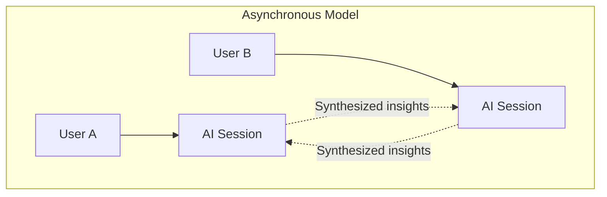
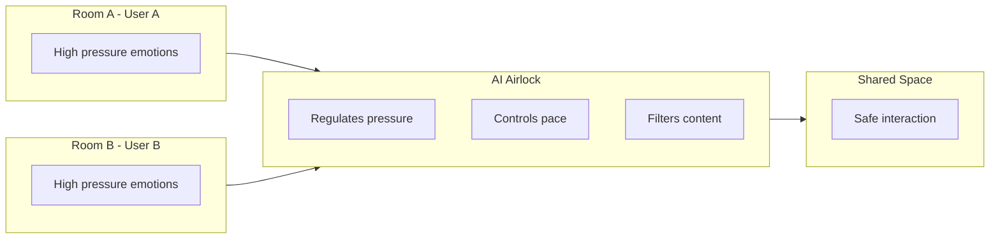
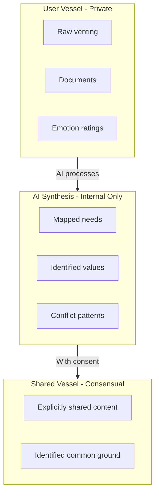
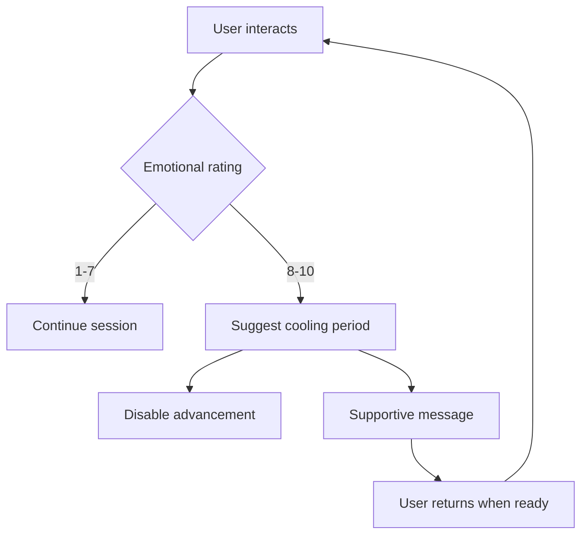

# Core Concept

## The Problem

Conflict escalates because humans try to solve problems while under **physiological and emotional threat**. When triggered:

- The prefrontal cortex (rational thinking) goes offline
- Fight/flight/freeze responses dominate
- Memory becomes distorted and selective
- Listening capacity diminishes
- Solutions feel impossible

## The Solution

BeHeard acts as an **External Prefrontal Cortex** that:

| Function | How BeHeard Provides It |
|----------|---------------------------|
| Regulation | Emotional Barometer monitors intensity; enforces cooling periods |
| Memory | Accurate, attributed records of what each person shared |
| Pacing | Stage gates prevent rushing; advancement requires readiness |
| Teaching | Builds skills in listening, reflection, and needs identification |

## Architectural Pillars

### 1. Asynchronous Processing

Users interact with the AI independently, not with each other directly. This:
- Reduces escalation triggers
- Allows each person to process at their own pace
- Prevents reactive, heated exchanges

#### The Airlock Analogy

Think of the app as a **safety airlock between two pressurized rooms**. Instead of opening the door and letting the pressure cause an explosion, the airlock (the AI) slowly regulates the environment in each room separately until it is safe for both parties to step into a shared space.

### 2. Vessel Privacy Model

Three distinct containers protect user data:

See [Privacy Model](../privacy/index.md) for details.

### 3. Non-Linear Pacing

The AI can enforce cooling periods based on emotional intensity:

See [Emotional Barometer](../mechanisms/emotional-barometer.md) for details.

## MVP Scope: Two-Person Conflicts

The initial version focuses on conflicts between two people:
- Couples
- Family members
- Coworkers
- Friends

Multi-party conflicts are a future enhancement.

---

## Related Documents

- [User Journey](./user-journey.md) - Complete flow through the system
- [Stages Overview](../stages/index.md) - The five-stage process
- [Privacy Model](../privacy/index.md) - Vessel architecture

---

[Back to Overview](./index.md) | [Back to Plans](../index.md)
