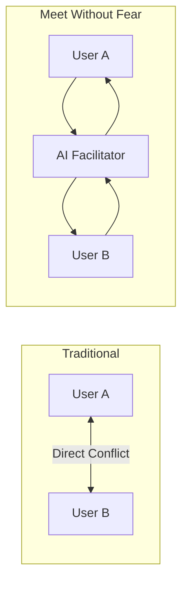

# Overview

High-level documentation for the Meet Without Fear AI-Facilitated Conflict Resolution System.

## Documents

- **[Core Concept](./concept.md)** - Problem statement, solution approach, and architectural pillars
- **[User Journey](./user-journey.md)** - Complete flow through the system with success/failure paths
- **[Inner Work](./inner-work.md)** - Personal growth mode for therapeutic insights and skill building
- **[Information Architecture](./information-architecture.md)** - Navigation hierarchy and screen relationships
- **[Product Philosophy](./product-philosophy.md)** - Core value proposition, business model, and strategic positioning

---

## At a Glance

Meet Without Fear acts as an **External Prefrontal Cortex** for people in conflict. Instead of users communicating directly (which escalates tension), they interact with an AI that:

1. **Maintains regulation** - Tracks emotional intensity and enforces cooling periods
2. **Preserves memory** - Keeps accurate records without distortion
3. **Controls pacing** - Prevents advancement until both parties are ready
4. **Teaches skills** - Builds listening, reflection, and needs-based understanding

---

[Back to Plans](../index.md)
