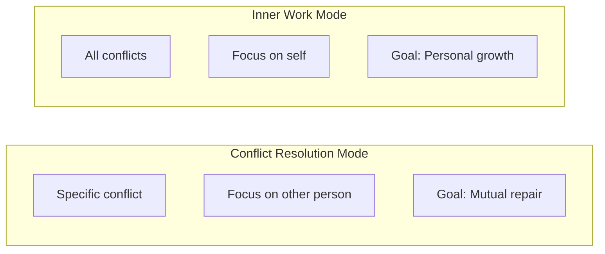
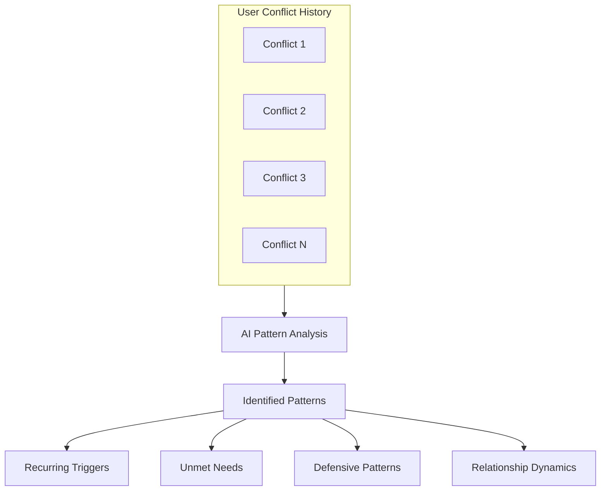
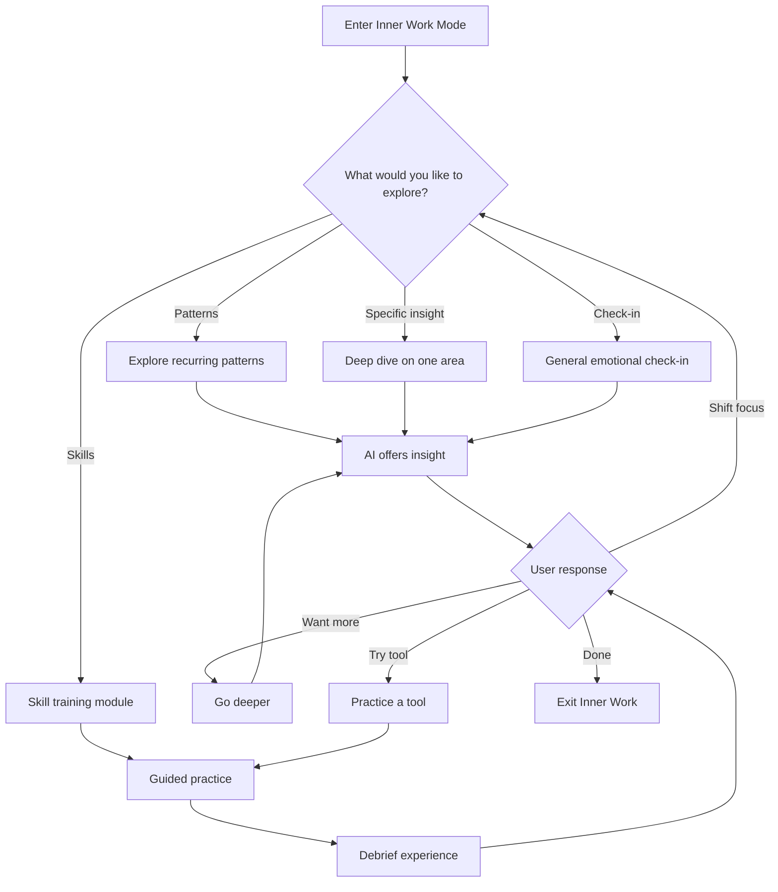
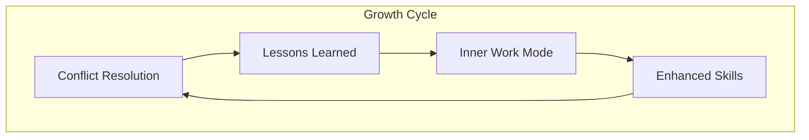

# Inner Work Mode

:::tip See it in action
<a href="/demo/features/inner-work.html" onClick="window.location.href='/demo/features/inner-work.html'; return false;">Try the Inner Work demo</a> - Experience the solo journey for personal growth and pattern recognition.
:::

## Purpose

Inner Work is a separate mode focused on personal growth and self-understanding. Unlike the conflict resolution stages which center on resolving issues with another person, Inner Work draws from patterns across all of a users conflicts to provide therapeutic insights, tools, and trainings.

## Distinction from Conflict Resolution



| Conflict Resolution | Inner Work |
|---------------------|------------|
| Specific conflict session | Draws from all sessions |
| Focused on the other person | Focused on yourself |
| Goal is mutual repair | Goal is self-understanding |
| Requires other participant | Solo work |
| Stage-gated progression | Open exploration |

## What Inner Work Offers

### Pattern Recognition

The AI synthesizes patterns across all of a users conflicts:

- Recurring emotional triggers
- Common needs that go unmet
- Defensive patterns that emerge
- Relationship dynamics that repeat



### Therapeutic Insights

The AI offers reflections that might emerge in therapy:

- Connecting present conflicts to past experiences
- Identifying core wounds or sensitivities
- Exploring the protective function of defenses
- Understanding the needs beneath reactions

### Tools and Exercises

Practical interventions the user can apply:

| Category | Examples |
|----------|----------|
| Regulation | Breathing exercises, grounding techniques, pause practices |
| Reflection | Journaling prompts, parts work explorations, needs inventories |
| Reframing | Cognitive reframes, empathy exercises, perspective shifts |
| Skill-building | Communication scripts, boundary language, repair phrases |

### Training Modules

Structured learning experiences:

- Active listening practice
- Needs-based communication
- Emotional regulation techniques
- Conflict de-escalation skills
- Boundary setting and maintenance

## Flow



## Example Interactions

### Pattern Recognition

```
AI: "Looking across your conflicts, I notice a pattern: when someone
    questions your competence, your response tends to be withdrawal
    followed by resentment. This has appeared with [Partner], with
    your manager, and in the friend situation from last month.

    What do you make of this pattern?"
```

### Therapeutic Insight

```
AI: "You mentioned feeling invisible in these moments. I wonder if
    there is something familiar about that feeling - if it connects
    to earlier experiences of not being seen or valued.

    Would you like to explore that, or would you prefer to stay
    focused on present strategies?"
```

### Tool Offering

```
AI: "When you notice that withdrawal impulse starting, you might try
    this: pause and name what you are actually feeling. Often the
    withdrawal protects something more vulnerable underneath.

    Would you like to practice this with a recent example?"
```

## Privacy Considerations

Inner Work mode operates within the users private vessel:

- Insights are derived from the users own data only
- Nothing from Inner Work is shared with conflict partners
- The user controls what patterns they want to explore
- All reflections can be deleted or refined

## Entry Points

Users can access Inner Work from:

1. **Main menu** - Direct access to personal growth mode
2. **Post-conflict** - After completing a conflict resolution session
3. **Pattern notification** - When AI detects a recurring pattern worth exploring
4. **Emotional state** - When user checks in with elevated emotions but no active conflict

## Success Metrics

Inner Work success is measured differently than conflict resolution:

| Metric | What It Indicates |
|--------|-------------------|
| Engagement time | User finds value in reflection |
| Return visits | Ongoing commitment to growth |
| Tool usage | Practical application of learnings |
| Pattern acknowledgment | Self-awareness developing |
| Conflict improvement | Skills transferring to real situations |

## Relationship to Conflict Resolution

Inner Work enhances conflict resolution by:

- Building self-awareness that prevents reactive patterns
- Developing skills that improve conflict outcomes
- Processing emotions that might otherwise escalate conflicts
- Creating insights that inform future interactions



---

## Related Documents

- [Core Concept](./concept.md)
- [User Journey](./user-journey.md)
- [Privacy Model](../privacy/vessel-model.md)

---

[Back to Overview](./index.md) | [Back to Plans](../index.md)
