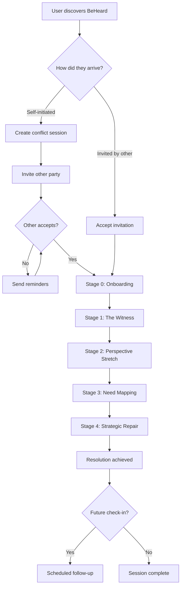
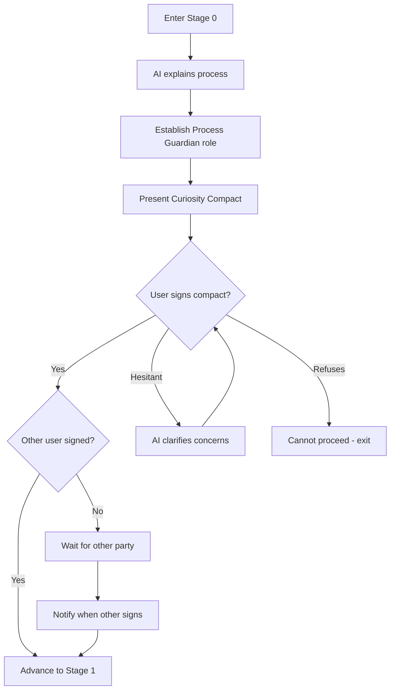
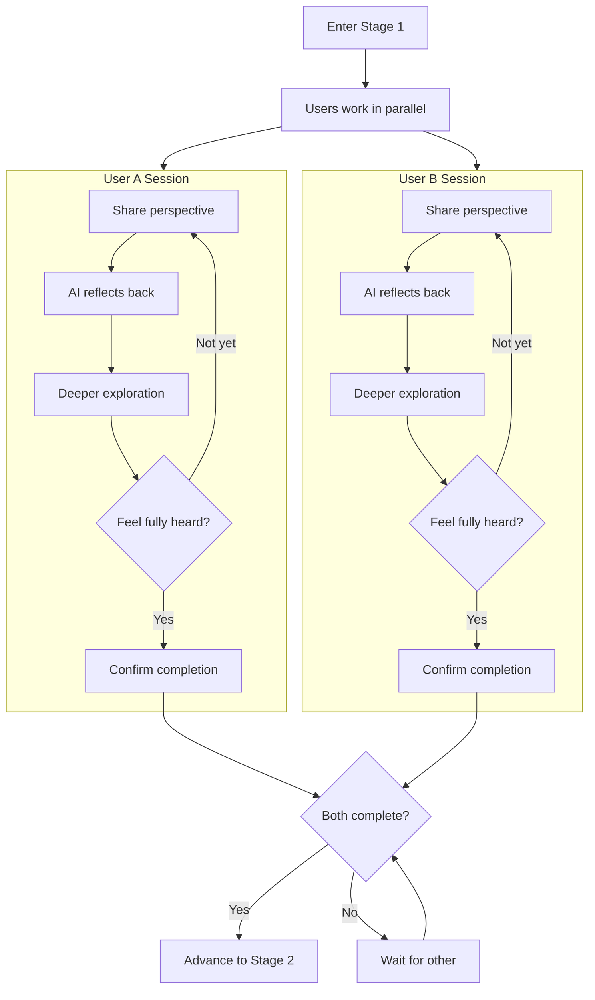
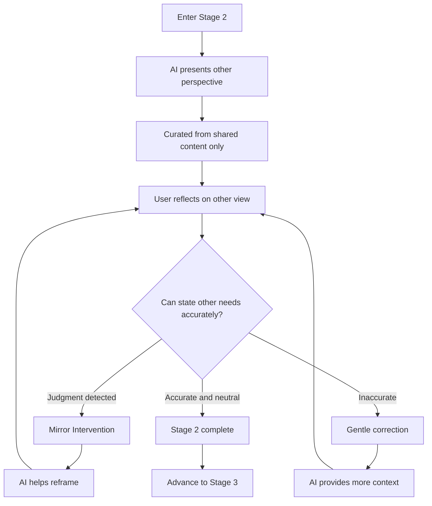
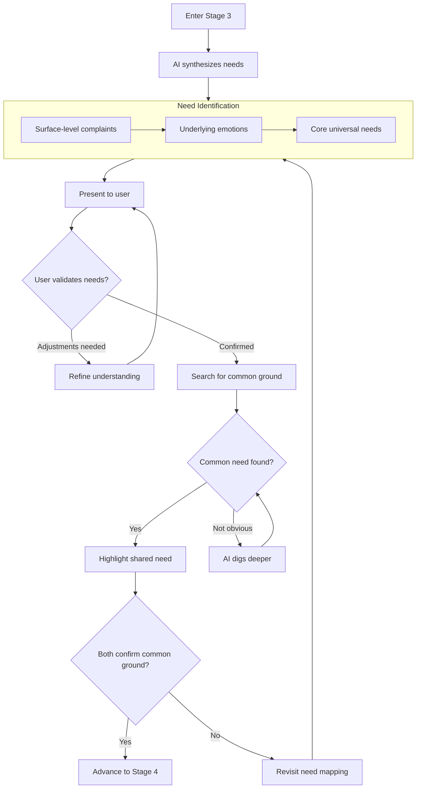
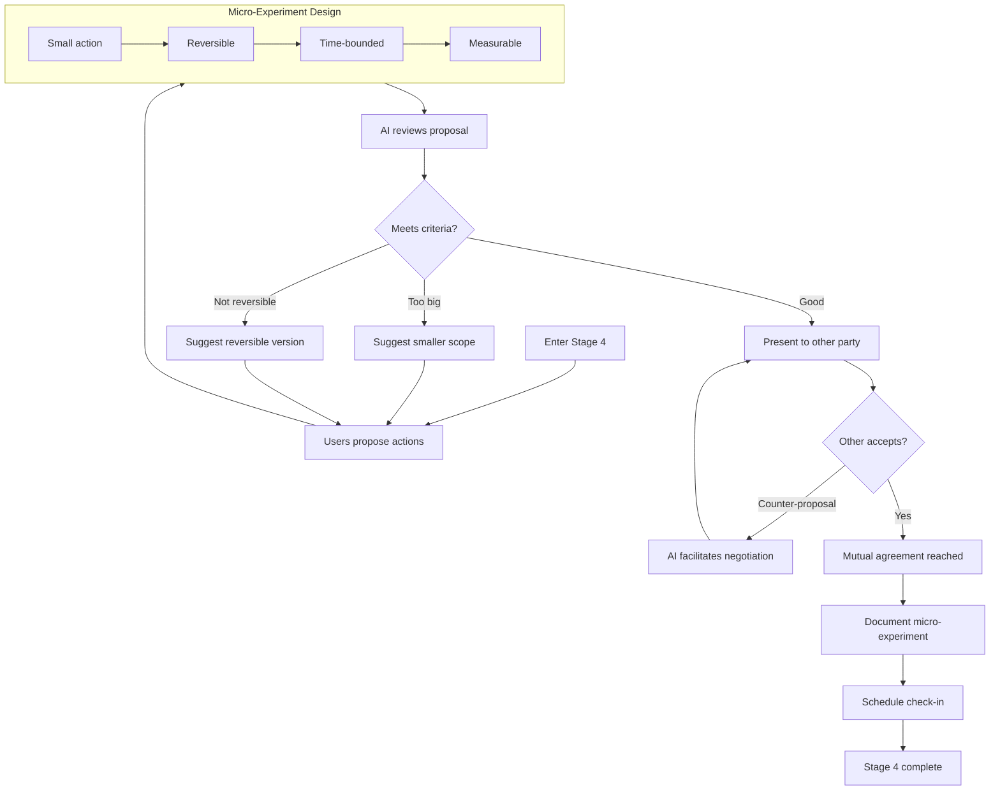
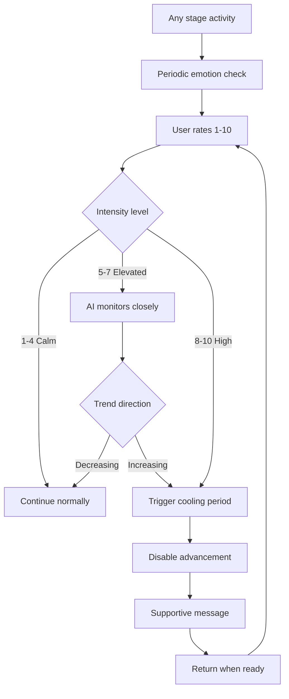
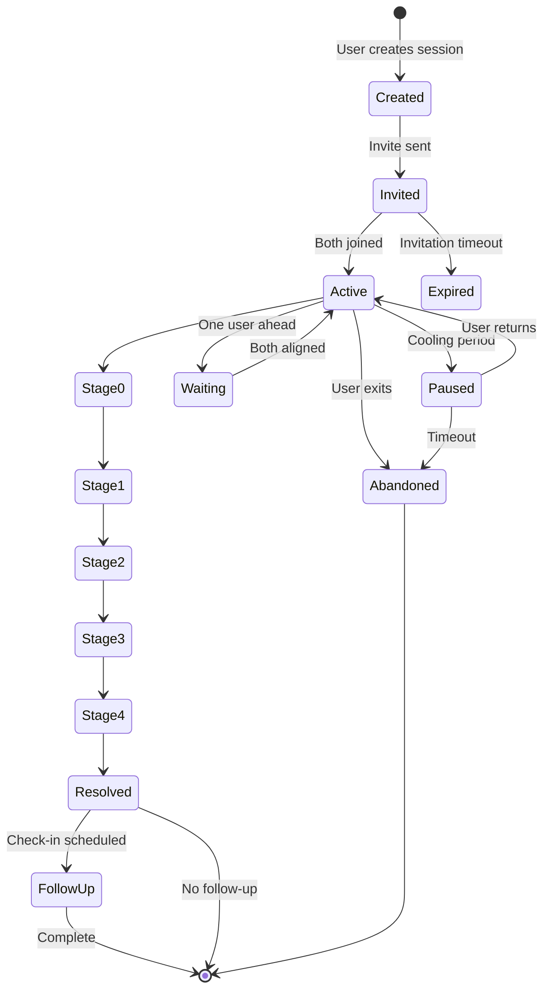

# User Journey

Complete flow through BeHeard from first contact to resolution.

## High-Level Journey

## Detailed Stage Flow with Success/Failure Loops

### Stage 0: Onboarding

**Success criteria:** Both users sign Curiosity Compact

**Failure paths:**
- User refuses compact - Session cannot proceed
- Other party never accepts invitation - Timeout with option to resend

---

### Stage 1: The Witness

**Success criteria:** Both users confirm "I feel fully heard by the AI"

**Failure paths:**
- Emotional intensity too high - Cooling period triggered
- User abandons session - Partner notified; can resume later
- User stuck in loop - AI offers alternative reflection approaches

---

### Stage 2: Perspective Stretch

**Success criteria:** User can accurately state the other persons needs without judgment

**Failure paths:**
- Repeated judgmental statements - Mirror intervention loop
- Emotional escalation - Barometer triggers cooling period
- User refuses to engage - Session paused; AI explains importance

---

### Stage 3: Need Mapping

**Success criteria:** At least one common-ground need identified (e.g., Safety, Respect, Connection)

**Failure paths:**
- No common ground apparent - AI explores deeper needs
- User rejects synthesis - Refinement loop
- Accusatory language - AI reframes to I/Needs statements

---

### Stage 4: Strategic Repair

**Success criteria:** Mutual agreement on at least one micro-experiment

**Failure paths:**
- No acceptable proposals - AI suggests options based on identified needs
- Repeated rejection - Return to need mapping for alignment
- Scope creep - AI enforces small, reversible constraint

---

## Cross-Cutting: Emotional Barometer

This mechanism operates across all stages:

See [Emotional Barometer](../mechanisms/emotional-barometer.md) for details.

---

## Session Lifecycle States

---

## Related Documents

- [Stage 0: Onboarding](../stages/stage-0-onboarding.md)
- [Stage 1: The Witness](../stages/stage-1-witness.md)
- [Stage 2: Perspective Stretch](../stages/stage-2-perspective-stretch.md)
- [Stage 3: Need Mapping](../stages/stage-3-need-mapping.md)
- [Stage 4: Strategic Repair](../stages/stage-4-strategic-repair.md)
- [Emotional Barometer](../mechanisms/emotional-barometer.md)

---

[Back to Overview](./index.md) | [Back to Plans](../index.md)
