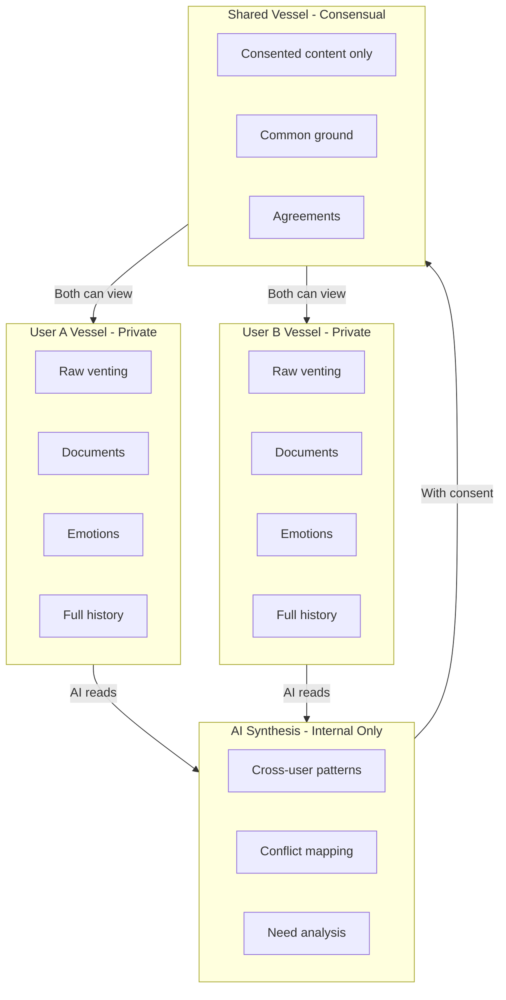

# Privacy Model

The Vessel architecture that protects user data and controls information flow.

## Documents

- **[Vessel Architecture](./vessel-model.md)** - The three-vessel privacy model

## Overview

BeHeard uses a three-vessel model to separate and protect data:

## Key Principles

| Principle | Implementation |
|-----------|---------------|
| Privacy by default | All user input starts private |
| Consent required | Nothing shared without explicit approval |
| Transformation | Raw content transformed before sharing |
| Revocable | Users can withdraw consent |
| Transparency | Users can see what has been shared |

---

[Back to Plans](../index.md)
