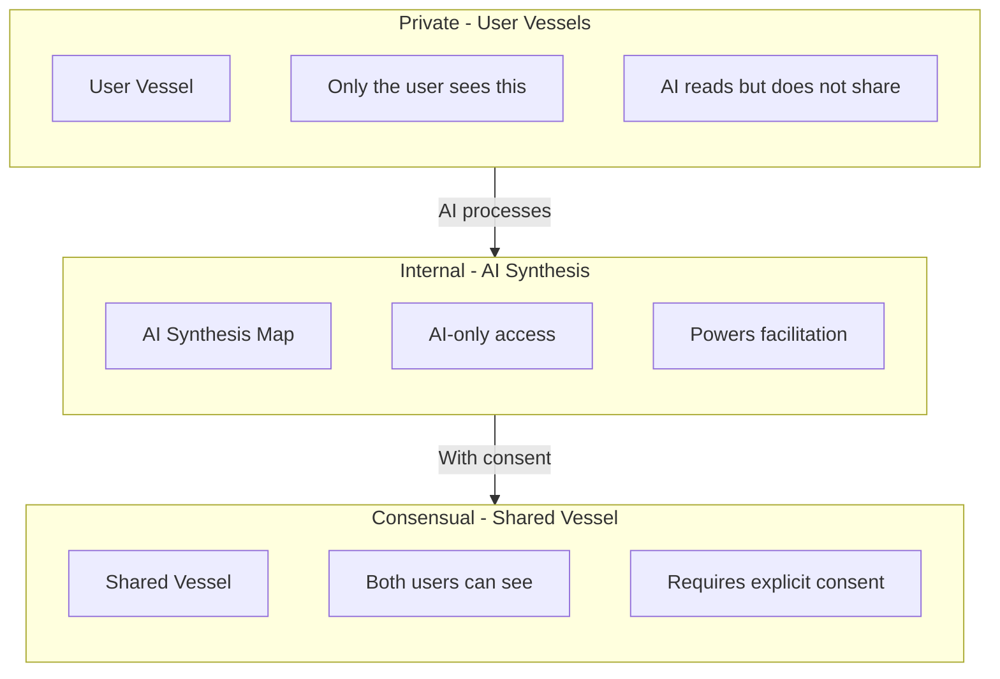
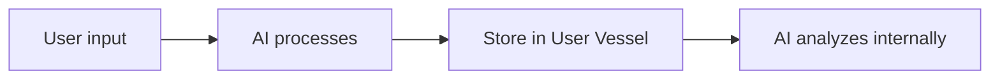
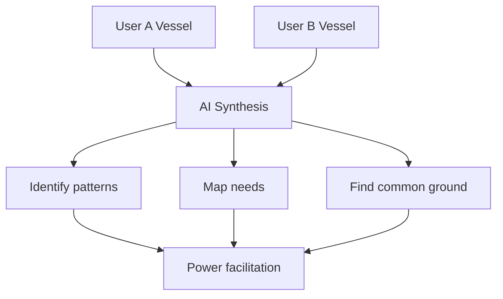
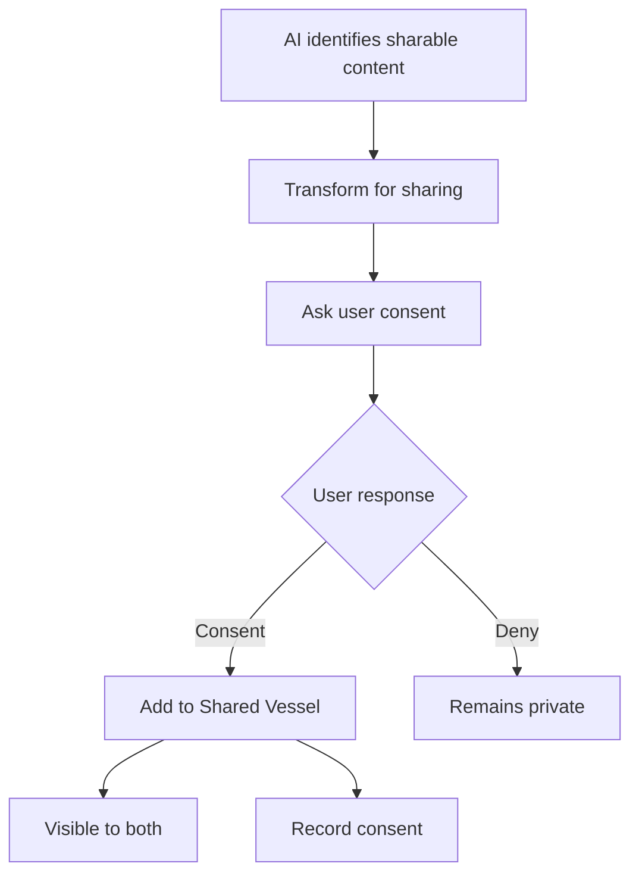
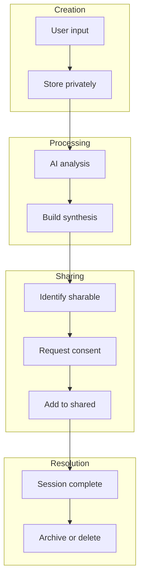
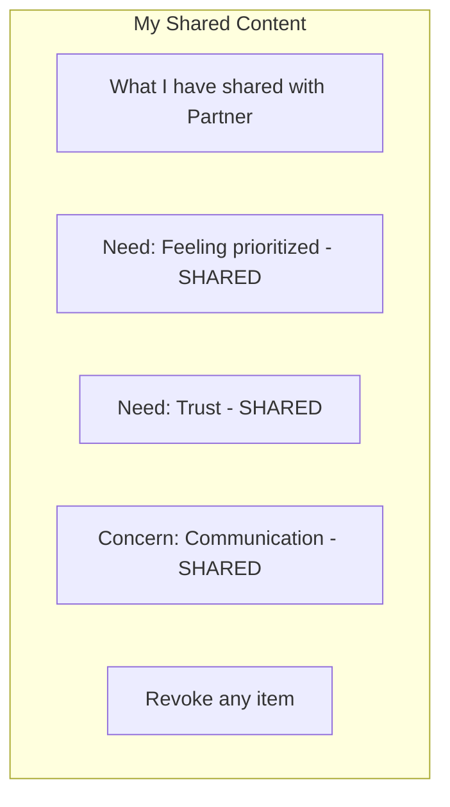

# Vessel Architecture

## The Three Vessels

BeHeard separates data into three distinct containers with different access rules.



## User Vessel (Private)

Each user has their own private vessel containing:

| Content | Description |
|---------|-------------|
| Raw input | Everything the user types or shares |
| Emotions | Barometer readings over time |
| Documents | Uploaded files and references |
| Events | Described situations and history |
| Interpretations | How user views events |
| Boundaries | What user will/wont accept |

### Access Rules

- **User**: Full read access
- **AI**: Full read access (for facilitation)
- **Other party**: No access whatsoever
- **System**: Encrypted storage

### Data Flow In



## AI Synthesis Map (Internal)

The AI maintains an internal working model:

| Content | Purpose |
|---------|---------|
| Need mapping | Identified needs for each user |
| Conflict patterns | Recurring dynamics |
| Common ground | Potential shared needs |
| Progress tracking | Where each user is in process |

### Access Rules

- **User**: No direct access
- **AI**: Full access
- **Other party**: No access
- **System**: Ephemeral (can be regenerated)

### How It Works



## Shared Vessel (Consensual)

Content visible to both parties, but only with consent.

| Content | How It Gets Here |
|---------|-----------------|
| Identified needs | User consents to share |
| Key concerns | User approves sharing |
| Common ground | Both confirm |
| Agreements | Mutual acceptance |
| Micro-experiments | Joint commitments |

### Access Rules

- **User A**: Full read access
- **User B**: Full read access
- **AI**: Full read/write access
- **System**: Permanent record

### Consent Flow



## Memory Object Structure

### User Memory Object

```
UserMemoryObject {
  user_id: string

  events: [
    {
      id: string
      description: string
      attributed_to: "self" | "other"
      emotions: [string]
      timestamp: datetime
    }
  ]

  emotions: [
    {
      timestamp: datetime
      intensity: 1-10
      context: string
    }
  ]

  needs: [
    {
      need: string
      evidence: [string]
      confirmed: boolean
    }
  ]

  values: [
    {
      value: string
      priority: number
    }
  ]

  documents: [
    {
      id: string
      type: string
      ai_interpretation: string
    }
  ]

  boundaries: [
    {
      boundary: string
      non_negotiable: boolean
    }
  ]

  micro_experiments: [
    {
      id: string
      description: string
      status: "proposed" | "agreed" | "completed"
    }
  ]
}
```

### Shared Memory Object

```
SharedMemoryObject {
  conflict_id: string
  participants: [user_id, user_id]

  consented_content: [
    {
      source_user: user_id
      original_id: string
      transformed_content: string
      consent_timestamp: datetime
      consent_active: boolean
    }
  ]

  common_ground: [
    {
      need: string
      confirmed_by: [user_id, user_id]
      timestamp: datetime
    }
  ]

  agreements: [
    {
      id: string
      description: string
      agreed_by: [user_id, user_id]
      status: string
      follow_up: datetime | null
    }
  ]

  stage_progress: {
    user_a: number
    user_b: number
    current_active: number
  }
}
```

## Data Lifecycle



## Privacy Guarantees

| Guarantee | Implementation |
|-----------|---------------|
| No auto-sharing | Every share requires explicit consent |
| Transformation | Raw content is never shared directly |
| Revocability | Users can withdraw consent |
| Transparency | Users can view all shared content |
| Encryption | Data encrypted at rest |
| Attribution | Clear source tracking |

## Viewing What Has Been Shared

Users can review their sharing:



---

## Related Documents

- [Consensual Bridge](../mechanisms/consensual-bridge.md)
- [System Guardrails](../mechanisms/guardrails.md)
- [User Journey](../overview/user-journey.md)

## Backend Implementation

- [Prisma Schema](../backend/data-model/prisma-schema.md) - Database implementation of the vessel architecture
- [Retrieval Contracts](../backend/state-machine/retrieval-contracts.md) - Per-stage data access enforcement

---

[Back to Privacy](./index.md) | [Back to Plans](../index.md)
