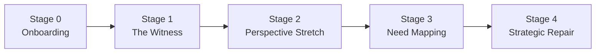
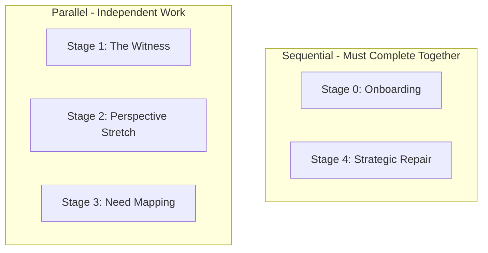

# Stages

BeHeard guides users through a structured five-stage process. Each stage has specific goals and advancement gates that must be satisfied before progressing.

## Stage Overview

## Documents

| Stage | Name | Purpose | Advancement Gate |
|-------|------|---------|-----------------|
| [Stage 0](./stage-0-onboarding.md) | Onboarding | Establish trust and process | Both sign Curiosity Compact |
| [Stage 1](./stage-1-witness.md) | The Witness | Deep reflection and being heard | Both feel fully heard |
| [Stage 2](./stage-2-perspective-stretch.md) | Perspective Stretch | Build empathy for other view | Can state other needs accurately; feels accurately reflected |
| [Stage 3](./stage-3-need-mapping.md) | Need Mapping | Identify universal needs | Common ground identified |
| [Stage 4](./stage-4-strategic-repair.md) | Strategic Repair | Commit to action | Agree on micro-experiment |

## Parallel vs Sequential Work

- **Stage 0 and 4**: Require coordination between both parties
- **Stages 1-3**: Users work at their own pace; system waits for both to complete before advancing

## Stage Enforcement

The AI enforces stage progression:
- Advancement buttons/prompts are **disabled** until gate conditions are met
- Users cannot skip ahead
- The system tracks each users progress independently
- Both must complete a stage before either can advance

## Backend Implementation

See [Retrieval Contracts](../backend/state-machine/retrieval-contracts.md) for the critical per-stage data access rules that enforce privacy at every stage.

---

[Back to Plans](../index.md)
