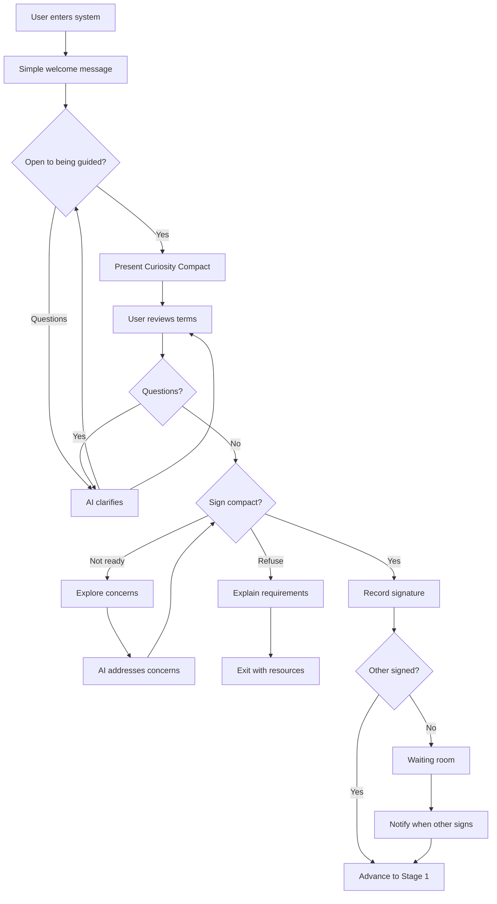

# Stage 0: Onboarding

## Purpose

Establish the Process Guardian role and secure commitment from both parties through the Curiosity Compact.

## AI Goal

- Acknowledge the courage it takes to begin this process
- Offer to guide both parties through a process of being heard
- Present the possibility of a win-win outcome
- Secure explicit agreement to proceed with curiosity rather than judgment

## Opening Message

The AI opens with a simple, warm message:

> "Congratulations [Name], you have taken the first step towards strengthening your connections. Are you open to me guiding you and [Partner] through a process where you both can be heard? I think there is a way we can find a win-win here."

This message:
- Celebrates the courage to begin
- Asks for consent to guide
- Frames the goal as mutual understanding
- Offers hope without overpromising

## Flow



## The Curiosity Compact

A commitment that both parties make before beginning:

```
I commit to:
- Approach this process with curiosity rather than certainty
- Allow the AI to guide the pace of our work
- Share honestly within my private space
- Consider the others perspective when presented
- Focus on understanding needs rather than winning arguments
- Take breaks when emotions run high

I understand that:
- The AI will not judge who is right or wrong
- My raw thoughts remain private unless I consent to share
- Progress requires both parties to complete each stage
- I can pause at any time but cannot skip ahead
```

## Wireframe: Onboarding Screen


## Success Criteria

Both users must sign the Curiosity Compact.

## Failure Paths

| Scenario | AI Response |
|----------|-------------|
| User has concerns | Explore concerns; provide reassurance |
| User refuses to sign | Explain this is required; offer resources for other options |
| Other party not responding | Send reminders; offer to resend invitation |
| Invitation expires | Allow session creator to send new invitation |

## Data Captured

- Signature timestamp for each user
- Any concerns raised (for improving onboarding)
- Invitation/acceptance timing

---

## Related Documents

- [User Journey](../overview/user-journey.md)
- [Next: Stage 1 - The Witness](./stage-1-witness.md)

---

[Back to Stages](./index.md) | [Back to Plans](../index.md)
