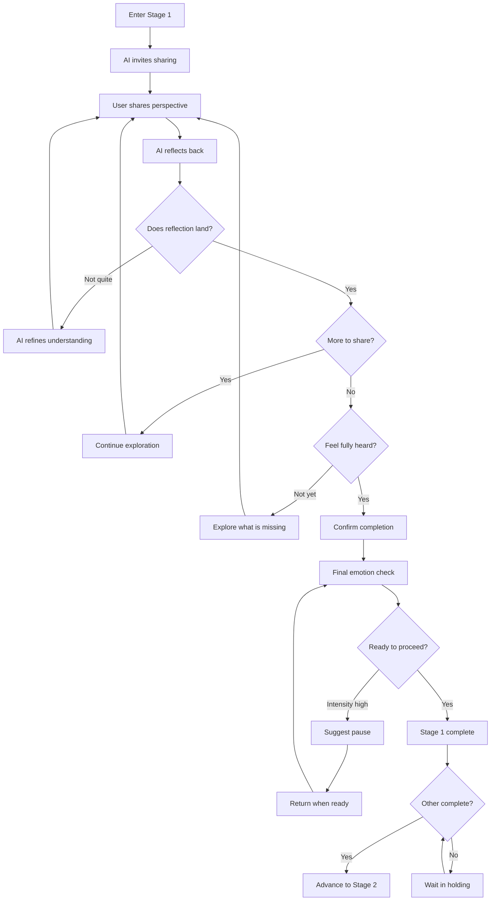
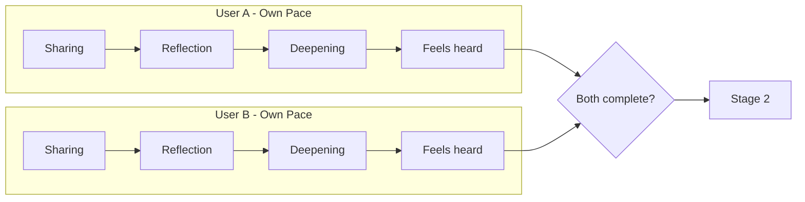
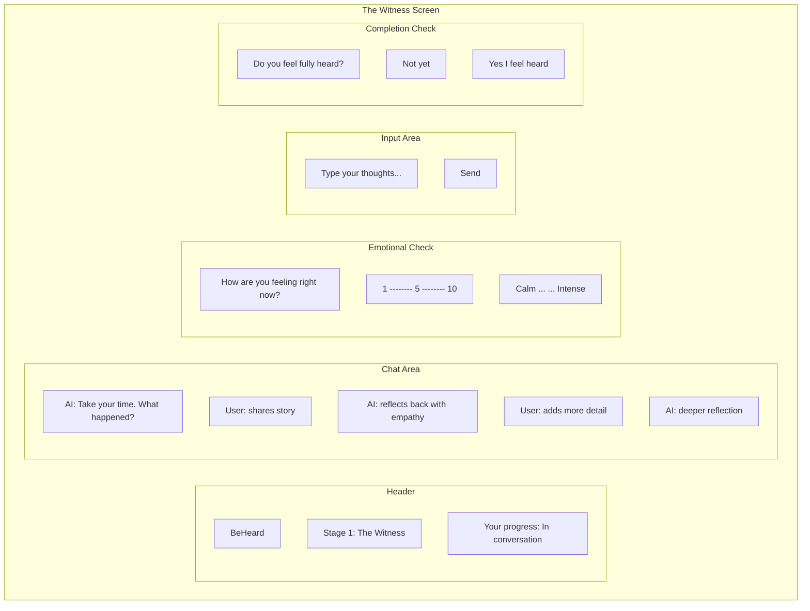

# Stage 1: The Witness

## Purpose

Provide each user with the experience of being deeply and fully heard by the AI, without interruption or judgment.

## AI Goal

- Create a safe space for venting and expression
- Reflect back what the user shares with accuracy and empathy
- Help users articulate feelings they may not have words for
- Continue until the user genuinely feels heard

## Open-Ended Design

Stage 1 is intentionally **open-ended with no suggested prompts or options**. This design choice:

- Allows the user to share freely without being guided toward specific responses
- Enables assessment of how well the AI listens and reframes
- Creates authentic space for natural expression
- Avoids leading questions that might shape the narrative

The AI simply invites sharing and then responds with empathetic reflection. The user types freely in an open text field.

## Flow

## Parallel Processing

Both users work through Stage 1 simultaneously but independently:

## AI Reflection Techniques

The AI uses several approaches to help users feel heard:

| Technique | Example |
|-----------|---------|
| Paraphrase | "So what I hear is that when X happened, you felt Y..." |
| Emotion naming | "It sounds like there is a lot of frustration there, maybe even some hurt underneath?" |
| Validation | "That sounds really difficult. It makes sense you would feel that way." |
| Gentle probing | "When you say it felt unfair, can you tell me more about what fairness means to you here?" |
| Summarizing | "Let me see if I can capture what you have shared so far..." |

## Wireframe: Witness Chat Interface

## Success Criteria

User explicitly confirms: "I feel fully heard by the AI"

This is a subjective assessment that the user must make. The AI cannot advance them without this confirmation.

## Failure Paths

| Scenario | AI Response |
|----------|-------------|
| User stuck or silent | Offer prompts; acknowledge difficulty |
| Emotional intensity spikes | Trigger cooling period via barometer |
| User wants to vent about other person | Allow initially; gently redirect to feelings and needs |
| User says "heard" but seems rushed | Gently check if they want more time |

## Data Captured

- All user input (private to User Vessel)
- AI reflections and summaries
- Emotional barometer readings over time
- Confirmation timestamp

## Privacy Note

Everything shared in Stage 1 remains in the users private Vessel. The AI synthesizes insights internally but does not share raw content with the other party.

---

## Related Documents

- [Previous: Stage 0 - Onboarding](./stage-0-onboarding.md)
- [Next: Stage 2 - Perspective Stretch](./stage-2-perspective-stretch.md)
- [Emotional Barometer](../mechanisms/emotional-barometer.md)

---

[Back to Stages](./index.md) | [Back to Plans](../index.md)
