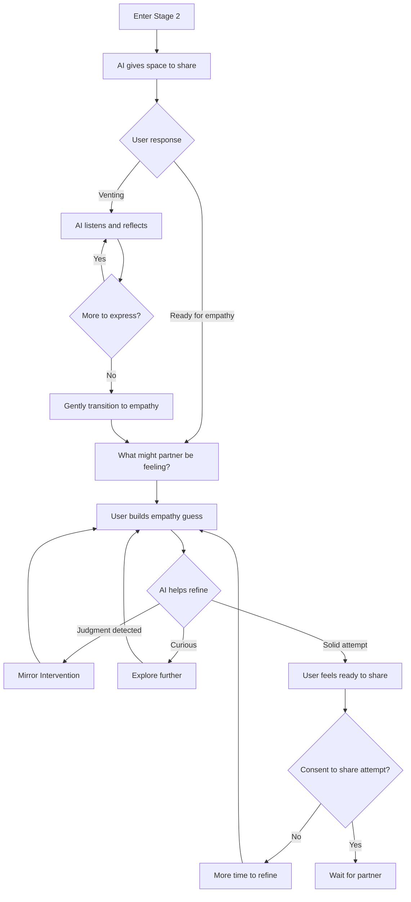
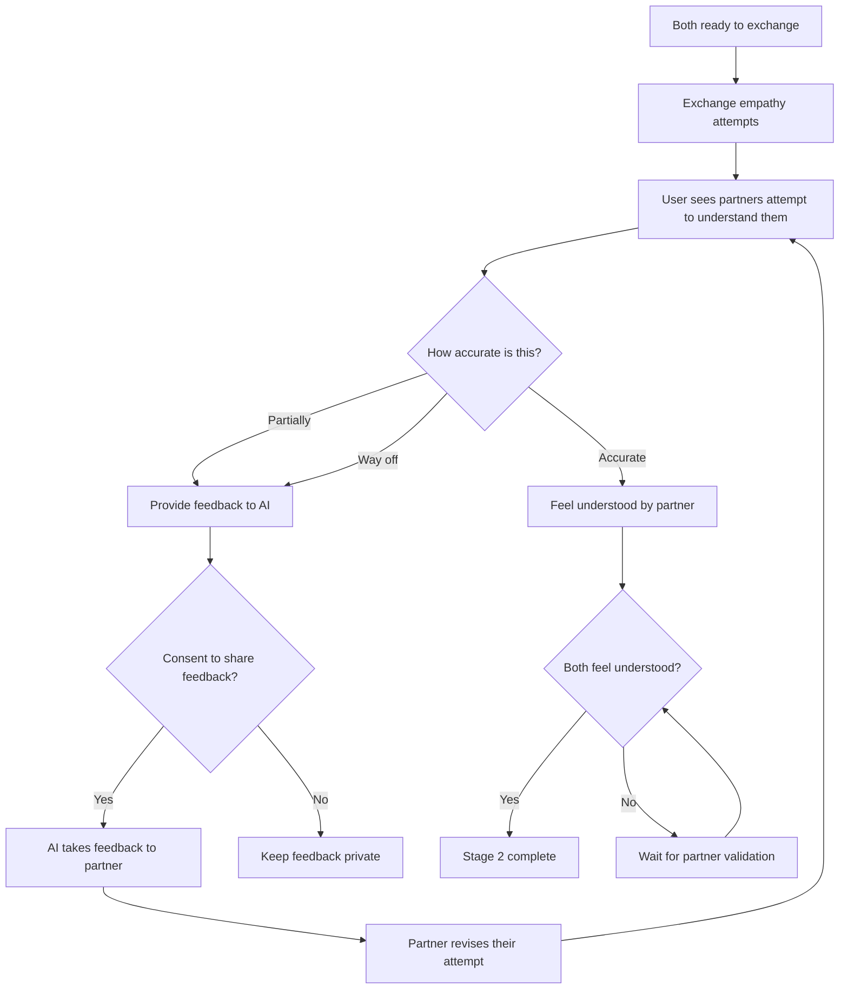
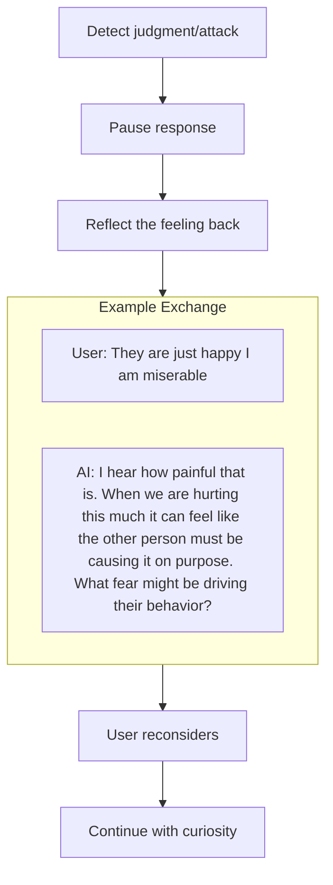
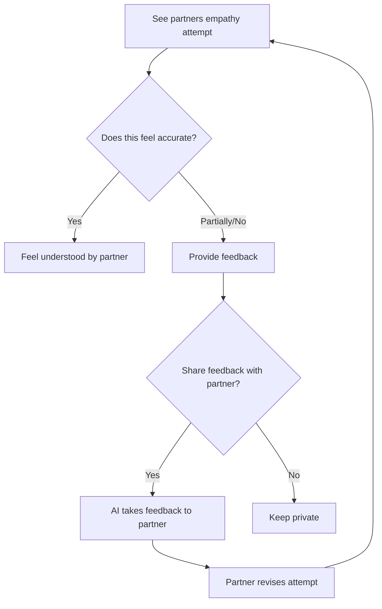
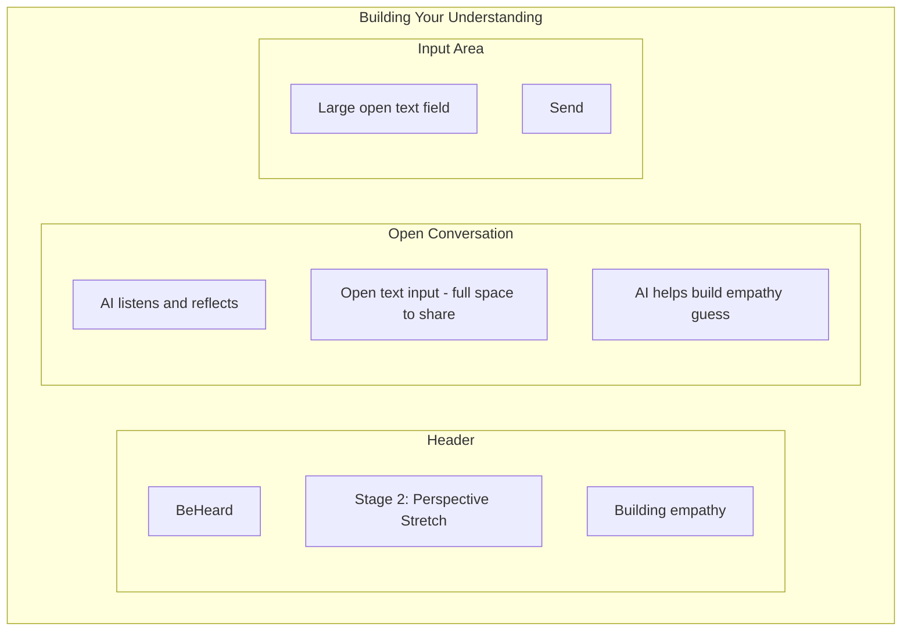
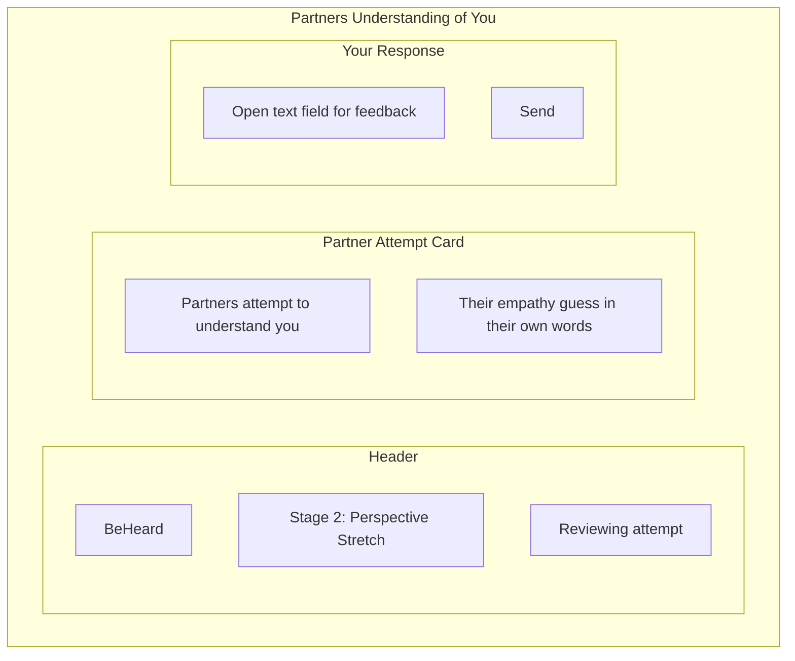

# Stage 2: Perspective Stretch

## Purpose

Build genuine empathy by helping each user understand the other persons perspective, needs, and experience.

## AI Goal

- **Demonstrate skilled listening** - give space to share, do not limit options or steer
- Allow venting - residual frustration from Stage 1 is normal, and being heard soothes
- Do not tell users what they are thinking or feeling unless reflecting what they just said
- Guide toward building their best empathy guess about their partner
- Facilitate mutual exchange of empathy attempts (with consent)
- Help refine understanding until both parties feel accurately understood by each other
- Monitor for judgment, attacks, or dismissiveness
- Use Mirror Intervention when needed

## Key Design Principle: Mutual Empathy Exchange

Stage 2 does **not** share partner content automatically. The AI holds partner information confidential until explicit consent is given. This is intentional:

- Immediately sharing the partner's words can trigger defensiveness
- People are more likely to accept perspectives they arrive at themselves
- The goal is for each person to feel understood **by the other person**, not just by the AI
- Venting may still occur - Stage 1 does not always exhaust all frustration

### The Listening Philosophy

When someone wants to be heard, give them space:
- Do not limit their options or steer their responses
- Do not tell them what they are thinking or feeling
- Only reflect back what they just said
- Let them get all the anger out - this serves dual purposes:
  1. Gathering information about their experience
  2. Soothing frustration by being genuinely heard

The AI demonstrates what skilled listening looks like. Focus on listening rather than rushing to answers or the next stage.

## Flow

### Phase 1: Building the Empathy Guess

Each user works independently with the AI to build their best guess at what their partner is experiencing.



### Phase 2: Mutual Exchange

Both parties consent to exchange their empathy attempts.



### Optional: AI-Assisted Hints

If a user is stuck, the AI may offer a hint about the partner's perspective.

**Key constraints:**
- Hints are only available if partner has already shared content to SharedVessel
- No new consent request is sent to partner (they already consented when sharing)
- User must explicitly accept the hint offer
- If no partner content is available, AI offers alternative support (reframing, universal needs)
- Hints inform AI questions - partner content is never quoted directly

See [Hint System](../mechanisms/hint-system.md) for the full design.

## Mirror Intervention

When judgment or attack patterns are detected, the AI uses reflection to redirect:



See [Mirror Intervention](../mechanisms/mirror-intervention.md) for details.

## What Gets Shared

Nothing is shared without explicit consent. The AI holds all partner information confidential.

| Shared (with consent) | Never shared automatically |
|----------------------|---------------------------|
| User's empathy attempt | Partner's raw words |
| Feedback on accuracy | Venting or accusations |
| Revised attempts | Any content without consent |

The [Consensual Bridge](../mechanisms/consensual-bridge.md) mechanism controls this.

## The Empathy Attempt

Each user builds their best guess at what their partner is experiencing:

```
AI: [After listening] "What do you imagine [Partner] might be
    feeling about this situation?"

User: [Builds their attempt - open-ended, not steered]

AI: [Reflects, helps refine without telling them what to think]
```

**Readiness criteria:**
- User feels they have put together their best guess
- Attempt shows genuine curiosity (not just going through motions)
- User consents to share this attempt with partner

## Receiving Partner's Attempt

Each user sees the other's attempt to understand them - not AI-curated content, but the partner's own words trying to empathize.

### Validation Loop



The loop continues until:
- The user confirms they feel accurately understood by their partner
- Or the user chooses to proceed

### Why This Matters

This exchange:
- Both parties end up feeling understood **by each other**, not just by the AI
- Creates genuine mutual understanding through iterative effort
- The partner's attempt to understand (even if imperfect) demonstrates care
- Builds foundation for genuine repair in later stages

## Wireframe: Perspective Stretch Interface

### Phase 1: Building Empathy Guess



### Phase 2: Viewing Partner Attempt



## Success Criteria

1. User has built their best empathy guess about partner
2. User has consented to share their attempt
3. User has seen partner's attempt to understand them
4. User feels accurately understood by partner (or chooses to proceed)

## Failure Paths

| Scenario | AI Response |
|----------|-------------|
| Repeated judgment in empathy attempt | Persistent Mirror Intervention; explore source of judgment |
| Cannot imagine partner perspective | Give more space; offer (with consent) helpful hint from partner |
| Emotional escalation | Barometer triggers cooling period |
| User tries to skip | Explain gate requirement; offer support |
| Partner attempt feels way off | Facilitate feedback loop; help partner revise |
| Refuses to share empathy attempt | Explore hesitation; acknowledge vulnerability; allow time |

## Data Captured

- Venting content (private, for AI understanding only)
- User's empathy attempt drafts
- Consent decisions
- Feedback on partner's attempt
- Mirror interventions used
- Revision iterations until validation

---

## Related Documents

- [Previous: Stage 1 - The Witness](./stage-1-witness.md)
- [Next: Stage 3 - Need Mapping](./stage-3-need-mapping.md)
- [Mirror Intervention](../mechanisms/mirror-intervention.md)
- [Consensual Bridge](../mechanisms/consensual-bridge.md)

### Backend Implementation

- [Stage 2 API](../backend/api/stage-2.md) - Empathy exchange endpoints
- [Stage 2 Prompt](../backend/prompts/stage-2-perspective.md) - Perspective prompt template
- [Mirror Intervention Prompt](../backend/prompts/mirror-intervention.md)
- [Consent API](../backend/api/consent.md)
- [Retrieval Contracts](../backend/state-machine/retrieval-contracts.md#stage-2-perspective-stretch)

---

[Back to Stages](./index.md) | [Back to Plans](../index.md)
