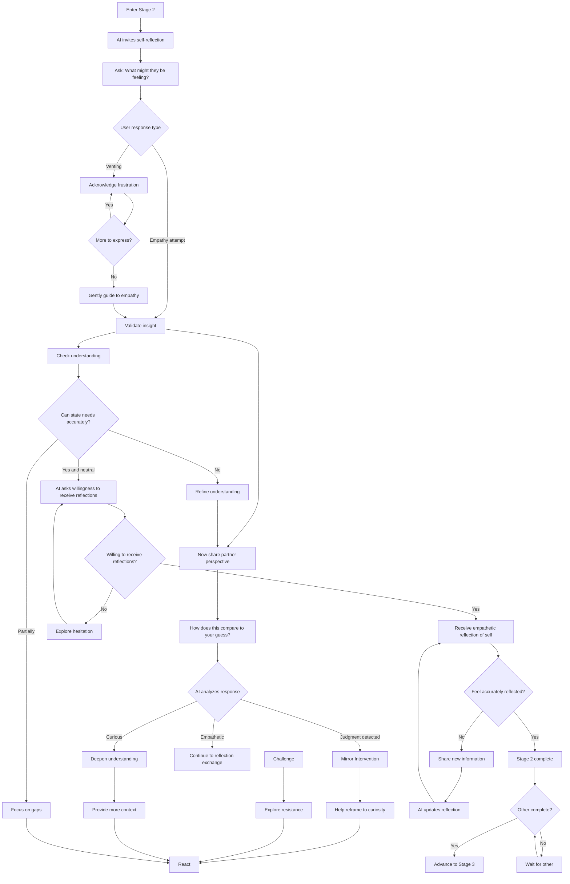
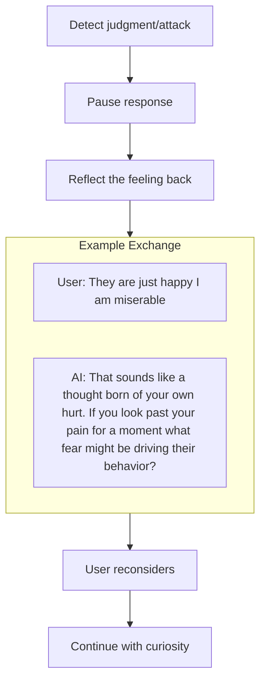
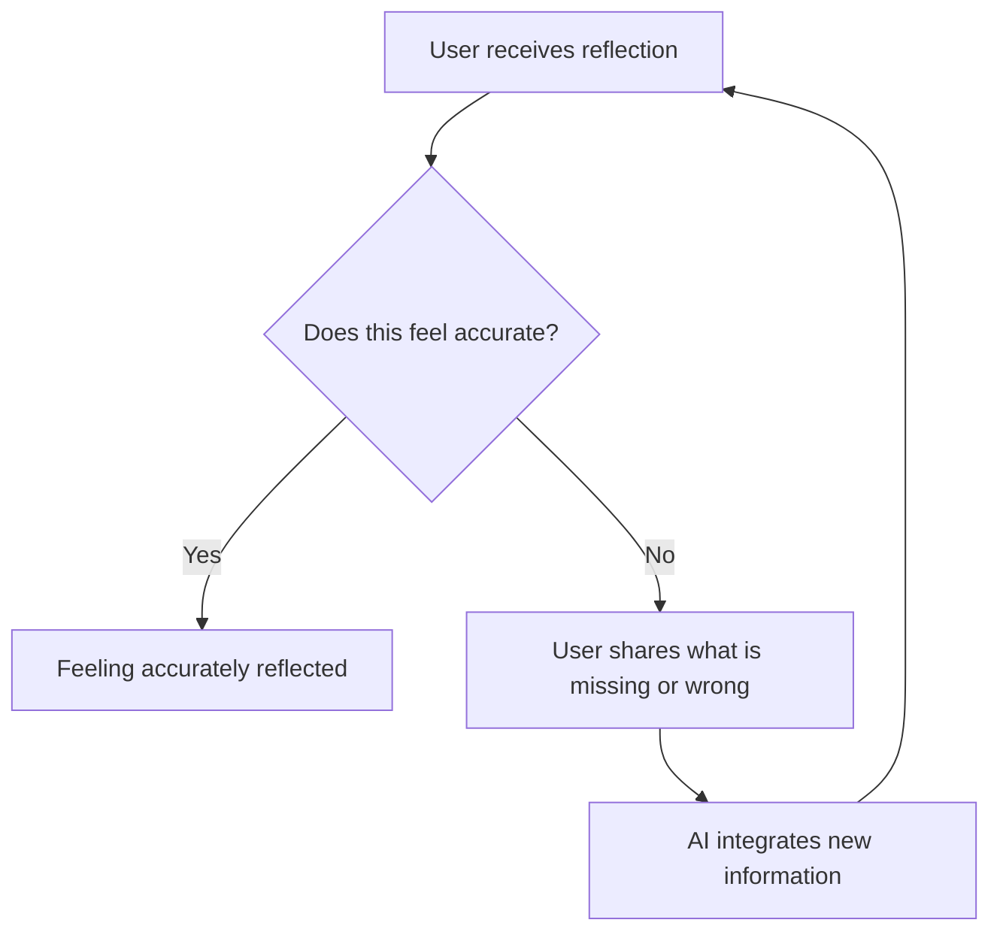
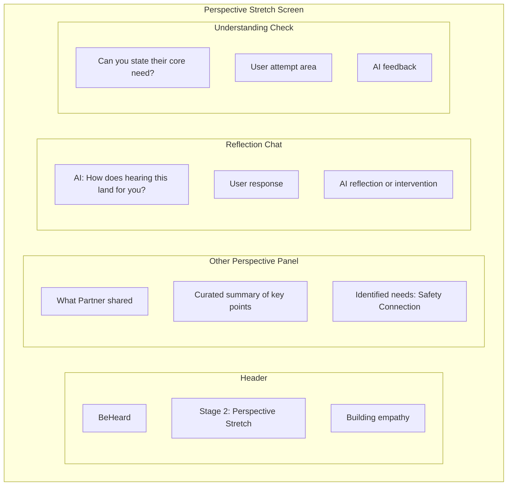

# Stage 2: Perspective Stretch

## Purpose

Build genuine empathy by helping each user understand the other persons perspective, needs, and experience.

## AI Goal

- Create space for self-generated empathy before revealing partner's words
- Allow venting if needed - residual frustration from Stage 1 is normal
- Gently guide toward perspective-taking
- Only then present the other persons perspective (curated, consented content only)
- Monitor for judgment, attacks, or dismissiveness
- Use Mirror Intervention when needed
- Confirm the user can accurately state the other persons needs without judgment

## Key Design Principle: Self-Generated Empathy First

Stage 2 does **not** start by presenting what the other person said. This is intentional:

- Immediately sharing the partner's words can trigger defensiveness
- People are more likely to accept perspectives they arrive at themselves
- Venting may still occur - Stage 1 does not always exhaust all frustration
- Self-generated empathy creates readiness to receive the other's actual words

The AI first asks: "What do you imagine they might be feeling about this situation?"

## Flow



## Mirror Intervention

When judgment or attack patterns are detected, the AI uses reflection to redirect:



See [Mirror Intervention](../mechanisms/mirror-intervention.md) for details.

## What Gets Shared

The AI curates what each user sees about the other:

| Shared | Not Shared |
|--------|------------|
| Core needs identified | Raw venting language |
| Key concerns | Accusations or attacks |
| Emotional impact summary | Detailed grievance lists |
| Consented specific content | Anything not explicitly approved |

The [Consensual Bridge](../mechanisms/consensual-bridge.md) mechanism controls this.

## Accuracy Check

The AI verifies understanding by asking the user to state the other persons needs:

```
AI: "Based on what we have discussed, can you describe what you
    think [Partner] needs most from this situation?"

User: [Attempts to articulate]

AI: [Evaluates for accuracy and judgment-free language]
```

**Pass criteria:**
- Identifies at least one genuine need
- States it without blame or sarcasm
- Shows some understanding of why that need matters to the other person

## Empathetic Reflection Exchange

After understanding the other person, each user is invited to receive an empathetic reflection of themselves from the other persons perspective.

### Willingness Check

```
AI: "You have done meaningful work understanding [Partner]'s perspective.
    Now I would like to offer you something: an empathetic reflection of
    you, based on what [Partner] has shared. This can help you see how
    you are being experienced. Are you open to receiving this?"
```

**If hesitant:** The AI explores the resistance gently, acknowledging that receiving reflection can feel vulnerable. The user is never forced.

### Receiving the Reflection

The AI presents a curated, empathetic summary of how the other person experiences the user:
- Framed without blame or attack
- Focused on impact and experience rather than judgment
- Drawn from consented content only

### Accuracy Loop



The user can share new information until they feel the reflection accurately captures their experience and intent. This loop continues until:
- The user confirms they feel accurately reflected
- Or the user chooses to proceed without full agreement

### Why This Matters

This exchange:
- Helps users see their blind spots with compassion
- Ensures both parties feel seen before moving to solutions
- Creates symmetry in the perspective-taking process
- Builds foundation for genuine repair in later stages

## Wireframe: Perspective Stretch Interface



## Success Criteria

1. User can accurately state the other persons needs without judgment
2. User has received and acknowledged empathetic reflection of themselves
3. User feels accurately reflected (or chooses to proceed)

## Failure Paths

| Scenario | AI Response |
|----------|-------------|
| Repeated judgment | Persistent Mirror Intervention; explore source of judgment |
| Complete dismissal | Acknowledge difficulty; return to Stage 1 if needed |
| Emotional escalation | Barometer triggers cooling period |
| User tries to skip | Explain gate requirement; offer support |
| Refuses reflection | Acknowledge vulnerability; explore gently; allow proceeding if firm |
| Disputes reflection accuracy | Invite new information; update reflection; iterate until resolved |

## Data Captured

- User reactions to other perspective
- Accuracy check attempts
- Mirror interventions used
- Progress toward empathy
- Willingness to receive reflection
- Reflection accuracy feedback
- New information shared during accuracy loop

---

## Related Documents

- [Previous: Stage 1 - The Witness](./stage-1-witness.md)
- [Next: Stage 3 - Need Mapping](./stage-3-need-mapping.md)
- [Mirror Intervention](../mechanisms/mirror-intervention.md)
- [Consensual Bridge](../mechanisms/consensual-bridge.md)

---

[Back to Stages](./index.md) | [Back to Plans](../index.md)
