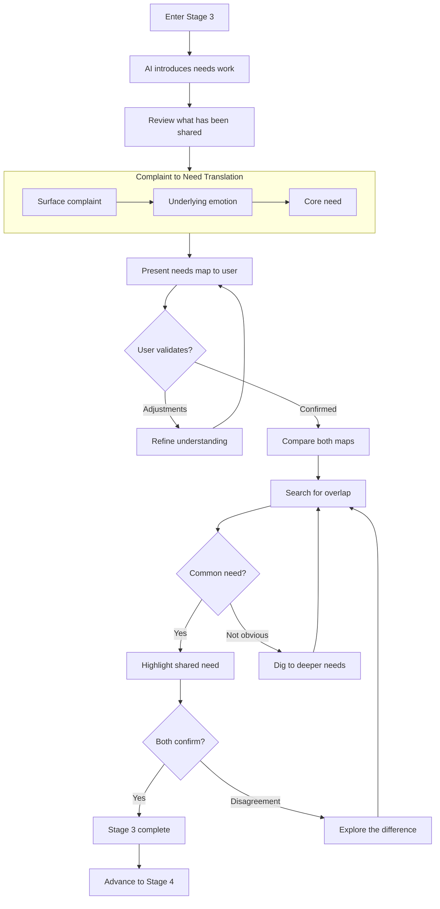
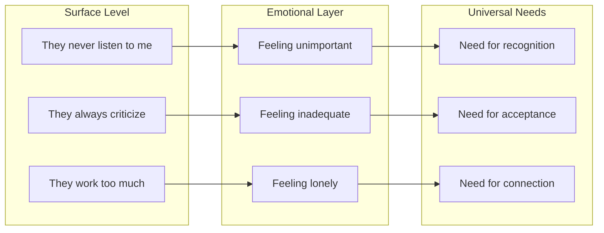
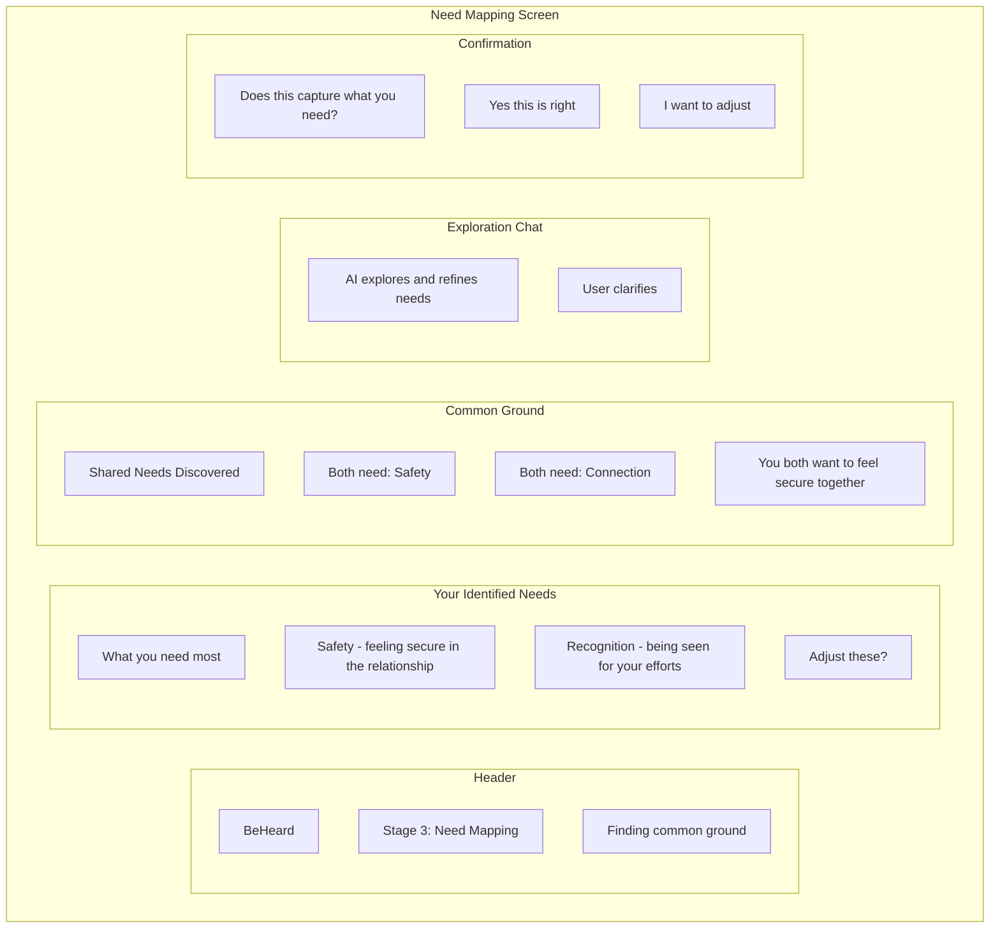
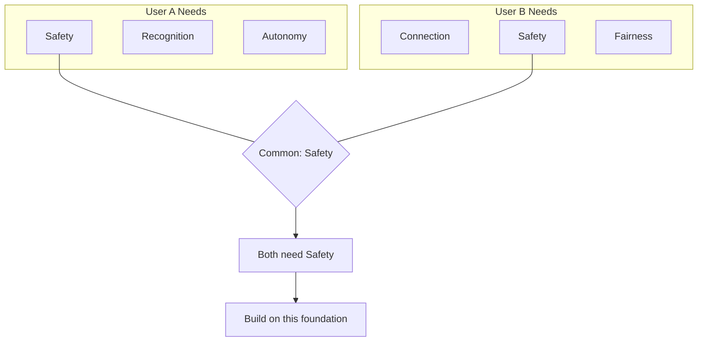

# Stage 3: Need Mapping

## Purpose

Transition from surface-level stories and complaints to identifying universal human needs that both parties share.

## AI Goal

- Synthesize underlying needs from each users sharing
- Translate complaints and positions into needs language
- Identify at least one common-ground need
- Reframe accusations into I-statements and needs

## Flow

## From Stories to Needs

## Universal Needs Framework

The AI maps to universal human needs:

| Category | Example Needs |
|----------|---------------|
| **Safety** | Security, stability, predictability, protection |
| **Connection** | Belonging, intimacy, closeness, understanding |
| **Autonomy** | Freedom, choice, independence, self-determination |
| **Recognition** | Appreciation, acknowledgment, respect, being seen |
| **Meaning** | Purpose, contribution, growth, significance |
| **Fairness** | Justice, equality, reciprocity, balance |

## Accusation Reframing

The AI transforms accusatory language:

| Original Statement | Reframed to Needs |
|--------------------|-------------------|
| "You never help around the house" | "I have a need for partnership and shared responsibility" |
| "You always take their side" | "I need to feel like you are on my team" |
| "You care more about work than me" | "I need quality time and to feel prioritized" |

## Wireframe: Need Mapping Interface

## Success Criteria

At least one common-ground need is identified and confirmed by both parties.

## Common Ground Discovery

## Failure Paths

| Scenario | AI Response |
|----------|-------------|
| No obvious overlap | Dig deeper - surface needs often share deeper roots |
| User rejects need synthesis | Refine and re-present; ask clarifying questions |
| Accusatory language persists | Apply reframing; return to Stage 2 if needed |
| One user dominates narrative | Balance attention; ensure both needs are mapped |

## Data Captured

- Identified needs for each user
- Common ground discovered
- Reframing transformations applied
- Confirmation of accuracy

---

## Related Documents

- [Previous: Stage 2 - Perspective Stretch](./stage-2-perspective-stretch.md)
- [Next: Stage 4 - Strategic Repair](./stage-4-strategic-repair.md)
- [System Guardrails](../mechanisms/guardrails.md)

---

[Back to Stages](./index.md) | [Back to Plans](../index.md)
