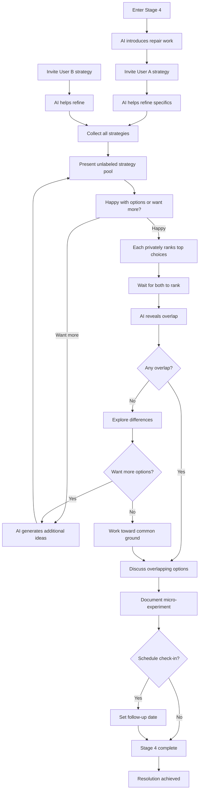
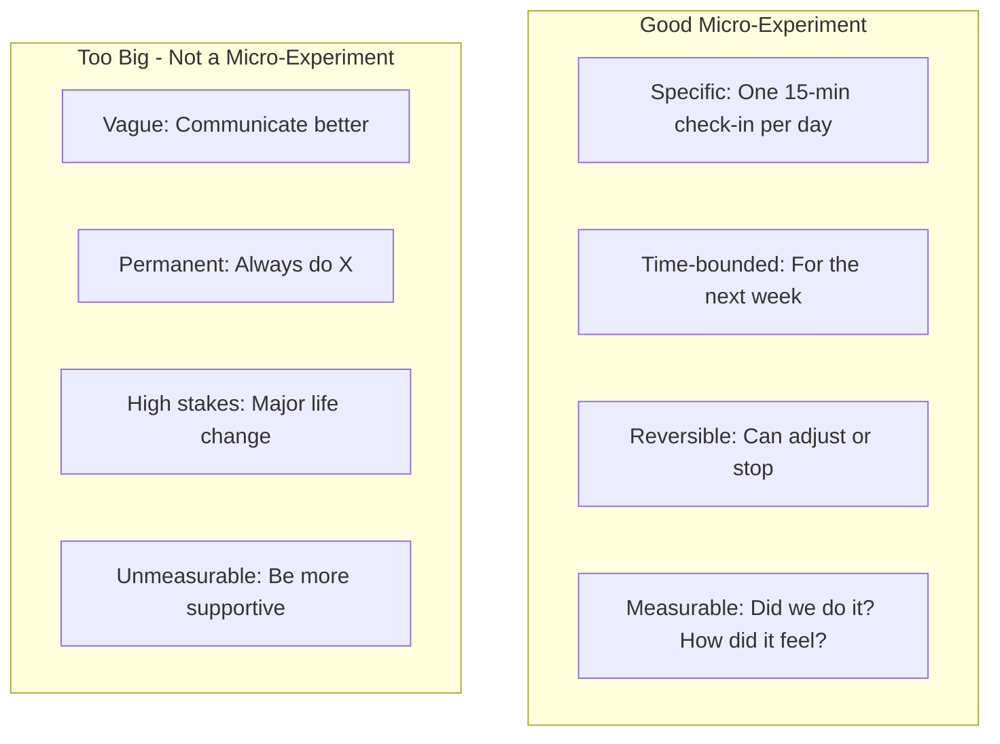
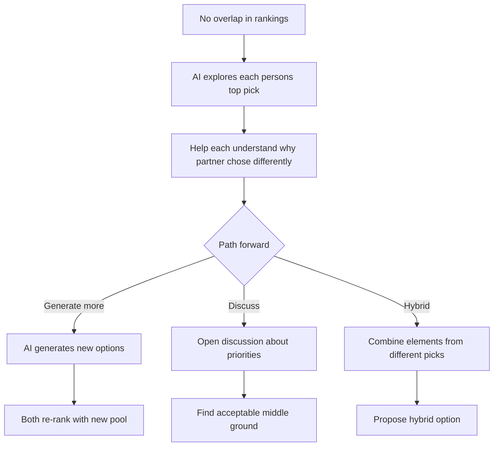
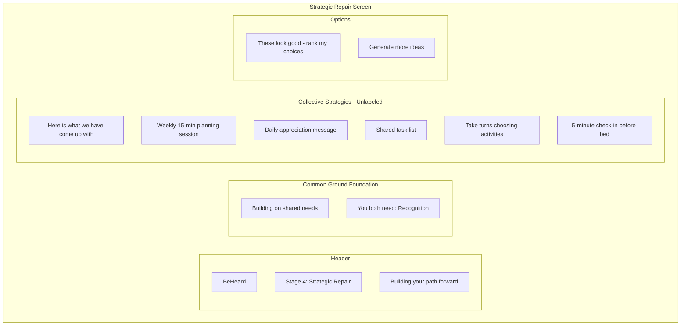
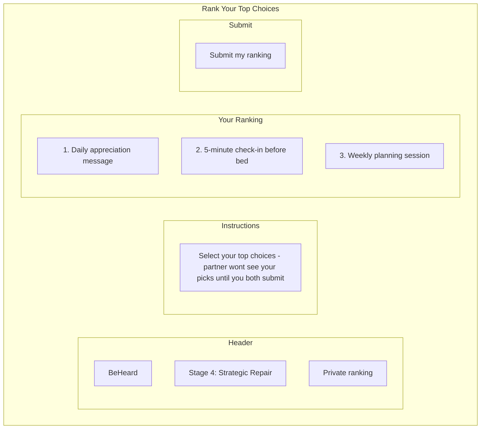
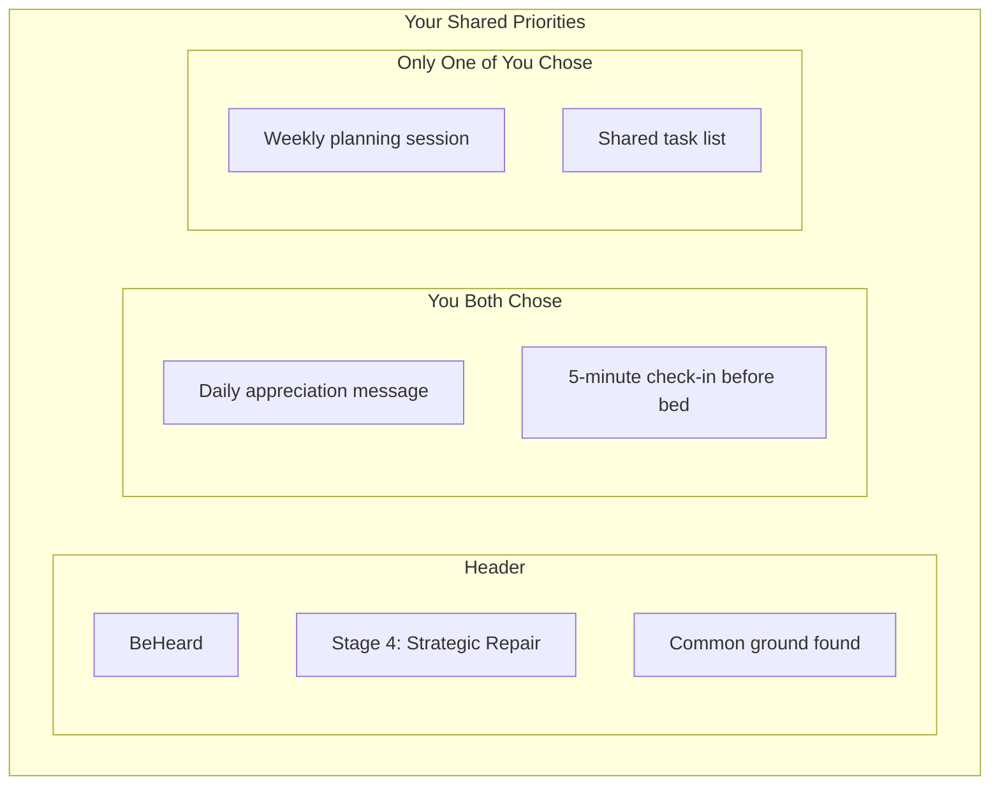
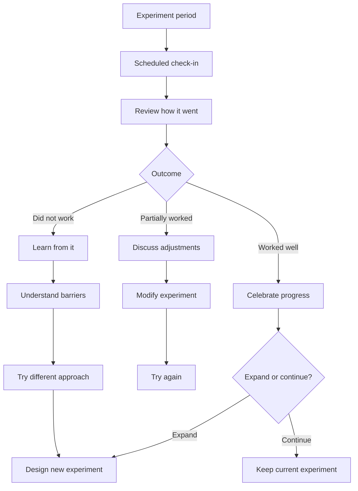

# Stage 4: Strategic Repair

:::tip See it in action
<a href="/demo/features/follow-up.html" onClick="window.location.href='/demo/features/follow-up.html'; return false;">Try the Follow-up Check-in demo</a> - Experience the post-agreement check-in that ensures accountability.
:::

## Purpose

Move from understanding to action by designing small, reversible experiments that address identified needs.

## AI Goal

- Invite **both users** to propose their own strategies
- Help refine proposals to be small, reversible, and time-bounded
- Collect and combine suggestions from both parties
- Present all strategies as **unlabeled options** (no attribution to source)
- Allow users to select from the combined pool
- Offer to generate additional AI suggestions if desired
- Document agreed-upon micro-experiments

## Key Design: Collaborative Strategy Generation

Unlike traditional negotiation where one person proposes and the other reacts, Stage 4 invites **both parties to contribute strategies independently**. The AI then:

1. Collects strategies from both users
2. Presents them as a single unlabeled pool (no attribution to source)
3. Asks: "Here is what we have come up with so far. Are you happy with these options, or would you like me to try and generate a few more to explore?"
4. Each person **privately ranks their top choices**
5. AI reveals where selections overlap

This approach:
- Removes defensiveness that comes with accepting another's proposal
- Creates joint ownership of solutions
- Avoids win/lose dynamics
- Encourages creativity when users can build on unlabeled ideas
- Private ranking removes pressure of visible negotiation
- Overlap emerges naturally without either person feeling like they gave in

## Flow



## Micro-Experiment Design

The AI helps users design experiments that are:



## Example Micro-Experiments

| Need Addressed | Micro-Experiment |
|----------------|------------------|
| Connection | "We will have a 10-minute phone-free conversation at dinner for 5 days" |
| Recognition | "I will say one specific thing I appreciate each morning for a week" |
| Safety | "We will use a pause signal when conversations get heated and take 5 minutes" |
| Fairness | "We will alternate who chooses weekend activities for the next month" |

## When No Overlap Exists

If private rankings reveal no overlap, the AI facilitates finding common ground:



## Wireframe: Strategic Repair Interface

### Strategy Pool View



### Private Ranking View



### Overlap Reveal View



**Key visual elements:**
- Strategy options are presented without labels indicating who suggested them
- All buttons use soft, neutral colors (no "yours" vs "theirs" styling)
- Ranking is private until both submit
- Overlap is revealed together, celebrating common ground

## Success Criteria

Mutual agreement on at least one micro-experiment.

## Agreement Documentation

When users agree, the AI documents:

```
MICRO-EXPERIMENT AGREEMENT
--------------------------
Participants: [User A], [User B]
Date agreed: [Date]

Experiment: [Specific description]
Duration: [Time period]
Success measure: [How to know if it worked]

Check-in scheduled: [Date/time if applicable]
```

## Failure Paths

| Scenario | AI Response |
|----------|-------------|
| No proposals generated | AI suggests options based on identified needs |
| Repeated rejection | Explore what would work; may need to return to need mapping |
| Proposals too ambitious | Help scope down; emphasize "small and reversible" |
| One party uncooperative | Acknowledge difficulty; explore barriers |

## Follow-Up Support

If users schedule a check-in:



## Data Captured

- Proposals made
- Negotiation history
- Agreed experiments
- Follow-up schedules
- Check-in outcomes (if applicable)

---

## Related Documents

- [Previous: Stage 3 - Need Mapping](./stage-3-need-mapping.md)
- [User Journey](../overview/user-journey.md)
- [System Guardrails](../mechanisms/guardrails.md)

---

[Back to Stages](./index.md) | [Back to Plans](../index.md)
