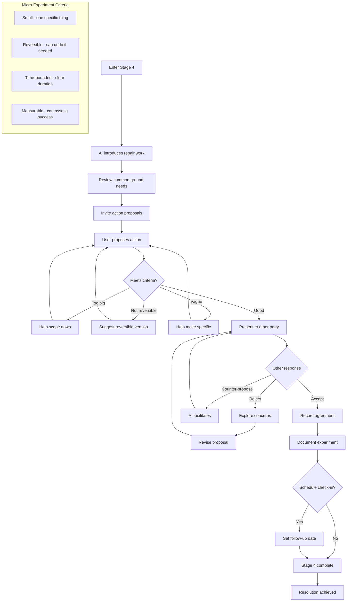
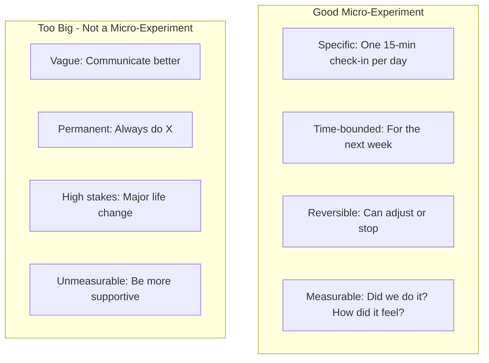
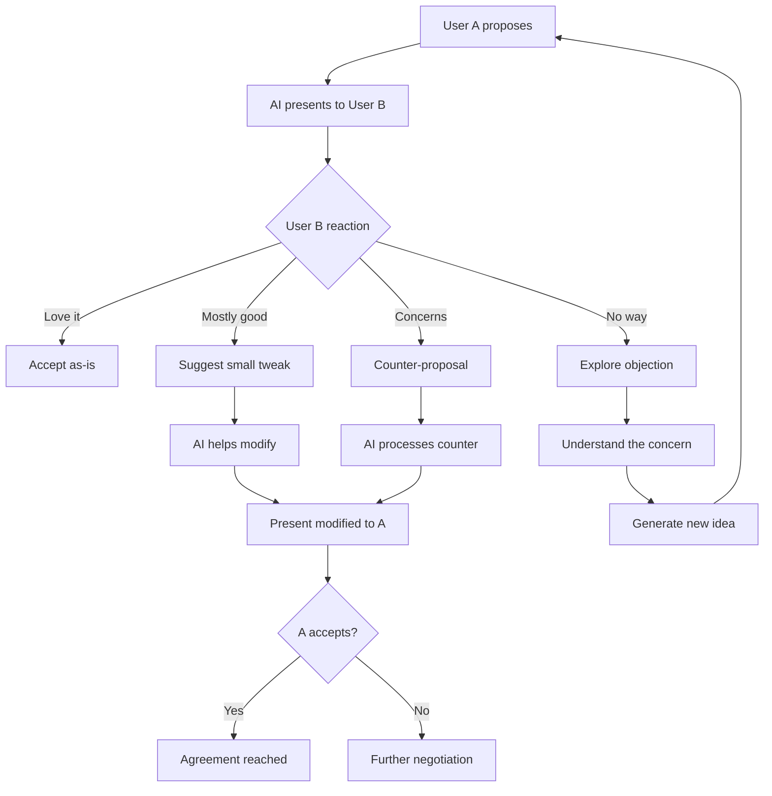
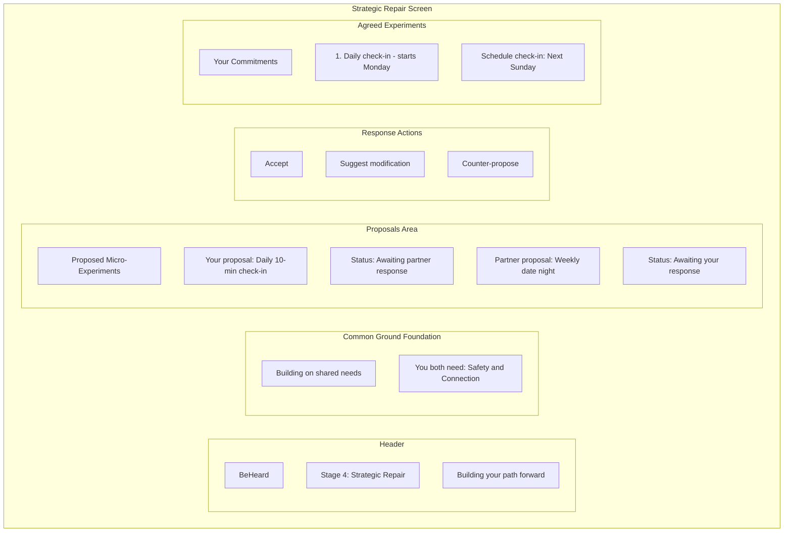
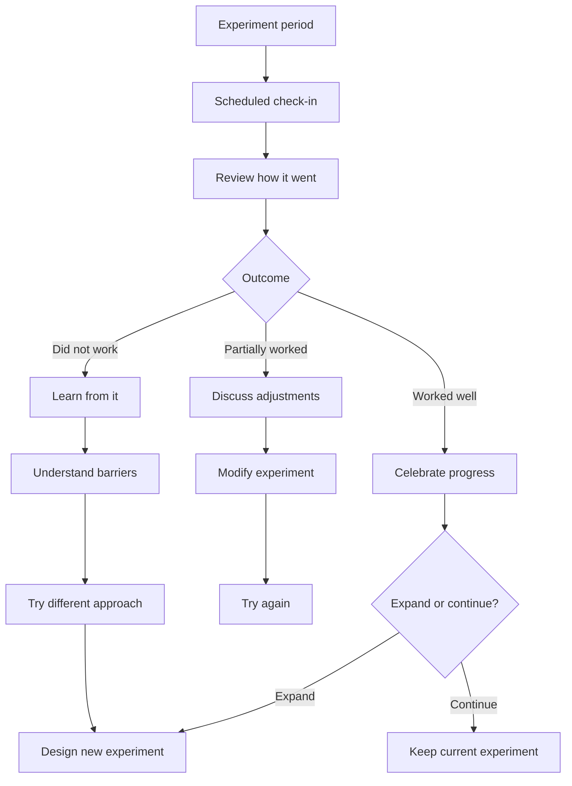

# Stage 4: Strategic Repair

## Purpose

Move from understanding to action by designing small, reversible experiments that address identified needs.

## AI Goal

- Guide users toward proposing concrete actions
- Ensure proposals are small, reversible, and time-bounded
- Facilitate negotiation if needed
- Document agreed-upon micro-experiments
- Optionally schedule follow-up

## Flow



## Micro-Experiment Design

The AI helps users design experiments that are:



## Example Micro-Experiments

| Need Addressed | Micro-Experiment |
|----------------|------------------|
| Connection | "We will have a 10-minute phone-free conversation at dinner for 5 days" |
| Recognition | "I will say one specific thing I appreciate each morning for a week" |
| Safety | "We will use a pause signal when conversations get heated and take 5 minutes" |
| Fairness | "We will alternate who chooses weekend activities for the next month" |

## Negotiation Flow



## Wireframe: Strategic Repair Interface



## Success Criteria

Mutual agreement on at least one micro-experiment.

## Agreement Documentation

When users agree, the AI documents:

```
MICRO-EXPERIMENT AGREEMENT
--------------------------
Participants: [User A], [User B]
Date agreed: [Date]

Experiment: [Specific description]
Duration: [Time period]
Success measure: [How to know if it worked]

Check-in scheduled: [Date/time if applicable]
```

## Failure Paths

| Scenario | AI Response |
|----------|-------------|
| No proposals generated | AI suggests options based on identified needs |
| Repeated rejection | Explore what would work; may need to return to need mapping |
| Proposals too ambitious | Help scope down; emphasize "small and reversible" |
| One party uncooperative | Acknowledge difficulty; explore barriers |

## Follow-Up Support

If users schedule a check-in:



## Data Captured

- Proposals made
- Negotiation history
- Agreed experiments
- Follow-up schedules
- Check-in outcomes (if applicable)

---

## Related Documents

- [Previous: Stage 3 - Need Mapping](./stage-3-need-mapping.md)
- [User Journey](../overview/user-journey.md)
- [System Guardrails](../mechanisms/guardrails.md)

---

[Back to Stages](./index.md) | [Back to Plans](../index.md)
