# Chat Interface

The primary conversation interface where users interact with the AI.

## Core Chat Layout

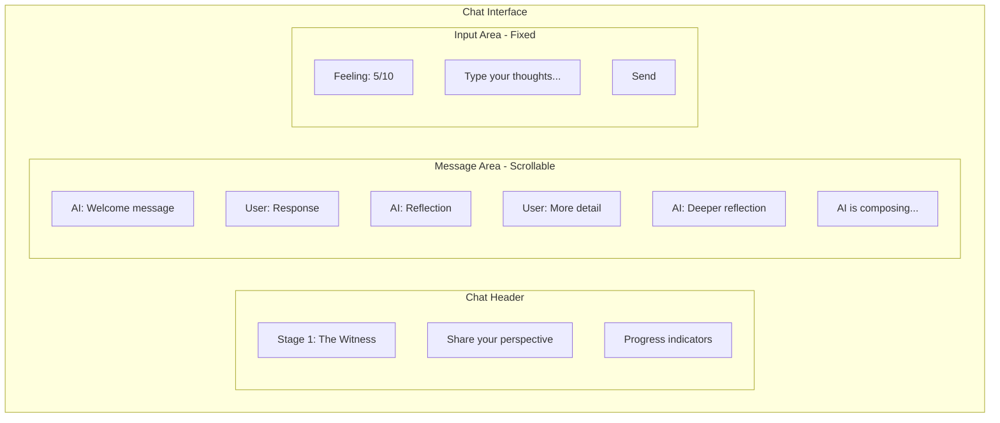

## Message Bubbles

### AI Message

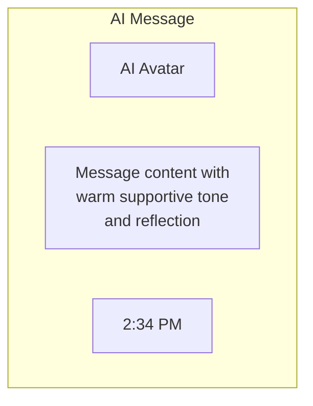

Characteristics:
- Left-aligned
- Subtle background color
- AI avatar/icon
- No typing indicator shown during composition

### User Message

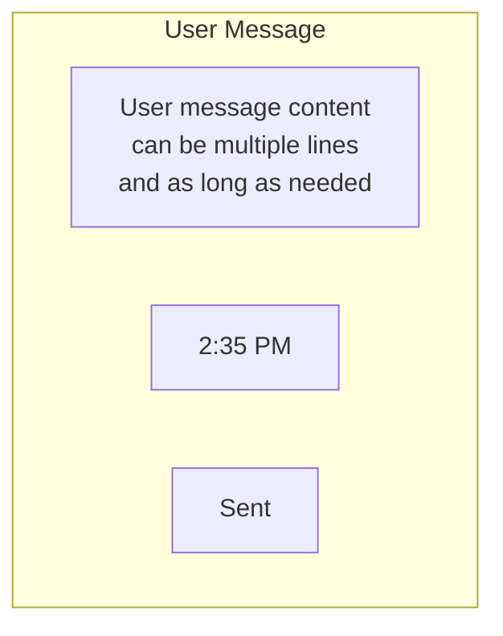

Characteristics:
- Right-aligned
- User-colored background
- Timestamp
- Sent/read status

## Stage-Specific Variations

### Stage 0: Onboarding Chat

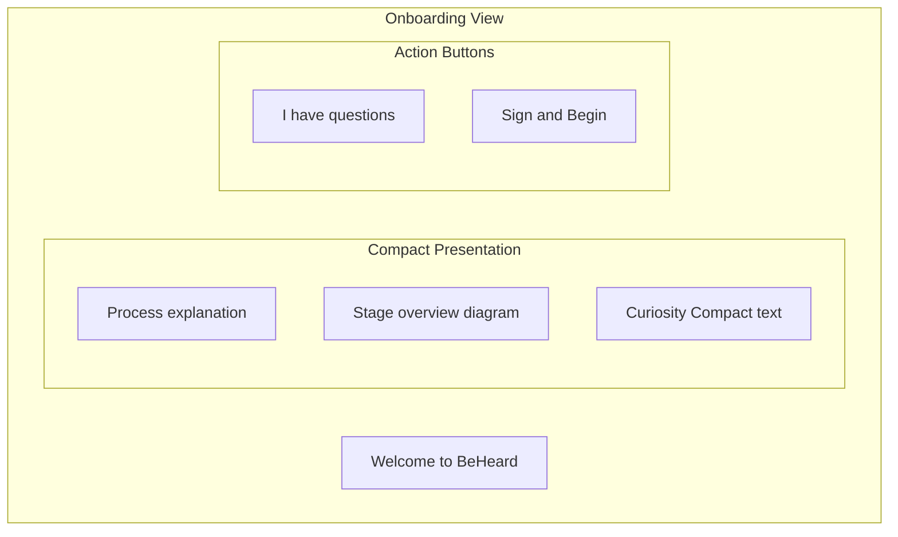

### Stage 1: The Witness Chat

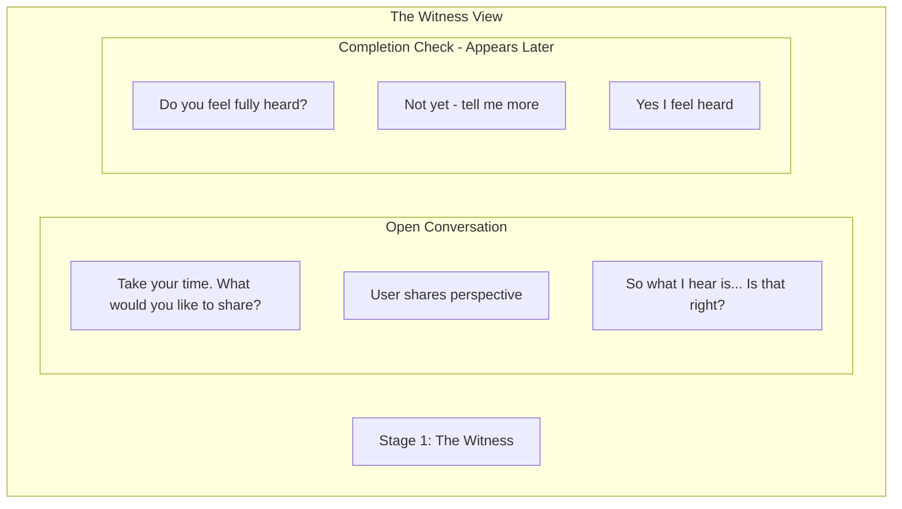

### Stage 2: Perspective Stretch Chat

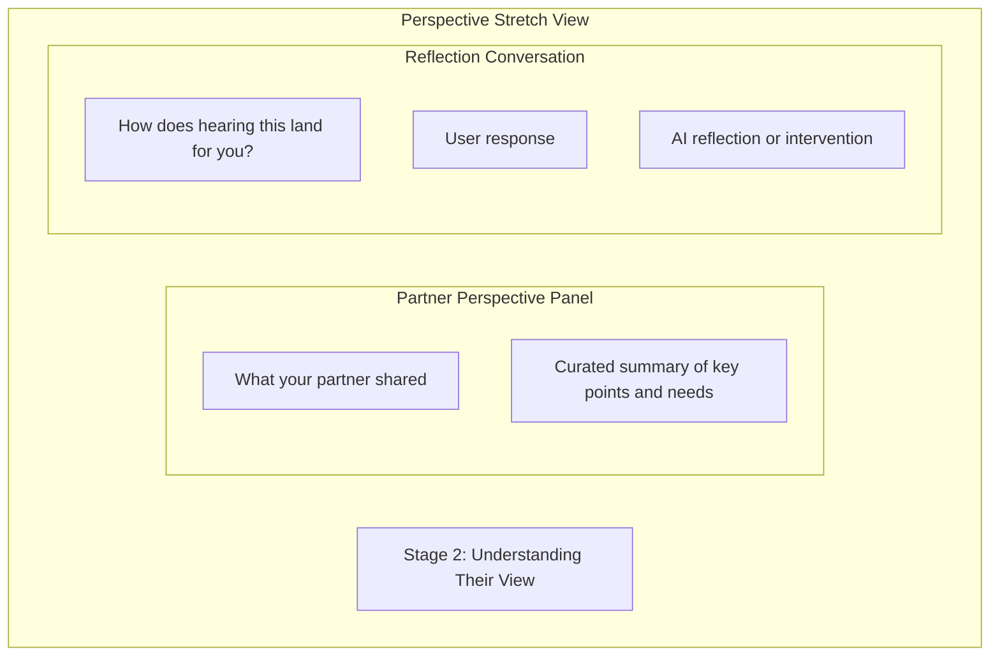

### Stage 3: Need Mapping Chat

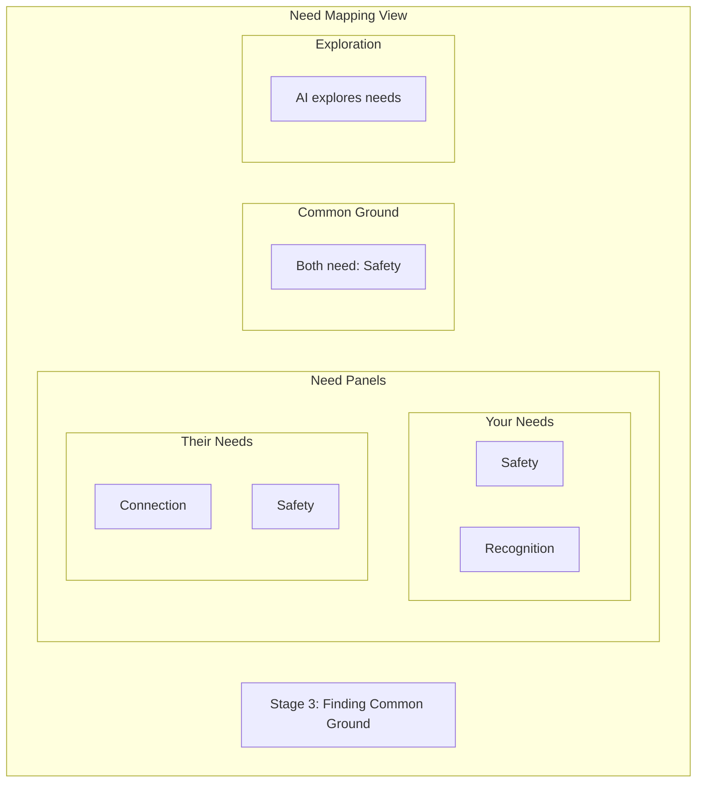

### Stage 4: Repair Chat

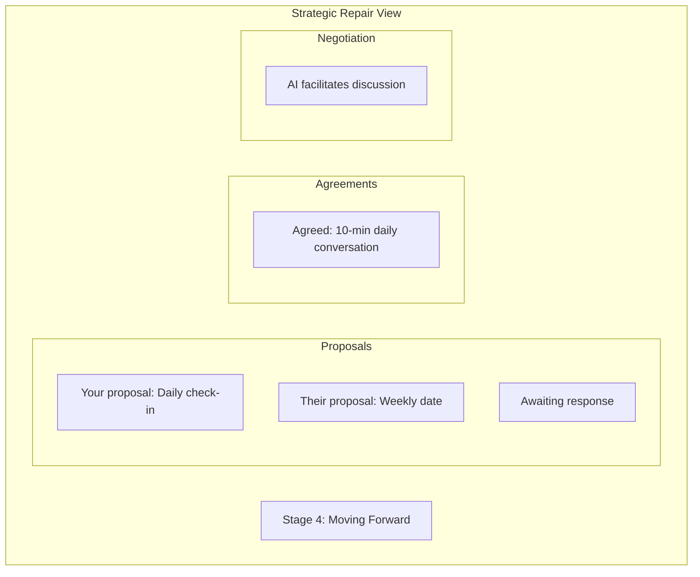

## Empty States

### Waiting for Partner

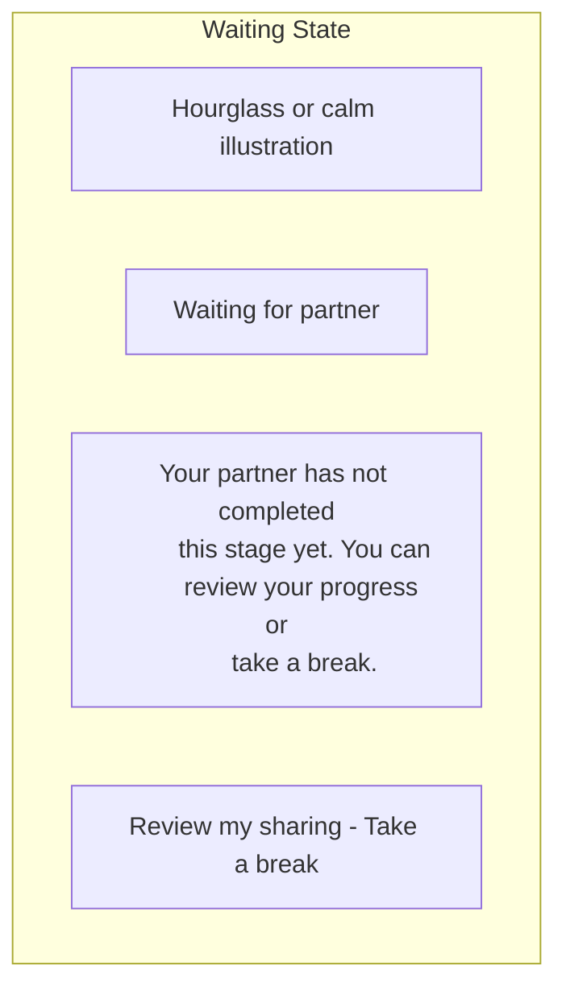

### Session Not Started

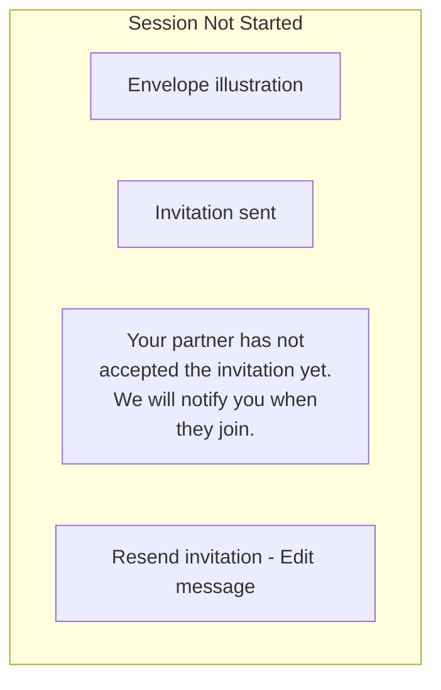

## Input Area Details

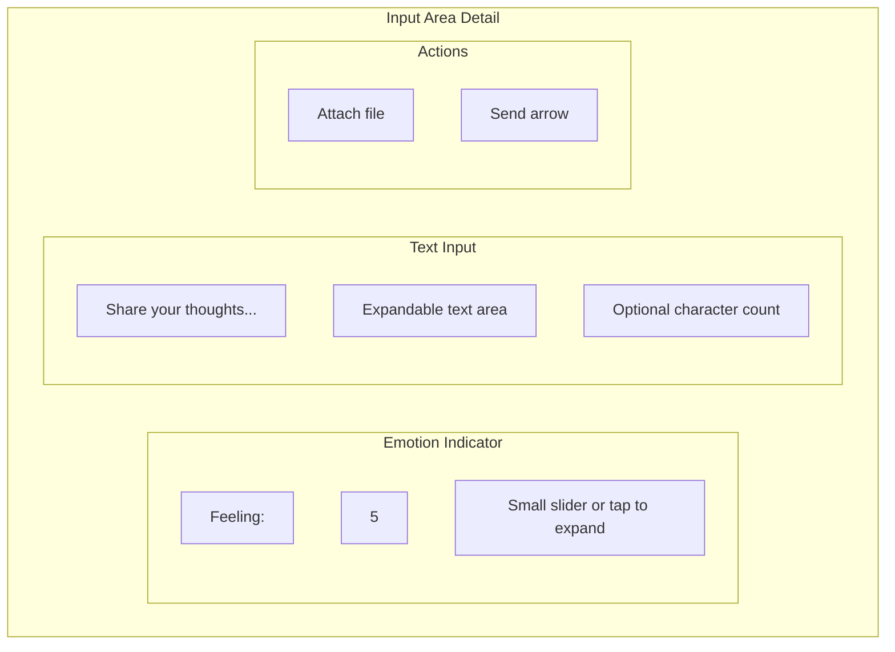

## Attachment Support

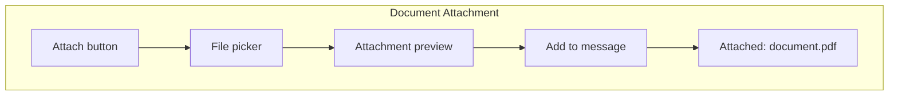

Supported types:
- Images (screenshots of texts, etc.)
- PDFs (documents, emails)
- Text files

---

## Related Documents

- [Core Layout](./core-layout.md)
- [Stage Controls](./stage-controls.md)
- [Emotional Barometer UI](./emotional-barometer-ui.md)

---

[Back to Wireframes](./index.md) | [Back to Plans](../index.md)
