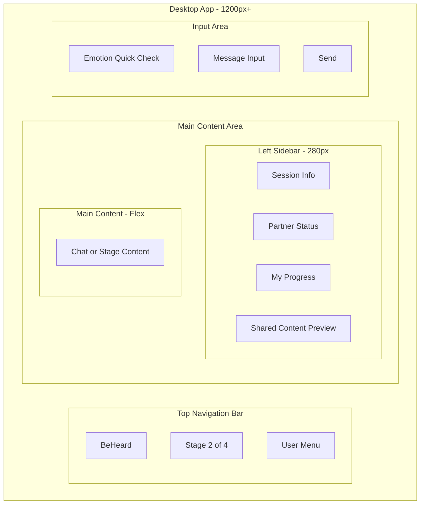
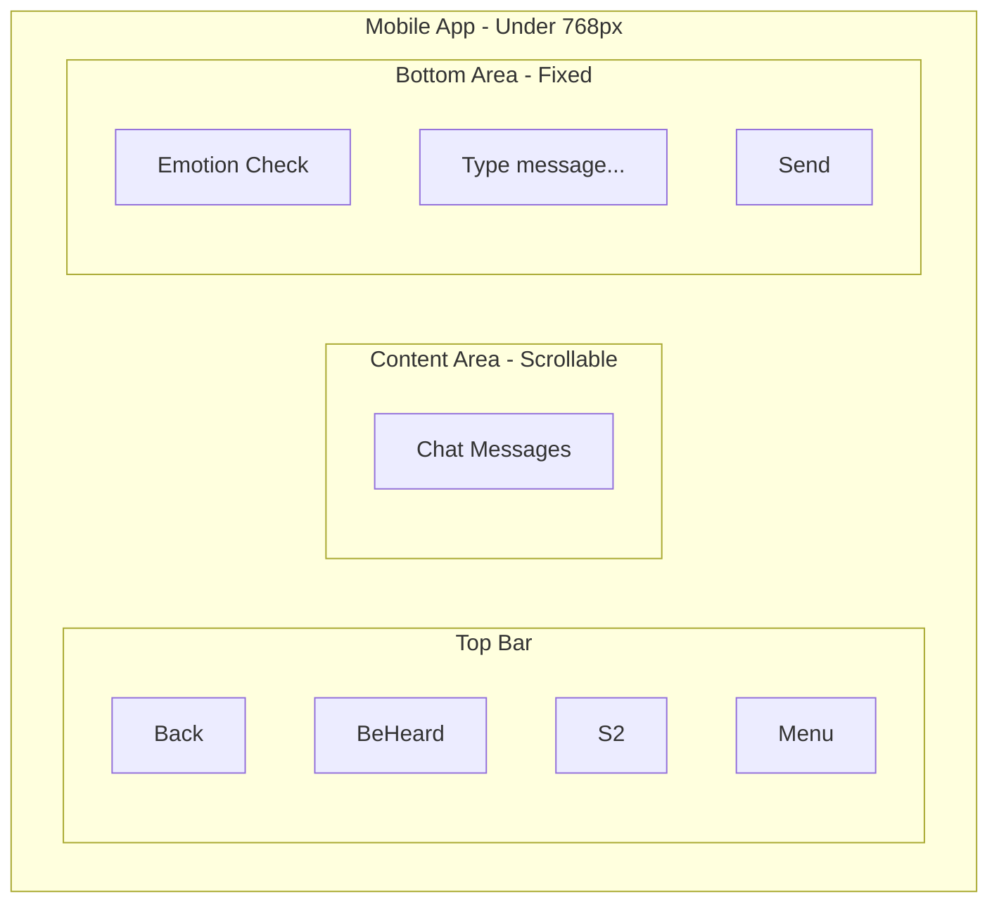
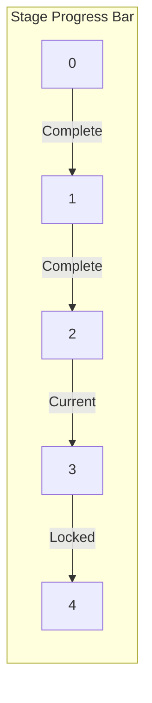
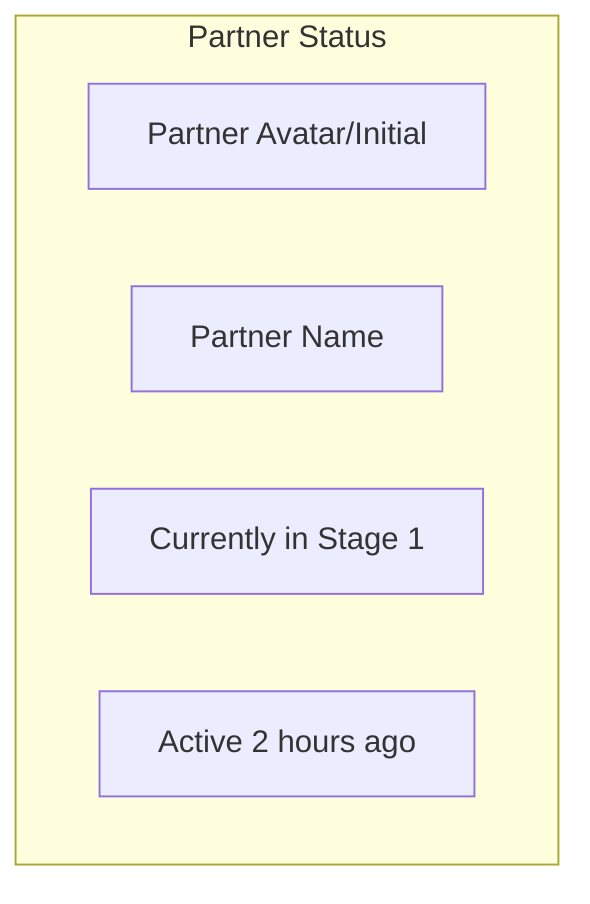

# Core Layout

Base app structure that persists across all screens.

## Desktop Layout

## Mobile Layout

## Stage Indicator States

Stage indicator styling:

| State | Visual |
|-------|--------|
| Complete | Filled circle with checkmark |
| Current | Highlighted, pulsing indicator |
| Locked | Grayed out, locked icon |
| Partner ahead | Badge showing partner completed |

## Partner Status Widget

Status messages:

| Situation | Display |
|-----------|---------|
| Both in same stage | "Working on Stage X together" |
| Partner ahead | "Completed Stage X - waiting for you" |
| User ahead | "Partner still in Stage X" |
| Partner in cooling | "Partner taking a break" |
| Partner offline | "Last active: time ago" |

## Color Palette

| Element | Purpose |
|---------|---------|
| Primary | Calm blue - trust and stability |
| Accent | Soft green - growth and progress |
| Warning | Warm amber - attention needed |
| Alert | Soft coral - cooling period |
| Background | Off-white - reduces eye strain |
| Text | Dark gray - not harsh black |

## Typography

| Element | Specification |
|---------|--------------|
| Headings | Clear, rounded sans-serif |
| Body | Readable, comfortable spacing |
| AI messages | Slightly different weight/style |
| User messages | Standard weight |

## Responsive Breakpoints

| Breakpoint | Layout |
|------------|--------|
| 1200px+ | Full desktop with sidebar |
| 768-1199px | Tablet - collapsible sidebar |
| Under 768px | Mobile - no sidebar, bottom sheet menus |

---

## Related Documents

- [Chat Interface](./chat-interface.md)
- [Stage Controls](./stage-controls.md)
- [Emotional Barometer UI](./emotional-barometer-ui.md)

---

[Back to Wireframes](./index.md) | [Back to Plans](../index.md)
