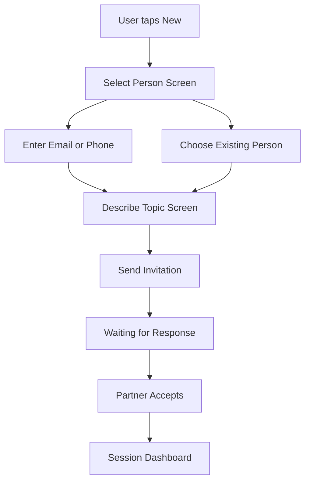
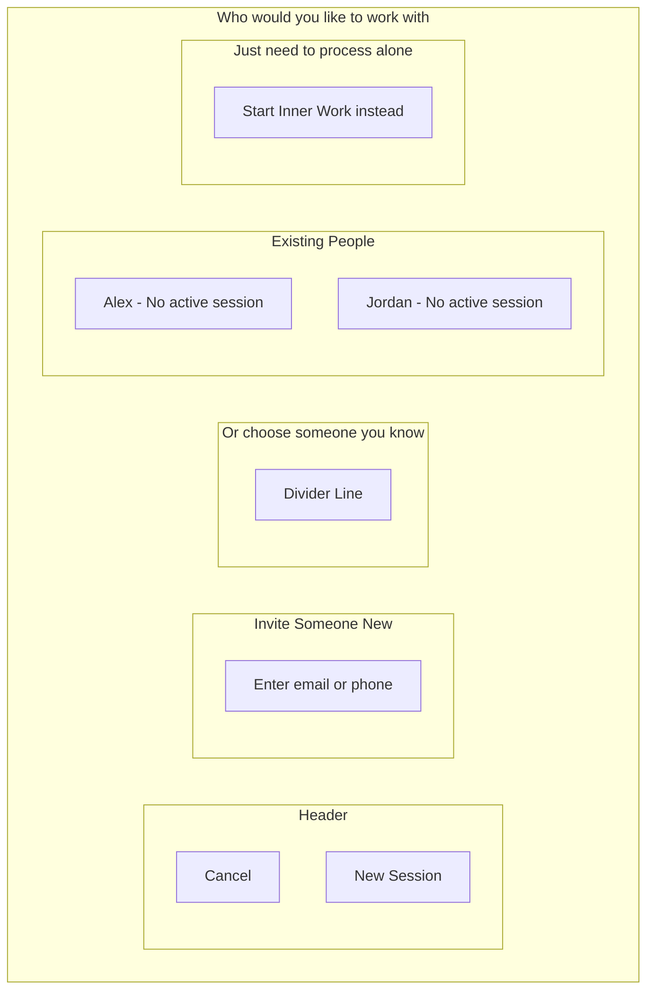
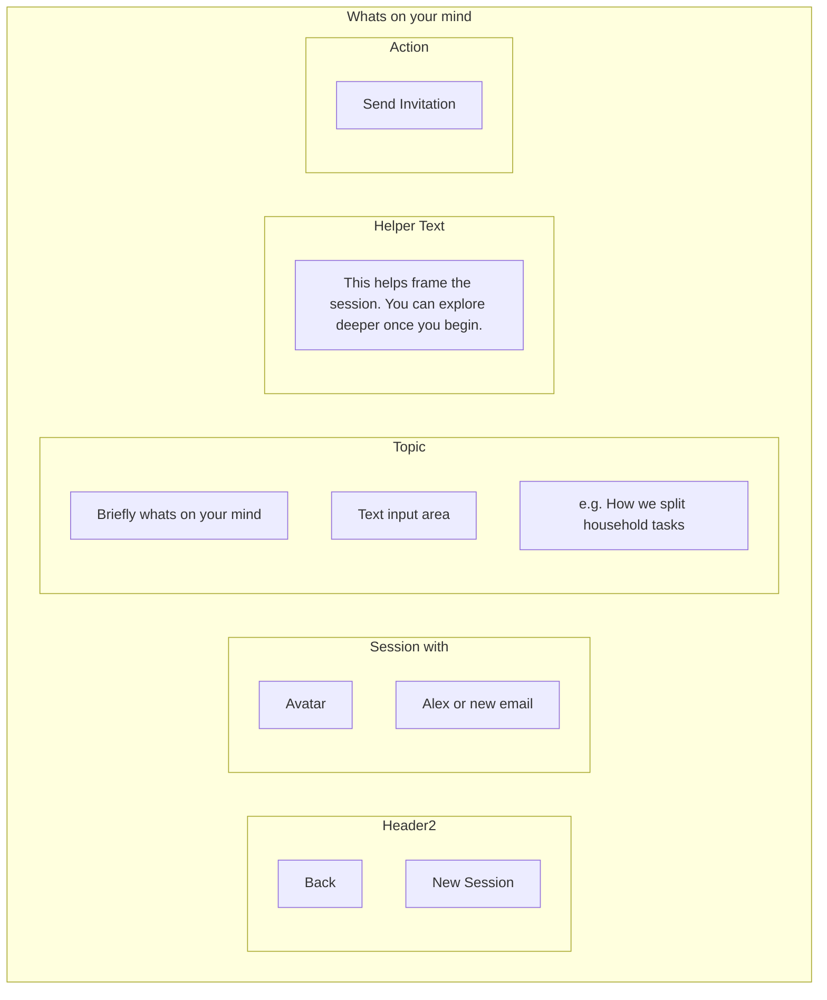
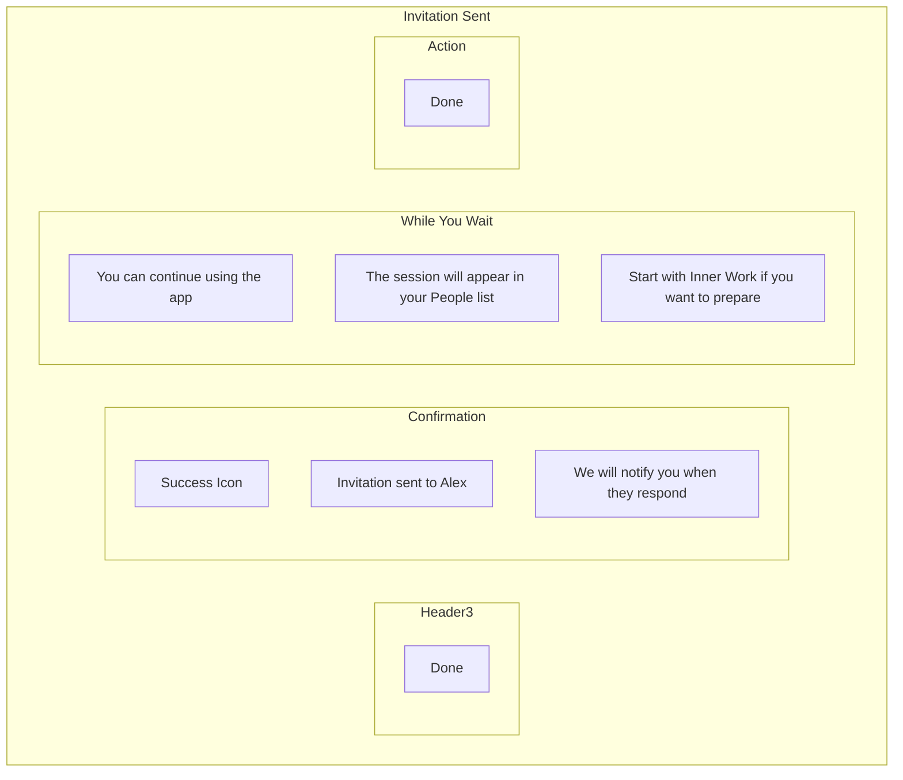
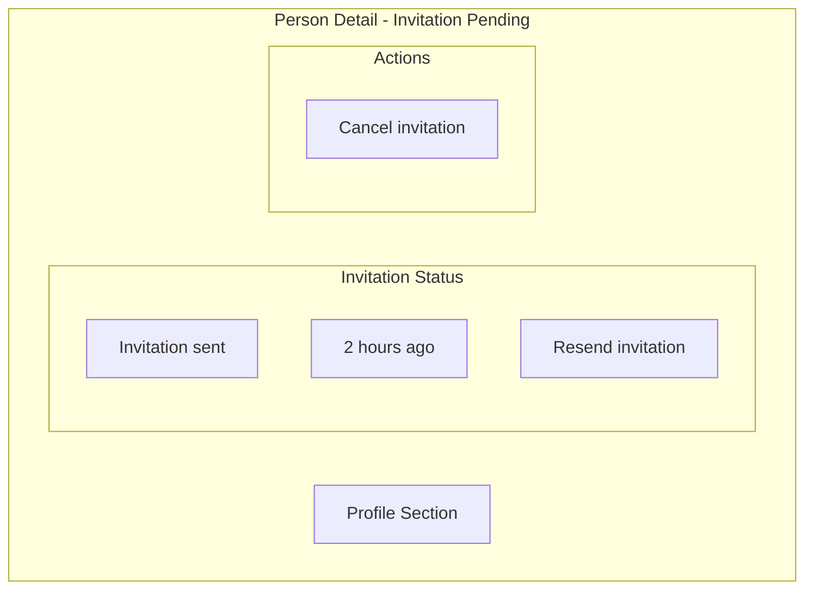
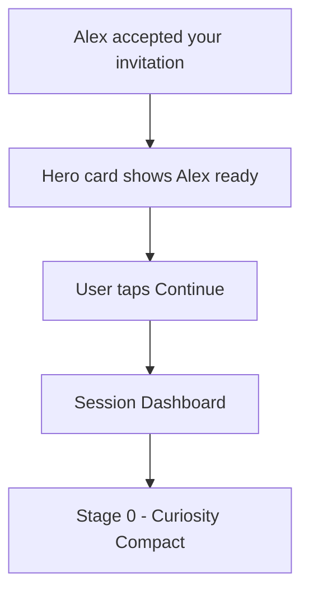
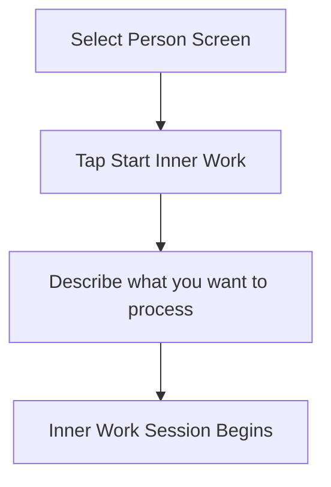

# New Session Flow

The flow for creating a new session and inviting someone to work through a conflict together.

:::tip See it in action
<a href="/demo/features/new-session.html" target="_blank" rel="noreferrer">Try the New Session demo →</a> - Invite someone, add a topic, resend or cancel, and watch acceptance take you into the process.
:::

## Entry Points

Users can start a new session from:
- **Home Dashboard** - Tap [+New] button in header
- **Person Detail** - Tap Start New Session (when no active session)
- **Hero Card** - Tap Invite Someone (when no sessions exist)

## Flow Overview

## Screen 1: Select Person

### Elements

| Element | Description |
|---------|-------------|
| Cancel | Returns to previous screen |
| Email/Phone Input | For inviting new people |
| Existing People | Only shows people without active sessions |
| Inner Work Option | Escape hatch for solo processing |

### Existing Person Filter

Only people without an active session appear in the list. People with active sessions are excluded since each relationship can only have one active session.

## Screen 2: Topic Input

### Topic Input Guidelines

| Guideline | Rationale |
|-----------|-----------|
| Keep it brief | Just enough to frame the session |
| No blame language | Sets constructive tone |
| Topic not resolution | Describe the situation not the solution |

### Helper Text

"This helps frame the session. You can explore deeper once you begin."

Reassures users they do not need to explain everything upfront.

## Screen 3: Invitation Sent

## Waiting State

After invitation is sent, the person appears in the People list with status:

| Element | Value |
|---------|-------|
| Status | Invited |
| Subtitle | Waiting for response |
| Time | Sent 2h ago |

### Person Detail While Waiting

## Partner Accepts

When partner accepts the invitation:

1. User receives notification
2. Person card updates to show "Stage 0 - Ready to begin"
3. Hero card surfaces the session
4. Tapping leads to Session Dashboard then Stage 0

## Inner Work Escape Hatch

From the Select Person screen, users can choose Inner Work instead:

## Validation

### Email/Phone Validation

| State | Behavior |
|-------|----------|
| Empty | Send button disabled |
| Invalid format | Error message appears |
| Valid | Send button enabled |
| Already connected | Suggest selecting from list |

**Delivery**: Email invitations are sent via [Resend](https://resend.com), phone invitations via [Twilio](https://twilio.com) SMS.

### Topic Validation

| State | Behavior |
|-------|----------|
| Empty | Send button disabled |
| Under 10 characters | Warning but allowed |
| Valid | Send button enabled |

## Actions Summary

| Action | Result |
|--------|--------|
| Tap Cancel | Return to previous screen |
| Enter contact | Validate and enable next step |
| Select existing person | Proceed to topic input |
| Tap Inner Work | Switch to inner work flow |
| Enter topic | Enable send button |
| Tap Send Invitation | Send invite and show confirmation |
| Tap Done | Return to Home Dashboard |

---

[Back to Wireframes](./index.md) | [Session Dashboard](./session-dashboard.md) | [Home Dashboard](./home-dashboard.md)
