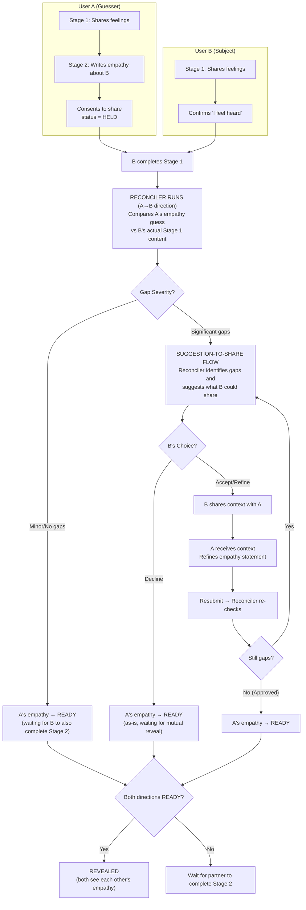
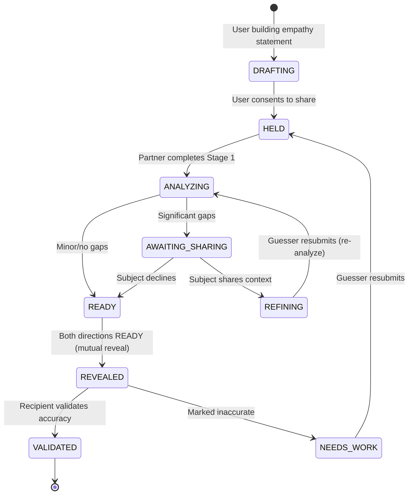

# Stage 2 Reconciler Flow Design

## Overview

This design documents the Stage 2→3 transition flow where empathy statements are validated through the reconciler. The key principle: **asymmetric triggering** - the reconciler runs for one user's empathy as soon as their partner completes Stage 1, not when both complete Stage 2.

## Core Flow Changes (Updated 2026-01-08)

### Asymmetric Reconciler Trigger

The reconciler no longer waits for both users to submit empathy statements. Instead:

1. **User A** completes Stage 1 → advances to Stage 2 → writes empathy about User B → consents to share → status = `HELD`
2. **User B** completes Stage 1 (confirms feelHeard) → this triggers the reconciler for User A's direction ONLY
3. Reconciler analyzes User A's empathy statement vs User B's actual Stage 1 content
4. Based on gaps, reconciler may suggest something User B could share to help User A understand better
5. User B can consent to share (or refine) the suggested content
6. User A receives the shared context and can refine their empathy statement
7. Once User A's empathy is approved → status = `READY` (waiting for mutual reveal)
8. **Mutual Reveal**: When BOTH directions are `READY`, both empathy statements are revealed simultaneously

### Suggestion-to-Share Flow

When the reconciler detects significant gaps, it can identify specific content from the subject's (User B's) witnessing that would help the guesser (User A) understand better. This creates a consent-based sharing flow:



## State Model

Each empathy direction (A→B, B→A) progresses independently:



## UI States Per User

| State | Guesser (User A) Sees | Subject (User B) Sees |
|-------|----------------------|----------------------|
| A submitted, B in Stage 1 | "Waiting for [B] to finish sharing their experience" | Normal Stage 1 chat |
| A submitted, B finished Stage 1 | "Analyzing your empathy attempt..." | Stage 2 (can write their own empathy) |
| A→B: AWAITING_SHARING | "Waiting for [B] to respond..." | "Would you like to share something to help [A] understand you better?" |
| A→B: REFINING | "New context from [B]! Would you like to refine your empathy attempt?" | Stage 2 continues |
| A→B: READY | "[B] is now considering how you might feel..." | Stage 2 continues (working on their empathy) |
| Both READY | "Both empathy statements will be shared soon..." | "Both empathy statements will be shared soon..." |
| A→B: REVEALED | "Your empathy attempt has been shared with [B]" | A's statement in chat + validation UI |
| A→B: VALIDATED | "[B] confirmed your attempt resonates with them" | Ready to continue |

## Information Boundaries

| Agent | Context |
|-------|---------|
| **Reconciler** | Both users' Stage 1 content, empathy statement, performs detailed comparison |
| **Suggestion Generator** | Subject's Stage 1 content, gap analysis, generates suggestions |
| **Refinement Conversation** | Standard full retrieval + abstract hint + newly shared context |

**Key constraint**: The guesser never sees the detailed reconciler analysis. They only receive:
- Abstract hints ("there might be more to explore around work")
- Shared context that the subject explicitly consented to share

## Data Model Changes

### EmpathyAttempt - Updated Status Enum

```prisma
enum EmpathyStatus {
  HELD              // Waiting for partner to complete Stage 1
  ANALYZING         // Reconciler is comparing guess vs actual Stage 1 content
  AWAITING_SHARING  // Gaps detected, waiting for subject to respond to share suggestion
  REFINING          // Guesser is refining after receiving shared context
  READY             // Reconciler complete, waiting for partner to also complete Stage 2
  REVEALED          // Recipient can now see statement (after mutual reveal)
  VALIDATED         // Recipient has validated accuracy
}

model EmpathyAttempt {
  // ... existing fields ...

  status        EmpathyStatus @default(HELD)
  revealedAt    DateTime?
  revisionCount Int           @default(0)
}
```

### ReconcilerResult - Add suggestion fields

```prisma
model ReconcilerResult {
  // ... existing fields ...

  // Abstract guidance for refinement (no specific partner content)
  areaHint      String?   // e.g., "work and effort"
  guidanceType  String?   // e.g., "explore_deeper_feelings"
  promptSeed    String?   // e.g., "what might be underneath"

  // Suggestion for subject to share
  suggestedShareContent String?  @db.Text  // AI-generated suggestion
  suggestedShareReason  String?  @db.Text  // Why this would help
}
```

### ReconcilerShareOffer - Enhanced for new flow

```prisma
model ReconcilerShareOffer {
  // ... existing fields ...

  /// Status of the share offer
  status    ReconcilerShareStatus @default(PENDING)

  /// AI-generated suggestion for what to share
  suggestedContent   String?  @db.Text
  suggestedReason    String?  @db.Text

  /// User's refined version (if they edited)
  refinedContent     String?  @db.Text

  /// Final content that was shared
  sharedContent      String?  @db.Text
  sharedAt           DateTime?

  /// If they declined
  declinedAt         DateTime?
}

enum ReconcilerShareStatus {
  PENDING     // Suggestion generated, not yet shown
  OFFERED     // Shown to user
  ACCEPTED    // User accepted (with or without refinement)
  DECLINED    // User declined to share
  EXPIRED     // Offer expired (timeout)
}
```

## API Changes

### Modified: POST /sessions/:id/empathy/consent

**Before**: Creates EmpathyAttempt with `status: HELD`. Waits for both parties.

**After**: Creates EmpathyAttempt with `status: HELD`. If partner has already completed Stage 1 (confirmed feelHeard), immediately triggers reconciler.

### Modified: POST /sessions/:id/feel-heard

**Before**: Just updates stage progress and notifies partner.

**After**: After confirming feelHeard, checks if partner has an empathy attempt in HELD status. If so, triggers reconciler for that direction.

### New: GET /sessions/:id/empathy/share-suggestion

Get the share suggestion for the current user (if any).

**Response**:
```json
{
  "hasSuggestion": true,
  "suggestion": {
    "guesserName": "Alex",
    "suggestedContent": "I've been feeling like my efforts go unnoticed...",
    "reason": "Alex mentioned work stress but may not realize how deeply this affects you",
    "canRefine": true
  }
}
```

### New: POST /sessions/:id/empathy/share-suggestion/respond

Respond to a share suggestion (accept, refine, or decline).

**Request**:
```json
{
  "action": "accept" | "decline" | "refine",
  "refinedContent": "Optional refined content if action is refine"
}
```

**Response**:
```json
{
  "success": true,
  "status": "shared" | "declined",
  "sharedContent": "The content that was shared (if accepted/refined)"
}
```

### Modified: GET /sessions/:id/empathy/status

Add fields for the new flow:

**Response** (updated):
```json
{
  "myAttempt": { ... },
  "partnerAttempt": { ... },
  "partnerCompletedStage1": true,
  "analyzing": false,
  "awaitingSharing": false,
  "hasNewSharedContext": true,
  "sharedContext": {
    "content": "I've been feeling like my efforts go unnoticed...",
    "sharedAt": "2024-01-08T12:00:00Z"
  },
  "readyForStage3": false
}
```

## Notifications

| Trigger | Recipient | Notification |
|---------|-----------|--------------|
| Partner completes Stage 1 + you have HELD empathy | You | "Analyzing your empathy attempt..." |
| Share suggestion generated | Subject | "[Guesser] shared their attempt to imagine how you feel. Would you like to help them see more?" |
| Subject shares context | Guesser | "[Subject] shared something to help you understand them better" |
| Subject declines | Guesser | "Your empathy attempt has been shared with [subject]" |
| Empathy approved | Guesser | "Your empathy attempt has been shared with [subject]" |
| Empathy revealed | Subject | "[Guesser] shared their attempt to imagine how you feel" |
| Subject validates | Guesser | "[Subject] confirmed your attempt resonates with them" |
| Both validated | Both | "You're both ready to move forward together" |

## Implementation Phases

### Phase 1: Foundation + Asymmetric Trigger

- [ ] Add `AWAITING_SHARING` and `REFINING` to EmpathyStatus enum
- [ ] Add migration for schema changes
- [ ] Modify `confirmFeelHeard` to check for partner's HELD empathy and trigger reconciler
- [ ] Modify `consentToShare` to check if partner already completed Stage 1 and trigger reconciler
- [ ] Update reconciler to only run for ONE direction (the one being analyzed)

### Phase 2: Suggestion Generation

- [ ] Add `suggestedShareContent` and `suggestedShareReason` to ReconcilerResult
- [ ] Update reconciler to generate share suggestions when gaps are significant
- [ ] Create endpoint `GET /sessions/:id/empathy/share-suggestion`
- [ ] Create endpoint `POST /sessions/:id/empathy/share-suggestion/respond`

### Phase 3: Shared Context Flow

- [ ] When subject shares, notify guesser and update their attempt status to REFINING
- [ ] Store shared context in ReconcilerShareOffer
- [ ] Update empathy status endpoint to include shared context
- [ ] Update refinement flow to incorporate shared context

### Phase 4: Notifications + Polish

- [ ] Add notification triggers at key state transitions
- [ ] Implement waiting state UI with appropriate messaging
- [ ] Handle edge cases:
  - Timeout if no response to share suggestion
  - Maximum revision attempts
  - Both users submitting empathy before either completes Stage 1

### Phase 5: Chat Integration

- [ ] When context is shared, create messages in guesser's chat
- [ ] When empathy is revealed, create messages in subject's chat
- [ ] Handle validation flow in chat

## Testing Scenarios

1. **Happy path (no gaps)**: A shares empathy → B completes Stage 1 → reconciler approves → A's empathy revealed to B
2. **Gaps with sharing**: A shares empathy → B completes Stage 1 → gaps detected → B shares context → A refines → approved → revealed
3. **Gaps but declines**: A shares empathy → B completes Stage 1 → gaps detected → B declines to share → A's empathy revealed as-is
4. **Multiple refinements**: A refines twice before approval
5. **Concurrent empathy**: Both A and B submit empathy before either completes Stage 1 → each gets analyzed when the other finishes Stage 1
6. **Race condition**: A submits empathy right as B confirms feelHeard

## Success Criteria

1. Empathy statements are analyzed as soon as the subject completes Stage 1 (not waiting for both)
2. Subjects have agency over what context to share (consent-based)
3. Guessers receive helpful context without seeing the raw reconciler analysis
4. Each direction progresses independently
5. Clear waiting states so users know what's happening
6. Notifications keep users informed of progress

---

## Related Documents

- [Stage 2: Perspective Stretch](../mvp-planning/plans/stages/stage-2-perspective-stretch.md)
- [Reconciler Service](../../backend/src/services/reconciler.ts)
- [Reconciler DTOs](../../shared/src/dto/reconciler.ts)
