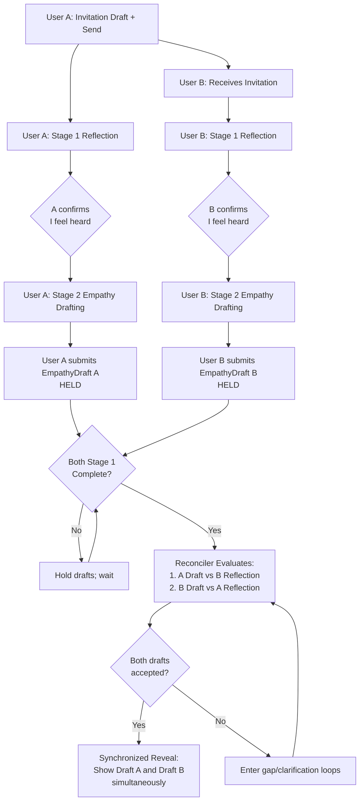
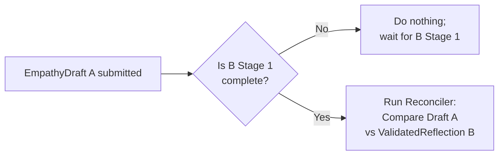
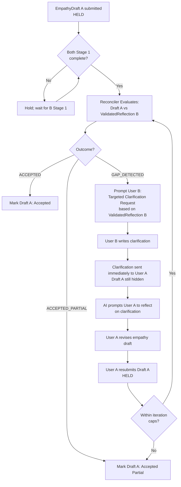
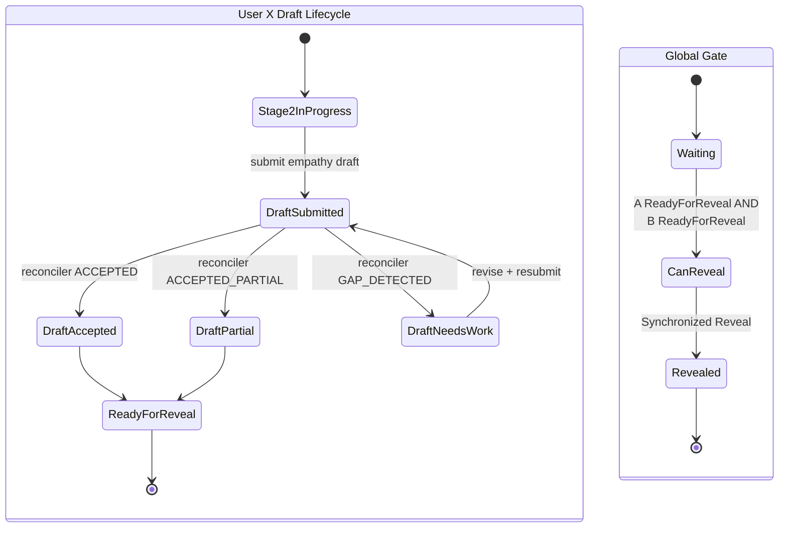

# Meet Without Fear — Stage 2: Empathy Drafting + Reconciliation Plan

## 1. Core Decisions & Policies

### Reveal Policy: Synchronized Reveal

- **Condition:** Empathy drafts are revealed only when **BOTH** users have:
  1.  Completed **Stage 1** (Reflection / "I feel heard").
  2.  Completed **Stage 2** (Empathy Drafting).
  3.  Had their empathy drafts evaluated as **sufficiently aligned** (or accepted as "partial" under iteration limits).
- **Mechanism:** Both finalized empathy drafts are shared at the exact same time.

### Iteration Policy (Guardrails)

To avoid "ping-pong fatigue":

- **Max Clarification Requests:** 1 per user per counterpart-draft.
- **Max Resubmission Cycles:** 2 per empathy draft.
- **Fallback:** If caps are reached, Reconciler returns `ACCEPTED_PARTIAL`. The draft proceeds to reveal with a "may be incomplete" warning label.

---

## 2. Actors & Artifacts

### Actors

- **User A:** Initiator.
- **User B:** Invitee.
- **AI Guide:** Helps each user through reflection and empathy drafting.
- **Reconciler:** System logic that compares one user’s _Empathy Draft_ against the other user’s _Validated Reflection_.

### Artifacts by Stage

| Stage             | Goal                                              | Output Artifact       | Visibility                             |
| :---------------- | :------------------------------------------------ | :-------------------- | :------------------------------------- |
| **0. Invitation** | Initiate contact                                  | `InvitationMessage`   | Sent to B                              |
| **1. Reflection** | User articulates feelings until they "feel heard" | `ValidatedReflection` | **Ground Truth** (Held for Reconciler) |
| **2. Drafting**   | User guesses other's feelings                     | `EmpathyDraft`        | **Hidden** (Held until Sync Reveal)    |

---

## 3. System States & Constraints

### Hard Constraints

1.  **Reconciler Gate:** Cannot run until **BOTH** users have completed Stage 1.
2.  **Secrecy:** No empathy draft is revealed until both users complete Stage 2 and alignment is confirmed.
3.  **Clarification Source:** Clarification requests must be derived strictly from the `ValidatedReflection`.
4.  **Routing:** Clarifications are sent immediately; Drafts remain hidden.

### User States

- `INVITED` (User B only)
- `STAGE_1_IN_PROGRESS`
- `STAGE_1_COMPLETE` (ValidatedReflection exists)
- `STAGE_2_IN_PROGRESS`
- `STAGE_2_DRAFT_SUBMITTED` (EmpathyDraft exists, held)
- `STAGE_2_DRAFT_ACCEPTED` (Accepted by reconciler)
- `READY_FOR_REVEAL` (Both users in accepted state)
- `REVEALED` (Synchronized reveal)

---

## 4. Reconciler Logic

### Inputs

1.  `EmpathyDraft(A)` vs `ValidatedReflection(B)`
2.  `EmpathyDraft(B)` vs `ValidatedReflection(A)`

### Outputs (Per Evaluation)

- `ACCEPTED`: Aligned sufficiently.
- `GAP_DETECTED`: Alignment insufficient; trigger targeted clarification.
- `ACCEPTED_PARTIAL`: Iteration cap reached; proceed with warning.

### Clarification Prompt Structure

`ClarificationRequest(to User X, topic=SpecificAspectFromValidatedReflection)`

---

## 5. Workflows

### High-Level Happy Path

1.  A & B complete Stage 1.
2.  A & B submit Stage 2 Empathy Drafts.
3.  Reconciler evaluates both sides simultaneously.
4.  Both accepted -> **Synchronized Reveal**.

### High-Level Gap Path

1.  Both complete Stage 1.
2.  A submits Empathy Draft.
3.  Reconciler checks A vs B -> **Gap Detected**.
4.  System asks B for targeted clarification (based on B's Stage 1).
5.  B submits clarification -> Sent to A immediately.
6.  A revises and resubmits Draft.
7.  Reconciler re-evaluates (loops until Accepted or Cap reached).
8.  Wait for B to finish their drafting -> **Synchronized Reveal**.

---

## 6. Diagrams

### Diagram 1: Overall System Flow (Both Users)

### Diagram 2: Reconciler Gate (Hard Constraint)

### Diagram 3: Gap Detected Loop (A's Draft vs B's Truth)

### Diagram 4: Symmetric Gap Loop (B's Draft vs A's Truth)

### Diagram 5: Synchronized Reveal State Machine

---

## 7. Implementation Notes

1. **Storage:** Store `ValidatedReflection` only once the user explicitly confirms "I feel heard."
2. **Clarification Prompts:** Must reference a specific aspect from `ValidatedReflection` (do not introduce new topics).
3. **Messaging:** Clarifications are the first direct cross-user messages, but they occur only after both Stage 1 completions.
4. **Hiding:** Empathy drafts remain hidden until the synchronized reveal, even if one user's draft is accepted significantly earlier than the other's.

---

## 8. Chat Interface Refinement

### Tabbed Chat Interface

When chatting with the AI during a session, the interface should have two tabs at the top:

1. **AI Chat Tab** (name TBD): The primary chat interface with the AI Guide for reflection, empathy drafting, and guidance throughout the session.
2. **User Chat Tab** (name TBD): A separate chat interface for viewing messages between the two users in the session. Users do not type messages directly here; instead, they work with the AI to draft messages, and the AI sends them (guarding against inappropriate language as per system policy).

### Initial State Behavior

When the session first starts:

- The **AI Chat Tab** is active by default (where users interact with the AI Guide).
- The **User Chat Tab** shows an empty chat interface with a placeholder message:
  - _"Messages between you and [Other User's Name] will go here once you are ready to share."_

### Message Drafting Workflow

**Important:** Users never type messages directly to send to the other user. The workflow is:

1. User wants to send a message to the other user.
2. User works with the AI (in the AI Chat Tab or a dedicated drafting interface) to express their intent.
3. AI drafts the message, applying content moderation and appropriateness checks.
4. AI sends the drafted message to the other user (message appears in both users' User Chat Tab).

This ensures all cross-user communication is moderated and appropriate, consistent with the system's safety policies.

### Transition to Active User Chat

Once users are ready to share (after synchronized reveal or when the system enables direct messaging), the User Chat Tab becomes active and displays the conversation history between the two users.

### Implementation Considerations

- Tab switching should be seamless and preserve chat state for both tabs.
- The placeholder message should be replaced with actual messages once direct communication is enabled.
- Both tabs should maintain their own message history and context.
- Message input in the User Chat Tab should route to the AI for drafting, not send directly.
