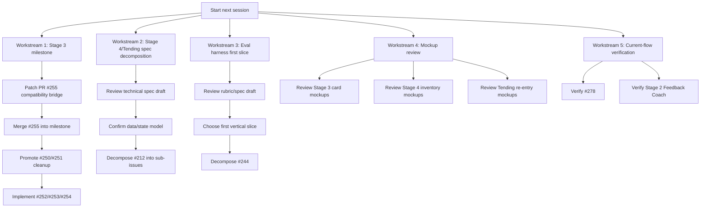
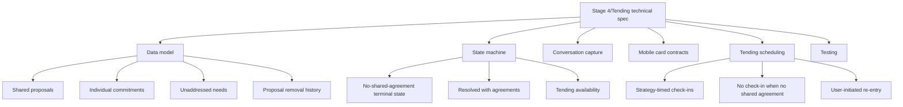
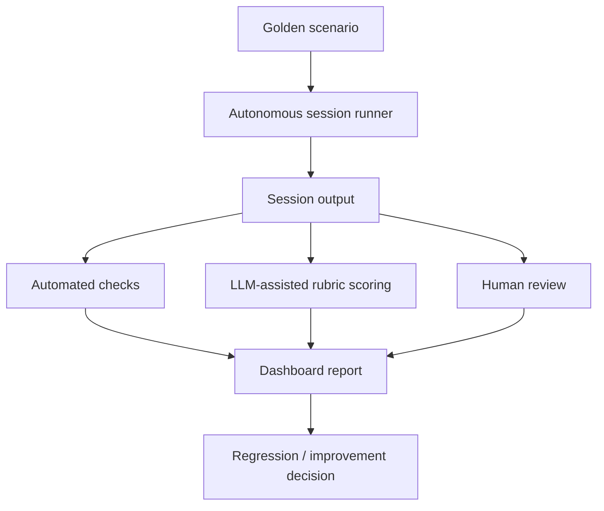
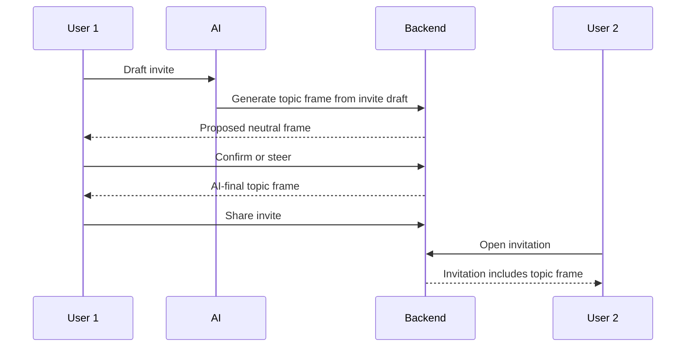
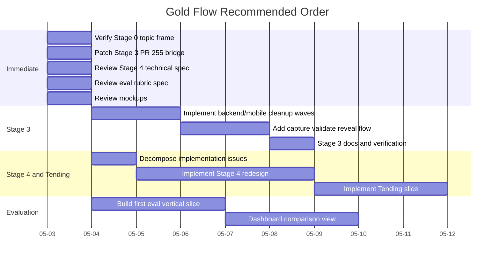

# Gold Flow Next Session Plan

Status: updated planning draft
Related: #282, #247, #212, #244, #278
Purpose: recommended next steps for the next work session, designed for heavy parallelization with subagents.

## Current State

The product direction is now coherent and mostly confirmed from Slack and GitHub:

- Stage 2 Not Quite Feedback Coach is merged and substantially up to date.
- Invitation topic framing is merged in PR #280. This is not the Stage 0 onboarding chat itself. It is an invite/share prerequisite owned by the session/invitation flow: the inviter drafts the invitation, the AI generates a neutral topic frame from that draft, the inviter can steer it, and the invite cannot be shared until an AI-final topic frame is confirmed.
- Stage 0 remains the post-acceptance onboarding/acknowledgment stage. Stage 1 uses the already-confirmed topic frame as context and does not renegotiate the invite topic.
- Stage 3 product decisions are resolved and implementation is decomposed in #247. The redesign removes AI-authored common-ground discovery from Stage 3 and moves to user-driven needs capture, consented side-by-side reveal, noticing, and validation before Stage 4.
- Stage 4 and Tending product decisions now have a technical spec draft in `docs/product/stage-4-tending-technical-spec.md`.
- The eval harness direction now has a draft spec in `docs/product/gold-flow-eval-harness-spec.md`.
- Low-fidelity Gold Flow mockups now exist in `docs/mobile/wireframes/gold-flow-mockups.md`.

## Latest Main-Branch Context

Recent merges that matter for this plan:

- PR #280: invitation topic frame. This prevents topic mismatch earlier in the flow without changing Stage 0 onboarding semantics.
- PR #275: Stage 2 Not Quite Feedback Coach loop end to end.
- PR #279: skips duplicate Stage 2 accuracy prompt.
- PR #281: improves Feedback Coach refinement context.
- PR #284: preserves user language and context in Feedback Coach refinements.
- PR #226 plus dashboard/test-runner work: live AI two-browser full-flow and related autonomous/e2e infrastructure.
- PRs #222, #223, #224, #225: dashboard/test infrastructure improvements that can support evaluation harness work.
- PR #256: Stage 3 prompt redesign merged to `milestone/stage-3-redesign`, not main.
- PR #255: Stage 3 shared DTO/gate update is open against `milestone/stage-3-redesign`; the recommended unblock is a short-lived shared DTO compatibility bridge, not a broad backend/mobile cleanup inside #255.

Implication: current main is stronger around invite/topic framing, Stage 2, and autonomous testing. The next major product work is Stage 3, then Stage 4/Tending.

## Immediate Cleanup

### 1. Update #282 With Stage 0 Done

Done in GitHub. #282 now marks the #278 topic-frame mismatch as resolved.

### 2. Decide Whether To Close #278

Recommended: leave #278 open until Shantam/Darryl verify the merged behavior in app, then close as completed.

Verification checklist:

- User 1 drafts invite.
- Topic frame is generated from invite draft, before Stage 1.
- User can steer, but the backend persists the AI-final neutral topic frame.
- AI final topic is neutral and 3-5 words.
- Invite cannot proceed without finalized topic frame.
- User 2 sees topic frame before entering.
- Stage 0 onboarding still behaves as the post-acceptance ready/acknowledgment flow; do not describe the topic-frame work as replacing Stage 0.

### 3. Decide Whether To Close #211

Recommended: close #211 as superseded by #247 after one human acknowledgement. #211 is useful provenance, but #247 is the implementation source of truth.

## Recommended Workstreams

## Workstream 1: Stage 3 Milestone

Goal: get #247 implementation moving again.

### Implementation Decisions

Stage 3 is no longer an AI common-ground synthesis stage. The implementation target is:

- User-driven needs exploration in chat.
- AI-suggested needs language as a proposal, not a correction.
- Structured capture/validation of the user's own needs.
- Explicit consent before sharing needs.
- Side-by-side reveal with neutral styling.
- No overlap badges, no "shared need" labels, and no AI-authored common-ground summary.
- A noticing prompt after reveal: "What do you notice?"
- Validation before Stage 4; if a user cannot validate the partner's needs yet, the AI slows down and continues conversation instead of forcing advance.
- Conversation-led revisions; cards are inline receipts of what the system is holding, not forms that replace the dialogue.

### Current Blocker

PR #255 updates shared Stage 3 DTOs and gates, but CI fails because downstream backend/mobile code still imports removed common-ground types.

### Decision

Use the recommendation in `docs/product/stage-3-pr-255-unblock-recommendation.md`:

- Add a short-lived compatibility bridge in `shared/src/dto/needs.ts`.
- Restore deprecated common-ground exports only to keep old consumers compiling:
  - `CommonGroundDTO`
  - `GetCommonGroundResponse`
  - `ConfirmCommonGroundRequest`
  - `ConfirmCommonGroundResponse`
  - `NeedsComparisonCommonGroundDTO`
- Consider preserving `ConsentShareNeedsResponse.commonGroundReady` as deprecated until mobile no longer reads it.
- Keep the new Stage 3 DTOs and target contracts:
  - `CapturedNeedInput`
  - `CaptureNeedsRequest`
  - `CaptureNeedsResponse`
  - `ValidateNeedsResponse`
  - side-by-side `GetNeedsComparisonResponse` without overlap/common-ground semantics
- Merge #255 into `milestone/stage-3-redesign` after the bridge patch and CI pass.
- Remove the compatibility bridge in the #250/#251 backend/mobile cleanup wave.

The compatibility bridge is compile-time debt only. It must not restore common ground to the Stage 3 product semantics.

### Remaining Subagent Assignments

#### Agent 1A: PR #255 Bridge Patch

Task:

- Patch PR #255 with the deprecated shared DTO exports described above.
- Run shared and mobile type checks.
- Confirm the bridge is clearly marked temporary/deprecated.

Deliverable:

- Small PR update or patch summary with type-check results and the exact deprecated exports restored.

#### Agent 1B: Backend Consumer Cleanup Prep

Task:

- Read #250 and current backend Stage 3 code after #255 lands.
- Identify all common-ground/extraction return paths, gates, tests, and fixture expectations.
- Produce a patch plan for replacing old common-ground behavior with capture, validate, consent, side-by-side reveal, noticing, and validation gates.

Deliverable:

- File-by-file backend implementation plan.

#### Agent 1C: Mobile Consumer Cleanup Prep

Task:

- Read #251 and current mobile Stage 3 UI.
- Identify all common-ground UI/hooks/types.
- Produce a patch plan for neutral side-by-side reveal, validation continuation, and removal of common-ground cards/badges.

Deliverable:

- File-by-file mobile implementation plan and any UI ambiguity.

## Workstream 2: Stage 4/Tending Technical Spec

Goal: review `docs/product/stage-4-tending-technical-spec.md`, resolve remaining data/state choices, and convert #212 into implementation-ready sub-issues.

### Technical Decisions To Make

### Subagent Assignments

#### Agent 2A: Data Model

Task:

- Inspect current Prisma models for strategies, rankings, agreements, sessions, and follow-up/check-in data.
- Propose data model changes for shared proposals, individual commitments, unaddressed needs, proposal status/removal, coverage audit, and Tending.

Deliverable:

- Technical spec section with model options and recommendation.

#### Agent 2B: State Machine

Task:

- Inspect current stage transition logic and session terminal states.
- Propose how to represent no-shared-agreement closure.
- Define how Stage 4 completes with shared agreements vs individual-only outcomes.

Deliverable:

- State transition diagram and implementation touchpoints.

#### Agent 2C: Conversational Capture

Task:

- Inspect current strategy proposal extraction and chat message handling.
- Propose how the AI captures proposal inventory from conversation.
- Include how removal/revision works.

Deliverable:

- Endpoint/service/prompt contract proposal.

#### Agent 2D: Tending

Task:

- Inspect current follow-up/check-in/agreement code.
- Propose Tending model: scheduled check-ins for shared agreements, no scheduled check-in for no-agreement, passive user re-entry.

Deliverable:

- Tending architecture proposal.

## Workstream 3: Evaluation Harness

Goal: review `docs/product/gold-flow-eval-harness-spec.md`, settle the first vertical slice, and convert #244 into buildable work.

### Recommended Eval Shape

### Rubric Dimensions

Start with:

- Listening depth.
- Resistance handling.
- Need universality.
- Needs coverage audit accuracy.
- Boundary honoring.
- Non-agreement grace.
- Tending re-entry quality.
- Prompt formula avoidance.

### Subagent Assignments

#### Agent 3A: Existing Infrastructure Map

Task:

- Inspect e2e tests, autonomous session runner, dashboard, snapshots, and session transcript tooling.
- Identify what can be reused for #244.

Deliverable:

- Architecture map and first vertical slice proposal.

#### Agent 3B: Rubric Review

Task:

- Review the rubric definitions in `docs/product/gold-flow-eval-harness-spec.md`.
- Confirm which dimensions are automated, LLM-assisted, or human-reviewed.
- Tighten pass/fail and regression semantics where needed.

Deliverable:

- Final rubric notes ready to paste into #244.

#### Agent 3C: Golden Scenario Fixtures

Task:

- Use `docs/product/source-material/golden-transcripts/` as the canonical home for Adam/Eve, James/Catherine, and the protocol update.
- Propose fixture format for scenario prompts, expected process beats, and human-judged notes.

Deliverable:

- Fixture schema and storage recommendation.

## Workstream 4: Mockups

Goal: review and refine the low-fidelity interaction structure before implementation.

Use `docs/mobile/wireframes/gold-flow-mockups.md` as the starting point.

### Mockups To Review

1. Stage 3 needs summary card.
2. Stage 3 side-by-side reveal card.
3. Stage 3 validation continuation.
4. Stage 4 proposal inventory card.
5. Stage 4 needs coverage audit card.
6. Stage 4 no-shared-agreement close state.
7. Tending re-entry surface.
8. Strategy-timed Tending check-in.

### Subagent Assignments

#### Agent 4A: Stage 3 Mockups

Task:

- Review the Stage 3 low-fidelity screen states.
- Stay consistent with existing chat UI patterns.

Deliverable:

- Stage 3 mockup notes with any required changes before implementation.

#### Agent 4B: Stage 4 Mockups

Task:

- Review low-fidelity cards for proposal inventory, coverage audit, shared-agreement outcome, and no-shared-agreement outcome.

Deliverable:

- Stage 4 mockup notes with interaction-rule changes and open questions.

#### Agent 4C: Tending Mockups

Task:

- Review low-fidelity entry/re-entry and check-in states.
- Cover both shared-agreement and no-shared-agreement cases.

Deliverable:

- Tending mockup notes and re-entry flow changes.

## Workstream 5: Current-flow Verification

Goal: verify recent merges and prevent planning on stale assumptions.

### Verify Stage 0 Topic Frame

Use app or e2e:

### Verify Stage 2 Feedback Coach

Test:

- User taps Not quite.
- User enters rough feedback.
- Feedback Coach preserves specific user language without euphemizing.
- Follow-up correction is understood as correction to the coach, not new partner feedback.
- Partner receives feedback and can refine / acceptance-check.

## Recommended Order Of Operations

## What Not To Do Yet

- Do not implement Stage 4 before #212 has a technical data/state plan.
- Do not build polished UI before low-fidelity interaction mockups settle the card structure.
- Do not build a broad eval platform before a small golden-scenario vertical slice works.
- Do not close #278 until someone verifies the merged behavior in app.

## First Prompt For Next Session

Suggested opening prompt:

> Use docs/product/gold-flow-next-session-plan.md, docs/product/stage-3-pr-255-unblock-recommendation.md, docs/product/stage-4-tending-technical-spec.md, docs/product/gold-flow-eval-harness-spec.md, and docs/mobile/wireframes/gold-flow-mockups.md. Start by patching PR #255 with the temporary compatibility bridge, then parallelize Stage 4/Tending spec review, eval first-slice decomposition, and mockup review. Do not restore common ground to Stage 3 product semantics, and do not implement broad Stage 4 or Tending code before #212 is decomposed.
