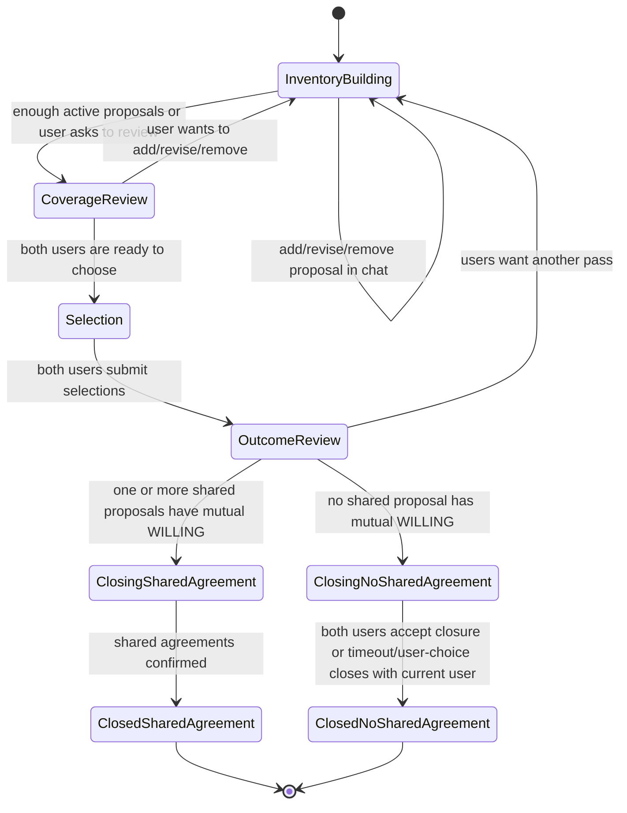

# Stage 4 and Tending Technical Spec

Status: implementation-ready draft
Related: docs/product/gold-flow-next-session-plan.md, docs/mobile/wireframes/gold-flow-mockups.md, docs/backend/api/stage-4.md, docs/product/stages/stage-4-strategic-repair.md

## Purpose

Convert Stage 4 from the current strategy pool and ranking implementation into a conversation-led proposal inventory that can close either with shared agreements or with a respected no-shared-agreement outcome, then support Tending through scheduled agreement check-ins and passive re-entry.

This spec is scoped to implementation planning. It does not change product code.

## Existing Implementation Summary

Current backend persistence:

- `StrategyProposal` stores session proposals with `description`, `needsAddressed`, optional `duration`, optional `measureOfSuccess`, source, creator, and optional consent record.
- `StrategyRanking` stores one ordered `rankedIds` array per user.
- `Agreement` stores shared vessel agreements with `description`, `type`, status, `agreedByA`, `agreedByB`, `agreedAt`, optional `followUpDate`, and optional `proposalId`.
- `StageProgress.gatesSatisfied` drives Stage 4 gates. Current gates are ranking/agreement oriented.
- `Session.status = RESOLVED` is the only successful terminal status. `resolveSession` currently requires at least one `AGREED` agreement.

Current backend behavior:

- `GET /sessions/:id/strategies` returns an unlabeled strategy pool and computes phase from ready/ranking state.
- `POST /sessions/:id/strategies` creates a `StrategyProposal`.
- `POST /sessions/:id/strategies/ready` marks `readyToRank`.
- `POST /sessions/:id/strategies/rank` writes `StrategyRanking` and marks `rankingSubmitted`.
- `GET /sessions/:id/strategies/overlap` reveals top-3 overlap when both ranked. If no overlap exists, it returns an empty overlap array, not a terminal closure.
- `POST /sessions/:id/agreements` creates a shared `Agreement`.
- `POST /sessions/:id/agreements/:agreementId/confirm` marks agreement consent and auto-resolves when all agreements are confirmed.
- AI conversational strategy capture currently depends on Stage 4 prompt micro-tags: `StrategyProposed: Y` plus `ProposedStrategy: ...`. The parser only captures proposal text and creates `StrategyProposal` rows with empty `needsAddressed`.

Current mobile behavior:

- Stage 4 UI is centered on `StrategyPool`, `StrategyRanking`, `OverlapReveal`, and `AgreementCard`.
- `StrategicRepairScreen` includes a local `FollowUpScheduler`, but Tending is not a persisted product surface.
- `UnifiedSessionScreen` renders strategy pool preview, overlap preview, agreement preview, and `SessionCompletionScreen` for `RESOLVED`.
- Chat input is hidden during non-`COLLECTING` Stage 4 phases, which conflicts with the redesigned conversation-led flow.
- The mobile suggestion hook currently calls `/strategies/suggestions`, while the backend route is `/strategies/suggest`. New Stage 4 work should avoid extending this mismatch.
- Shared DTOs include `StrategyPhase.NEGOTIATING` and `StrategyPhase.AGREED`, but backend phase computation currently only returns collecting, ranking, and revealing.

## Product Target

Stage 4 should be led by conversation. Cards should be structured receipts of what the AI is holding, not the primary input mechanism.

The system must support:

- Shared proposals: actions both people would need to agree to try.
- Individual commitments: one person's voluntary commitment, visible as an outcome but not requiring partner agreement.
- Unaddressed needs: needs from Stage 3 not currently covered by any proposal.
- Proposal add, revise, remove, and selection through conversation.
- No-shared-agreement closure as a legitimate terminal state, not an error or indefinite negotiation.
- Tending only schedules active check-ins for shared agreements with timing. No scheduled shared check-in is created for no-shared-agreement closure.
- Passive Tending re-entry remains available for all closed sessions.

## Data Model Recommendation

### Recommendation

Evolve the existing Stage 4 model rather than replacing it in one pass:

1. Keep `StrategyProposal` as the backing table for proposal inventory, but rename at the API/DTO layer to `Stage4Proposal` or `ProposalDTO`.
2. Add explicit proposal lifecycle, kind, selection, coverage, and revision/history tables.
3. Keep `Agreement` for shared agreements, but create agreements only after overlap or explicit mutual selection.
4. Add a session-level closure outcome record instead of overloading `Session.status`.
5. Add first-class Tending tables for check-in schedules and check-in responses.

This minimizes migration risk because existing agreement creation, realtime invalidation, and completion UI already depend on `StrategyProposal`, `Agreement`, and `Session.status`.

### Prisma Changes

Add enums:

```prisma
enum Stage4ProposalKind {
  SHARED_PROPOSAL
  INDIVIDUAL_COMMITMENT
}

enum Stage4ProposalStatus {
  ACTIVE
  REVISED
  REMOVED
  CONVERTED_TO_AGREEMENT
}

enum Stage4SelectionDecision {
  WILLING
  NOT_WILLING
  NEEDS_DISCUSSION
}

enum Stage4ClosureKind {
  SHARED_AGREEMENT
  NO_SHARED_AGREEMENT
}

enum Stage4ClosureReason {
  MUTUAL_SELECTION
  NO_OVERLAP
  BOUNDARY_HONORED
  USER_STOPPED
}

enum TendingEntryType {
  SCHEDULED_SHARED_AGREEMENT_CHECKIN
  USER_INITIATED_REENTRY
}

enum TendingEntryStatus {
  SCHEDULED
  OPEN
  PARTIAL
  COMPLETED
  EXPIRED
  CANCELLED
}
```

Extend `StrategyProposal`:

```prisma
model StrategyProposal {
  // existing fields stay
  kind              Stage4ProposalKind   @default(SHARED_PROPOSAL)
  status            Stage4ProposalStatus @default(ACTIVE)
  removedAt         DateTime?
  removedByUserId   String?
  removalReason     String?              @db.Text
  parentProposalId  String?
  coverageSummary   Json?
  capturedFromMessageId String?
  selections        Stage4ProposalSelection[]
  revisions         Stage4ProposalRevision[]
}
```

Add selection rows:

```prisma
model Stage4ProposalSelection {
  id          String                  @id @default(cuid())
  proposal    StrategyProposal        @relation(fields: [proposalId], references: [id], onDelete: Cascade)
  proposalId  String
  session     Session                 @relation(fields: [sessionId], references: [id], onDelete: Cascade)
  sessionId   String
  user        User                    @relation(fields: [userId], references: [id], onDelete: Cascade)
  userId      String
  decision    Stage4SelectionDecision
  note        String?                 @db.Text
  selectedAt  DateTime                @default(now())
  updatedAt   DateTime                @updatedAt

  @@unique([proposalId, userId])
  @@index([sessionId, userId])
}
```

Add revision/removal history:

```prisma
model Stage4ProposalRevision {
  id          String           @id @default(cuid())
  proposal    StrategyProposal @relation(fields: [proposalId], references: [id], onDelete: Cascade)
  proposalId  String
  sessionId   String
  actorUserId String?
  action      String           // CREATED, REVISED, REMOVED, RESTORED, CONVERTED
  before      Json?
  after       Json?
  reason      String?          @db.Text
  messageId   String?
  createdAt   DateTime         @default(now())

  @@index([proposalId, createdAt])
  @@index([sessionId, createdAt])
}
```

Add coverage audit:

```prisma
model Stage4NeedCoverage {
  id               String   @id @default(cuid())
  session          Session  @relation(fields: [sessionId], references: [id], onDelete: Cascade)
  sessionId        String
  needId           String?  // IdentifiedNeed.id or ConsentedContent.id when available
  needLabel        String
  sourceUserId     String?
  coverageStatus   String   // COVERED, PARTIAL, OPEN
  coveringProposalIds String[]
  note             String?  @db.Text
  updatedAt        DateTime @updatedAt
  createdAt        DateTime @default(now())

  @@index([sessionId])
}
```

Add closure outcome:

```prisma
model Stage4Closure {
  id                    String              @id @default(cuid())
  session               Session             @relation(fields: [sessionId], references: [id], onDelete: Cascade)
  sessionId             String              @unique
  kind                  Stage4ClosureKind
  reason                Stage4ClosureReason
  summary               String              @db.Text
  sharedAgreementIds    String[]
  individualProposalIds String[]
  openNeedIds           String[]
  closedByUserId        String?
  closedAt              DateTime            @default(now())
  createdAt             DateTime            @default(now())
}
```

Add Tending:

```prisma
model TendingEntry {
  id          String             @id @default(cuid())
  session     Session            @relation(fields: [sessionId], references: [id], onDelete: Cascade)
  sessionId   String
  agreement   Agreement?         @relation(fields: [agreementId], references: [id], onDelete: Cascade)
  agreementId String?
  type        TendingEntryType
  status      TendingEntryStatus @default(SCHEDULED)
  scheduledFor DateTime?
  openedAt    DateTime?
  completedAt DateTime?
  summary     String?            @db.Text
  createdAt   DateTime           @default(now())
  updatedAt   DateTime           @updatedAt

  responses TendingResponse[]

  @@index([sessionId, status])
  @@index([agreementId])
  @@index([scheduledFor])
}

model TendingResponse {
  id              String       @id @default(cuid())
  tendingEntry    TendingEntry @relation(fields: [tendingEntryId], references: [id], onDelete: Cascade)
  tendingEntryId  String
  user            User         @relation(fields: [userId], references: [id], onDelete: Cascade)
  userId          String
  status          String       // WORKED, PARTLY, DID_NOT_WORK, DID_NOT_TRY, OTHER
  reflection      String?      @db.Text
  continueChoice  String?      // CONTINUE, ADJUST, CLOSE, NEW_PROCESS, OTHER_TRACK
  submittedAt     DateTime     @default(now())

  @@unique([tendingEntryId, userId])
}
```

### Agreement Changes

Add optional denormalized fields to `Agreement` so the completion and Tending surfaces no longer return `duration: null` and `measureOfSuccess: null`:

```prisma
duration         String?
measureOfSuccess String?
tendingEntries  TendingEntry[]
```

### Session Status Recommendation

Keep `Session.status = RESOLVED` for both successful terminal outcomes. Add `Stage4Closure.kind` to distinguish:

- `SHARED_AGREEMENT`: at least one agreed shared proposal exists.
- `NO_SHARED_AGREEMENT`: no shared proposal has mutual willingness, but the conversation closed with boundaries respected.

Do not add `NO_AGREEMENT` to `SessionStatus`; too many list/detail screens already use `RESOLVED` as the completion gate.

## State Machine

### Stage 4 State Definitions

Use a new API-facing enum separate from the current `StrategyPhase`:

```ts
type Stage4Phase =
  | 'INVENTORY_BUILDING'
  | 'COVERAGE_REVIEW'
  | 'SELECTION'
  | 'OUTCOME_REVIEW'
  | 'CLOSING'
  | 'CLOSED_SHARED_AGREEMENT'
  | 'CLOSED_NO_SHARED_AGREEMENT';
```

Recommended gate fields on each user's `StageProgress.gatesSatisfied`:

```ts
{
  proposalInventorySeen?: boolean;
  coverageAuditSeen?: boolean;
  selectionSubmitted?: boolean;
  closureReviewed?: boolean;
  sharedAgreementConfirmed?: boolean;
  noSharedAgreementAccepted?: boolean;
}
```

Session-level closure belongs in `Stage4Closure`, not only in per-user gates.

### Transition Diagram



### Closure Rules

Shared agreement closure:

- At least one `SHARED_PROPOSAL` has `WILLING` selections from both users.
- Create one `Agreement` per selected shared proposal, capped by product limit.
- Confirm agreements using an explicit partner confirmation moment.
- Create `Stage4Closure(kind = SHARED_AGREEMENT)`.
- Set `Session.status = RESOLVED`, `resolvedAt = now`, and complete open `StageProgress` rows.
- Create Tending entries only for agreements with a usable `followUpDate` or derived schedule.

No-shared-agreement closure:

- Both users submitted selections and no active `SHARED_PROPOSAL` has mutual `WILLING`, or a user states a clear boundary and the AI closes after review.
- Persist individual commitments where `kind = INDIVIDUAL_COMMITMENT` and the owner is willing.
- Persist open/partial needs in `Stage4NeedCoverage`.
- Create `Stage4Closure(kind = NO_SHARED_AGREEMENT, reason = NO_OVERLAP | BOUNDARY_HONORED | USER_STOPPED)`.
- Set `Session.status = RESOLVED`, `resolvedAt = now`, and complete open `StageProgress` rows.
- Do not create scheduled shared Tending entries.
- Passive user-initiated re-entry remains available from session detail.

Timeout rule:

- If one user completes selection/closure review and the partner is inactive beyond the existing session wait policy, allow present-user closure only if no new shared obligation is created for the absent partner.
- Result can include individual commitments and open needs, but no shared agreement.

## Conversation Capture and Prompt Contract

### Current Gap

The current `ProposedStrategy:` micro-tag contract captures only proposal descriptions. It cannot express:

- shared versus individual proposal kind
- covered needs
- revision or removal
- user boundaries
- selection decisions
- no-shared-agreement closure readiness
- Tending timing

### Recommendation

Use a Stage 4 structured capture service after each user turn, separate from visible AI response generation.

Rationale:

- The visible response should stay conversational and stream quickly.
- Inventory updates need richer structure than micro-tags.
- The capture result can be validated, diffed, audited, and safely ignored when low confidence.

### Capture Service Contract

Create `stage4-capture.service.ts` with:

```ts
type Stage4CaptureInput = {
  sessionId: string;
  userId: string;
  messageId: string;
  userMessage: string;
  aiResponse: string;
  currentInventory: ProposalInventoryDTO;
  confirmedNeeds: Stage4NeedDTO[];
  recentStage4Messages: Array<{ role: 'USER' | 'AI'; userId?: string; content: string; timestamp: string }>;
};

type Stage4CaptureResult = {
  operations: Stage4InventoryOperation[];
  coverageAudit?: Stage4CoverageAuditDTO;
  selection?: Stage4SelectionCaptureDTO;
  closureSignal?: Stage4ClosureSignalDTO;
  tendingTiming?: Stage4TendingTimingDTO;
  confidence: number;
  rationale: string;
};
```

Operations:

```ts
type Stage4InventoryOperation =
  | {
      type: 'ADD_PROPOSAL';
      tempKey: string;
      kind: 'SHARED_PROPOSAL' | 'INDIVIDUAL_COMMITMENT';
      ownerUserId?: string;
      description: string;
      needsAddressed: string[];
      duration?: string;
      measureOfSuccess?: string;
      capturedQuote?: string;
    }
  | {
      type: 'REVISE_PROPOSAL';
      proposalId: string;
      description?: string;
      needsAddressed?: string[];
      duration?: string;
      measureOfSuccess?: string;
      reason?: string;
    }
  | {
      type: 'REMOVE_PROPOSAL';
      proposalId: string;
      reason?: string;
    }
  | {
      type: 'RESTORE_PROPOSAL';
      proposalId: string;
      reason?: string;
    };
```

Selection capture:

```ts
type Stage4SelectionCaptureDTO = {
  userId: string;
  decisions: Array<{
    proposalId: string;
    decision: 'WILLING' | 'NOT_WILLING' | 'NEEDS_DISCUSSION';
    note?: string;
  }>;
};
```

Closure signal:

```ts
type Stage4ClosureSignalDTO = {
  readyToClose: boolean;
  kind?: 'SHARED_AGREEMENT' | 'NO_SHARED_AGREEMENT';
  reason?: 'MUTUAL_SELECTION' | 'NO_OVERLAP' | 'BOUNDARY_HONORED' | 'USER_STOPPED';
  summary?: string;
};
```

Tending timing:

```ts
type Stage4TendingTimingDTO = {
  proposalId?: string;
  agreementId?: string;
  suggestedFollowUpDate?: string;
  sourceText?: string;
};
```

### Prompt Requirements

Update Stage 4 prompting to:

- Orient from Stage 3 needs without using the old common-ground-only framing.
- Invite proposals in conversation.
- Ask one missing detail at a time when a proposal is vague.
- Treat "I can do X" as an individual commitment unless it requires partner action.
- Treat "we could try X" as a shared proposal unless the user clarifies it is unilateral.
- Honor removals immediately: if the user says "take that off", mark removed and do not argue.
- Never create a shared agreement from one user's willingness alone.
- Name open needs honestly without implying failure.
- Ask whether to keep exploring or leave a gap named.
- In no-overlap outcomes, avoid "failed", "no solution", or "could not agree".
- Ask for follow-up timing only for shared agreements or individual commitments that the owner wants to tend. Do not require a shared check-in when there is no shared agreement.

### API Endpoints

Add or revise endpoints:

```http
GET /sessions/:id/stage4
```

Returns full Stage 4 state for mobile cards:

```ts
type GetStage4StateResponse = {
  phase: Stage4Phase;
  inventory: ProposalInventoryDTO;
  coverageAudit: Stage4CoverageAuditDTO;
  mySelections: Stage4SelectionDTO[];
  partnerSelectionStatus: 'NOT_STARTED' | 'SUBMITTED';
  outcome: Stage4OutcomeDTO | null;
  tendingPreview: TendingPreviewDTO | null;
};
```

```http
POST /sessions/:id/stage4/proposals/:proposalId/selection
POST /sessions/:id/stage4/selections
POST /sessions/:id/stage4/close
```

Keep existing `/strategies` and `/agreements` endpoints temporarily for compatibility, but new mobile work should read from `/stage4`.

## Mobile Card Contracts

### Shared DTOs

```ts
type ProposalInventoryDTO = {
  sharedProposals: ProposalCardDTO[];
  individualCommitments: ProposalCardDTO[];
  unaddressedNeeds: UnaddressedNeedDTO[];
  removedProposalCount: number;
  updatedAt: string;
};

type ProposalCardDTO = {
  id: string;
  kind: 'SHARED_PROPOSAL' | 'INDIVIDUAL_COMMITMENT';
  description: string;
  ownerLabel?: 'You' | 'Partner'; // individual commitments only
  needsAddressed: Array<{ id?: string; label: string; coverage: 'COVERED' | 'PARTIAL' }>;
  duration: string | null;
  measureOfSuccess: string | null;
  status: 'ACTIVE' | 'REVISED' | 'REMOVED' | 'CONVERTED_TO_AGREEMENT';
  myDecision?: 'WILLING' | 'NOT_WILLING' | 'NEEDS_DISCUSSION';
  partnerDecisionVisible?: 'WILLING' | 'NOT_WILLING' | 'NEEDS_DISCUSSION';
};

type UnaddressedNeedDTO = {
  id?: string;
  label: string;
  source: 'YOU' | 'PARTNER' | 'BOTH' | 'UNKNOWN';
  note: string;
};
```

### Proposal Inventory Card

Purpose: inline receipt of what the AI is holding.

Props:

```ts
type ProposalInventoryCardProps = {
  inventory: ProposalInventoryDTO;
  onOpenDetails?: () => void;
};
```

Rules:

- Render sections in this order: shared proposals, individual commitments, needs not yet addressed.
- Do not include add/remove buttons as the primary workflow. Add, revise, remove, and select happen through chat.
- A small details affordance is acceptable for reading history or removed items.
- Show removed count only as a secondary receipt, not as a warning.

### Needs Coverage Audit Card

Props:

```ts
type NeedsCoverageAuditCardProps = {
  covered: CoverageRowDTO[];
  partial: CoverageRowDTO[];
  open: CoverageRowDTO[];
};
```

Rules:

- Use "covered", "partly covered", and "still open" language.
- Do not imply that open needs are product failure or relational failure.
- The AI message after the card asks whether to keep exploring or leave the gap named.

### Selection Receipt Card

Props:

```ts
type SelectionReceiptCardProps = {
  mySelections: Stage4SelectionDTO[];
  partnerSelectionStatus: 'NOT_STARTED' | 'SUBMITTED';
  canRevealOutcome: boolean;
};
```

Rules:

- Current user sees their own choices.
- Partner choices are not shown until both submit.
- Unlike ranking, selection is not top-3 order. It is per-proposal willingness.

### Shared Agreement Outcome Card

Props:

```ts
type SharedAgreementOutcomeCardProps = {
  agreements: AgreementDTO[];
  individualCommitments: ProposalCardDTO[];
  openNeeds: UnaddressedNeedDTO[];
  tendingPreview: TendingPreviewDTO | null;
};
```

Rules:

- Show shared agreements first.
- Show individual commitments as meaningful but separate.
- Show check-in timing per agreement when present.
- Primary action is confirm/review agreement if confirmation is still needed.

### No Shared Agreement Close Card

Props:

```ts
type NoSharedAgreementCloseCardProps = {
  individualCommitments: ProposalCardDTO[];
  openNeeds: UnaddressedNeedDTO[];
  closureSummary: string;
  passiveTendingAvailable: boolean;
};
```

Rules:

- Treat this as a normal resolved state.
- Avoid "failed to agree".
- Include enough individual commitments and open needs that the work feels preserved.
- Do not show a scheduled check-in CTA.
- Show passive re-entry CTA from session detail or resolved session surface.

### Tending Entry Card

Props:

```ts
type TendingEntryCardProps = {
  sessionId: string;
  entryId?: string;
  type: 'SCHEDULED_SHARED_AGREEMENT_CHECKIN' | 'USER_INITIATED_REENTRY';
  contextSummary: string;
  agreements: AgreementDTO[];
  individualCommitments: ProposalCardDTO[];
  openNeeds: UnaddressedNeedDTO[];
  status?: TendingEntryStatus;
};
```

Rules:

- Scheduled entries review each shared agreement.
- Passive re-entry starts with context, not a demand for agreement.
- User can choose continue, close, start a new process, or move to another track.

## Tending Scheduling and Re-entry

### Scheduled Tending

Create scheduled Tending entries when:

- Stage 4 closes with `Stage4Closure.kind = SHARED_AGREEMENT`.
- An `Agreement` has `followUpDate`, or the AI captured a strategy-timed check-in such as "after one week".

Do not create scheduled Tending entries when:

- Stage 4 closes with `NO_SHARED_AGREEMENT`.
- An agreement lacks timing and the users explicitly decline scheduling.
- Only individual commitments exist and no owner requested a reminder.

Scheduling flow:

1. On shared agreement closure, call `createTendingEntriesForClosure(sessionId)`.
2. For each agreed agreement with timing, create `TendingEntry(type = SCHEDULED_SHARED_AGREEMENT_CHECKIN, status = SCHEDULED, scheduledFor = followUpDate)`.
3. Notification worker opens the entry at `scheduledFor`, sends push/realtime notification to both users, and sets `status = OPEN`.
4. Each user submits a `TendingResponse`.
5. When both responses exist, show overlap/review and set `status = COMPLETED`.
6. If only one user responds, allow present-user continuation after timeout without inventing partner feedback.

### Passive Re-entry

Every resolved session can expose user-initiated Tending re-entry:

```http
POST /sessions/:id/tending/reentry
```

Behavior:

- Creates `TendingEntry(type = USER_INITIATED_REENTRY, status = OPEN, openedAt = now)`.
- Seeds context from `Stage4Closure`, agreements, individual commitments, open needs, and session summary.
- Does not notify partner by default until the user chooses a path that requires partner participation.

Recommended paths:

- Continue tending an existing agreement.
- Adjust or close an agreement.
- Reopen a conversation around open needs.
- Start a new partner process.
- Move to Inner Work or another support track.

## Implementation Decomposition

### Issue 1: Stage 4 Data Model Migration

Scope:

- Add proposal kind/status fields, proposal selections, proposal revisions, coverage audit, closure outcome, and Tending tables.
- Add duration and measureOfSuccess to `Agreement`.
- Add Prisma tests for constraints and cascade behavior.

Acceptance:

- Existing Stage 4 tests still pass or are updated behind compatibility endpoints.
- `Session.status = RESOLVED` remains compatible.
- No-shared-agreement closure can be represented without any `Agreement` rows.

### Issue 2: Stage 4 State Service

Scope:

- Create service that assembles `GetStage4StateResponse`.
- Compute `Stage4Phase` from inventory, coverage, selections, and closure.
- Replace ranking-derived phase for new mobile surfaces.

Acceptance:

- `GET /sessions/:id/stage4` returns inventory, coverage, selections, outcome, and tending preview.
- No partner private selections are exposed before both submit.

### Issue 3: Conversation Capture Service

Scope:

- Implement structured capture service and persistence of inventory operations.
- Retire Stage 4 dependence on `ProposedStrategy:` micro-tags after compatibility window.
- Add confidence thresholds and audit logging.

Acceptance:

- Add/revise/remove/select phrases in chat update inventory correctly.
- Low-confidence capture produces no destructive change.
- Removal creates history and hides proposal from active cards.

### Issue 4: Coverage Audit

Scope:

- Generate and persist `Stage4NeedCoverage` from Stage 3 needs plus active proposals.
- Add refresh on proposal inventory change.

Acceptance:

- Covered, partial, and open needs are returned with proposal links.
- Open needs can exist at closure without blocking no-shared-agreement closure.

### Issue 5: Selection and Outcome

Scope:

- Add selection endpoints.
- Replace ranking overlap with mutual willingness calculation.
- Create agreements from mutually willing shared proposals.
- Create no-shared-agreement closures.

Acceptance:

- Shared agreement closure resolves session and creates closure record.
- No-shared-agreement closure resolves session without agreements.
- Individual commitments persist in both outcomes.

### Issue 6: Tending Backend

Scope:

- Add Tending entry/response endpoints.
- Add scheduler/notification integration for agreement check-ins.
- Add passive re-entry endpoint.

Acceptance:

- Shared agreements with timing create scheduled check-ins.
- No-shared-agreement closure creates no scheduled shared check-ins.
- Re-entry works for any resolved session.

### Issue 7: Mobile Stage 4 Cards

Scope:

- Replace or wrap strategy pool/ranking/overlap components with inventory, coverage, selection, shared outcome, and no-shared-agreement cards.
- Keep chat input available through conversation-led phases except explicit waiting/confirmation overlays.
- Update `UnifiedSessionScreen` card insertion and resolved session surface.

Acceptance:

- Cards match DTO contracts above.
- No-shared-agreement close is shown as resolved, not as waiting.
- Existing agreement confirmation still works for shared outcomes.

### Issue 8: Tending Mobile Surface

Scope:

- Add scheduled check-in entry surface.
- Add session detail passive re-entry CTA.
- Add per-agreement review flow.

Acceptance:

- Notification opens the correct Tending entry.
- User-initiated re-entry opens from resolved session detail.
- Present-user-only continuation is supported after partner timeout.

### Issue 9: E2E and Evaluation

Scope:

- Add deterministic fixtures for shared agreement, individual-only, removed proposal, and no-shared-agreement paths.
- Add two-browser tests for selection privacy and closure outcomes.

Acceptance:

- New tests cover both closure kinds and Tending scheduling rules.
- Existing Stage 4 tests are either migrated or explicitly marked legacy.

## Verification Checklist

Backend:

- `GET /sessions/:id/stage4` does not expose proposal creator for shared proposals.
- Individual commitments expose owner label only when product intends to show it.
- Proposal removal hides proposal from active inventory and records revision history.
- Coverage audit updates after add, revise, remove, and restore.
- Selection privacy holds until both users submit.
- Mutual `WILLING` on shared proposal creates agreement candidate.
- No mutual `WILLING` can close as `NO_SHARED_AGREEMENT`.
- `Session.status = RESOLVED` works for both closure kinds.
- `resolveSession` no longer rejects no-shared-agreement closure.
- Scheduled Tending entries are created only for shared agreements with timing.
- Passive re-entry can be created for both closure kinds.

Mobile:

- Stage 4 chat remains usable during inventory building, coverage review, and selection discussion.
- Proposal inventory card has shared, individual, and open needs sections.
- Needs coverage card names gaps without failure language.
- Selection receipt does not reveal partner choices early.
- Shared agreement outcome shows agreements, individual commitments, open needs, and check-in timing.
- No-shared-agreement close card appears as a legitimate resolved outcome.
- Resolved session screen branches by `Stage4Closure.kind`.
- Tending re-entry surface shows context, agreements if any, individual commitments, and open needs.

E2E:

- Two users close with one shared agreement and scheduled Tending.
- Two users close with no shared agreement and no scheduled shared Tending.
- One user removes a proposal; partner no longer sees it in active inventory.
- One user makes only individual commitments; session can close without partner obligation.
- Partner inactivity timeout does not create shared agreement.
- Re-entry from resolved no-shared-agreement session opens a passive Tending conversation.

Regression:

- Existing Stage 0, Stage 2 reconciler, and Stage 3 flows still advance to Stage 4.
- Existing `Agreement` notifications still work for shared agreement closure.
- Session list/detail screens do not treat no-shared-agreement closure as abandoned.
- Data deletion anonymizes or removes new Stage 4/Tending records consistently with existing strategy/agreement records.
